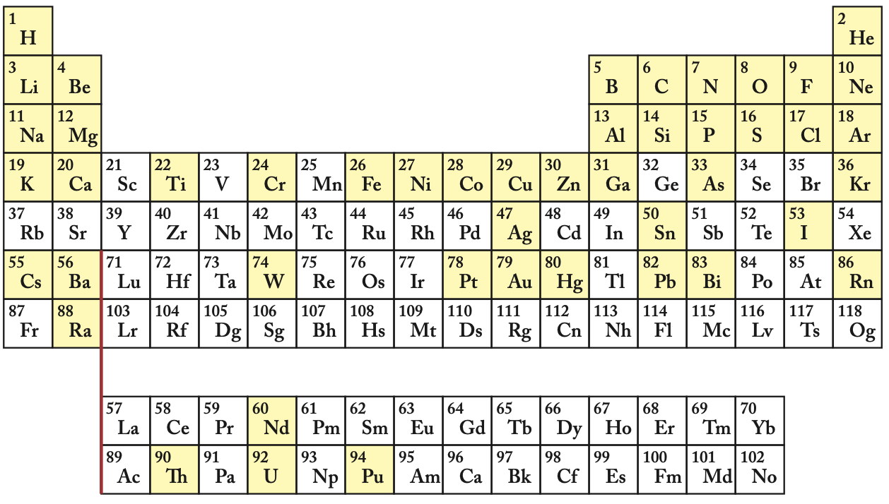

附录 B 化学基础/复习
========================

本书并不十分依赖以往的化学知识，但了解一些在化石燃料、生物能源和气候变化中发挥作用的基本元素还是很有帮助的。这部分内容可以作为复习，也可以作为对基础知识的初次接触。

.. _B.1:

B.1 摩尔 Moles
-----------------------

  
  **图 B.1：**\ 元素周期表。由于该版本太小，无法列出名称，因此只给出了符号。比较熟悉的元素突出显示。数字代表相关原子的质子数。