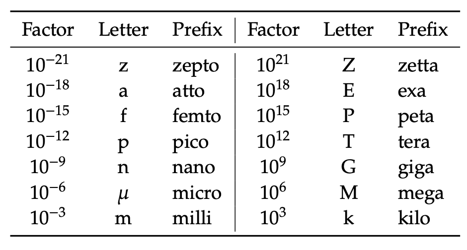
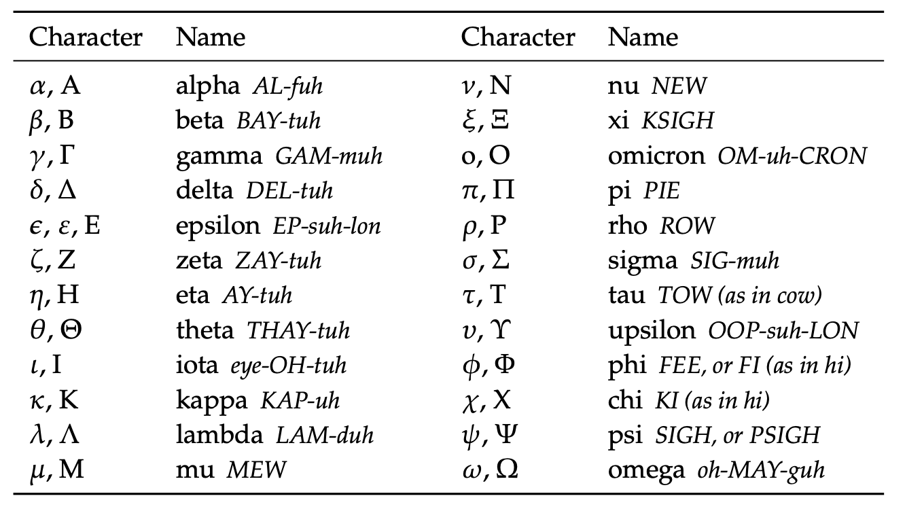

符号、系数前缀和希腊字母
++++++++++++++++++++++++++++++++++++++++

符号
--------------------

- 𝑐 Speed of light in a vacuum inertial frame: 2.99792458 × 10\ :sup:`8` m/s ≈ 3 × 10\ :sup:`8` m/s
- 𝜀 Efficiency; typically 0 ≤ 𝜀 ≤ 1; unitless
- 𝑔 acceleration due to gravity: 9.8 m/s2 or ≈10 m/s\ :sup:`2`
- h Planck’s constant: 6.626 × 10\ :sup:`-34` J · s
- 𝑘 Boltzmann’s constant: 1.38 × 10\ :sup:`-23` J/K B
- 𝑁 Avogadro’s number: 6.022 × 10\ :sup:`23` particles per mole A
- Δ𝑄 Change in thermal energy, in Joules
- 𝑅\ :sub:`⊕` Radius of Earth: 6,378 km
- 𝑅\ :sub:`⊙` Radius of Sun: 695,700 km
- 𝑟\ :sub:`⊕⊙` Earth–Sun distance (1 AU): 149.6 million km
- 𝜎 Stefan-Boltzmann constant: 5.67 × 10\ :sup:`-8` W/K/m\ :sup:`2` Δ𝑆 Change in entropy, in J/K
- Δ𝑇 Change in temperature, typically in ◦C or Kelvin (K) Δ𝑊 Change in energy—work performed, in Joules

标度系数前缀
--------------------------

希腊字母和发音
--------------------------

