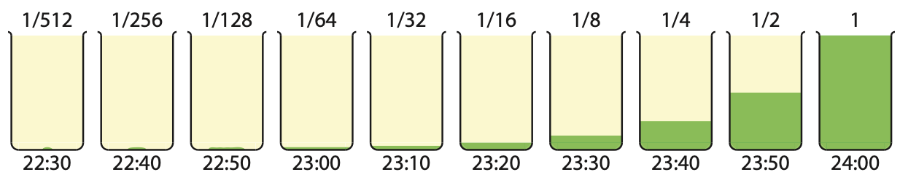
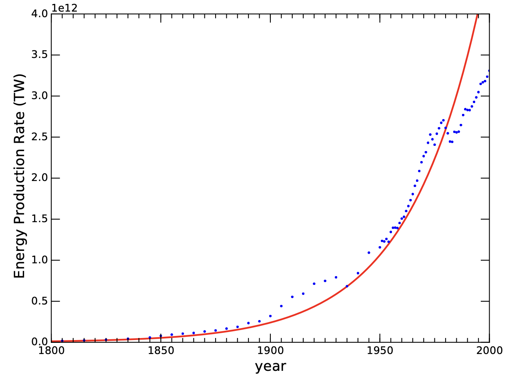
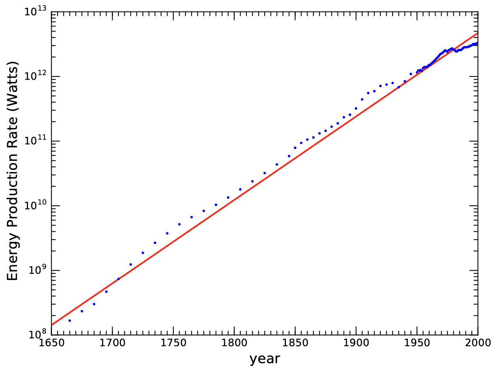
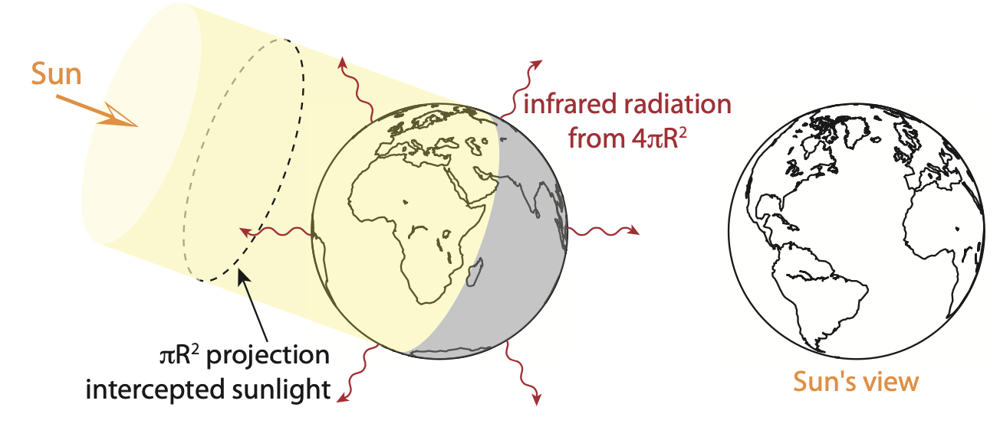

1 指数增长
====================

人类有惊人的力量，也有明显的弱点，其中最重要的一点也许就是我们难以理解指数增长的后果。
这真是一种讽刺，因为我们的经济和政治目标往往是明确支持持续增长的\ [#]_ 。对持续增长的期望和渴望已融入我们的社会，
因此我们有必要仔细研究这一现象，以避免在不稳固的基础上继续发展。在本章，我们将探讨指数增长的一般性质，
通过揭示持续增长所带来的各种荒谬后果，来理解长期持续增长的不可能性。其结果\ [#]_ 是，
我们的社会框架最终必然面临背离当前模式的强制性改变——我们都应将这一认识牢记于心。
本章之后的几个章节将讨论其在经济和人口增长的应用，包括更现实的 Logistic 增长曲线，
然后讨论有限的地球对人类所施加的限制。

.. [#] 向 Al Bartlett （1923-2013，Colorado大学核物理教授）致敬，他致力于提高人们对指数增长的认识。
.. [#] 原文使用的 "upshot" 一词，意思是最终结果或底线。本书每章末尾都有一小节 "upshot"。

.. _1.1:

1.1 罐子里的细菌
---------------------

指数增长的一个特点是，规模翻倍所需的时间（翻倍时间）是恒定的。在本章，我们将反复使用一个重要且方便的概念，
即 70 法则：[*]_ 

.. [*] {-}请注意，任何增长，无论多么缓慢，都可以用加倍时间来描述，即使这个过程不涉及离散的加倍步骤。

.. _def1.1.1:

  **定义 1.1.1：70 法则：**\ 增长率以百分比表示，其翻倍时间就是 70 除以百分号之前的数字。
  1% 的增长率需要 70 年翻一番，2% 的增长率 35 年翻一番，而 10% 的增长率则 7 年翻一番。
  也适用于其他时间尺度：如果大流行病例以每天 3.5% 的速度增长，其翻倍时间就是 20 天。

.. margin:: 

  .. table:: **表 1.1**: 7% 增长示例
    :name: tab1.1
    :class: booktabs

    ====  ====
    年    人口
    ====  ====
    1900  100 
    1910  200 
    1920  400 
    1930  800 
    1940  1,600
    \:     \: 
    2000  102,400
    ====  ====

我们将在本章稍后部分看到 70 法则是如何在数学上产生的。但首先，更重要的是了解其后果。
为了使计算简化，我们假设一个城镇的规模每 10 年翻一番（顺便一说，根据 70 法则，这相当于 7% 的增长率）。
从 1900 年的 100 个居民开始，我们预计 1910 年的城镇人口为 200 人，1920 年为 400 人，1930 年为 800 人，
最终到 2000 年将超过 100,000 人（见 :ref:`表 1.1<tab1.1>`）。如果 7% 的增长势头不减，那么在实验开始 260 年后，
该镇的人口就会达到目前的世界人口总数。

让我们再探讨一个指数增长的例子，这个例子经常用来揭示我们的错误直觉。假设有一个营养丰富的罐子，里面培植的细菌
每 10 分钟分裂一次\ [*]_\ ，并且恰好会在 24 小时后充满这个罐子。实验从午夜零点开始，问题是：
到什么时候罐子会变成半满的状态？

.. [*] {-}对于生物学来说，10 分钟也许有点快，但我们追求的是简单易懂，选择了方便的数字。在实践中，
   20-30 分钟可能更切合实际。在这个「玩具」模型中，我们还忽略了死亡，但这只是改变了速度，而不是整体结论。

请自己思考一下。按照直觉，实验进行到一半的时候，即中午的时候，罐子可能会变成半满。但如果我们倒过来想想呢？
午夜时罐子是满的，每十分钟翻一番，那么什么时候是半满呢？

答案是午夜前的一个翻倍时间，即 11:50 分。:ref:`图 1.1<fig1.1>` 展示了这个过程。晚上 11 点，
罐子的容量为 1/64，即 1.7%。因此，在 24 小时中的前 23 小时，罐子看起来基本上是空的。
所有事情都以戏剧性的方式发生在最后阶段。

  
  **图 1.1：**\ 细菌（绿色）在瓶中生长的最后 90 分钟，每 10 分钟翻一番。在最初的 22.5 小时内，几乎看不到任何东西。
  请注意，绿色部分的上升构成一条指数曲线。

现在，让我们在上面例子的基础上继续设想一种情景。时间是晚上 11:30，离结束还有半个小时，罐子已占满八分之一。
文明中的一位智者预测了未来，并且决定如果文明要继续其发展轨迹，就必须在短时间内发现更多无人居住、营养丰富的罐子。
试想一下，其他绝大多数居民可能会表示难以置信：这个罐子还远远没有装满，而且已经使用了 141 代——看起来几乎是永恒的。
尽管如此，这位探险家还是回来报告说，另外三个同样大小的装满食物的罐子近在咫尺。他受到英雄般的欢迎。
这个文明还能继续发展多久？你的答案是什么？

人口每十分钟增加一倍。如果原来的罐子在 12:00 装满，那么到 12:10 时，人口会翻倍，装满第二个罐子。
到 12:20 时，再增加一倍，四个罐子都装满了。庆祝是短暂的。

我们不可避免的看到，自己处在相似的情景中。一个为我们服务了无数代人的星球，看起来像是无限大的，我们难以想象会达到它的极限。
我们现在满了一半吗？四分之一？八分之一？这三个可能的答案，在不同程度上都是可怕的。以 2% 的增长率（资源使用量）计算，
翻一番的时间是 35 年，即使现在才用了 1/8，我们也只有大约一个世纪的时间\ [#]_ 。

.. [#] 如果现在是 1/8，每 35 年翻一番，那么 35 年后将达到 1/4，70 年后达到 1/2，105 年后就全部用完了。

与细菌罐寓言不同的是，我们人类已经没有罐子了。我们把星球比做罐子，但现实里的其它星球对人类生命充满敌意，没有食物，
也很难到达。我们没有可行的出路\ [#]_ 。即使我们不考虑实际的困难，第二颗星球又能为我们不间断的增长争取多少时间呢？
另一个 35 年？

.. [#] :doc:`第 4 章<ch4>`\ 讨论太空探索的现实问题。

1.1.1 指数的数学
++++++++++++++++++++++

.. _box1.1:

.. admonition:: Box 1.1: 阅读数学的一点建议

  这一小节是本书中数学最复杂的其中之一。不要被它吓倒：只需冷静地接受它。\ [*]_\ 要知道，
  指数增长遵循的是一套不变的规则，只需几页纸就能讲完。只要给它一个机会，你的大脑就能全部吸收。多读几遍段落，
  你会发现每读一遍都能加深你的理解。公式只是捕捉本质概念的速记语句\ [#]_ ，因此，与其把它们当作算式来读，
  然后抄在笔记本上，等以后解决问题时再用，不如努力理解每个等式背后的\ **含义**\ 及其出现在这里的原因。
  这样，接下来的内容就不是杂乱无章的在数学和文字之间肆意穿梭，而是用两种语言同时表达的一种连续的思维脉络。
  :doc:`序言</Preface>`\ 提供了与这一主题相关的其他想法，\ :doc:`附录 A </Appendices/appendixA>`
  提供了一些数学复习资料。

.. [#] 与文字语言不同，为公式选择的符号只是标签，没有内在含义——因此，𝑥、𝑛、𝑡、𝑏、𝑀 等符号是任意选择的，
   如果愿意的话，可以随便替换。真正的内容在于方程/句子的结构。
.. [*] {-}专家们习惯于将复杂的文献阅读多遍，然后才能理解其中的内容。也许正是这种冷静的习惯让他们成为了专家！

指数增长的基本特征是，规模随着时间间隔的某个基数（可以是任意数字）的\ **幂**\ 而增大。在倍增序列中，我们从原来的 1 倍开始，
然后是 2 倍、4 倍、8 倍等。每个时间间隔都乘以 2（基数，或底数）。例如，经过 5 次倍增后，我们得到 2×2×2×2×2，
或 2\ :sup:`5` = 32。更一般地说，经过 𝑛 次加倍后，就增长到原来的 2\ :sup:`𝑛`\ 倍，其中 2 是基数，𝑛 是加倍次数。
我们可以将其形式化为：

.. _eq1.1:

.. math:: M = 2^n = 2^{t/t_2}, \tag{1.1}

其中，𝑀表示最终的增长倍数（系数），𝑡 表示经过的时间，我们选择 𝑡\ :sub:`2` 表示增加一倍所需的时间，因此 𝑛 = 𝑡/𝑡\ :sub:`2` 
就是加倍的次数。\ [*]_\ 

.. [*] {-}例如，增加两倍，𝑀 = 2；增加三倍，𝑀 = 3；增加 29%，𝑀 = 1.29。

.. margin:: 

  .. table:: **表 1.2**: 利息示例（2% 的利率）
    :name: tab1.2
    :class: booktabs

    ====    ===========  ====
    年      b\ :sup:`n`  元
    ====    ===========  ====
    0       1.00         100.00
    1       1.02         102.00
    2       1.0404       104.04
    3       1.0612       106.12
    \:      \:           \:
    10      1.2190       121.90
    \:      \:           \:
    35      1.9999       199.99
    ====    ===========  ====

.. _box1.2:

.. admonition:: Box 1.2: 利息

  银行账户累积利息的过程也是如此。假设你将 100 元存入一个年利率为 2% 的银行账户。一年后，你将拥有 102 元，
  是原始金额的 1.02 倍。第二年，是 102 元的 1.02 倍，即 104.04 元，也就是原来的 100 元乘以 1.02 × 1.02。
  三年后将是 106.18 元，即 100 元乘以 1.02\ :sup:`3`。摸清规律后，35 年后将是 100 美元乘以 1.02\ :sup:`35`，
  刚好是 199.99 美元。请注意，以 2%的比率在 35 年内翻一番完全符合 70 法则。表 1.2 总结了这个例子。

无论是翻倍，还是像\ :ref:`Box 1.2<box1.2>`\ 中那样应用利率，其模式都是将同一个数（即底数）重复相乘。
这就是幂运算（乘方运算），其中的指数等于底数在连续相乘中出现的次数，从而得到总的增长系数。因此，
如果我们把底数设为 𝑏，把它出现的次数设为 𝑛 ，我们就得到：

.. _eq1.2:

.. math:: M = b^n. \tag{1.2}

现在，我们要玩一个数学「小技巧」\ [*]_\ ，帮助我们计算指数增长的各种有用信息。指数和自然对数是一对反函数，
两者互相抵消。因此有 ln (𝑒\ :sup:`𝑥`\ ) = 𝑥 和 𝑒\ :sup:`ln 𝑥`  = 𝑥。我们可以用这个技巧把数字 2 表示为
𝑒\ :sup:`ln 2`，或任何底数 𝑏 = 𝑒\ :sup:`ln 𝑏` 。对于 𝑏 = 2（翻倍）的特殊情况\ [*]_\ ，我们有：

.. _eq1.3:

.. math:: M = 2^{t/t_2} = (e^{\ln{2}})^{t/t_2} = e^{t \frac{\ln{2}}{t_2}}, \tag{1.3}

.. [*] {-}这里所说的 "技巧"，并不意味着任何邪恶或不正当的东西：只是一个可爱的小把戏，
   可以带来更多的启示或使事情变得更容易。

.. [*] {-}请随便找几个数字作为 𝑏，在计算器上试试计算结果（让它成为你自己的真实体验！）。

上式从\ :ref:`公式 1.1<eq1.1>`\ 开始，重新表达了数字 2，然后应用幂的乘方运算法则：底数不变，指数相乘\ [#]_ 。
通过这个技巧，我们可以把任何底数放到指数上，比如可以把 𝑏\ :sup:`𝑥` 转化为 𝑒\ :sup:`𝑥 ln 𝑏`。也就是说，
可以用 𝑒 ≈ 2.7183 把任何幂函数转化为指数函数形式。于是\ :ref:`公式 1.2<eq1.2>`\ 可以转换成这种形式：

.. _eq1.4:

.. math:: M = b^n = e^{n\ln{b}}. \tag{1.4}

.. [#] 例如，把 (5^3)^4 想象成(5×5×5)^4 = (5×5×5)×(5×5×5)×(5×5×5)×(5×
   5×5），也就是 12 个 5 相乘，即 5^12。通常情况下，我们不需要记住数学规则，快速的实验一下就能明白其原理。

如果想反过来计算增长到某个特定倍数 𝑀 的时间，可以在等式两边同时取自然对数：

.. _eq1.5:

.. math:: \ln{M} = n\ln{b}, \tag{1.5}

这样，所求的 𝑛 就是：𝑛 = ln 𝑀/ln 𝑏。

.. _exp1.1.1:

  **示例 1.1.1：**\ 以 1.07（年增长率 7%；𝑏 = 1.07）的速度增长 1000 倍（𝑀 = 1000）\ [*]_\ 
  所需的时间是 𝑛 = ln 𝑀/ln 1.07 = 102 年。

.. [*] {-}如果使用 log 而不是 ln，也会得到同样的结果：试试看！

将增长系数 𝑀 设为 2，就可以推出\ [#]_\ \ :ref:`70 法则<def1.1.1>`\ 。先看看一般用来计算利息的公式 (1 + 𝑝)\ :sup:`𝑡`，
其中 𝑝 是年利率（例如 2%，即 0.02），𝑡 是年数。 将 𝑏 = 1 + 𝑝 和 𝑛 = 𝑡 代入\ :ref:`公式 1.4<eq1.4>`，并考虑翻倍
（𝑏 = 2）这种特殊情况，其结果等于\ :ref:`公式 1.3<eq1.3>`\ ，即：

.. _eq1.6:

.. math:: M = e^{t\ln{(1+p)}} = e^{t \frac{\ln{2}}{t_2}}. \tag{1.6}

.. [#] 下面是一种优雅的代数方法，只要在\ :ref:`公式 1.5<eq1.5>`\ 中设 𝑀 = 2 并求解 𝑛，就能得到同样的结果。

从上式看到指数部分相等，即 :math:`\ln{(1 + 𝑝)} = \ln{2} / t_2`，那么翻倍时间 𝑡\ :sub:`2` 可以求得：

.. _eq1.7:

.. math:: t_2=\ln{2} / \ln{(1+p)}. \tag{1.7}

对于较小的 𝑝 值（远小于 1），1 + 𝑝 的自然对数近似于𝑝。换句话说，当 𝑝 = 0.02 时，ln 1.02 ≈ 0.02 ≈ 𝑝。\ [*]_\ 
这就是我们选择 𝑒 作为底数的部分原因，因为它在数学上是「自然的」。由于 ln 2 ≈ 0.693 ≈ .70，
翻倍时间 𝑡\ :sub:`2` 大约是 70 除以以百分比表示的年增长率 𝑝。因此，之所以用 70 来计算翻倍时间（而不是 60 或 80），
主要是因为 2（代表翻倍）的自然对数大约是 0.70。

.. [*] {-}自己试着在计算器上验证一下，输入不同的较小的 𝑝 看看结果。

.. _exp1.1.2:

  **示例 1.1.2：**\ 为了把上面的知识联系起来，验证一下它们彼此之间的关系，让我们来看一个量化的案例。
  我们将描述年增长率是 5% 的情况。\ [*]_\ 
  
  应用70 法则（:ref:`定义 1.1.1<def1.1.1>`）我们知道加倍时间为 14 年，因此可将式 1.1、1.3、1.6 和 1.7 中出现
  的 𝑡\ :sub:`2` 设为 14 年。利用\ :ref:`式 1.7<eq1.7>`\ 可以精确计算得出是 14.2 年。

  要计算 10 年后的增长，我们可以使用\ :ref:`式 1.1<eq1.1>`，其中 𝑡 = 10，𝑡\ :sub:`2` = 14.2，得出 𝑀 = 1.63，
  即规模增长了 63%（是开始时的 1.63 倍）。或者，我们也可以应用\ :ref:`式 1.2<eq1.2>`，使用 𝑏 = 1.05 和 𝑛 = 10 得到
  完全相同的结果。可以看到，我们可以自由地将基数定义为 1.05 或 2，只要将相应的步数（𝑛）分别定义为 10 或 𝑡/𝑡\ :sub:`2` = 0.704，
  都能得到相同的结果。并且根据\ :ref:`式 1.4<eq1.4>`\ ，这两种 𝑏 和 𝑛 的组合都能得出 𝑒\ :sup:`0.488` 的结果。\ [*]_\ 

  如果我们想「倒推」，问什么时候是数量原来的 3 倍（𝑀 = 3），我们可以利用\ :ref:`式 1.5<eq1.5>`\ 得出
  𝑛 在 𝑏 = 1.05 时是 22.5（因此是 22.5 年，因为这个基数表示每年的增长）。如果我们使用 𝑏 = 2，计算出 𝑛 = 1.58，
  这就是说经过 1.58 次的翻倍后，总数将达到原来的 3 倍，即 :math:`1.58t_2` = 22.5 年。

  我们可以使用\ :ref:`式 1.6<eq1.6>`\ 来检验结果，代入 𝑡 = 22.5 和 𝑝 = 0.05，或 𝑡\ :sub:`2` = 14.2。

.. [*] {-}不要将这个示例视为解决习题的分步指导，把它当作帮助理解、总结本节内容的一种方式。

.. [*] {-}更一般地说，我们并不局限于任何特定的基数 𝑏，我们这里只是出于方便和相关性选了这两个数字。例如，
   我们可以用 𝑏 = 10，相应地可以得到 𝑛 = 0.211。它的含义是，10 年的时间实现了 10 倍增长的 21.1%，
   并且需要 10/0.211 = 47.4 年实现 10 倍增长。

1.2 指数型的能源发展
----------------------

在介绍了指数增长的一些基本原理后，现在是时候初步讨论一下我们对未来的期望及其限制了。这里先关注能源的使用。\ [*]_\ 
美国能源局（ Energy Information Administration，:term:`EIA`）提供了1949年至今的能源使用情况。
其报告附录E1部份估计了 1635–1945 年的能源使用情况\ :cite:`c3`\ 。:ref:`图 1.2<fig1.2>` 
展示的是美国最近两百年的能源消耗。

.. [*] {-}由于缺乏全球的可比数据，这里仅使用美国的数据，但仍能反映出全球的增长趋势。即使是远远落后的国家，
   能源使用量也在增长，其增长速度往往超过美国历史上平均 3% 的增长速度。

  
  **图 1.2：**\ 美国两百年来的能源使用情况，由于\ :term:`化石能源<fossil fuel>`\ 的发现和使用，
  有非常明显的增长趋势。红色曲线为拟合的指数增长曲线，其范围覆盖了图 1.3 所示的更长的历史时期。

请注意图 1.2 左侧边缘，能量生产率几乎低到不可见。如\ :ref:`图 1.3<fig1.3>` 所示，将数据显示在对数图上，\ [*]_\ 
我们可以更好地看到整个轨迹。在这种图上，指数增长变成了直线。在历史上的大部分时间里，趋势与指数增长（红线）惊人地一致，
每年的增长率仅仅是不到 3%。请注意，这一总体趋势包括人口增长的因素，但人口增长的速度不及能源增长的速度，
因此人均能源也在增加。这是有道理的：按人均计算，我们今天的生活比过去人们的生活有丰富得多的能源供应。

.. [*] {-}细心的读者可能会注意到，近年来的数据与指数式增长出现了偏离。这恰恰强化了本章的主要观点，
   即无限期地维持指数增长是荒谬的，也是不可能发生的。如果增长注定要停止，也许我们早在本章提出的理论时间尺度之前，
   就已经开始体验到它的极限了。

在确定了过去几个世纪的能源增长可以用指数来很好地描述之后，我们就可以探讨一下继续保持这一趋势的影响了。
当今全球的能源生产率为 18×10\ :sup:`12` Watts（18 TW）\ [*]_\ ，我们从这里开始，并用每年 2.3% 的增长率来计算。
采用这一增长率有两个原因：1）它比历史趋势更为温和，因此不会过分夸大结果；2）这一增长率带来了计算上的便利，
即每个世纪增长 10 倍\ [#]_ 。

.. [*] {-}\ :term:`Watts<Watt>`\ （瓦特）是\ :term:`功率<power>`\ 单位，是能量的一种比率。
   :doc:`第 5 章</Part2/ch5>`\ 将更全面地介绍这一概念和单位。

.. [#] 从根本上说，这与 10 的自然对数为 2.30 有关。在\ :ref:`式 1.7<eq1.7>` 中，用 10 代替 2，
   𝑝 = 0.023，增长率为 2.3%，则增长十倍的时间为 𝑡\ :sub:`10` ≈ 100 年。

  
  **图 1.3：**\ 美国长期的能源使用情况。红线是增长率为 2.9% 的指数增长曲线，在对数图上表现为直线。

下面的内容是一场很快就会变得荒诞不经的幻想，但我们会追逐它的荒诞程度，因为它有趣味性，有启发性，并且震撼人心。
请记住，以下内容不应被视为对我们未来的预测\ [#]_ ，相反，我们可以用这种荒诞来预测我们的未来不会是什么样子！

.. [#] ⚠️不要把本节内容理解为对我们未来发展的\ **预言**。

太阳给地球表面的能量约为 1,000 W/m\ :sup:`2`\ （每平方米 1,000 瓦特；我们将在\ :doc:`第 5 章</Part2/ch5>`\ 中更好地理解这些单位）。
如果不考虑云层，太阳光的截射面积为 𝐴 = 𝜋𝑅\ :sub:`⊕`\ :sup:`2`\ ，其中 𝑅\ :sub:`⊕`\ 为地球半径，约为 6400 千米。
地球表面约有四分之一是陆地\ [*]_\ ，将其全部加起来，我们可以得到约 30 × 10\ :sup:`15` W 落在陆地上。
如果我们在所有的陆地上都安装太阳能电池板，以 20% 的效率\ [#]_\ 将太阳光转化为电能，我们就拥有总计 6 × 10\ :sup:`15` W 的电力供应。
这相当于目前全球 18 TW 能源使用的 300 多倍。多么令人鼓舞的数字！还有这么多未开发能源。
那么我们的增长要多久才能达到这个目标？一个世纪后，我们的能源消耗是现在的 10 倍，\ [*]_\ 
两个世纪后是现在的 100 倍。大约需要 2.5 个世纪（250 年）才能达到这个极限。然后就不再有能源增长了。

.. [#] 对于一般的太阳能电池板来说，20% 偏高。
.. [*] {-}对于这里的估计，用近似数字是完全没问题的。
.. [*] {-}各种替代能源的特点将在后面的章节中论述，因此不要用本章的内容来形成对太阳能等替代能源实用性方面的看法。

但是，等等，为什么不在整个海洋上安装漂浮的电池板，并神奇地将转化效率提高到 100% 呢\ [*]_\ ？这样一来，
我们可以获得高达 130 × 10\ :sup:`15` W 的电能，是现今的 7000 多倍。现在我们把增长时间提高到
接近 400 年了。每十倍是一个世纪，10,000 倍就是十倍翻四次（10\ :sup:`4`\ ），需要四个世纪\ [*]_\ 。

.. [*] {-}⚠️无视物理极限
.. [*] {-}10,000 和 7,000 相差不大，「四舍五入」便于我们理解结果，因为 10,000 更容易看出是 10 的 4 次方，
   也就是 400 年。

因此，在 400 年内，我们就能以 100% 的效率利用抵达地球的每一丝太阳能。但我们的星球只是太空中的一个小点，
为什么不在一个围绕太阳的球体（称为戴森球，见\ :ref:`Box 1.3<box1.3>`\ ）中捕捉太阳发出的所有光线呢？
这才是真正的能源！太阳输出 4 × 10\ :sup:`26` W，如果太阳是一个灯泡，这就是它的标称功率（让 100 W 的普通白炽灯泡汗颜）。
这个数字确实是挺大的，但接下来的计算还是容易掌握的\ [#]_ 。每 100 年增长 10 倍，从我们现在的水平（18 × 10\ :sup:`12` W）
到整个太阳的水平大约是 14 个数量级。因此，在 1,400 年后\ [#]_ ，我们将达到 18 × 10\ :sup:`26` W，
大约是太阳输出功率的 4.5 倍。因此，我们将在不到 2000 年的时间里用完太阳的全部输出功率。

.. [#] 如果把视线模糊一点，不要求多准确，数学就会变得容易一些。比如，我们基本上可以忽略指数以外的部分，这样的话，
   按照我们选定的 2.3% 的增长率，每过一个世纪，指数就会增加 1。
.. [#] 这里「真正的」答案应该是 1,335 年，但既然结果没有质的区别，为什么要在细节上纠缠不休呢？
.. _box1.3:

.. admonition:: Box 1.3：建造戴森球

  如果我们用整个地球（或金星）作为建造材料，按照目前的地日距离，围绕太阳建造一个球体，它的壳体厚度将不足 4 毫米！
  而这些物质并不全是建造高科技球体和太阳能电池板的理想材料。将地球的大气层铺在这个球体上，厚度仅有 1.4 豪米。
  不要屏住呼吸等待这一切的发生。

.. margin:: 

  .. table:: **表 1.3**: 能源增长时间表
    :name: tab1.3
    :class: booktabs

    ====================          ========
    来源                           可用时间
    ====================          ========
    太阳能，陆地，20%                250 
    太阳能，地球，100%               390 
    整个太阳                        1,400 
    整个银河系                      2,500 
    可见宇宙                        3,600
    可见宇宙中的所有物质              5,000
    ====================          ========

把无聊的现实主义放一边。我们的太阳并不是银河系中唯一的恒星，事实上，我们估计银河系中大约有 1,000 亿颗恒星！
这似乎是无限的。十亿秒相当于 30 多年，所以没有人能在一生中数到一千亿颗恒星。但是让我们来看看：1,000 亿就是 10\ :sup:`11`，
马上能看出按我们 2.3% 的增长率的话，只是又延长了 11 个世纪。因此，从吞噬整个太阳到吞噬银河系中的所有恒星，
需要 1,100 年的时间！把这两个时间相加，从现在算起来也就是 2,500 年，这仍然是一个文明尺度的时间段。
你可以把上面这些当作是一种数学练习，毕竟都没有考虑银河系的尺度是 10 万光年，我们不可能在 2,500 年的时间内到达所有的恒星。
没错，物理学也在限制我们能在多长时间内保持目前的增长速度。

癫狂的游戏可以继续下去，假设我们可以捕捉到可见宇宙中所有星系中所有恒星发出的所有光线。
由于可见宇宙包含约 1,000 亿个星系，我们还能再争取到 1100 年的时间。我们还可以更进一步，
想象把所有物质（恒星、气体、尘埃）转化为纯能量（𝐸 = 𝑚𝑐\ :sup:`2`），而不是像现在这样只局限于恒星发出的光。
即使玩这种疯狂的游戏，我们也会以 2.3% 的速度在 5000 年内耗尽可见宇宙中的所有物质\ [*]_\ 。
指数增长是一头凶残的野兽。表 1.3 总结了这些计算结果。

.. [*] {-}巧合的是，可见宇宙中的星系数量和我们银河系中的恒星数量一样多。我们所说的「可见」宇宙是指 138 亿光年内
   的一切事物，这是自宇宙\ :term:`大爆炸<Big Bang>`\ 以来光能够传播的最远距离（见\ :ref:`附录 D.1<d.1>`）。

这里并不是真的在认真考虑征服太阳或银河系要花多少时间。相反，正是这种荒谬的做法强调了我们的能源不可能继续呈指数增长。
各种原因都会阻碍能源的持续增长，包括人口不可能在这个星球上无限增长。
我们将在\ :doc:`第 4 章</Part1/ch4>`\ 讨论太空殖民幻想。

1.3 热动力学后果
----------------------

物理对增长还有一个限制，那就是废热。我们所有的能源消耗最终都会变成热量。\ [*]_\ 显然，很多时候直接涉及热量的产生：
烤箱、炉灶、烤面包机、加热器、干衣机等。即使是冷却设备也是净发热体。任何使用电源插座供电的设备，
最终都会在环境中产生净热量，只有极少数例外。一辆汽车在路上行驶，把你从 A 处带到 B 处，同时也搅动了空气\ [#]_ ，
加热了发动机和周围的空气，并把热量转化到刹车片和转子、轮胎和路面上。人体新陈代谢的能量主要用于维持体温。
我们自己的身体活动，最终也会变成环境中的热量。唯一的例外是将能量从地球环境中传送出去（如光或无线电），
或将能量储存起来（最终还是会转化为热能）。但从数量上看，这些例外情况并不多。

.. [#] 被搅动的空气最终会因粘度/摩擦力而停止，变成热量。
.. [*] {-}有空时，去感受一下空调机排出的废气，或者冰箱背面和底部产生的热量。尽管这些设备具有制冷功能，
   但它们产生的热量却多于制冷量。

所有这些废热会产生怎样的影响呢？如果全部留在地球上，温度就会不断攀升。但这些热量确实有逃逸的途径：
向太空进行\ :term:`红外辐射<infrared radiation>`\ [#]_ 。
地球处于近似的热力学平衡状态：输入太阳能，红外辐射平衡输入，形成稳定的净能量。我们将在\ :doc:`第 5 章</Part2/ch5>`\ 看到，
能量流动的速率称为\ :term:`功率<power>`，因此我们可以用功率来描述进出地球系统的能量流动。
物理学中有一个定义明确的简单规则，即斯蒂芬-波尔兹曼定律（:term:`Stefan-Boltzmann law`），
来计算一个物体辐射多少能量\ [#]_ ：

.. _eq1.8:

.. math:: P=\sigma A_{surf}(T^4_{cold}-T^4_{hot}). \tag{1.8}

.. [#] 一种\ :term:`电磁辐射<electromagnetic radiation>`\ 形式。
.. [#] 这里忽略了一种叫发射率的东西，与这里的内容无关。

𝑃 是辐射功率，𝐴\ :sub:`surf` 是表面积，𝑇\ :sub:`hot` 是辐射物体的温度（注意，单位是开尔文\ [#]_ ）。
T\ :sub:`cold`\ 是环境温度（单位也是开尔文），𝜎 是斯蒂芬-玻尔兹曼常数\ [#]_：
𝜎 = 5.67 × 10\ :sup:`-8` W/m\ :sup:`2`/K\ :sup:`4`.
注意，该定律中是两个温度的四次方之差。

.. [#] 从摄氏（或华氏）换算成开尔文（Kelvin）的过程如下：
   𝑇(k) = 𝑇(c) + 273.15；
   𝑇(c) = [𝑇(f) - 32]/1.8
.. [#] 实际上，这是一个很容易记住的常数：5-6-7-8（但必须记住指数上的减号）。

.. _exp1.3.1:
 **示例 1.3.1：**\ 如果房间里的桌子和墙壁温度相同，则不会出现净辐射流，因为两个温度的四次方相减互相抵消了。
 在这种情况下，从桌子到墙壁的辐射量与从墙壁到桌子的辐射量相同。但是 300 K 的室温物体每平方米向低温的太空辐射约 450 W。

由于太空非常寒冷（实际上只有几十开尔文，除非暴露在阳光下），这么小的数字的四次方与 300 的四次方相比显得微不足道，\ [*]_\ 
因此我们可以放心地忽略它对太空的辐射\ [*]_\ ：

.. [*] {-}请自己在计算器上试试。

.. _eq1.9:

.. math:: P_{space}\approx \sigma A_{surf} T^4, \tag{1.9}
.. [*] {-}注意温度的单位是 K。

式子里只有一个温度了：太空中温暖物体的温度。

地球的能量输入等于能量输出时，就会达到一个平衡状态\ [#]_ 。向地球输入更多能量，那么温度就会上升，
直到𝜎𝑇\ :sup:`4`\ 上升到与之相匹配。:ref:`式 1.9<eq1.9>`\ 描述的关系对地球的温度平衡至关重要，
而且非常普遍，如\ :ref:`Box 1.4<box1.4>` 所示。

.. [#] 气候变化是由于温室气体阻挡了一些向太空逃逸的辐射，目前造成了约 ∼0.1% 的不平衡，
   :doc:`第 9 章</Part2/ch9>`\ 将讨论这个问题。
.. _box1.4:
.. admonition:: Box 1.4：万物均辐射

  同样的关系式（:ref:`式 1.8<eq1.8>`）也适用于太阳表面、灯泡灯丝、发光的煤炭，甚至人体。
  虽然人体消耗新陈代谢能量的速度与白炽灯泡相似（约 100 W），但由于表面积相差悬殊，因此一个比另一个更热。

  
  **图 1.4：**\ 这里显示的是北半球夏季的地球，它截获阳光的面积是地球的投影面积（𝜋𝑅\ :sup:`2`），
  而从整个表面辐射的面积则是它的四倍（4𝜋𝑅\ :sup:`2`）。

为了评估地球的预期温度，我们首先需要知道太阳向地球大气层顶部输送了\ [*]_ 1,360 W/m\ :sup:`2` 的热量\ :cite:`c4`
（到达地面的热量略低）。我们还知道，其中约 29.3% 被云、雪等反射，其中水和陆地反射得更少一些。因此，
地球系统吸收了大约 960 W/m\ :sup:`2` 。地球面向太阳的区域在吸收能量：
一个面积为 𝐴\ :sub:`proj` = 𝜋𝑅\ :sub:`⊕`\ :sup:`2`
的投影圆。但地球的总表面积是这个数字的四倍，所有的表面积都参与了向太空的辐射（:ref:`图 1.4<fig1.4>`）。
平衡条件下能量输入和输出相等，那么：\ [*]_

.. [*] {-}1,360 W/m\ :sup:`2` 被称为太阳常数，是太阳光入射地球的入射功率或通量（flux）。
.. [*] {-}0.707 为吸收系数，即 29.3% 被反射回太空。
.. _eq1.10: 
.. math:: P_{in}=0.707\times 1360 W/m^2 \times \pi R^2_{⊕} = P_{out}=4\pi R^2_{⊕} \sigma T^4, \tag{1.10}

上式可整理得到温度的表达式：

.. _eq1.11:
.. math:: T^4 = \frac{0.707\times 1360 W/m^2}{4\sigma}. \tag{1.11}

求解得到 𝑇 ≈ 255 K，或 -18℃（约 0℉）。这实在是太冷了。我们观测到的地球平均温度约为 288 K，或 15℃（59℉）。
这 33℃ 的差异是由于\ :term:`温室气体<greenhouse gas>`\ ——主要是 H\ :sub:`2`\ O——阻止了大部分辐射直接逃逸到太空，从而影响了热平衡。
我们将在\ :doc:`第 9 章</Part2/ch9>`\ 详细介绍这一点。

有了\ :ref:`式 1.11<eq1.11>`，我们就可以估算废热对地球平衡温度的影响。\ [*]_
沿用上一节的指数增长案例，假设全球能源消耗从现在的 18 TW 开始，每年增加 2.3%（每个世纪增加 10 倍）。
把我们产生的这些废热当成额外的太阳能输入，这样只需将其加入式 1.11 的分子中即可。
当前，我们向投影区域 𝜋𝑅\ :sub:`⊕`\ :sup:`2` 投入的 18 TW 将使能源输入量增加 0.14 W/m\ :sup:`2`。
这一数值现在看微不足道，但随后每个世纪都会增加 10 倍。以一个世纪为单位，由此产生的温度——
加上温室气体产生的 33 K——如表 1.4 所示。
起初，这种影响并不重要，但在 300 年后，就远远超过了全球变暖的速度，并在 400 多年后达到水的沸点！
如果继续下去（当然不可能），地球的温度将在 1000 年内超过太阳的表面温度！

.. [*] {-}这里的估算有一个潜在的漏洞，上一节假想能源的持续增长，就是以太阳能为基础的，以此作为捕获恒星能量的前奏。
   但这里将人类的能源添加到现有的太阳能输入中。如果太阳是能量源头，我们就不应该重复计算它的贡献。
   尽管如此，持续的、无限制的增长最终会要求我们攫取额外的太阳能，带来同样的热力学挑战。
   总而言之，利用地球上的太阳光，我们不可能在几个世纪的时间里保持 2.3% 的能源增长。
   如果我们发明一些新的、与众不同的技术，来替代已被充分挖掘的太阳能潜力，那么它也将在几个世纪内达到热力学极限。

.. csv-table:: **表 1.4**：以每年 2.3% 的增长率计算，废热（而非二氧化碳排放）带来的全球温度升高
   :name: tab1.4
   :class: booktabs
   :header: "年","功率密度(W/m\ :sup:`2`)","𝑇 (K)","Δ𝑇 (C)"
   
   100,1.4,288.1,0.1
   200,14,288.9,"~1"
   300,140,296.9,"~9"
   400,1400,344,56
   417,2070,373,85
   1000,"1.4×10\ :sup:`9`",8600,8300

把这些假想联系起来，我们在上一节中发现，按照 2.3% 的增长率，我们将在 1,400 年内消耗掉太阳的全部能量。
因此，如果我们在地球表面使用整个太阳的能量，那么地球表面（面积较小）必然会比太阳更热，
就像灯泡灯丝比人的皮肤更热一样，尽管发出的能量是一样的——这是因为面积不同。\ [#]_ 

.. [#] 这是\ :ref:`式 1.8<eq1.8>`\ 或\ :ref:`式 1.9<eq1.9>`\ 告诉我们的。

考虑热辐射极限的一个关键点是，**它并不依赖于能源的形式**。原则上，它可以是化石燃料、核裂变、核聚变，
或者是我们尚未意识到、甚至可能还没有命名的某种形式的能源！不管是什么，它都必须遵守热力学。
因此，热力学为地球上的能源增长设定了时间限制。

1.4 总结：物质增长的物理极限
-----------------------------

我们在本章中看到，无节制的增长会导致荒谬的结果。首先，我们以罐子里的细菌为参考，校准了我们的直觉。
关键在于，罐子从半满到满，只需要一个加倍时间。虽然这看起来很明显，但它却把戏剧性推迟到了最后，
迅速施加了硬性限制，让居民措手不及。持续了几代人的条件——被认为是理所当然的——突然完全改变了。

接着，我们发现，在能源方面继续保持适度的增长速度，在几个世纪内就会变得荒谬至极。然后，\ [*]_\ 
我们看到了这枚硬币的另一面，即如果能源继续增长，对地球表面产生的热力学后果。

.. [*] {-}因为不现实的设定导致荒谬，所以这个数学练习毫无意义吗？不是——
   了解到我们对持续增长的假设根本不成立，是非常有价值的。合乎逻辑的结论是，
   增长不可能无限期地持续下去。

最后，物理学为地球上能源增长的预期设定了一个时间限制。也许仅有 300 年还不够惊人，
但如果想维持历史上的增长速度，它确实为我们设置了一道坚硬的屏障。实际上，在碰到硬性限制之前，
一些实际困难很可能早就出现了。因此，我们可以预计，人类的增长阶段将在几百年内结束。
鉴于增长阶段持续的时间远远长于这个时间，可以说，我们现在更接近于传奇的结束而不是开始，
但世界并没有为这样一个新的现实做好集体准备。这似乎是不明智的，我们将在随后的章节中评估\ [*]_\ 
需要关切的各个方面。

.. [*] {-}请注意，如果偏离假设的 2.3% 稳定增长率，所有数字都会发生变化，这可能就是解决办法：降低增长速度！

限制人口和资源使用增长的因素有很多：资源匮乏、污染、地下水枯竭、水资源供应、气候变化、战争、
渔业崩溃、可耕地数量有限（因荒漠化而减少）、森林砍伐、疾病等等。这更加说明了一点，
某种程度上，我们应将目前的物质增长期视为一个暂时阶段：只是人类漫长传奇中的一个短暂插曲。

思考题
----------------------

每章结尾的思考题，暂请移步\ `原文 <https://escholarship.org/uc/energy_ambitions>`_\ 。
