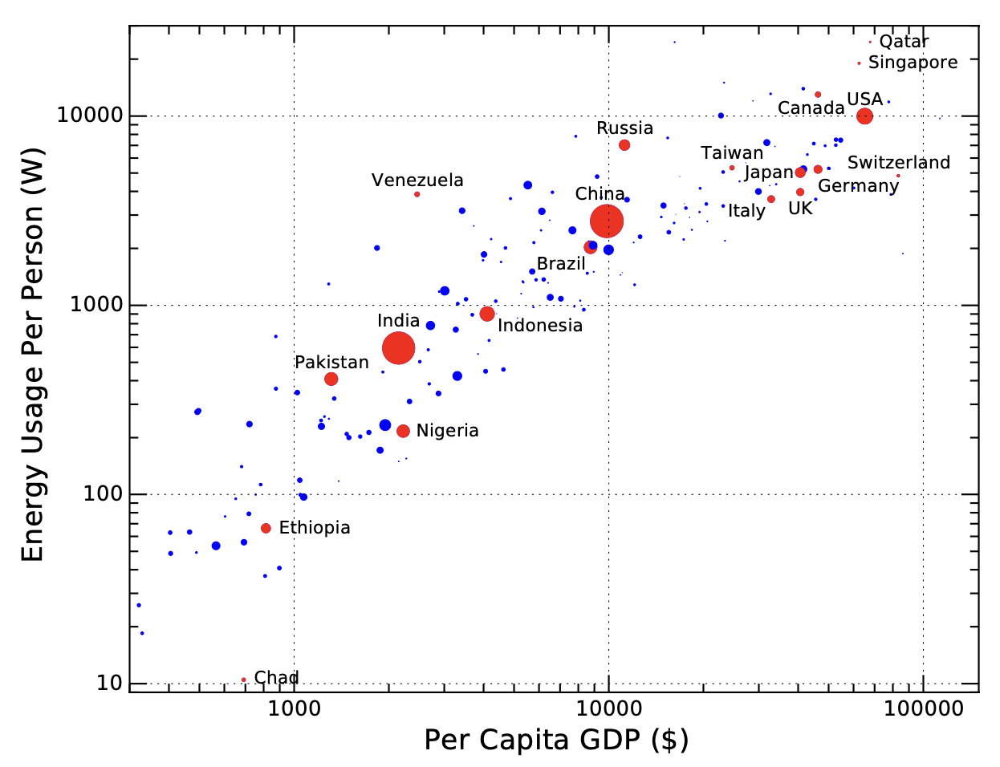
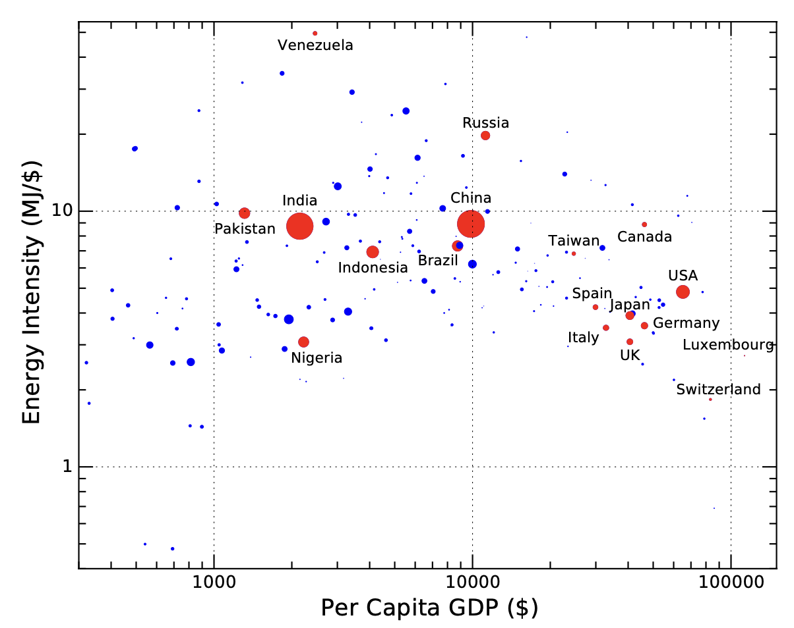
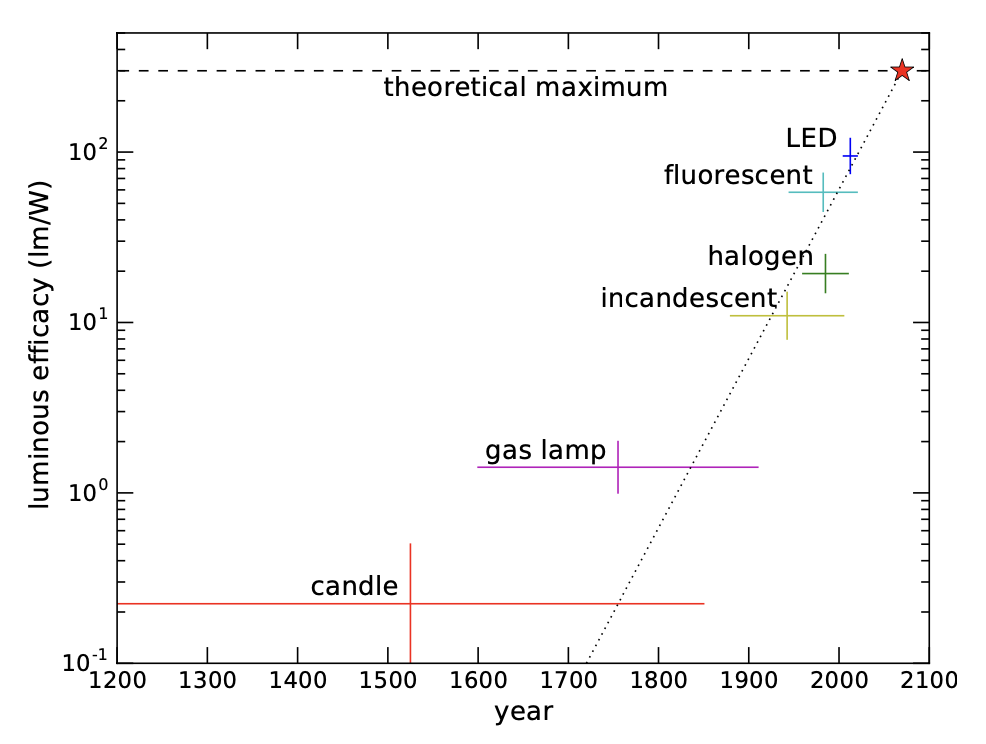
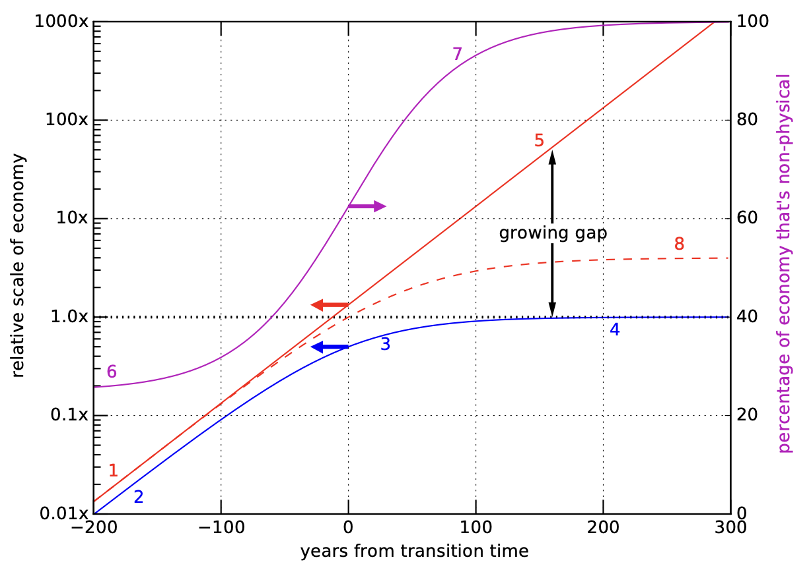

2 经济增长的极限
======================

:doc:`第 1 章</Part1/ch1>`\ 用物理定律和数学逻辑说明了，持续的哪怕只是百分之几的增长，最后也变得荒谬、站不住脚，
即使只持续几百年也是不可能的。在本章中，我们将探讨经济增长这一不怎么受物理学限制的概念，
因为经济增长是现代社会的基石。投资、贷款、退休和社会保障计划都以经济增长为前提。
本章的结论是，在没有物理增长的情况下，经济增长将无法以任何显著的速度持续下去——而我们已经看到
物理增长不可能无限期地持续下去。经济学家通常很快就会批评这种说法，但只要有耐心，他们是可以被说服的。\ [#]_ 
这就开始吧。

.. [#] 比如：\ :cite:`c5`

2.1 历史耦合
-----------------------

在自给自足的时代，与实物相比，美学的价值微乎其微：比如，你不能吃雕塑，它也不能帮你保暖。\ [#]_ 
食物、工具、木材等资源、驮兽或役畜才是最有价值的东西。当满足了基本的生存需求后，
黄金或珠宝可能也需要一点，但这些也是物质资源。

.. [#] 事实证明，生命是一场与热力学的斗争。

农业解放了社会中的一些人，使他们能够思考和创造。经济为艺术和表演提供了更多的价值空间：
这些东西即使不能为身体提供动力，也能为思想提供动力。在文艺复兴时期，赞助人会支持艺术家和科学家，
因为他们的成果很少有其他经济支持渠道。在当今世界，复杂的经济根据社会价值观
将金融资产分配给各种各样的从业者。

但资源仍然是最重要的。美国的繁荣在很大程度上是因为它拥有丰富的自然资源。
矿业和动物皮毛以及农业（烟草、棉花、玉米、小麦）在早期占据主导地位。
20 世纪中叶，美国成为世界上最主要的石油出口国（首先在宾夕法尼亚州开发，\ [*]_\ 
然后是加利福尼亚州和得克萨斯州）。经历两次世界大战，
美国国内的基础设施基本毫发无损，同时还建立了庞大的制造能力。
美国人抱着「敢做敢为」的态度，在几乎所有领域都取得了巨大成就。
作为 20 世纪中期的制造业强国，美国的原材料和受过良好教育的劳动力共同推动了创新和生产。
许多美国人渴望回到这些「光辉岁月」，\ [*]_\ 这绝非偶然；然而，我们不可能做到这一点，
因为我们已经永久性地耗尽了一些原始库存。

过去是这样，今天也是这样：石油、钢铁、金属、农产品和重型机械等资源在市场上依然价格不菲。
资源助长了繁荣，它不是**唯一**的原因，但仍然是可靠的基石。图 2.1 显示了经济规模与能源
使用之间的紧密联系，人们常说这两者之间存在耦合（coupling）关系。

.. [*] {-}可以说，美国就是当时的沙特阿拉伯。
.. [*] {-}「光辉」、「荣耀」并不是对所有人而言，认识到这点很重要。

  
  **图 2.1：**\ 人均能源使用量是国内生产总值的对数函数。人均 GDP 是一个国家的经济总量除以人口，
  实际上表示平均年收入。个人使用能源的速度以功率（W）表示。这里存在一个跨越许多数量级的强相关关系：
  富裕国家的人均能源使用量更大\ :cite:`c6`\ :cite:`c7`\ :cite:`c8`。图中标注了几个有启发性的案例（红点）。 圆点面积与人口成比例。

要捕捉经济活动与物理的联系，一种方法是看支出每一元钱\ [#]_ 消耗的能源。
一个国家的经济\ :term:`能源强度<energy intensity>`\ （见\ :ref:`定义 2.1.1<def2.1.1>`）
就是社会总的能源支出除以国内生产总值（:term:`GDP`）\ [#]_ 。

.. [#] 或换算成等价货币。
.. [#] 国内生产总值是衡量一个国家一年内生产的商品和服务的货币总值。

.. _def2.1.1:

  **定义 2.1.1：能源强度**\ 是衡量一个社会相对于其经济规模使用多少能源的指标，有点像效率。
  它可以代表一般的资源使用情况，计算公式为：

  .. _eq2.1:

  .. math:: \text{能源强度} = \frac{消耗的能源}{花掉的钱} \tag{2.1}

  在一个资源受限的世界里（物质和能源供应有限），较低的能源强度意味着
  在一定的经济产出下较少的能源消耗，或者反过来，在固定的能源消耗下有较高的经济产出。
  在较小的尺度上，我们可以举例说，花 1000 元乘飞机旅行的能源强度要远远高于花同样的钱购买法律咨询。

因此，能源强度可以衡量一个国家相对于其经济规模而言的资源密集程度。例如，美国每年消耗约 10\ :sup:`20` J
的能量，国内生产总值约为 20 万亿美元。将其相除，则能源强度为 5 × 10\ :sup:`6` J/$，
或 5 MJ/$（单位可有多种变化）。\ [*]_\ 全世界一年消耗约 4.5 × 10\ :sup:`20` J，
世界生产总值约为 90 万亿美元，也是 5 MJ/$。发达国家之间的差异不是特别大，
一般在个位数 MJ/$ 的范围内。

.. [*] {-}我们将在\ :doc:`第 5 章</Part2/ch5>`\ 中介绍能量单位。现在，我们只需
   知道\ :term:`焦耳<Joule>`\ （J）是一种能量单位，MJ 表示兆焦耳，即 10\ :sup:`6` J。

  
  **图 2.2：**\ 各国的能源强度,对数坐标。纵轴显示每个国家的能源「饥饿」程度与其经济产出的关系，
  横轴则按人均经济产出对各国进行排序。图中标出了几个具有启发性的案例（红点）。点的面积与人口成比例。
  富裕国家的能源强度往往低于发展中国家，但部分原因可能与制造业从前者转移到后者有关。

:ref:`图 2.2<fig2.2>` 显示了世界各国的能源强度。驱动能源使用的因素包括地理范围
（大国需要更多长途运输）、气候（寒冷国家需要更多供暖）、效率和生活方式。俄罗斯、加拿大
和美国的国土面积很大，前两者比大多数国家需要更多的供暖。相比之下，瑞士地域狭小，
大部分重工业都是外包的。也许该有人去了解一下委内瑞拉（Venezuela）的情况\ [#]_ 。

.. [#] 也许他们不小心忘关烤箱？

2.2 资源解耦和替代
----------------------------

随着经济规模的扩大，经济活动超出了仅能维持生存的水平，艺术和娱乐等「琐碎」活动的比重会越来越大。
这类活动的能源强度可以很低。艺术品收藏家可能会花 100 万美元购买一幅梦寐以求的画作。这只需要很少的能量。
这幅画很久以前就已经完成了。它甚至可能一直在同一地点展出，只是所有者的名字发生了变化。
金融交易不需要制造、运输，所需能源几乎可忽略不计，被称为与有形资源「解耦」。社会中有很多这样的例子，
经济学家们举出这些例子，来说明我们如何能够在不扩大资源需求的情况下继续扩大经济\ [#]_ 。

.. [#] 无论如何，这是种希望。

.. _def2.2.1:

  **定义 2.2.1：**\ :term:`解耦（decoupling）<decoupling>`\ 是指经济活动不必与物质
  （如能源）需求紧密联系在一起，因此能源强度可以任意变小。把经济活动按解耦程度排列的话，
  一端是能源和物质资源的高强度利用（如钢铁生产），另一端是艺术品交易\ [#]_ 。
  在物质增长受限的情况下，经济保持增长的唯一途径就是提高社会的解耦程度。

.. [#] 水暖、新闻或营销等服务业介于两者之间，使用一些有形资源，但不像重工业那么多。

我们的\ **梦想**\ 是，随着发展的进步，经济能源强度可能会下降（解耦程度更高），
这样每单位能源消耗就能赚到更多的钱。如果经济能够与能源需求脱钩，
我们在追求经济持续增长时就不会受到限制，投资者和政治家们也会喜笑颜开。
广义而言，这种转型意味着更注重抽象服务业\ [#]_ ，减少能源和资源密集型工业/制造业的发展。

.. [#] 这些服务可能包括歌唱教学、生活指导、心理治疗、财务规划和其他几乎不需要体力投入的活动。

这世界像是某种「实验场」，\ [*]_\ 呈现了不同国家采取的不同政策和不同的发展状态，
因此\ :ref:`图 2.2<fig2.2>`\ 可被视为实现解耦的潜在路线图。

.. [*] {-}富裕国家的能源强度较低，部分原因是制造业向海外转移。
   但推动整个世界降低能源消耗强度会更加困难，因为物理过程仍然必须在某个地方进行。

问题是，随着国家的发展和繁荣，能源强度是否会像我们希望的那样作为解耦的信号而降低？
从大尺度来看，影响是很轻微的。从印度到美国，强度只降低了 2 倍，
而个人富裕程度却横跨大部分水平轴（人均 GDP 相差 30 倍）\ [#]_ 。这太微不足道了。

.. [#] 美国和印度分别为 65,000 美元和 2,100 美元。

在个人收入最高的部分（\ :ref:`图 2.2<fig2.2>` 右侧），我们可能会发现一个下降的趋势。
但是，面对不可复制的情况，我们必须谨慎选择。并不是每个国家都能像瑞士一样，
拥有得天独厚的地理位置和以金融为中心的特点。美国也许想象自己提供了一个其他国家可效仿的模式，
但如果许多欧洲国家采用美国的生活习惯，其强度实际上反而会增加。从整体上来看，典型发达国家
大概在 4 MJ/$ 的水平，但没有任何一个发达国家能在低于 1 MJ/$ 的强度运行。
本书对未来增长的评估，关注的是数量级的规模和极限（如\ :doc:`第 1 章</Part1/ch1>`\ ），
目前来看解耦似乎并没有什么用处\ [#]_ 。

.. [#] 也就是说，在增长达到物质资源极限后，我们不可能再继续增长几个数量级了。

.. _def2.2.2:

  **定义 2.2.2：**\ 替代（\ :term:`substitution`\ ）是指切换到其它资源的能力，
  当一种资源变得稀缺或找到更好/更优的替代品时。替代常常被用来反驳人们对资源稀缺的担忧。
  一种常见而又可爱的说法是，石器时代的终结并不是因为我们用完了石头，而是因为我们发现了青铜。

过去有很多替代的例子（\ :ref:`定义 2.2.2<def2.2.2>`）。从明火到蜂蜡蜡烛，到鲸油灯笼，\ [*]_\ 
到管道煤气灯，到白炽灯泡，到荧光灯，再到 LED（发光二极管）技术，照明技术在不断进步。
每一步似乎都是一种进步，因此我们很自然地认为，故事将沿着这个方向继续发展下去。

.. [*] {-}通过这个例子，我们可以看到替代和解耦是如何联系在一起的：通过替代提高效率，
   同样的照明亮度需要更少的能源。

.. _box2.1:

.. admonition:: Box 2.1: 照明效率的故事

  量化照明技术进步的一种方法是以流明/瓦特为单位的照明效率（luminous efficacy）。在 20 世纪，
  白炽灯长期以来无处不在，以至于我们养成了用灯泡消耗的电功率（W）来描述亮度的坏习惯。因此，\ [*]_\ 
  我们几代人都习惯了「100 瓦」或「60 瓦」灯泡有多亮。随着技术的发展，我们应该改用「流明」来表征亮度，
  因为它能准确表示人眼感知光源的亮度。

  :ref:`表 2.1<tab2.1>`\ 和\ :ref:`图 2.3<fig2.3>`\ 显示了改进光源后带来的发光效率提升。
  这种趋势会一直持续下去吗？不会。每个光子都有一个最低能量\ [#]_ ，取决于其波长。
  对于分布在可见光谱上的光子（产生我们认为是白色的光），理论极限约为 300 lm/W\ :cite:`c9`。
  在这一极限值下，产生光的过程中不会浪费任何能量，100% 的能量都用于光本身。由于一系列现实挑战，
  工程上很少能达到理论极限。因此，如果照明效率在今天的基础上再提高两倍，结束长达几个世纪的趋势，
  也不足为奇。

.. [*] {-}灯泡包装上仍然会写着「等效瓦数」，但「等效60 瓦」的灯泡可能只消耗 12 W 的电。

.. [#] 我们将在 5.10 节中看到这一点。

.. margin:: 

  .. table:: **表 2.1**: 照明效率\ :cite:`c10`\ :cite:`c11`
    :name: tab2.1
    :class: booktabs

    =====================    ===========
    光源                      lm/W
    =====================    ===========
    蜡烛                      ~0.3
    煤气灯                    1-2
    白炽灯                    8-15
    卤素灯                    15-25
    节能灯（:term:`CFL`）      45–75
    LED                      75-120
    =====================    ===========

  
  **图 2.3：**\ 照明效率的历史进程，纵坐标为对数，用线条表示时间和性能的大致范围。
  顶部的虚线代表白光（无废热）的最大理论效率。倾斜的虚线按照我们的习惯，以每百年 10 倍的速度上升
  （年增长率为 2.3%）。这条虚线在本世纪中叶达到了理论最大值（红星），表明这种长达数百年的上升趋势
  不会持续太久\ :cite:`c10`\ :cite:`c11`。

历史上的进步会让我们误以为，可以期待更好的替代品不断涌现。在目睹了
照明效率不断提升（:ref:`Box 2.1<box2.1>`），仿佛半打兔子从帽子\ [#]_\ 里神奇地跑出来之后，
我们习惯于相信会有更多的兔子跑出来。但 6 只兔子并不意味着无限多。\ [*]_\ 
我们应该欢迎每一只新兔子，但不能把我们的未来寄托在源源不断的新兔子上。

.. [#] 魔术师那种
.. [*] {-}我们将在\ :term:`化石能源<fossil fuel>`\ 的背景下回到这个主题，
   化石能源可以说是所有兔子之母。我们已经从帽子里掏出了一只如此巨大的兔子，
   因此许多人认为我们从此就万事大吉了。相当于把一个等同于无穷个，这就更加可疑了。

对处于财富分配顶端、经济上有保障的人来说，更容易接受替代的诱惑，将其作为前进的方向。
许多人都是从卑微的起点获得财富的，因此在住房、交通、服装、食品、旅行等方面都过着不断升级的生活。
更不用说那些一生都被财富包围的人，有能力负担各种新的升级。然而把少数人享有的推广给大多数人，
并不总是现实的。不是所有东西都能规模扩张的。\ [*]_\ 

.. [*] {-}拥有数百公里续航里程的电动汽车似乎是超越化石燃料的必由之路。但对大多数人来说，
   4 万美元以上的价格似乎并不是一个很好的解决方案，而且我们也不能确定价格是否会迅速下降。
   :ref:`附录 D.3<d.3>`\ 更详细地介绍了电气化交通。

.. _box2.2:

.. admonition:: Box 2.2: 协和飞机的命运

  协和客机在 1976-2003 年间提供跨大西洋超音速客运服务，它的命运或许可以为我们提供有益的启示：
  制造超音速客机是\ **可能的**\ ，但这并不意味着有足够多的人能负担得起，从而在经济上\ **可行地**
  缩短所有人的跨洋旅行时间。现在的消费者不再有选择超音速飞行的权利，尽管 50 年前人们认为这是未来的趋势。
  有时候，当我们的梦想与现实不符时，我们确实会倒退。

更一般地说，有时最佳解决方案和「巅峰」技术会在历史中某个早期出现。尽管我们对元素周期表上的元素进行了大量研究，
但作为一种重要物质\ [#]_ ，我们永远无法超越 H\ :sub:`2`\ O。营销人员可能会推销说 H\ :sub:`2`\ O\ :sub:`2`\  更好，
多了一个有益的氧原子，但\ **请不要饮用过氧化氢**！今天使用的一些技术即使前工业时代的人也认识，比如
车轮、绳子、碗、玻璃、衣服。我们并不总能找到更好的东西，尽管随着时间的推移，
我们可能会做出一些渐进式的改进。但并不是所有东西都会经历改变游戏规则式的跳跃发展。

.. [#] 与此相关的是，考虑到元素周期表是有限的，可以很容易地放在一张纸上（:ref:`图 B.1<figb-1>`）。
   我们没有无限的替代元素/化合物。天体物理学的测量结果证明，整个宇宙都局限于同一组元素。

总之，解耦和替代被认为是在能源和其他资源受限的情况下，让经济增长无需放缓的机制。
我们可以利用更少的资源来赚钱（解耦），或者找到不受制约的替代品（替代）。是的，
这种观点是有大量实例支持的。如果说我们已经走到了尽头，不能再指望从解耦或替代中获得更多收益，
那就太愚蠢了。但如果认为它们可以永远产生红利，从而使经济能够永恒增长，那也同样是愚蠢的。

.. admonition:: Box 2.3: 效率极限

  提高效率似乎是容忍可用能源停滞或减少的一种方法。少花钱多办事是非常吸引人的。是的，
  提高效率是件好事，应该继续努力。但它们并不能解决增长的极限问题，原因如下。
  
  1. 在大多数情况下，实际效率已经在理论极限的 2 倍以内\ [#]_ 。以 90% 的效率运行的电机
  或发电机几乎没有改进的余地。如果效率远小于 1%，那么在未来一段时间内，将效率提高作为一种「资源」
  是合理的，但实际情况并非如此。
  #. 能源使用效率的提高往往以每年 1%\ [#]_ ，有时 2% 的速度缓慢进行。因此，:term:`翻番的时间<doubling time>`
  是以几十年为单位的，这与前面的观点相结合，表明这趟列车将在本世纪内结束\ [#]_ 。
  #. 提高效率可能会适得其反，这就是所谓的杰文斯悖论(:term:`Jevons paradox`)或反弹效应。
  增加对更高效技术的需求会导致对基础资源的\ **更大**\ 需求。例如，冰箱效率的提高导致冰箱体积增大、数量增多\ [#]_ ，
  从而增加了用于制冷的能源。上个世纪，在效率大幅提高的背景下，全球人均能源和物质资源使用量不断攀升\ :cite:`c12`。\ [*]_\ 
  
  提高效率并不能解决资源短缺问题。

.. [#] 第 6 章介绍了化石燃料等热源的理论效率极限。
.. [#] 即今年的 30% 明年可能是 30.3%（而不是 31%，后者将提高 ∼3%）。
.. [#] 类似照明技术，见Box 2.1 和图 2.3。
.. [#] 还有地下室、车库或办公室等等。
.. [*] {-}\ :cite:`c12`: Garret (2014), Rebound, Backfire, and the Jevons Paradox

2.3 物理限制下的经济极限
------------------------

现在让我们来做一个思想实验。我们将以\ :ref:`图 2.4<fig2.4>` 为参考。以下文字中的彩色数字
表示图中颜色相似的标签。首先，我们假设整个经济的增长率是恒定的（图 2.4 中的\ :red:`标记 1` ，红色曲线），
用我们所熟悉的 2.3% 的年增长率，即每个世纪翻 10 倍。同时，从 :blue:`标记 2` 开始，经济中的物质资源
（能源、材料）规模也以同样的速度增长。两条曲线之间的垂向差距表明，经济一开始并不是百分之百的实物经济：
经济总量大于实物部分\ [#]_ 。

.. [#] 这样就给服务业一点空间。

  
  **图 2.4：**\ 物质资源饱和后的经济演变模型。蓝色曲线为物质经济规模（趋于平稳或饱和）。
  红色实心曲线是总经济规模，我们强制其保持恒定增长率（每百年 10 倍，或年增长率 2.3%）。
  品红色实线是非物质部门在经济中所占的比例，红色虚线是经济对物质部门饱和的更现实的反应。
  彩色箭头指向每条曲线应使用的刻度：左边是经济规模的对数刻度，右边是线性的百分比。
  构建该模型只是为了说明整体情况，时间尺度和其他量化细节不应按字面意思理解。

从 :blue:`标记 3` 开始，快进到物质资源停止增长的时代。第 1 章以能量和热力学为基础，
已经说明了我们不能指望物质增长无限地持续下去，最长也会在几个世纪的时间尺度上结束\ [#]_ 。
在这种情况下，我们社会的能源规模会在一个稳定的尺度上趋于平稳（:blue:`标记 4`）。

.. [#] 这里（乐观地）假定我们已经找到了一种可再生的替代能源，可以有效地无限期满足恒定的需求。
   如果不能，情况就会更糟，我们将被迫缩小有形部门的规模，这将迫使图 2.4 中的蓝色曲线在以后几年中下降。

如果我们要求经济在能源恒定的情况下继续增长，解耦就变得越来越有必要，如图 2.4 所示，两者差距越来越大。
换句话说，如果国内生产总值（:term:`GDP`，作为经济活动的指标）要继续增长\ [#]_\ （:red:`标记 5`），
那么总的能源强度（每一元钱的能耗）就必须不断降低。为此，低能耗活动必须在经济中占据越来越重要的地位。
到目前为止，经济学家们都不会有异议，因为这恰恰激发了人们对解耦的支持——这正是面对物理限制的前进之路。
人们可能会期待更多的抽象服务、虚拟体验、艺术交易、高级演出，所有这些都只需要很少或不需要额外的能源消耗，
甚至可能比以前更少。这样，在物质资源保持不变的情况下，经济规模可以不断扩大。

.. [#] 是从实际价值的角度来看，而不是人为地通过通货膨胀。

如果经济要在解耦的基础上继续扩张，就必须有更多的资金流向非物质部门。这意味着更多的现金流与低消耗活动相关。
因此，在实际生活中，更多的个人收入将流向与能源或其他物质需求无关的体验性消费。在图 2.4 的\ :purple:`标记 6`，
我们可以看到非物质部门在经济中所占的比例从 25% 开始，虽不占主导地位，但也不容忽视。
随着红线和蓝线的分开，品红色曲线必然上升，直到\ :purple:`标记 7`，非物质部门的比例接近 100%，
并继续无限接近 100%。

在这一过程中，一个显而易见的反向结果是，高能耗或高体力消耗的活动，如交通、食品、取暖、烹饪、制成品等，
在经济中所占的比重越来越小，或者说，在每月开支中所占的比重越来越小。换句话说，这些活动变得廉价。\ [*]_\ 

.. [*] {-}⚠️但我们会认为，这是不现实的。

在我们想象的经济持续增长的情景中，指数无情地攥住了缰绳，让鸿沟越来越大，于是实物商品变得非常廉价，
占消费的比例越来越小\ [*]_\ 。当我们到达图 2.4 的右侧时，经济规模是实物规模的 1000 多倍，
这意味着实物部分在整个经济中所占的比例不到 0.1%。表 2.2 说明了上述 2.3% 增长率下的发展情况。
如果在 2000 年，一个人 50% 的收入（也就是大约一半的工作时间）用于购买高消耗产品，
那么这个比例会越来越小，直到表末，你每年只需花 6 分钟的工作时间\ [*]_\ 就能赚到足够的钱购买高消耗产品——
你所有的食物、衣服、交通、取暖、烹饪、制成品。

.. [*] {-}看起来同样是不现实的。
.. [*] {-}非常荒谬的结果。

.. margin:: 

  .. csv-table:: **表 2.2**: 实物商品的成本
    :name: tab2.2
    :class: booktabs
    :header: "年","占收入%","工作小时"

    2000,50%,1000
    2100,5%,100
    2200,0.5%,10
    2300,0.05%,1
    2400,0.005%,0.1

如果你开始觉得这像是不切实际的幻想，那很好，你的直觉让你受益匪浅。
**供应有限的**、基本的、不可讨价还价的、维持生命的商品，怎么可能变得几乎免费呢？
这种想象违背了另一个更基本的经济\ **供求原则**。有限的生活必需品总是具有略高的价值。
有限的供应和刚性的需求决定了价格的底线。

.. admonition:: Box 2.4: 轻松玩转垄断

  这种情景的荒谬性，还可以这么看：如果物理上有限但又必不可少的（维持生命的）资源
  在一定的时间里变得特别廉价，那么一个人就可以花很少的钱买下所有这些资源，
  然后再向任何想要继续生存的人收取高昂的费用。我们根本不会遇到珍贵而有限的资源变得非常廉价的情况。
  另外，如果人们每年只需工作一小时就能满足基本需求，那么工作就会大大减少，从而拖累经济生产率，
  进而以某种方式阻碍增长的持续。

一旦达到价格底线，实物资源的成本将无法进一步下降。这在物质资源规模停止增长后很快就会发生。
事实上，在作者看来，生存所必需的有限资源不太可能低于总经济规模的 10%\ [*]_\ ，
而在我们的 2.3% 增长情景中，这发生在物质资源饱和后的一个世纪内。
图 2.4 中的\ :red:`标记 8` 描绘了经济（红色虚线）在物质规模饱和时更为现实的发展轨迹。
在这种情况下，经济的增长速度略高于实物部门的增长速度，但最终会自发进入非增长阶段。

.. [*] {-}你认为合理的下限是多少？基本需求在经济中的比重能达到多低的程度，并且是合理的？

综上，我们有一个符合逻辑的推测，经济增长将在几个世纪的时间尺度上结束。
假设目标增长率为每年百分之几，那么热力学将地球上的能源增长限制在最多几个世纪的时间内，
而经济增长将在此后的一个世纪左右停止。在现实中，经济增长可能会在达到理论极值之前就结束。

2.4 没有增长的世界
------------------------

上述论点阐明了为什么不能指望经济增长无限期地持续下去——与普遍的假设相反。
当一个数学模型得出荒谬的结果，比如我们推断能源使用量达到荒谬极端的结果时，
这并不意味着数学本身是错误的，只是它被错误地应用，或者是使用了错误的假设。
因此，分辨缘由，只能是无限增长的假设是站不住脚的。

增长机制已深深融入我们当今的全球社会。为什么不呢？我们世世代代都在享受它带来的好处。
我们赞美它所带来的种种益处，因此我们的政治和经济制度也都致力于保护它。
社区规划、利率、投资、贷款、银行、社会保障系统\ [#]_ 以及退休计划都取决于经济增长的假设\ [#]_ 。
鉴于经济增长对社会运作的重要性，一旦出现（哪怕是暂时的）衰退迹象，恐慌的冲击波就会回荡。
然而，这里传达的信息是，我们不能指望经济增长会一成不变地持续下去。这意味着许多事情都必须改变。

.. [#] 在美国，社会保障和医疗保险就是例子。
.. [#] 劳动力和投资的增长是这些保障计划的基本要素，其支付的金额超过了个人过去的贡献。

回到经济理论的根源，最早的思想家——亚当·斯密、大卫·李嘉图、托马斯·马尔萨斯、约翰·斯图亚特·米尔
——都以自然哲学为基础\ [#]_ ，认为经济增长只是一个暂时阶段，最终受限于一种主要的物质资源：土地。
在当时，土地是农业、木材、采矿和狩猎产出的关键，因此决定着经济的发展。
这些经济学先驱没有预见到的是\ :term:`化石能源<fossil fuel>`\ 的到来，以及伴随能源爆炸而来的技术发展。

.. [#] 更接近现代物理学而非现代经济学，植根于自然世界。

现在，我们已经陷入了某种自满情绪之中，我们已经从早期经济学家的增长终结预言中解脱出来，
因此很容易得出结论：他们错了\ [#]_ ，我们已经超越了自然极限。这种想法是危险的。
归根结底，大自然对我们想象中的自己有多聪明漠不关心。\ **如果我们真的聪明，
我们就会开始思考如何构建一个不依赖增长的世界，以及如何在地球的极限内和谐地生活。**
本书\ :doc:`第 19 章</Part4/ch19>`\ 继续涉及这一主题，在此之前的章节对能源限制进行更全面的阐述。

.. [#] 最典型的例子就是托马斯·马尔萨斯，他在 200 多年前就根据资源的有限性发出了警告，
   后来化石能源的出现才打破了这一说法。把马尔萨斯和「错误」长久的联系起来，这让人产生了一种危险的联想，
   认为所有类似的警告都是不可信的，都可以忽略不计。请注意，从「狼来了」的故事中得到的最重要
   也是最容易被忽视的教训是，真的有狼出现了。

2.5 总结：经济增长终将停止
---------------------------

Box 2.5 概述了结束经济增长的秘诀，值得再次重申。请确保你能追溯从一点到下一点的内在逻辑和联系，
而不是将其作为互不关联的事实死记硬背。\ [*]_\ 

.. [*] {-}如前所述，专家们经常会将复杂的内容多读几遍，以充分吸收其中的论点。请在这里试试。

.. admonition:: Box 2.5: 经济增长极限

  1. 有形资源（在我们的例子中是能源）最终会稳定在一个固定的年产量上。
  2. 经济中的非物质部门必须承担起经济持续增长的责任，\ **如果**\ 经济增长要继续的话。
  3. 经济逐渐由非物质部门主导。
  4. 物质部门在经济中所占的比重越来越小，如果要保持指数增长，物质部门最终会消失。
  5. 在这种情况下\ [#]_ ，物质产品（其中包括能源）变得非常便宜，只需要一周的收入，然后是一天的收入，
     然后是一小时、一分钟、一秒钟的收入。
  6. 这种情况是不可能发生的，也不符合常识性的供需原则：在市场体系中，有限的、但绝对重要的资源
     永远不会变得特别廉价。
  7. 在某一时刻，有形资源将「饱和」到只占经济的最小部分，到那时，非有形部门的整体增长也必然停止。

.. [#] 再明确一下，我们认为这最终是完全不可行的。

我们可以举出一些完全合法的解耦的\ **例子**\ 和许多令人印象深刻的替代故事，
但这并不意味着整个经济可以建立在无限期的、持续的基础之上。我们是有形世界中的有形人，
对生活有着不可商量的最低要求。支持关键功能的活动和商品不可能无限扩张下去，一旦其扩张达到物理极限，
也不会变得异常廉价。我们这个世界的有限性保证了这种极限会到来，从而导致经济增长停滞。
归根结底，任何事物都逃不过物理规律。

因此，在承认过去的增长给人类带来了无数好处的同时，我们也必须扪心自问：如果增长的终结是不可避免的，
那为什么它仍然是我们的主流计划呢？

2.6 思考题
--------------

（略）