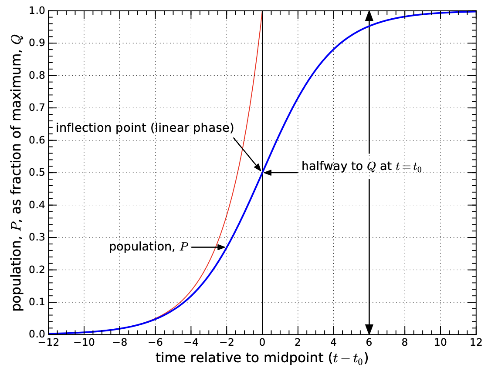
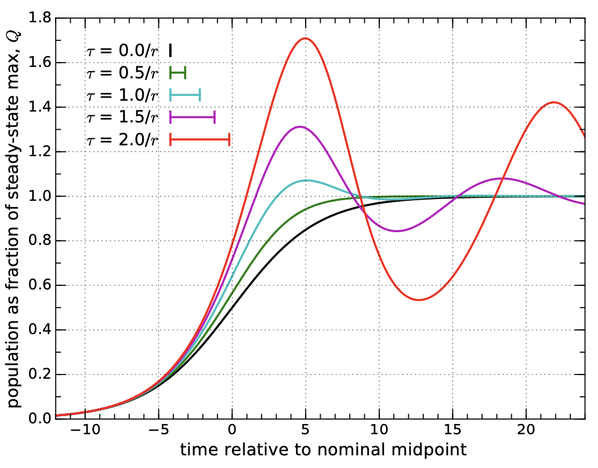
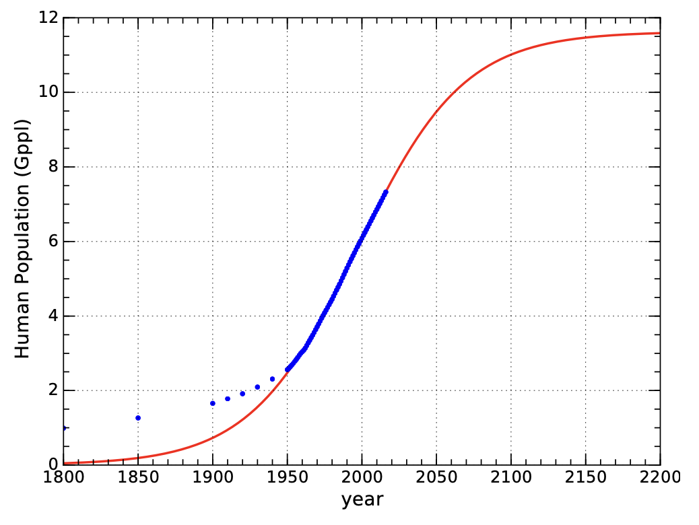
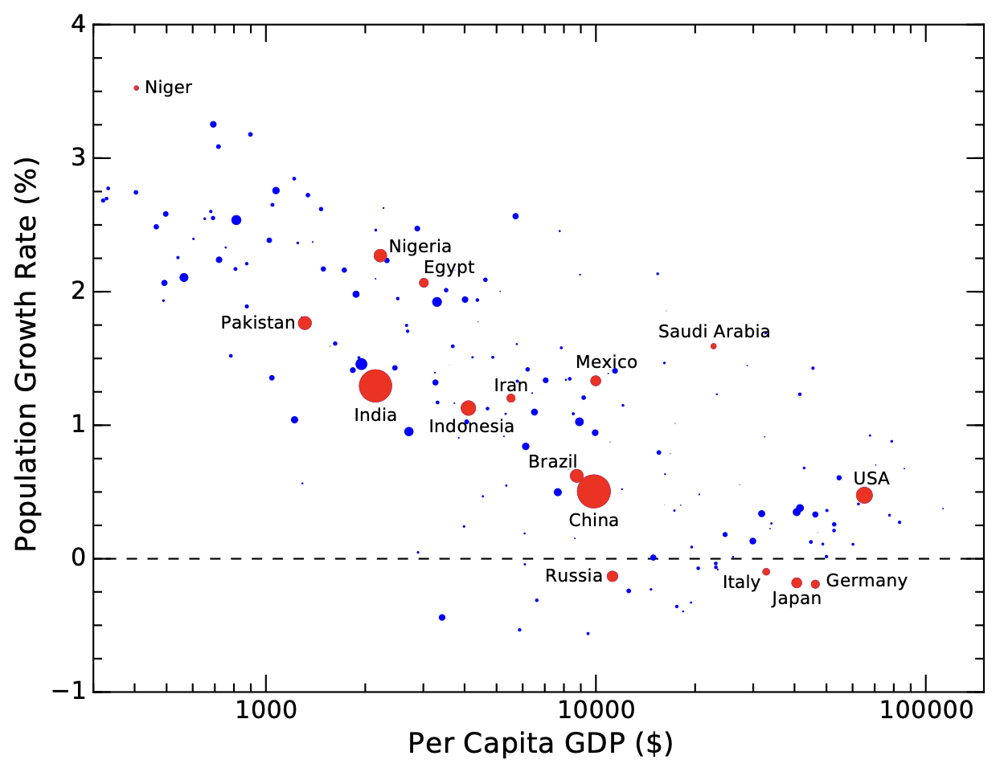
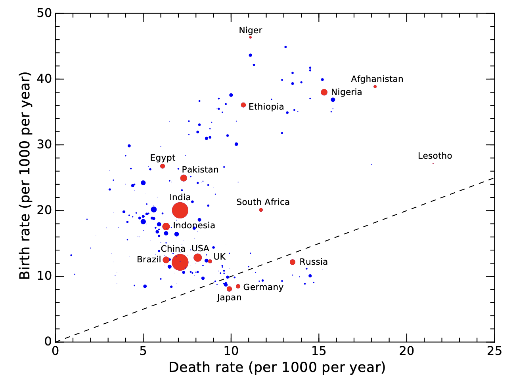
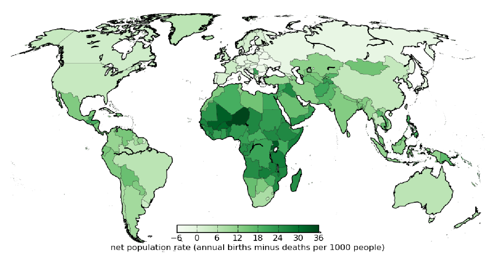
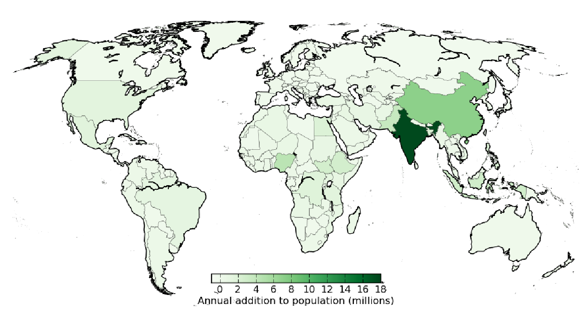
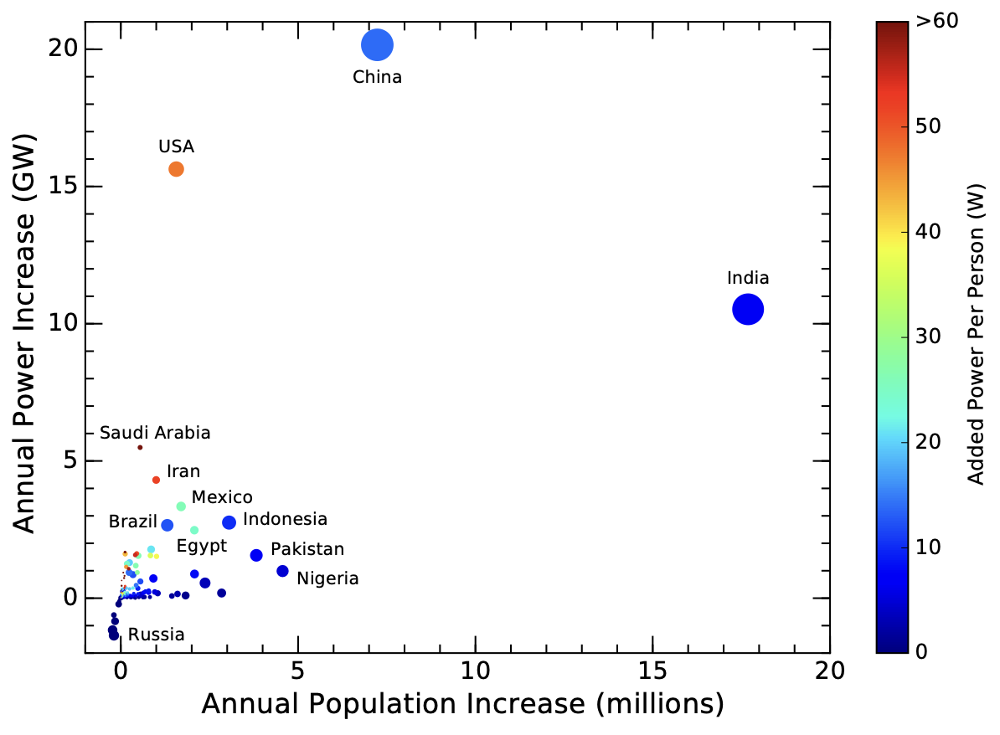

3 人口
=============

我们在这个星球上经历的几乎所有问题都与人口有关。:doc:`第 1 章</Part1/ch1>`\ 中
关于能源持续增长的讨论是基于能源的历史增长率，其部分原因是人口增长，部分原因是人均使用量增加。
但是，第 1 章中隐含的人口将继续呈指数攀升的观点是不切实际的——
这是让第 1 章的「预测」失效并禁止「永远增长」的众多因素之一。

因此，让我们从现实出发，审视一下更实际的情况。美国人的人均能源使用量大约是全球平均水平的 **5 倍**。
如果全球人口最终翻一番，而全球人均能源与美国人目前的水平持平\ [#]_ ，那么能源使用的总规模将增加 10 倍，
按照我们数学上方便的 2.3% 年增长率计算，需要 100 年的时间（见\ :ref:`式 1.5<eq1.5>`）。
这就为能源增长的终结提供了一个比第 1 章中天马行空的推断更现实、更接近的时间尺度。

.. [#] 即让全球人均能源使用量比现在增加五倍

.. margin:: 

  .. figure:: ../images/fig3-1.png
    :name: fig3.1
  
    **图 3.1：**\ 人口（红色）和全球能源消耗（蓝色），显示出能源需求（功率）的增长速度
    远高于人口的增长速度，这与人均用量的增加息息相关。纵轴按比例缩放，使曲线在 19 世纪重叠。
    :cite:`c14`\ :cite:`c15`\ :cite:`c16`

虽然本章的重点是令人震惊的人口增长速度，但根据本书总的主题，我们应该始终注意背景中的能源和资源问题。
为此，:ref:`图 3.1<fig3.1>` 显示了能源需求在多大程度上超过了人口增长的速度，
其纵向比例设置成与 19 世纪人口重叠。从 1900 年到 1950 年，人均能源消耗略有增长，
但 1950 年后急剧膨胀，以至于今天地球上有相当于 250 亿人在以 19 世纪的能源水平生活。

既然人口对我们的未来发展起着巨大的作用，我们就需要更好地了解人口的过去。
我们还可以对人口理论有一定的了解，然后讨论预言的「人口转变，demographic transition」及其影响。

3.1 人口的历史
----------------------

.. list-table:: 

  * - .. figure:: ../images/fig3-2.png
        :name: fig3.2

        **图 3.2：**\ 从古至今的全球人口估计，按线性比例绘制。近代的情况在图 3.1 中更清楚。:cite:`c14`\ :cite:`c15`

    - .. figure:: ../images/fig3-3.png
        :name: fig3.3

        **图 3.3：**\ 从古至今的全球人口估计，纵坐标为对数。:cite:`c14`\ :cite:`c15`

.. margin:: 

  .. figure:: ../images/fig3-4.png
    :name: fig3.4

    **图 3.4：**\ 近几个世纪以来的全球人口估计数。在对数图中，斜率不变的线段是指数线段。
    从图中可以看出四条这样的指数线段，它们的增长率都在不断上升。:cite:`c14`\ :cite:`c15`

  .. csv-table:: **表 3.1：** 图 3.4 对应的翻倍时间
    :name: tab3.1
    :align: center
    :class: booktabs
    :header: "公元","增长%","𝑡\ :sub:`2` 年"

    "1000-1700","0.12%",600
    "1700-1870","0.41%",170
    "1870-1950","0.82%",85
    "1950-2020","1.70%",40

:ref:`图 3.2<fig3.2>` 展示了过去 12,000 年的全球人口历史。请注意，在大部分时间里，人口都很少，
以至于图上几乎看不到。人们自然会对近代人口的急剧增长感到震惊，这使得当前的时代显得异乎寻常，
或者说是一种反常现象。但等等，也许这只是一个普通的指数函数。所有的指数函数——它们都是无情的——
都会在某一点上显示出这种惊人的上升，这种图形有时被称为「:term:`曲棍球杆<hockey stick>`」。
为了更深入地观察，我们把纵坐标换成对数（:ref:`图 3.3<fig3.3>`）。现在我们能看到过去的数据点了，
也能看到单一的指数函数（在对数图中保持斜率不变）是否能描绘整个图景了。

等等，什么？它看起来还是有点像曲棍球杆（甚至更像了）！这怎么可能？这不会是个好消息。
再仔细观察，我们可以粗略地将历史分为两个时代，每个时代都呈指数增长（图中的直线），但速度不同。
早期阶段的增长率仅为 0.044%。根据「:ref:`70法则<def1.1.1>`」，相应的\ :term:`翻倍时间<doubling time>`
约为 1600 年。在近代，1% 的增长率（70 年翻一番）显得更特别。事实上，我们有理由说，
与图中的前 10,000 年相比，最近的几个世纪是反常的。如果我们将 0.04% 的线和 1% 的线延长，
会发现它们在 1700 年左右相交，可以帮助确定大概的转型时间。

最近的人口快速上升是一个吸引眼球的发展阶段，值得仔细研究。:ref:`图 3.4<fig3.4>` 显示了
最近 ∼1000 年的情况，我们可以看到几段指数型的增长阶段。表 3.1 列出了图中四个速率对应的翻倍时间。

对人口历史的解释可能如下。黑暗时代之后的时期变化不大\ [#]_ 。文艺复兴（∼1700 年）引入了科学思想，
我们开始战胜疾病，人口增长得以加快。19 世纪中叶（1870 年），化石燃料的使用量开始爆炸性增长，
实现了大规模工业和机械化耕作。我们可以养活更多的人，同时对人类健康的掌控能力也在不断提高。
20 世纪中期（1950 年），绿色革命\ :cite:`c17`\ 引入了基于化石燃料的化肥和大规模农业机械化，
将粮食生产变成了一种产业。廉价营养品的供应发生了质的变化，疾病控制也在不断进步，
这两方面的结合使人口增长率进一步上升。

.. [#] 除了在 14 世纪，饥荒和瘟疫造成人口下降。

近年来，这一比率有所下降，从\ :ref:`图 3.4<fig3.4>` 中最后一部分的 1.7% 下降到 1.1% 左右。
为方便计算，把人口增长率四舍五入为 1%，那么人口将在不到 14 年的时间里从 70 亿增加到 80 亿。
计算方法与\ :doc:`第 1 章</Part1/ch1>`\ 相同，在此重新表述为：

.. _eq3.1:

.. math:: P = P_0 e^{\ln{(1+p)(t-t_0)}}, \tag{3.1}

其中，𝑃\ :sub:`0` 是时间 𝑡\ :sub:`0` 时的人口数量，而 𝑃 是时间 𝑡 时的人口数量，且增长率稳定在𝑝。
将这个等式反转\ [#]_ ，我们可以得到：

.. _eq3.2:

.. math:: t-t_0 = \frac{ln(P/P_0)}{ln(1+p)}. \tag{3.2}

.. [#] 自然对数和指数函数相互「抵消」（作为\ :term:`反函数<inverse function>`）

.. _exp3.1.1:

  **示例 3.1.1：**\ 我们可以用\ :ref:`式 3.1<eq3.1>` 计算：如果从 2010 年的 70 亿人开始，
  以 1% 的速度持续增长，到 2100 年将会有多少人。即 𝑃\ :sub:`0` = 7 :term:`Gppl`\ [#]_ ,
  𝑡 = 2010, 𝑝 = 0.01, 可计算出 2100 年的人口为 𝑃 = 7𝑒\ :sup:`ln 1.01×90` = 17 Gppl。
  
  根据\ :ref:`式 3.2<eq3.2>` 可以得出结论：从 7 Gppl 增加到 8 Gppl 按 1% 的速率计算，
  所需的时间小于 14 年。是这样计算的：ln(8/7)/ln1.01 = 13.4。\ [*]_\ 请注意，我们不需要
  在分子和分母中包含 10 亿，因为它们抵消了。

.. [#] Gppl 是 giga-people 的缩写，即十亿人。
.. [*] {-}由于我们近期的增长率略高于 1%，增加 10 亿人的实际时间为 12 年。

.. csv-table:: **表 3.2**：人口里程碑：地球上又增加了十亿人的日期。时间和翻倍时间以年为单位。1965 年前后，增长率达到 2%，翻番时间为 35 年。
   :name: tab3.2
   :align: center
   :class: booktabs
   :header: "年","人口","时间","增长率","翻倍时间"

   1804,1 Gppl,--,0.4%,170
   1927,2 Gppl,123,0.8%,85
   1960,3 Gppl,33,1.9%,37
   1974,4 Gppl,14,1.9%,37
   1987,5 Gppl,13,1.8%,39
   1999,6 Gppl,12,1.3%,54
   2011,7 Gppl,12,1.2%,59
   2023,8 Gppl,12,1.1%,66

:ref:`表 3.2<tab3.2>` 和\ :ref:`图 3.5<fig3.5>` 展示了每增加 10 亿人所需的时间，
并推断增加到 80 亿人所需的时间（截至 2020 年撰写本书时\ [*]_\ ）。第一个十亿人口显然花费了数万年的时间，
此后每增加一个十亿人口所花费的时间都在减少。20 世纪 60 年代，增长率达到顶峰，为 2%，
对应的翻番时间为 35 年。现在，指数增长速度有所放缓，但在现阶段，即使是 1% 的增长速度，
也是每 13 年增加 10 亿人。保罗·埃利希（Paul Ehrlich）于 1968 年出版了一本很有名的书
《人口爆炸》（The Population Bomb）\ :cite:`c18`，对 2% 的人口增长率表达了担忧。
这是可以理解的，尽管那时的人口数现在看来并不算多。从那时起，人口增长速度放缓至 1%，
让人感到一点欣慰，但我们还完全没有走出困境。下一节将讨论遏制人口增长的自然机制。

.. [*] {-}译注：2022年11月15日联合国宣布世界人口达 80 亿。

.. margin:: 

  .. figure:: ../images/fig3-5.png
    :name: fig3.5

    **图 3.5：**\ 表 3.2 的图示，每增加 10 亿人之间的时间间隔\ :cite:`c14`\ :cite:`c15`。

3.2 Logistic 模型
--------------------------------

如果没有人类的影响，地球上某一动物物种的数量可能会在短时间内（逐年）发生波动，而在很长时间内
（几个世纪或更长）则会发生巨大变化。但大体上，自然界会找到一个大致的平衡点。
过度繁殖被证明是暂时的，因为食物资源枯竭、捕食者增加，在某些情况下疾病（其实是另一种形式的捕食）
会使种群数量减少\ [#]_ 。另一方面，小种群也很容易扩展，因为有丰富的食物机会。
依赖该物种的捕食者也会因为缺乏猎物而缩小规模。

.. [#] 作为参考，2020 年的 SARS-CoV2 大流行几乎没有影响全球人口增长率。
   当人口每年增长 8000 多万时，哪怕只有几百万人死于一种疾病，也几乎不会影响大趋势。

我们刚刚描述了\ :term:`负反馈<negative feedback>`\ 的一种形式：采取纠正措施，使失调的系统恢复平衡。

.. _def3.2.1:

  **定义 3.2.1：**\ :term:`负反馈<negative feedback>`\ 简单地说，\ [*]_\ 
  就是在与最近运动相反的方向上施加修正。如果摆锤向右运动，恢复力会将其推回左侧，
  而向左运动过多会导致向右的推力。在弹簧上摆动的物体具有类似的特征，所有平衡现象都必须如此。

.. [*] {-}注：负反馈这个词听起来可能是我们不希望看到的，但它的表亲——正反馈——却会导致灾难性的失控状况。
   正反馈的一个例子是第 1 章中的细菌：细菌越多，生长速度越快。指数是正反馈的标志，
   而平衡则是负反馈的信号。

我们可以建立一个简单的模型，来说明一个种群如何在承载负反馈的环境中演化。当种群数量较少而资源丰富时，
出生率与种群数量成正比。

.. _exp3.2.1:

  **示例 3.2.1：**\ 如果森林里有 100 头有繁殖能力的鹿，或 50 对鹿，我们可以预计一年
  会有 50 只小鹿（根据简化且不重要的假设，即每头雌鹿每年会产下一只小鹿）。
  如果森林里有 200 头鹿，我们就可以预期会有 100 只小鹿。出生率与能够生育的种群数量成正比\ [#]_ 。

.. [#] 这里还没有负反馈。

如果示例 3.2.1 描述的是唯一的设定，我们就会发现指数增长：更多的后代意味着更大的种群，
而这些后代达到繁殖年龄又会产生更多的后代\ [#]_ 。但随着种群的增长，负反馈将开始发挥作用。
我们将种群记为 𝑃，其变化率记为 :math:`\dot{P}`。\ [#]_ 我们可以把增长率 :math:`\dot{P}` 写成：

.. math:: \dot{P} = rP, \tag{3.3}

.. [#] 我们刚刚描述了一种正反馈状态：更多派生更多。
.. [#] \ :math:`\dot{P}` 是时间导数（注意上面的点），定义为 :math:`\dot{P}=dP/dt` 𝑑𝑃/𝑑𝑡 。
   如果你不擅长微积分，也不必惊慌：我们在这里描述的内容还是完全可以理解的。

其中，𝑟 代表出生率与种群的比例（例如，如果一年内有 4% 的个体生育，则为 0.04）\ [#]_。这个公式 
只是重申了一个简单的概念，即种群数量的增长率取决于现有种群规模（与现有种群成正比）。
这个\ :term:`微分方程<differential equation>`\ 的解是一个指数：

.. math:: P = P_0 e^{r(t-t_0)}, \tag{3.4}

.. [#] 对我们之前在\ :ref:`式 3.1<eq3.1>` 中使用的增长率 𝑝，有 𝑟 = ln(1 + 𝑝)。因此，
   举例来说，如果增长率为 2%，𝑝 = 0.02，𝑟 也为 0.02（𝑝 值较小时，𝑟 ≈ 𝑝）。

这就是把\ :ref:`式 3.1<eq3.1>` 重复了一遍，只是用 𝑟 替换了 ln(1 + 𝑝)。

.. _exp3.2.2:

  **示例 3.2.2：**\ 类似于示例 3.2.1 中鹿的种群情况。如果我们设定 𝑟 = 0.5，
  并且种群数量为 𝑃 = 100 头成年鹿（半数为雌性），式 3.3 得到 :math:`\dot{P}` = 50，
  这意味着种群数量将变化 50 个单位。\ [#]_ 

  然后，我们可以利用式 3.4 来确定 4 年后的种群数量：𝑃 = 100𝑒\ :sup:`0.5·4` ≈ 739。\ [*]_\ 

.. [#] 在这里，「单位」更可爱的说法是「小鹿」。
.. [*] {-}注：这里忽略了死亡率，但它会有效地降低 𝑟，我们稍后会遇到这种情况。

比方说，某片森林在稳定状态下可以养活的鹿的最终数量为 𝑄，而当前的数量为 𝑃。
𝑄 - 𝑃 之间的差值就是可供增长的「空间」，可以想见它与可用资源相关。一旦 𝑃 = 𝑄，就不再有资源支持增长。

.. _def3.2.2:

  **定义 3.2.2：**\ :term:`承载力<carrying capacity>`\ 一词通常用来描述 𝑄，表示
  环境可承受的种群数量。地球上人类人口的承载能力（𝑄）并没有一个公认的数字，无论如何，
  它肯定与生活方式的选择和对资源的依赖性密切相关。

.. margin:: 

  .. figure:: ../images/fig3-6.png
    :name: fig3.6

    **图 3.6：**\ Logistic 模型中的增长率随着人口的增加而降低，当 𝑃 = 0 时，增长率为 𝑟，
    当 𝑃 → 𝑄 时，增长率为零（见式 3.5）。 

𝑄 - 𝑃 代表可用空间，量化了限制增长的机制。将这一特征纳入增长率方程的一种方法是使增长率看起来像：

.. _eq3.5:

.. math:: \dot{P} = \frac{Q-P}{Q}rP. \tag{3.5}

我们在原来的 𝑟𝑃 前面乘上一项，它变成了有效增长率 𝑟 → 𝑟(𝑄 - 𝑃)/𝑄。当 𝑃 相对于 𝑄 较小时，
有效增长率基本上就是原来的 𝑟。但当 𝑃 接近 𝑄 时，有效增长率趋近于零。换句话说，当 𝑃 → 𝑄 时，\ [*]_\ 
种群数量达到最终的饱和状态，增长速度减慢并趋于零（见\ :ref:`图 3.6<fig3.6>`）。

.. [*] {-}你可以自己试试：选择一个 𝑄 值（比如 1000），然后选择不同的 𝑃 值，看看有效增长率会有什么变化。

这个\ :term:`微分方程<differential equation>`\ 的解（其求解技术不在本课程范围内\ [*]_\ ）
称为 Logistic 曲线，如\ :ref:`图 3.7<fig3.7>` 所示，其形式为：

.. [*] {-}译注：感兴趣的读者可参考\ `这篇文章 <https://zhuanlan.zhihu.com/p/630739668>`_。

.. _eq3.6:

.. math:: P(t) = \frac{Q}{1+e^{-r(t-t_0)}}. \tag{3.6}

:ref:`图 3.7<fig3.7>` 中曲线的前半部分，即 𝑡 - 𝑡\ :sub:`0` 为负的部分\ [#]_ ，
是指数式的，但值比较小。在 𝑡 = 𝑡\ :sub:`0` 时（拐点时间），人口为 𝑄/2。随着时间的推移，
𝑃 逐渐接近 𝑄。在此过程中，负反馈机制（资源和食物供应的限制、捕食、疾病）变得更加强大，
并抑制了增长速度，直到 𝑃 达到 𝑄 时完全停止增长。

.. [#] 参数 𝑡\ :sub:`0` 是 Logistic 曲线到达中点的时间。在此时间之前 𝑡 - 𝑡\ :sub:`0` 具有负值。

  **图 3.7：**\ Logistic 曲线（蓝色），有时也称为 S 曲线，如式 3.6 所示，
  在本例中绘制了 𝑟 = 0.5 的曲线，以与文中的示例相匹配。红色曲线是没有任何负反馈的指数曲线。

.. _exp3.2.3:

  **示例 3.2.3：**\ 继续看鹿群的情况，假设森林最终可以支持 840 只成年鹿\ [#]_ ，
  并保持 𝑟 = 0.5 作为无抑制的生长率。利用式 3.6 可以得出在 𝑡 = 𝑡\ :sub:`0` - 4 年时
  （这是\ :ref:`示例 3.2.1<exp3.2.1>` 中的初始状态）有 100 只成年鹿。一年后，
  在 𝑡 = 𝑡\ :sub:`0` - 3 时，式 3.6 得出 153，非常接近名义上增加的 50 只。但在四年后
  （𝑡 = 𝑡\ :sub:`0`），结果是 420 只\ [#]_ ，而不是\ :ref:`示例 3.2.2<exp3.2.2>`
  中无约束的指数增长下的 739 只。

.. [#] 为方便与上述示例中使用的数字相匹配而进行了调整
.. [#] 毫不意外，在半程点 𝑡 = 𝑡\ :sub:`0`，𝑃 = 𝑄/2。

Logistic 曲线是\ **最理想的情况**，没有任何戏剧性。种群规模只是平稳、整齐地接近其终极值。
我们可以想象或希望人类人口也遵循类似的轨迹。也许我们已经进入了一个线性阶段——\ [*]_\ 
最近每 12 年持续增加 10 亿人口——这一事实预示着我们正处于拐点，并将开始向一个稳定的终点前进。
如果是这样的话，我们就可以从 Logistic 曲线的特性判断，最终人口将达到线性部分的两倍。

.. [*] {-}\ :ref:`表 3.2<tab3.2>` 列出了三个连续的 12 年区间。如果这段时间的中点
   是 Logistic 曲线线性部份的中点，即 2011 年为 70 亿人，那么这可能意味着人口最终将达到 140 亿。

3.2.1 过冲（Overshoot）
+++++++++++++++++++++++++

但别这么快下结论。我们忽略了一个关键因素：反馈延迟。得出 Logistic 曲线的数学假设是，
负反馈\ [#]_ 在决定种群数量时是瞬时起作用的。

.. [#] 取决于剩余资源 𝑄-𝑃，式 3.5。

考虑到人们做出生育决定是基于当前的条件：食物、机会、稳定等等。但人类的寿命长达几十年，
出生后许多年才会生育，从而有效地延迟了负反馈。而 Logistic 曲线和对应的方程并不包含延迟。

.. _def3.2.3:

  **定义 3.2.3：** 过冲（:term:`overshoot`）是延迟负反馈的一般后果。\ [*]_\ 
  由于负反馈是一种「纠正性」的稳定影响，延迟负反馈会使系统「摆脱」控制，从而超出目标平衡状态。

.. [*] {-}这里说的「一般后果」是指与细节无关的、具有情境特征的结果。

这个概念很容易理解。:ref:`图 3.7<fig3.7>` 中的对数曲线首先加速，然后短暂滑行，最后减速，
平稳地到达目标。根据文献\ :cite:`c1`\ 中的一个例子，\ [*]_\ 这很像一辆汽车从静止开始加速，
然后踩下刹车，当保险杠几乎碰到砖墙时缓缓停下。驾驶员正在运行一个负反馈回路：看到/感觉到离墙的距离，
并相应减速。离墙越近，驾驶的速度就越慢，直到轻触墙壁。现在试想一下，\ [*]_\ 
蒙住驾驶员的眼睛并用语音描述离墙的距离，这样司机决定刹车的力度，
就因为交流过程而有延迟。显然，除非整个过程大幅放缓，否则司机就会撞墙。
同样，如果负面影响——我们需要减缓人口增长的信号——在更多人口出生数十年后才出现，
我们就会超过「自然」极限 𝑄，这种情况就被称为过冲。

.. [*] {-}[1]: Meadows et al. (1972),
   *The Limits to Growth: A Report for the Club of Rome’s Project on the Predicament of Mankind.*
   本书第三版中文版由机械工业出版社出版。

.. [*] {-}另一个反馈延迟导致过冲的例子：假设你按住空格键，试图将光标定位在屏幕中间。
   但由于各种滞后，即使你在看到光标到达中间位置时松开空格键，光标还是会继续飞过：这就是过冲。

.. _exp3.2.4:

  **示例 3.2.4:** :ref:`示例 3.2.3<exp3.2.3>` 中没有详细说明负反馈机制如何将鹿的数量稳定在 𝑄，
  但为了说明延迟负反馈是如何产生过冲的，我们可以将捕食者视为其中一种作用力。用一些简单的数字来表示，
  假设稳定状态下每 50 头鹿可以支持一头成年（狩猎）山狮。最初，当鹿的数量为 100 头时，
  有两头捕食者。当鹿的数量达到 𝑄 = 840 头时，可能会有 17 头捕食者。但是，
  捕食者需要时间对不断增长的猎物数量做出反应，也许需要几年的时间才能产生必要数量的成年捕食者。
  如果缺乏足够的捕食者，鹿的数量就会超过 840 头，直到捕食者数量增加到最终平衡为止。事实上，
  捕食者的数量也很可能会超过其稳定数量，从而导致\ :ref:`图 3.8<fig3.8>` 所示的振荡。

我们可以探讨一下，如果负反馈的延迟时间不同，Logistic 曲线会发生什么变化。:ref:`图 3.8<fig3.8>`
给出了几个随着延迟增加而出现过冲的例子。为避免出现明显的过冲，延迟 (𝜏) 必须小于自然时标（natural timescale）
定义为：1/𝑟，其中 𝑟 是\ :ref:`式 3.5<eq3.5>` 和 :ref:`3.6<eq3.6>` 中的速率。
在鹿群 𝑟 = 0.5 的例子中，任何超过 2 年的延迟都会导致过冲。对于较低的增长率（比如人类），
延迟时间为几十年（见\ :ref:`Box 3.1<box3.1>`）。

  **图 3.8:** 反馈延迟通常会导致过冲和振荡，图中显示了各种延迟值 𝜏。黑色曲线（𝜏 = 0）是
  无延迟的 Logistic 曲线。随着延迟的增加，过冲的严重程度也会增加。延迟以 1/𝑟 的 0.5 倍为增量
  （此处使用 𝑟 = 0.5 以匹配之前的示例，例如，𝜏 = 1.5/𝑟 的延迟相当于图中 3 个时间单位）。
  延迟时间也在图例中用线段长度表示。

最终，图 3.8 中的所有曲线都会收敛到值为 1.0 的稳定状态\ [#]_ ，
虽然人类人口所涉及的复杂性并不是这个简单的数学模型所能涵盖的\ [#]_ 。不过，
即使振荡和最终的稳定状态并不能很好地反映人类人口的未来发展，
只要负反馈延迟出现，就会导致过冲，这是一种普遍的属性。

.. [#] 即人口 𝑃 达到 𝑄。
.. [#] 例如，剧烈的过冲和崩溃可能具有足够的破坏性，足以摧毁我们目前以化石燃料为支撑的农业基础设施，
   从而使 𝑄 值重置为某个较低值。

  **图 3.9:** 人口数据点（蓝色）及拟合 1950 年以后数据的 Logistic 曲线（红色）。
  拟合得出的 𝑄 ≈ 12 Gppl，𝑟 = 0.028，中点为 1997 年。实际数据序列在 1950
  年（:term:`绿色革命<Green Revolution>`？）有一个突然的弯曲，无法与更大跨度的数据拟合。
  换句话说，实际数据并没有很好地遵循单一的 Logistic 函数，这在条件发生突然变化
  （这里指能源和技术）时是意料之中的\ :cite:`c14`\ :cite:`c15`。

.. _box3.1:

.. admonition:: Box 3.1: 人口是否会过冲？

  人类是否面临人口过剩的危险？我们的 𝑟 值是多少？取 𝑟=0.01，即目前的 1% 的增长率很有诱惑性。
  这意味着任何短于 100 年的延迟都不会产生明显的过冲，挺让人欣慰的。但是，
  如果人口的增长遵循 Logistic 曲线而非指数曲线，那么资源的可获得性就已经在发挥缓和作用，
  现在似乎正处于线性「巡航」阶段，大约是极限值的一半。实际数据拟合（图 3.9）表明，𝑟 ≈ 0.028，
  相当于 36 年的时间尺度（1/𝑟）。这就与人类寿命、世代和社会变迁的时间尺度吻合上了，
  从而大大增加了过冲发生的可能性。
  
3.2.2 Logistic 模型的预测
+++++++++++++++++++++++++++++

如\ :ref:`图 3.9<fig3.9>` 所示，人类人口并没有遵循严格的 Logistic 曲线。如果是的话，
早期的人口增长速度将是指数级的 ∼2.8%，这是最近的人口数据拟合的结果，但过去的人口增长速度远远低于 2.8%。
技术进步和化石燃料推动了我们近期的增长，使其远远超过了 1950 年以前典型的不到百分之一的增长率。
关键在于，虽然使用数学模型对我们的思考框架，以及更一般性的对问题的理解都极有帮助，
但我们很少应该从字面上理解任何数学模型，因为它很可能无法捕捉到其试图模拟的系统的全部复杂性。
对目前的问题，只要注意到以下几点就足够了：

1. 指数无情地驶向无穷大（最终是不现实的）；
#. Logistic 曲线为现实增加了一个合理的层次，为增长设定了某种稳态的上限；
#. 其他动态因素（如延迟）可能会阻碍平滑的 Logistic 函数，从而可能导致过冲；以及
#. 许多其他因素（医疗和技术突破、战争、饥荒、气候变化）可能会使情况变得比简单的预测更好或更糟。

3.3 人口转变（demographic transition）
--------------------------------------------

正如\ :ref:`图 3.10<fig3.10>` 所示，一个国家的人口增长率与其财富相关，这也许并不令人惊讶。
减少人口增长的一个诱人途径是让贫穷国家沿着这个趋势向右滑动：变得更加富裕，
并相应地改变社会价值观，从而降低人口净增长率。

当出生率超过死亡率时，人口就会增长。

.. _def3.3.1:

  **定义 3.3.1:** 出生率（通常以每年每 1000 人的出生率表示）减去死亡率（也以每年每
  1000 人的死亡数表示）就是净人口增长率\ [#]_ 。如果差值为正，人口就会增长；如果差值为负，
  人口就会减少。

.. [#] 这里忽略了移民，因为移民只是换个地方。

  **图 3.10:** 人口净增长率（百分比）与人均 GDP 的关系。一个明显的趋势是，越富裕的国家净增长率越低。
  一个双赢的解决方案似乎已经出现，即该图右下方所代表的：所有人都能获得更多的钱，同时人口保持稳定！
  图中点的大小（面积）与该国人口成正比\ :cite:`c6`\ :cite:`c8`\ :cite:`c19`\ :cite:`c20`。

.. _exp3.3.1:

  **示例 3.3.1:** 美国每年的出生率约为 12‰，死亡率为 8.1‰。因此，净增长约为每年每千人 +4，
  即净增长率为 0.4%。\ [#]_ 
  
  尼日尔的出生率为 46‰，死亡率为 11‰，净增长为 +35，即 3.5%。

.. [#] 4 分之 1,000 等于 0.4 分之 100，也就是 0.4%。

随着条件的变化，出生率和死亡率不必同步变化。发达国家往往出生率低、死亡率低，因此人口净增长率相对较低。
发展中国家的死亡率往往较高，而出生率则更高，从而导致净增长率较高。
:ref:`图 3.11<fig3.11>` 显示了世界各国的出生率和死亡率。
少数国家（主要是欧洲国家）已滑落到更替线以下，表明人口在减少。\ [#]_ 

.. [#] 请注意，这里不考虑移民，只计算国内的出生率和死亡率。

人们普遍认为，发达国家已经「成功」实现了负责任的低增长，而人口增长是由较贫穷国家推动的。
对许多人来说，一个有吸引力\ [#]_\ 的解决方案是使发展中国家达到发达国家的标准，
使它们也能适应低增长率。这种从快速增长的穷国到缓慢增长（或零增长）的富国的演变过程被称为人口转变。

.. [#] 对另一些人则是「说教」

.. _def3.3.2:

  **定义 3.3.2:** :term:`人口转变<demographic transition>`\ 是指高死亡率和高出生率的
  发展中国家采用技术、教育等手段提高生活水平，从而实现低死亡率和低出生率——更像发达国家——的过程。

为了实现这一目标，应该向民众提供现代医学和医疗服务，降低死亡率。
出生率降低的部分原因是婴儿死亡率的降低，由于生存更有保障，最终会减少生育。但更重要的原因是教育的加强，
尤其是妇女的教育，使她们更有可能拥有工作，并有能力控制自己的生育（比如，
在亲密关系中拥有更多发言权和/或采取避孕措施）。所有这些发展都需要时间和大量的资金投入\ [#]_ 。
此外，经济必须能够支持更多受过更好教育的劳动力。根据设想，人口转变将是一场变革或彻底改革，
使国家更符合「第一世界」国家的模式\ [#]_ 。

.. [#] 好医院和学校不是免费的。
.. [#] 人们有理由质疑这是否是「正确的」目标。

  **图 3.11:** 各国的出生率和死亡率，点的大小与总人口成正比。对角线表示出生率和死亡率相等，
  因此人口没有增长。线以上的国家人口在增长，线以下的国家人口在减少。
  少数国家略低于这条线\ :cite:`c8`\ :cite:`c19`\ :cite:`c20` 。

图 3.11 提示了一种模式。各国分布成一条弧线，其中一部分国家的死亡率介于每年每千人
5-10 例死亡、出生率少于每年每千人 20 例。另一组国家（其中许多在非洲）的出生率高于 20‰，
但死亡率也较高。因此，一个国家也许可以从莱索托附近的高死亡率和高出生率开始，
然后随着死亡率的下降（出生率出现暂时的激增）向尼日利亚迁移。接下来，死亡率和出生率都会下降，
并逐渐向巴基斯坦、印度、美国迁移，最后达到欧洲的稳定状态。:ref:`图 3.12<fig3.12>` 展示了这样的过程。

.. margin::

  .. figure:: ../images/fig3-12.png
    :name: fig3.12

    **图 3.12:** 人口转变过程示意图。在 A 点和 D 点，出生率和死亡率相等，人口没有增长。
    通常情况下，死亡率下降，而出生率上升（B 点），最终死亡率达到最低点，而出生率开始下降（C 点）。

人口结构转型在西方知识分子中得到了广泛的支持，他们往往抱怨转型还不够快。事实上，
人口结构转型在人道主义方面的影响似乎是积极而巨大的：生活在贫困和饥饿中的人减少了；妇女的权利增强了；
教育水平提高了；工作机会增多了；社会更加宽容了。如果我们\ **不希望**\ 地球上的所有人都实现这些目标，
我们肯定会受到谴责。

然而，我们需要了解代价是什么。我们有\ **想要**\ 的东西，但大自然并不会顺从。
我们有实现这一目标的资源吗？如果我们在追求全球人口结构转型的过程中失败了，
那么我们是否在不知不觉中增加了无法再养活的人口总数，从而给人类带来更大的痛苦？
善意的行动有可能产生灾难性的结果，因此，至少让我们了解其中的利害关系。
不愿实现全球人口结构转型可能会受到谴责，但不去探讨潜在的不利因素可能同样是不光彩的。

3.3.1 地理因素
+++++++++++++++++++++

  **图 3.13:** 各国人口净增长率。净增长率最高（阴影最深）的国家是非洲撒哈拉的尼日尔\ :cite:`c19`\ :cite:`c20`。

图 3.13 显示了世界各国的人口净增长率（出生率减去死亡率）。非洲是人口净增长率最高的大洲，
在讨论人口问题时一直备受关注。

但是，让我们从一个新的角度来看待不同国家的人口比例。图 3.13 中可以很容易地看到尼日尔的人口净增长率
——约为美国的 10 倍（见\ :ref:`示例 3.3.1<exp3.3.1>`）——并得出结论说，
类似尼日尔的国家在人口增长方面对地球构成更大风险。但是当考虑绝对人口数量时，我们的观点就会发生变化。
如果一个国家的人口只有 73 人，又有谁会在乎其增长率是否达到爆炸性的 10% 呢？\ [#]_ 

.. [#] 但 100 年后再看看有多少人！

  **图 3.14:** 各国人口绝对增长率：每年增加多少百万人（出生率减去死亡率乘以人口）。\ :cite:`c8`\ :cite:`c19`\ :cite:`c20`

图 3.14 用人口乘以净增长率，可以看出哪些国家为地球带来最多的净增人口，表 3.3 列出了前十名。
由此看来，非洲不再是最令人担忧的地区\ [#]_ 。印度是目前最大的人口增长国，每年新增人口近 1800 万。
中国远远落后，位居第二。美国每年新增人口约 160 万，略低于前十名。这项工作表明，在评估数据时，
背景非常重要。

.. [#] 尽管整个非洲大陆贡献了总新增人口的 35%。

.. csv-table:: **表 3.3:** 按新增人口绝对数量排序的前十个国家\ :cite:`c8`\ :cite:`c19`\ :cite:`c20`。出生率和死亡率以每年每千人的数量表示。这十个国家占全球人口增长的 55%。
  :name: tab3.3
  :align: center
  :class: booktabs
  :header: "国家","人口（百万）","出生率","死亡率","年净增（百万）"

  印度,1366,20.0,7.1,17.7
  中国,1434,12.1,7.1,7.2
  尼日利亚,201,38.0,15.3,4.6
  巴基斯坦,216,24.9,7.3,3.8
  印度尼西亚,271,17.6,6.3,3.1
  埃塞俄比亚,112,36.1,10.7,2.8
  孟加拉国,163,20.2,5.6,2.3
  菲律宾,108,24.2,5.0,2.1
  埃及,100,26.8,6.1,2.1
  刚果（金）,87,36.9,15.8,1.8
  全世界,7711,19.1,8.1,86

从另一个相关的角度来看，考虑到美国的人均能源消耗是尼日尔的 200 多倍\ [#]_ ，再加上美国人口较多，
我们会发现美国出生人口\ **对资源的影响**\ 比尼日尔高出近 400 倍\ [#]_ 。按人均计算，
美国人口增长对未来资源的需求是尼日尔的 28 倍\ [#]_ 。在一个有限的星球上，
我们关注人口增长的主要原因与有限的资源有关。因此，从资源的角度来看，这个问题并不局限于发展中国家。
表 3.4 显示了能源增长需求（作为一般资源需求的代表）前十的国家，这些需求来自人口增长。
:ref:`图 3.15<fig3.15>` 用图示展示了同样的数据（所有国家）。作为参考，1000 兆瓦（GW，吉瓦）
相当于一座大型核电站或燃煤电站的发电能力。因此，仅为满足人口增长带来的需求，
中国、美国和印度每年都要增加相当于 10-20 座这样的发电厂\ [#]_ 。

.. [#] 美国人均能源为 10,000 W，而尼日尔为 50 W。
.. [#] 换言之，尼日尔每增加一公斤煤炭、钢材或其他东西的消耗，美国就需要 400
   公斤同样的东西来满足人口增长的需要。
.. [#] 400 倍是总量的差距，人均 28 倍是因为两国总人口不同。
.. [#] 这还没考虑不断提高的生活标准所带来的额外负担。

.. csv-table:: **表 3.4:** 能源需求增长最快的十个国家。人口单位为百万。功率单位为 W 或 10\ :sup:`9` W（GW）。每年增加的能源是\ **人口增长导致的**\ 需求绝对增长，其作为一般资源需求的代表。最后一栏代表个人在增加资源压力方面应承担的责任。仅人口增长导致的新增电力需求的前三位贡献者（中国、美国和印度）就占全球总量的三分之一。:cite:`c7`\ :cite:`c8`\ :cite:`c19`\ :cite:`c20`
  :name: tab3.4
  :align: center
  :class: booktabs
  :header: "国家","人口（百万）","年净增人口（百万）","人均能源（W）","每年增加能源（GW）","人均每年增加能源（W）"

  中国,1434,7.2,2800,20.2,14
  美国,329,1.6,10000,15.6,48
  印度,1366,17.7,600,10.5,8
  沙特阿拉伯,34,0.54,10100,5.5,160
  伊朗,83,1.0,4300,4.3,52
  墨西哥,128,1.7,2000,3.3,26
  印度尼西亚,271,3.1,900,2.8,10
  巴西,211,1.3,2000,2.7,13
  埃及,100,2.1,1200,2.5,25
  土耳其,83,0.85,2100,1.8,21
  全世界,7711,86,2300,143,18.4

  **图 3.15:** 表 3.4 的图示，包括所有国家。圆点表示每年新增的人口数量，以及由此产生的额外能源需求，
  其大小与人口成正比。不同颜色表示每年因人口增长而产生的额外人均电力需求。负数区域（收缩）包括俄罗斯、
  日本、德国和乌克兰。:cite:`c7`\ :cite:`c8`\ :cite:`c19`\ :cite:`c20`

表 3.4 的最后一栏相当于是人均成本，例如，以美国的人口净增长率，美国每人每年增加约 50 W 的能源需求\ [#]_ 。
从这个意义上说，最后一栏是个人通过其所在社会的净人口增长率和消费率对世界资源需求做出的「个人贡献」。
得分高的人应该三思而后行，不要把责任归咎于外部，也许应该像俗话说的那样，管好自己的家。

.. [#] 相比之下，尼日尔公民每年因人口增长对能源的需求仅增加 1.7 W。

在本节结束之前，让我们再看看大陆范围的区域而不是单个国家的数据。表 3.5 反映了与表 3.4 类似的信息，
但改变了区域范围。从表中我们可以了解到，亚洲的需求与其已经占主导地位的人口相称；
北美洲尽管人口少得多，但却造成了第二大压力；非洲在人口增长方面很突出，但目前只占资源压力的 10%。
最后，欧洲人口占全球人口的 10%，但没有通过人口增长增加资源需求，这似乎就是人口结构转型的目标
形态。\ [#]_ 

.. [#] 请注意，欧洲国家对自己在日益增长的竞争性世界中的衰落感到不安。

.. csv-table:: **表 3.5:** 按新增电力需求排列的世界各地区人口压力。其中一些列以占总数的百分比表示。最下面一行为总数。:cite:`c7`\ :cite:`c8`\ :cite:`c19`\ :cite:`c20`
  :name: tab3.5
  :class: booktabs
  :header: "区域","人口百分比","每年增长%","人均能源W","每年新增能源百分比","每年人均新增能源W"

  亚洲,59.7,55.1,1800,60.5,18.9
  北美洲,7.6,5.5,7100,23.0,56.1
  非洲,16.9,34.7,500,9.9,10.8
  南美洲,5.5,4.4,2000,5.4,18.1
  大洋洲,0.5,0.5,5400,1.5,49.5
  欧洲,9.7,-0.1,4900,-0.3,-0.6
  **全球总数**,77.11亿,8600万,2300,143 GW,18.4

3.3.2 人口转变的成本
+++++++++++++++++++++++++++

.. margin::

  .. figure:: ../images/fig3-16.png
    :name: fig3.16

    **图 3.16:** 人口转变的示意图。

我们最后来看看\ :ref:`图 3.12<fig3.12>` 描绘的\ :term:`人口转变<demographic transition>`\ 轨迹中的一段过程：
死亡率首先下降，而出生率保持高位，甚至更高，然后才开始下降。图 3.16 举例说明了这一过程：
起初，死亡率很高（𝑟\ :sub:`1`），并且保持（导致人口稳定）；然后，经过 𝑇 时间，
过渡到新的低死亡率（𝑟\ :sub:`2`）；出生率在某个时间 𝜏 之后开始下降，然后与死亡率相匹配，
再次使人口稳定。曲线之间的黄色阴影区域表示出生率超过死亡率，导致人口净增长（人口激增）。

激增的人口与曲线间面积的指数成正比。对于示意图中的梯形，面积就是底（𝜏）乘以高（比率之差），
因此人口增长看起来就是 𝑒\ :sup:`(𝑟1-𝑟2)𝜏`，其中 𝑟1 是初始比率，𝑟2是最终比率。
实际上曲线的形式可以多种多样，关键在于出生率下降的延迟会带来人口激增，\ [*]_\ 
而增加的幅度随着曲线间面积的增大而增大。

.. [*] {-}请注意，在图 3.16 的示例中，曲线之间的面积只取决于速率差（高度）和延迟 𝜏。
   完成转换所需的时间 𝑇 与此无关，因为平行四边形的面积只是底乘以高。因此，
   与人口结构转型相关的人口激增主要取决于前后比率的差异，以及出生率开始下降之前的延迟时间。

.. _exp3.3.2:

  **示例 3.3.2:** 我们假设开始和结束时的比率分别是每年每千人中有 25 人出生/死亡（𝑟1 = 0.025），
  和每年每千人 8 人出生/死亡（𝑟2 = 0.008；根据\ :ref:`图 3.11<fig3.11>`\ 
  验证这些数字是否合理），延迟 𝜏 = 50 年出生率才开始下降，可以看到人口增加的倍数：

  .. math:: e^{(r_1-r_2)\tau} = e^{(0.025-0.008)\cdot50} =e^{0.85} =2.34
  
  这意味着人口增加了一倍多，即增加了 134%。

因此，实现人口结构转型意味着大幅增加人口负担。与此同时，转型人口会以更高的速度消耗资源──
这是一个拥有更好的医疗保健、教育和就业机会的社会自然运行的副产品。运输、制造和消费活动都会增加。
带来的影响是双重打击：\ **更多**\ 人口使用\ **更多**\ 的人均资源。资源需求对地球的影响急剧上升。

.. margin::

  .. figure:: ../images/fig3-17.png
    :name: fig3.17

    **图 3.17:** 如果到 2100 年，不断增长的全球人口（红色虚线，预测的 Logistic 曲线）
    的人均能源消耗增长到美国目前的水平（增长五倍），那么我们的能源需求将会如何（蓝色虚线）。
    历史上的能源和人口以实线表示。与过去的差异是惊人的\ :cite:`c15`\ :cite:`c16`。

与此相关的问题是，地球是否做好了接纳资源使用量急剧增加的准备。我们可能会认为，
地球上所有国家都能顺利完成人口结构转型，并以第一世界的标准生活，
但这并不意味着大自然有能力满足我们的要求。美国的人均能源使用量大约是目前全球平均水平的五倍。
要让 70 亿人达到同样的标准，需要五倍于目前的规模。完成全球人口结构转型将使目前的世界人口翻一番，
因此能源的总增长将是目前的十倍。\ :ref:`图 3.17<fig3.17>` 中预测的蓝色虚线看起来相当荒谬，
它是对迄今为止较为温和──但仍然相当显著──的能源攀升的延伸。由于我们正在努力满足当前的能源需求，
因此人类「了不起的梦想」似乎不太可能实现。

在这方面，能源是其他物质资源的代表。想想我们今天所面临的全球范围的挑战，例如，
森林砍伐、渔业崩溃、水资源压力、土壤退化、污染、气候变化和物种减少。
我们凭什么认为我们能够在全球人口结构转型导致消耗量比今天高出数倍的情况下生存下来？
难道我们不觉得自己已经接近了一个转折点吗？

如果大自然不让我们实现某个梦想，那么追求这个梦想在道义上没有责任吗？
如果追求梦想的行为本身增加了系统的压力，\ **使失败的可能性更大**\ ，
那么这个问题就会变得尤为尖锐。如果人口增长到崩溃的地步，最大化的可能是社会的总痛苦，而不是总福祉。
从这个意义上说，我们巧妙地将尽可能多的人塞进体育场，见证一个最壮观的事件：体育场的坍塌
──这只是因为我们挤满了体育场才发生的。你明白其中的讽刺了吧？

出于上述一系列显而易见的原因（生活质量的提高、教育机会、更大的宽容、尊严和成就感），
实现全球人口结构转型的动力十分强劲。挑战这一愿景可能是一场艰苦的战斗，
因为人们对资源限制的认识并不普遍。这可能是人类自然倾向于简单外推的一个例子：在过去的一个世纪里，
我们看到了许多国家人口结构转型带来的好处，并可能期望这一趋势能够持续下去，
直到所有国家都完成这一历程。但请记住，早期的成功是在全球资源可用性并非主要限制因素的时期取得的。
如果情况发生变化，我们的地球已经「满员」，那么过去的例子可能无法提供什么有用的指导。

3.4 棘手的问题
--------------------------------

3.4.1 人口讨论迅速变得个人化
+++++++++++++++++++++++++++++++++

我们所做的一些决定会对我们的物质世界产生影响，而这些决定又是非常个人化的，很难处理。
没有人愿意被告知应该吃什么，应该多久洗一次澡，或者应该把住宅保持在什么温度。
但最容易触动人心的可能是生育问题。与有孩子的人讨论人口问题可能很棘手。即使不是故意的，
这个话题也很容易被认为是对他们的人身攻击。我们谈论的不是穿什么颜色的袜子这样的选择。
孩子是（大多数）父母的心肝宝贝，因此，暗示生孩子不好或会造成伤害，
很快就会让人觉得他们的「天使」受到了攻击，他们「自私」地决定生孩子
也受到了攻击（见\ :ref:`Box 3.2<box3.2>`）。孩子的数量越多，这种对立可能就越严重。
有两个孩子的夫妇会感到欣慰，因为他们实现了净零「替代」。\ [*]_\ 

.. [*] {-}有两个孩子并不是严格意义上的替代，因为父母和孩子在地球上是同时存在的。
   但这种做法至少保持了稳定状态。

一个常见的旁门左道是将注意力集中在其他国家的高出生率上，这样就可以认为错在别处。
但如果我们关心的是地球的压力和量入为出，正如上文所指出的，不发达国家对全球资源造成的压力
并没有许多较为富裕的国家那么大。因此，尽管把矛头指向其他地方能让我们稍感宽慰，
而且这也是一种非常自然的倾向，但这并不是问题的全部。

总之，在与他人讨论时，要意识到这个话题的敏感性。在极少数情况下，让别人为自己的选择感到难过
──即使是无意的──有\ **一点点**\ 可能性会让人产生感激之情并提高意识。但\ **更有可能**\ 的是，
让别人对我们所面临的挑战失去原本有价值的看法。

.. _box3.2:

.. admonition:: Box 3.2: 哪个更自私？

  许多父母在养育孩子的过程中付出了巨大的牺牲──经济上、情感上和时间上的投入──可以理解的是，
  他们认为自己的不懈努力是无私的：在这一过程中，他们往往放弃了自己的时间、舒适和自由。
  因此，也可以理解，他们可能会认为那些没有孩子的人是自私的：与无私相反。但是，
  这一点可以反过来看。他们到底为什么决定要孩子，并让我们的地球付出代价？
  是他们的选择（或不小心）让他们扮演了父母的角色，而整个地球──不仅仅是人类──都为他们的决定付出了代价，
  这就显得有点自私了\ [#]_ 。我们做出的任何决定都可以被称为自私，因为我们通常至少部分地考虑了自己的利益。
  因此，试图把自私与否归结为生不生孩子的决定是毫无意义的。
  但请考虑一下：如果地球上的其他生物──所有植物和生物──都有发言权，
  你认为它们会投票赞成地球上再增加一个人类吗？人类至少有能力考虑比自身利益更大的全局，
  并为那些在我们高度以人为本的体系中没有权利或发言权的群体提供代表权。

.. [#] 生孩子的原因有很多：基因驱动、家族传承/传统、劳动力来源、老年照顾、陪伴和爱
   （投射到尚未存在的人）。需要注意的是，领养也可以在不增加人口的情况下满足上述许多目的。

3.4.2 人口政策
++++++++++++++++++++++

政府和其他组织该如何管理民众？这又是一个敏感领域，容易引发深刻的个人或宗教观点与国家之间的冲突。
中国于 1979 年开始实行独生子女政策，并一直持续到 2015 年（根据地区和性别的不同而有例外）。\ [*]_\ 
在此期间，中国的人口从未停止过增长，因为在之前的高出生率时期出生的孩子已经长大成人，
并开始有了自己的孩子──即使数量有限。预计到 2030-2040 年期间\ [#]_ ，中国的人口曲线才会趋于平缓。
这种自上而下的政策只能在强大的**政权中实施，在许多国家会被视为对个人自由的严重侵犯。
宗教信仰体系也可能与有意限制人口增长的努力背道而驰。此外，人口萎缩的国家在全球市场中处于竞争劣势，
这往往会导致鼓励生育的政策。

.. [*] {-}各种例外情况的净效应意味着，在这一时期的大部分时间里，半数中国父母可以生育第二个孩子。
.. [#] 这是负反馈延迟导致过冲的一个例子。

南太平洋的提科比亚岛（Tikopia）是一个很少见的实现可持续人口控制的突出例子\ :cite:`c21`\ 。
要在这个小岛上维持几千年的人口稳定，不仅要采用尽可能接近岛上天然植物的饮食方式，\ [*]_\ 
还要严格控制人口。这个平等主义社会的酋长们经常宣扬人口零增长，并防止过度捕捞。
他们严格限制家庭规模，并通过文化禁忌将这个小岛上的人口控制在 1200 人左右。
控制人口的方法包括避孕、堕胎、杀婴、自杀或「虚拟自杀」，
即踏上不太可能成功的危险海上航行。这样，严酷的社会规范取代了严酷的大自然，
而这些规范在我们看来可能是令人发指的。20 世纪，当基督教传教士让岛上居民改信基督教后，
堕胎、杀婴和自杀等习俗被制止，人口开始攀升，导致饥荒，过剩的人口被赶出了岛屿。

.. [*] {-}\ :cite:`c21`\ 中文版：崩溃──社会如何选择成败兴亡，贾雷德·戴蒙德，中信出版集团，2022

归根结底，如果我们要缓解人口困境，个人选择将非常重要。要么条件太不稳定，无法养育孩子，
要么我们采取的价值观将短期的个人和人类需求置于生态系统和人类长期幸福的大背景下。

3.5 总结：一切取决于我们
--------------------------------------

如果地球上只居住着一百万人类，即使是按照美国的标准生活，我们可能也不会讨论地球的有限性、
增长的极限或气候变化。我们不会认为自然资源和生态系统有任何的限制。相反\ [*]_\ ，
我们不难想象，如果地球上有 1,000 亿人口，那么地球养活我们的能力就会受到\ **严重的**\ 的压力
──尤其是如果我们试图像美国人那样生活的话，甚至很可能无法养活我们。
如果我们必须选择调整一个参数，来缓解我们所面临的全球性挑战，那么很难找到比人口更有效的参数了。

.. [*] {-}对于「人口越少越好」的说法，人们通常的反应是要求回答，我们到底要消灭谁。
   理想情况下，我们应该能够讨论人口这样一个重要的话题，而不用诉诸主张种族灭绝的指责。
   当然，我们需要照顾那些已经活着的人，并通过未来的生育选择来解决这个问题。

也许我们不需要采取任何行动。一旦我们走得太远，负反馈就会强烈地表现出来
──要么导致稳定地接近平衡，要么产生过冲/崩溃的结果。大自然会以这样或那样的方式调节人类人口。
而我们有机会通过自主意识和选择做得更好。

很少有学者不关心人口压力问题。然而，这个问题始终是个棘手的问题，因为它关系到个人的选择，
而且人们有理由不愿意「欺凌」发展中国家，让他们在自己有机会自然经历人口转变之前停止增长。
传统观点认为，人口转型最终是解决人口问题的最佳方案。但很少有人提出这样的问题：
考虑到相关的人口激增和随之而来的资源需求，地球是否能够支持所有人走这条路。
如果不能，世界就会因为人口增加而陷入争夺日益减少的资源，
而为世界谋求人口过渡最终可能会造成更多的破坏和痛苦。

3.6 思考题
-----------------

（略）

