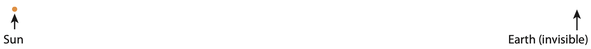
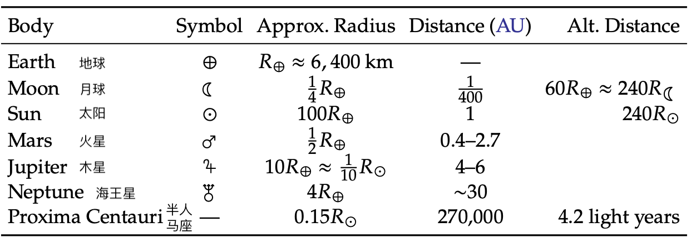
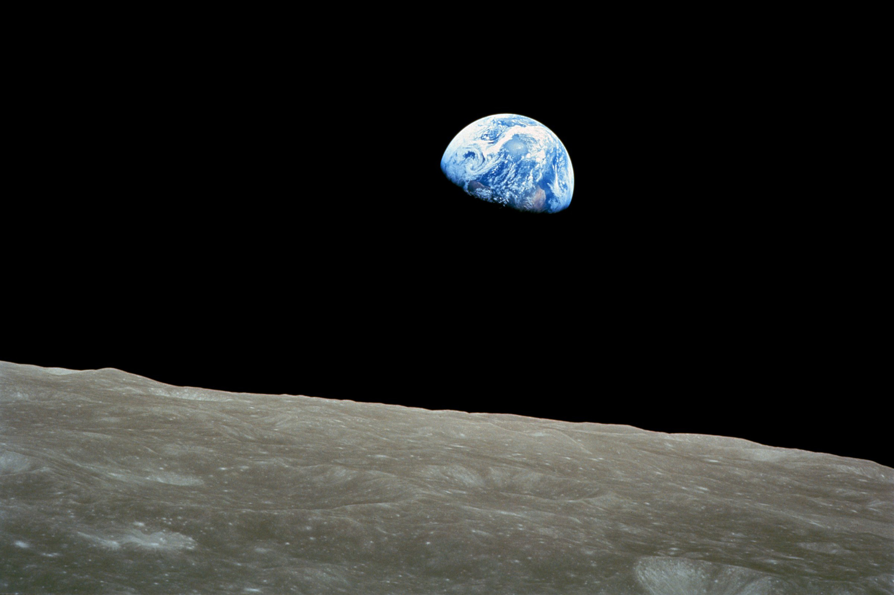

4 太空探索 vs. 太空殖民
===================================

本书评估了生活在一个资源有限的星球上所面临的挑战和限制。如果怀有一种期望，
认为我们将闯入太空生存，从而减轻在地球上所面临的挑战，
那么我们就很难对地球发出的警告信息做出认真的回应。本章的目的是「切断退路」，
以便让本书其他部分的内容变得更有意义，更值得我们投入精力去学习。
与教科书相比，本章一些部分包含更多作者的观点。有些人可能不同意书中提出的观点，
但请考虑一下，对于一种超出我们现有能力的深不可测的生活方式，也许应该由其支持者来承担举证责任\ [#]_ 。

.. [#] 引用卡尔·萨根（Carl Sagan）的话：非凡的主张需要非凡的证据。

4.1 太空的尺度
----------------------

我们可以坐在电影院里用两个小时「参与」星际旅行，而不会感到疲倦。让我们走出娱乐（虚构）产业，
来看看真实太空环境的物理尺度。

.. margin:: 

  .. csv-table:: **表 4.1:** 递增的比例系数
    :name: tab4.1
    :class: booktabs
    :header: "距离","比例（相对上一行）"

    地球直径,-
    地月距离,30×
    地日距离,400×
    海王星的距离,30×
    最近的恒星,9000×
    银河系中心,6000×
    仙女座星系,100×
    宇宙边缘,6000×

描述太阳系、银河系和宇宙的比例模型──我们马上就会这样做──是一项充满挑战的工作，
因为如果我们用直觉可感的物理尺度（一天的驾驶距离？），最终会发现难以想象的小斑点（看不见的）
代表着我们熟悉的物体，比如地球。当把地球制作成可以拿在手上欣赏的大小时，尺度又变得太大，
不容易理解了。图 4.1 和图 4.2 展示了在书本中使用正确比例的图形是多么困难或不可能。

  **图 4.1:** 地球和月球（最右边）的比例。按照这个比例，太阳比书页大，距离约 400 页。
  火星距离地球有 160 到 1100 页。自 1972 年以来，人类的旅行距离从未超过图中地球的黑色轮廓（600 km）。

  **图 4.2:** 这证明了书本不利于绘制正确比例的太空物体图形，当地球与太阳的距离横跨整页纸时，
  地球（最右边）太小了，印刷品上无法看到，直径不到最左边橙色太阳直径的 1%。
  地月距离大约是指向地球的箭头杆的宽度。人类从地球出发的距离\ **从未**\ 超过箭头杆的宽度，
  在最近 50 年左右，人类甚至没有超过这个距离的 0.2% ！火星距离地球的平均距离比太阳还要远。

这里先列举一些比例关系，让我们对宇宙的尺度有些直观认识。

.. _def4.1.1:

  **定义 4.1.1:** 可以根据这些近似关系建立宇宙的比例模型，其中一些也在表 4.1 和表 4.2 中列出：

  #. 月球的直径是地球直径的四分之一，到地球的平均距离是 30 个地球直径（60 个地球半径，见图 4.1）。
  #. 太阳的直径大约是地球的 100 倍，距离地球的距离是地月距离的 400 倍（见图 4.2）。
  #. 火星的直径大约是地球直径的一半，与地球的距离是地日距离的 0.4 到 2.7 倍。
  #. 木星的直径约为地球的 10 倍，比太阳小 10 倍；它距离太阳的距离约为地球的 5 倍。
  #. 海王星绕太阳运行的距离是地球的 30 倍。
  #. 奥尔特云\ [#]_\ 的彗星与太阳的距离大约是地日距离的 2,000 到 100,000 倍。
  #. 最近的恒星\ [#]_\ 距离我们 4.2 光年，而地球到太阳的距离为 500 光秒，两者的比例是 270,000。
  #. 银河系的中心距离我们约 25,000 光年\ [#]_\ ，银河系的直径约为这个距离的 4 倍。
  #. 下一个大星系\ [#]_\ 在 250 万光年之外，也就是大约 25 个银河直径之外。
  #. 可见宇宙的边缘\ [#]_\ 距离地球 138 亿光年，大约是地球到仙女座星系距离的 6,000 倍。

.. [#] 奥尔特云标志着太阳引力对外层空间的影响。
.. [#] 比邻星（半人马座）。
.. [#] 这是到最近恒星距离的 6,000 倍。
.. [#] 即仙女座星系。
.. [#] 可见宇宙「边缘」受到光波旅行时间的限制，被称为我们的宇宙地平线。宇宙大爆炸发生在 138 亿年前，
   那之后才有光。更多信息，请参阅附录 D.1。

我们将利用定义 4.1.1 中的尺度关系构建一个模型，从舒适的局部尺度开始。\ [*]_\ 

.. [*] {-}下面构建模型的每一步，都请你暂停一下，用身边的东西想象对比一下。

把地球看做沙粒大小（直径约 1 毫米）。月球是一个更小的小点（尘埃？），它的轨道直径相当于你两只眼睛的距离。
按照这个比例，太阳的直径为 100 毫米（一个葡萄柚），距离约为 12 米。火星大概在 4.5 米到 30 米之间。

  **表 4.2:** 符号、相对大小以及太阳系和最近恒星之间的距离。一个 AU 是一个天文单位，即地球到太阳的平均距离，约为 1.5 亿千米。太阳和月球距离地球的半径都是 240，这就是为什么它们在天空中看起来大小相似，从而导致 "恰好 "的日食。

请想一想，人类从未涉足过比月球更远的地方，在这个比例上，月球只有 3 厘米远\ [#]_ 。
火星则远得离谱。\ [*]_\ 海王星距离地球约 0.4 公里（按此比例在校园内），
下一颗恒星距离地球超过 3000 公里（大约从圣地亚哥到亚特兰大，或者上海到拉萨）。
这已经打破了简单直观的预期，而我们甚至还没有越过太阳以外的第一颗恒星。而且，
这还是把地球当作小沙粒开始的。在这个比例模型上，我们最远只走过两指宽的距离\ [#]_ ，
而下一颗恒星就像是在全国范围内进行一次漫长的旅行。
我们知道月球旅行是非常困难的，而后者则几乎不可能。

.. [#] 对此，请想象鼻梁上的一粒沙子代表地球，一只眼睛前的一粒灰尘代表月亮。
.. [#] 上一次我们走的这么远是 1972 年。
.. [*] {-}如果地球是鼻子上的一粒沙，瞥一眼火星大概有多远。

.. _box4.1:

.. admonition:: Box 4.1: 我们什么时候会到那里？

  旅行者 2 号用了 12 年才到达海王星，而海王星就在「我们的后院」。迄今为止，
  速度快到足以离开太阳系的航天器只有两个旅行者号（Voyager 1, 2）、两个先驱者号（Pioneer 10, 11）
  和新视野号探测器（New Horizons prob）\ :cite:`c23`。
  其中最远、速度最快的是旅行者 1 号，历时 43 年，距离约为日地距离的 150 倍。
  最近的恒星距离大约是它的 2000 倍。按照它目前每秒 17 公里的速度，
  再过 75,000 年就能到达最近的恒星\ [#]_ 。

  .. [#] 不过，它并没有瞄准最近的恒星。
  
  有记录以来速度最快的航天器是帕克太阳探测器（Parker Solar Probe），
  它的速度达到了惊人的 68.6 km/s，但这只是因为它在绕着太阳急速飞行（坠落）。
  由于它离太阳太近，即使是这样的速度也不足以让它爬出太阳的引力控制并逃逸，
  而上述五个探测器却成功地做到了这一点。
  即使旅行者 1 号在挣脱太阳引力束缚后还能以 70 km/s 的速度飞行\ [#]_ ，
  它仍然需要 2 万年的时间才能到达距离最近的恒星。请注意，人类的寿命大约短 200 倍。

  .. [#] 它现在的速度只有 17 km/s。

  将适合人类居住的航天器推向高速，比加速这些零散拼凑的小探测器要难得多，
  因此所面临的挑战是多种多样的，也是极端的。作为参考，阿波罗登月任务携带了近 3,000 吨燃料\ :cite:`c24`，
  约为普通汽车油箱容量的 80,000 倍。一辆普通汽车需要 2000 年才能消耗掉这么多燃料。
  你觉得宇航员们会为谁来支付油费而争论不休吗？

\ [*]_\ 

.. [*] {-}公平地说，太空旅行与汽车旅行不同，燃料需求并不简单地随着距离的增加而增加。
   不过，仅仅离开地球就需要大量的燃料。

让我们稍微放宽比例，把太阳变成鹰嘴豆。地球现在只有头发丝的直径（容易掉），距离太阳一米。
月亮基本上看不见了，距离地球只有雀斑的宽度。下一颗恒星现在距离地球 300 公里
（以高速公路的速度开车需要 3 小时），而银河系中心距离地球 150 万公里。哎呀，
这是\ **实际**\ 地月距离的四倍多。我们甚至还没走出银河系，就又破坏了我们的比例尺。

好吧，我们重置太阳，让它变成一粒沙子。现在，地球距离太阳 10 厘米，下一颗恒星距离太阳 30 公里\ [#]_ 。
这样想象一下太空：星系内的恒星群就像相距几十公里的沙粒。在这个尺度上，太阳系就像卧室那么大，
中间是一粒明亮的沙粒，房间里散落着几粒尘埃（行星）\ [#]_ 。在恒星之间的广袤地带，就更加空旷了。
在这个比例上，银河系的范围仍然比实际的地球大得多，相当于月球轨道的大小。

.. [#] 走路可能要一整天。
.. [#] 即使是太阳系，也只是银河系中的一片绿洲，大部分都是空旷的空间。

.. margin::

  .. figure:: ../images/fig4-3.png
    :name: fig4.3

    **图 4.3:** 星系实际上分布在巨大气泡（空洞，在图像中显示为暗色区域）的边缘，呈泡沫状。
    这种结构的形成是引力的自然结果，因为星系会相互拉扯，凝聚成星系群，在星系群之间留下空隙。
    这幅图显示了星系聚集的气泡边缘和细丝。在这个图中，较大的星系是一个个明亮的小点，
    就像沿着三维高速公路网穿过广袤虚空的城市。引自 Millennium Simulation :cite:`c25`。

.. _box4.2:

.. admonition:: Box 4.2: 宇宙尺度

  我们没有必要再对浩瀚的太空喋喋不休，但有些学生在走到这一步后，可能会对完成这趟视觉之旅感兴趣。

  太阳系之大令人匪夷所思，更不用说太阳系本身在恒星间的距离面前相形见绌，
  而恒星距离与银河系的规模相比又微不足道，我们怎么才能欣赏到宇宙中最大的尺度呢？
  让我们从星系开始吧。如果把星系比作硬币（比如直径约为 1 cm 的一角硬币），
  那么它们之间的距离通常就是米级。可见宇宙的边缘（见\ :ref:`附录 D.1<d.1>`）只有 1.5 公里远。
  终于，我们可以比较容易地想象：星系像硬币一样，被一臂之长的距离分隔开来，
  延伸的范围就像一个中等大小的城镇中心。我们甚至可以想象这些星系呈泡沫状、丝状排列，
  其中有房屋大小（5-50 m）的空隙，空隙中没有硬币（星系）。请参见图 4.3 以获得直观的解释。

  但是，要深入了解单个星系（硬币大小）的本质却非常困难：它们大多是空旷的空间，
  当我们把星系缩小到可以控制的尺度（如 10 km，这样就可以把整个星系想象成城市大小）时，
  单个恒星之间的距离只有十分之几米，直径只有大约 50 个原子（大约 10 纳米）。
  实际的细胞和细菌比这大 100-1000 倍。因此，我们几乎不可能在想象银河系规模的同时，
  还能体会到恒星的大小以及它们之间的空间有多大。

鉴于太空的浩瀚，认为太空旅行可以「解决」我们目前在地球上所面临的一系列挑战，
这些挑战的时间尺度，远远短于在太空建立任何有意义的存在所需的时间尺度。此外，
太空旅行在能源和经济上都非常昂贵（见表 4.3）。本世纪晚些时候，
当我们发现自己正在争夺日益减少的一次性资源时，太空旅行将很难得到优先考虑，
除非是在逃避现实的娱乐活动中。\ [#]_ 

.. [#] 只要它没有危险地扭曲我们对现实的感知，它就是好东西。

.. margin:: 
  
  .. csv-table:: **表 4.3:** 按通货膨胀调整后的近似/估计费用（亿美元）。\ :cite:`c26`\ :cite:`c27`\ :cite:`c28`\ :cite:`c29`
    :name: tab4.3
    :class: booktabs
    :header: "项目","成本"

    阿波罗计划,2880
    发射航天飞机,4.5
    送一个人上国际空间站,0.9
    载人火星任务,5000

4.2 错误的叙事
---------------------

人类并不羞于恭贺自己取得的成就，是的，我们已经取得了相当了不起的成就。于是，
一种常见而吸引人的感性叙事出现了，从进化的角度：鱼儿爬出海洋，鸟儿飞向天空，
而人类迈向太空也顺理成章──继续摆脱水、陆地和地球的束缚。这是一个引人入胜的故事，
我们的确学会了摆脱地球引力的束缚，踏上另一个星球。

但是，我们千万不要自以为是。我们可以列出一些特殊成就的\ **例子**\ ，但这些例子并不预示着一种新的常态。
一个人可以攀登珠穆朗玛峰，但这不可能成为一种司空见惯的活动。我们可以建造一架超音速客机，
用于横跨大西洋的飞行，但这并不意味着这种飞行可以持续下去\ [#]_ 。我们可以在后院为松鼠设置障碍，
并制作成流量视频，但这种有趣的展示并不意味着后院设计的「新常态」。我们需要将\ **可能性**\ 与\ **实用性**\ 区分开来。
登月可以被看作是一次有趣的特技表演，一种能力的展示，而不是通向我们未来的道路。
我们在\ :doc:`第 2 章</Part1/ch2>`\ 中提到了与解耦相关的类似论点：
在经济的某些领域可以实现解耦，并不意味着整个经济都可以解耦并「抵抗地心引力」。

.. [#] 参见协和式飞机的故事（:ref:`Box 2.2<box2.2>`）

吸引人的进化论忽略了现实的两个关键方面。当鱼类爬出海洋时，它们躲过了捕食者（因为它们是陆地上的第一种动物），
并找到了没有竞争的新食物来源。这是一个双赢的局面：更少的危险，更多的食物\ [#]_ 。同样，
当鸟类开始飞行时（或者我们可以讨论一下昆虫，它们比鸟类更早开始飞行），
也是一个类似的故事：躲避不会飞行的地面捕食者，获得全新的食物──又一个双赢。

.. [#] 进化的原理是发挥优势，偏向于「赢家」，让「输家」淘汰。

但进入太空很容易看出是双输的局面。那里的环境极其恶劣，没有任何保护或避风港\ [#]_ ，也没有任何东西可以吃\ [#]_ 。
想想看，目前在太阳系中，除了地球，你还会去哪里吃东西呢？与浩瀚的星际虚空相比，太阳系绝对是一片\ **绿洲**。
共同推动人类向陆地和空中进化的两个因素，并不能让我们「进化」到太空里。这个前景要艰难得多。\ [*]_\ 
是的，在宇宙飞船上或加压的栖息地里种植食物是有可能的，但那样我们就不再遵循偶然发现好东西的进化模式了。

.. [#] 地球就是避风港。
.. [#] 有趣的是,芝士汉堡从未撞上过太空舱。译注：从语气看作者这里是在玩梗，两个猜测：1、空间站里不能吃面包，
   因为碎屑太多；2、SpaceX 公司 2010 年首次龙飞船试验，将一块 Le Brouère 奶酪放在飞船中作为「绝密」搭载物。
.. [*] {-}有些人想象的太空「胜利」之一是获得资源。然而，地球上的元素周期表中的元素已经非常丰富，
   从太空中获取材料的经济效益怎么算都太过高昂。

.. margin::

  .. figure:: ../images/fig4-4.png
    :name: fig4.4

    **图 4.4:** 粉色条带表示过去 50 年间人类距离地球表面最远的地方。哈勃太空望远镜（HST）
    在这条带的顶端运行，高度为 600 km，国际空间站（ISS）在中间，高度为 400 km。
    在勾勒出地球轮廓的黑色细线之外，大气层非常稀薄，无法支持生命的存在。

.. _box4.3:

.. admonition:: Box 4.3: 航天成就

  在介绍我们在太空中尚未完成的工作之前，学生们可能需要对迄今为止取得的进展有所了解。
  这份清单绝非详尽无遗，只是为了澄清一些常见的误解。

  - 1957：斯普特尼克（苏联）是第一颗进入地球轨道的卫星。
  - 1959：月球3号（苏联，无人驾驶）飞越月球。
  - 1961：尤里-加加林（苏联）首次进入太空，绕地球飞行一次。
  - 1965：阿列克谢-列昂诺夫（苏联）首次进行「太空行走」。
  - 1965：水手 4 号（美国，无人驾驶）到达火星。
  - 1968：阿波罗 8 号（美国）首次将人类送入月球轨道。
  - 1969：阿波罗 11 号（美国）将人类首次送上月球表面。
  - 暂停一下，欣赏一下这一切是如何迅速发生的。不难理解为什么人们会认为火星将在 50 年内成为殖民地。
    迷人的故事是很难过时的，即使是错误的。
  - 1972：阿波罗 17 号（美国）是人类最后一次登月任务；只有 12 人登上过另一个太阳系的天体，
    最后一次大约是在 50 年前。
  - 1973 年至今：自阿波罗任务结束以来，截至本文撰写之时（2020年），人类还没有在距离地球表面约 600 km
    以外的地方（称为低地球轨道，或LEO；见图4.4）进行过探索。
  - 1981-2011：美国运营航天飞机，设想将太空旅行常规化。在进行了 135 次发射（其中两次以灾难性事故告终）后，
    航天飞机退役，美国没有了载人航天发射能力。
  - 1998 年至今：国际空间站（ISS）\ :cite:`c30`\ 提供了一个实验平台，并在太空中保持运转。国际空间站距离地球表面仅 400 公里（4 小时车程），
    它的名字令人误解，它并没有被用作太空旅行的太空港枢纽。它本身就是目的地。

4.3 困难重重
----------------------

如果你不为太空的广袤空旷、恶劣条件或缺乏支持人类的资源而气馁，那么也许是因为你相信人类的智慧能够克服这些挑战。
这在一定程度上是正确的。我们已经在另一个太阳系天体上行走过\ [#]_ 。这些要么是我们迈向太空未来的第一步，
要么是我们付出巨大努力/代价才能完成的罕见壮举。我们该如何区分呢？

.. [#] 最后一次阿波罗登陆是在 1972 年。

.. _box4.4:

.. admonition:: Box 4.4: 与背包旅行的比较

  大多数人体验背包旅行的方式与我们进行太空探索的方式类似：在有限的旅行时间内，背上所有需要的食物、
  衣物、住所和实用设备。在野外只能获得空气和水。要进行太空旅行，就连空气和水也必须从地球上发射。
  因此，太空旅行就像是一种美化了的、超级昂贵的背包旅行──尽管可以欣赏到令人惊叹的美景！

要区分是临时的展示，还是未来之路，一种方法是列出我们尚未在太空中实现的、对太空生活非常重要的能力，
其中包括：

1. 种植用于维持生存的食物；
2. 在地球磁场保护之外长期生存，免受宇宙射线的伤害；\ [#]_ 
3. 在远离地球表面的地方生产或收集推进燃料；
4. 在低重力环境中长期保持肌肉和骨骼健康超过一年；
5. 在原地开采建筑材料；
6. 维持封闭可持续生态系统；
7. 任何类似\ :term:`地球化改造<terraforming>`\ 的技术（见下文）。

.. [#] 国际空间站（ISS）仍在地球的保护范围内。

如果我们先看到海底殖民的例子\ [#]_ ，就会更容易相信太空殖民的可能性。这样的环境面临着许多类似的挑战：
自然条件下无法呼吸；巨大的压力差；需要封闭的自我维持环境。但是与太空相比，海洋居住地有几大优势：\ [*]_\ 
食物就在居住地外觅食、游泳；安全的环境、空气就在不远处（米级）；容易进入（游泳/潜水）；
地球上所有的资源都便于建造、使用（比如，不远处的家得宝建材超市）。

.. [#] 哪怕是海面以下 10 米！
.. [*] {-}⚠️这并不是要鼓吹海底居住是个好主意。它只是用来说明，太空居住是一个更不切实际的想法。

在海底建造一个栖息地要比在太空中建造容易得多。当然，在陆地上会\ **更容易**\ 。但是，
我们还没有成功地在陆地上建立和运行一个封闭的生态系统！我们尝试过一些人造「生物圈」，
但都以失败告终\ :cite:`c31`。如果在地球表面都不容易成功，我们又怎么能幻想在遥远而充满敌意的太空中，
在无法轻易获得各种制造资源的情况下取得成功呢？
  
.. margin::

  .. figure:: ../images/fig4-5.png
    :name: fig4.5

    **图 4.5:** 太阳系中的类地行星环境，显示了平均温度（摄氏度）和压力（标准大气压，atm）。
    地球的「舒适度」范围显示为一个蓝色矩形，温度从 -10◦C 到 40◦C，压力从 0.2 atm
    （需要 100% 的含氧量）到 10 atm。其他行星不仅远远超出了我们的舒适范围，
    其大气成分也是有毒的，并且缺乏氧气。请记住，即使是几度的变化──如气候变化──也是一件大事。
    即使是需要补充氧气才能生存几小时的珠穆朗玛峰，也比火星要舒适得多。

关于地球化改造，请从以下角度考虑。由于化石燃料的燃烧（\ :doc:`第 9 章</Part2/ch9>`\ 的主题），
地球现在面临着二氧化碳过量的问题。这个问题让我们的经济和政治体系无所适从，因此，
我们不仅无力恢复到工业化前的二氧化碳水平，甚至连阻止碳排放量逐年增加的趋势都显得力不从心。
工业化前大气中的二氧化碳含量为百万分之 280（280 ppm），我们把这视为\ **正常**\ 水平。
今天的水平已经超过了 400 ppm，因此修正值略高于 100 ppm，即占大气的 0.01%。\ [#]_\ 与此同时，
火星大气中 95% 是二氧化碳 。因此，我们可以说地球的问题是 100 ppm，而火星的问题则是一百万 ppm。
在地球上，我们享受了所有的资源，因而也受制于 100 ppm 二氧化碳的增长。看看我们这些发达的基础设施，
却仍然无法扭转甚至是阻止二氧化碳的增加。而火星上没有任何基础设施，
那我们怎么可能把火星大气层改造成适合居住呢？当然，对于宣布什么是\ **不可能** \的，我们必须慎重，
但我们有理由将其称为\ **不切实际**，以至于会分散讨论的注意力。
图 4.5 进一步说明了人类生存条件与太阳系实际环境之间的巨大差距。

.. [#] 从 280 到 400 的增幅约为 50%，作为地球大气总量的一部分， ∼ 100 ppm 的变化是
   100 除以 100 万（根据 ppm 的定义），即 0.01%。

我们应该再回顾一下第 1 章中关于\ :term:`指数增长<exponential growth>`\ 的教训，
增加另一个栖息地除了推迟短暂的翻倍时间外，对总体结果基本上没有影响。因此，
即使上述讨论出现了偏差，又有谁会在意呢？我们仍然无法回避人类面临的主要挑战，
即在有限的世界（甚至是有限的太阳系，如果真的到了那一步的话）中，
人类的发展会遇到种种限制。

4.4 探索的作用
---------------------

不难理解人们为什么会认定目前对太空的探索最终会用来实现太空殖民。正如早期的探险家们为殖民「新世界」
开辟了道路一样，探索行星也是打开通往新世界的大门，相似之处显而易见\ [#]_ 。
这是一个耳熟能详的故事，因此很容易「推销」给那些已经被启蒙的、毫不怀疑的头脑。此外，
我们也被太空殖民所代表的新奇和挑战所吸引──娱乐产业中专门讲述太空生活故事的蓬勃发展就证明了这一点。
但并不是所有的探索都会导致定居，娱乐产品也不是真理。

.. [#] 到达美洲需要跨越面积约为欧洲两倍的海洋（可维持生命）。到达火星需要飞跃地球直径 5000 倍的荒凉空间
   ──完全不相似。

人类已经探索过（一小部分）高压的深海，攀登过地球上最高但完全荒凉的山峰，探访过北极严酷的冰盖。
在这些探索中，我们并没有打算建立永久居住地。这些地方既是考验我们坚韧不拔精神的地方，
也是了解新环境的地方。我们不会仅仅因为这些探索没有最终开辟新的居住地，而将其视为\ **错误**\ 。相反，
我们将这些探索视为人类群体帽子上的羽毛：让我们作为一个物种感到自豪的壮举。
太空也可以用类似的方式来看待：在挑战和猎奇方面都是一流的，正面反映了我们的好奇心、动力、智慧和团队精神。
我们还能从以下方面获益\ [#]_：探索精神推动了技术进步，同时也加深了我们对大自然的科学理解。

.. [#] 其中包括对稀有而珍贵的地球的更深刻的认识.

因此，即使太空不能满足人类继续向宇宙扩张的幻想，但\ **探索**\ 太空也是我们的天性。
我们最好把太空探索归入征服珠穆朗玛峰这一类活动，而不是欧洲人偶然发现西印度群岛
（一个几乎无法居住，另一个可以居住）。我们千万不要犯错，将错误的叙事应用于太空。

关于太空探索，我们可以说很多积极的东西，也希望能继续无限期地探索我们的外部环境。然而，
希望这种探索是人类殖民太空的途径，这可能是错误的，而且几乎肯定会适得其反，\ [*]_\ 
因为目前人类的扩张可能会在很短的时间内撞上地球的极限。

.. [*] {-}尽管这一章的基调很悲观，但作者本人却被太空深深吸引，并围绕太空展开了自己的人生：
   小时候接触的《星球大战》和后来的《星际迷航》都产生了巨大的影响。电影《太空先锋》至今仍是他的最爱。
   他曾窥探过宇宙的边缘──先是通过高中时制作的 10 英寸望远镜，后来又使用了世界上最大的望远镜。
   他参与过航天飞机实验，见过宇航员，认识莎莉-莱德（Sally Ride），
   并在职业生涯的大部分时间里建造了一套激光系统，用来探测阿波罗宇航员放置在月球表面的反射镜上反弹的光子
   （测试重力的基本性质），在与《生活大爆炸》编剧的私人交往中，这套系统直接启发了《生活大爆炸》剧集的部分内容。
   所以，作者对太空情有独钟？是的。会自愿去月球或火星吗？是的。相信它是人类未来的关键？不相信。

如果随着时间的推移，我们真的看到了一条切实可行的太空殖民的道路，那也未尝不可。但是，
考虑到极端的挑战和成本──在能源和经济上，并且在短期内不能造成太大的冲击──
还是首先处理好我们与地球的关系，然后在适当的时候再考虑太空殖民（如果还有意义的话），这样似乎要谨慎得多。
否则，我们不仅会不明智地耗费宝贵的资源，而且（更糟糕的是）我们的思维会被不切实际的幻想所蒙蔽，
忽视眼前真正的挑战。我们需要面对现实。
也许 Twenty øne piløts 乐队的 *Stressed Out* 这首歌中表达得最好：
  
  We used to play pretend, give each other different names

  We would build a rocket ship and then we’d fly it far away

  Used to dream of outer space but now they’re laughing at our face Saying, “Wake up, you need to make money.”
  
  Yeah.
  
  我们经常假扮，给对方起不同的名字

  造一艘火箭飞船，然后飞向远方

  曾经梦想外太空，现在只有面前嘲

  「醒醒吧，你得赚钱」

  可不是

目前，太空殖民可能只是一个虚幻的幻想。我们最好清醒地面对现实中的挑战。从某种意义上说，
也许实现太空移民梦想的唯一途径──如果这是个梦想的话──就是先假装这是不可能的，
然后把注意力放到地球上最紧迫的问题上。否则，我们就有可能在两个方面都失败。

.. _box4.5:

  **Box 4.5: Q&A**

  读完本章初稿后，学生们还提出了一些问题。下面是其中一些问题以及作者的回答。

  1. 我们还要多久才能在其他星球上生活？

     也许永远不会\ [#]_。遥远的距离意味着我们的太阳系实际上是唯一的选择。在太阳系内，
     火星是最适宜人类居住的星球──意思是我们可能在没有生命支持的情况下活上两分钟。相比之下，
     南极洲和海底要实际得多，但我们在那里却看不到永久定居点。\ [#]_ 

  2. 寻找其他宜居星球的情况如何？

     我们对太阳系的了解相当深入，这里没有第二个家园。
     我们已经探测到其他恒星周围的行星，有数千颗\ :cite:`c32`，
     但对于大多数恒星周围的行星，探测能力还不能区分是否是类地行星。可以想见，
     我们将在未来几十年内找到类似地球的行星，但它们将赋予「完全地」和「无法接近」这两个词新的含义。

  3. 难道我们没有从太空探索的技术衍生品（如无线耳机和假肢）中受益吗？
  
     毫无疑问！这些好处数不胜数，我绝不会把我们迄今为止的太空探索说成是白费力气。只是，
     我们迄今为止在太空所做的一切并不意味着星级殖民是显而易见或切实可行的下一步。事实上，
     本章的标题图片来自阿波罗 8 号任务（见下），吸引了全世界的目光，它让我们意识到，
     保护世界上所有生命的这颗星球，看上去是那么脆弱而珍贵。
     所以，我们的太空探索所带来的最大益处，或许将是对地球的深深感激和眷恋！

.. [#] 的确，「永远」是一段很长的时间。我们可能永远不会在太空殖民的说法，现在对你来说似乎有些荒谬。
   请读到本书结尾再回来看一下。我们的机会更多的是在枯燥乏味中挣扎，努力寻找我们在大自然中的位置。
.. [#] 在南极洲，有人驻扎的研究站与人类居住区并不是一回事。

4.5 总结：把地球放在第一位
-----------------------------------

作者甚至可以说得更严重一点，在面临更为紧迫的挑战的情况下，把重点放在太空殖民上是不负责任的可耻行为。
如果将注意力转移到这一可能徒劳无益的\ [#]_\ 努力上，这不仅意味着资源的错误分配，
也许更严重的是让人们觉得太空是一个可行的逃生通道，最终可能会导致更大的总痛苦（\ *greater total suffering*\ ）。
让我们还是不要分心吧！

.. [#] 至少在相关的时间尺度上。

事实上，关于什么是优先事项或太空是不是我们的未来，从未有全球性的共识，
这一事实恰凸显了，人类社会并没有按照经过深思熟虑的总体规划\ [#]_\ 来运作。我们只是在「随波逐流」，
后果可能是把精力浪费在没有结果的野心上。就因为有些人热衷于太空未来，并不意味着它能够或将要实现。

.. [#] :doc:`第 19 章</Part4/ch19>`\ 将讨论这样的计划。

诚然，我们无法确定未来会发生什么，但也许\ **正因为如此**，我们才更应该谨慎行事，
不要愚蠢地追求高风险的幻想\ [#]_ 。从这一点出发，
本书接下来将转向与地球上的生息更切实相关的问题。

.. [#] 尽管我们可能会被流离失所的尼日利亚王子通过电子邮件提出的帮助将其数百万美元转移到一个安全账户的提议所诱惑，但我们大多数人都知道最好不要上钩。财富的承诺会让轻信者走向毁灭。

.. _box4.6:

.. admonition:: Box 4.6: 民意调查怎么说？

  要是能做这样一个调查就好了，了解有多少人认为 500 年后会有大量人口离开地球生活。笔者猜测，
  大多数美国人会认为这是可能的。然而，如果这样的未来不会出现──由于一系列实际原因，包括可能发生严重的衰退，
  不再有能力追求太空飞行──那么我们就会发现，大多数人对未来的想象是完全错误的。
  我们将会发现自己处于一种非同寻常的状态，尽管并不完全令人惊讶。

4.6 思考题
--------------------

（略）