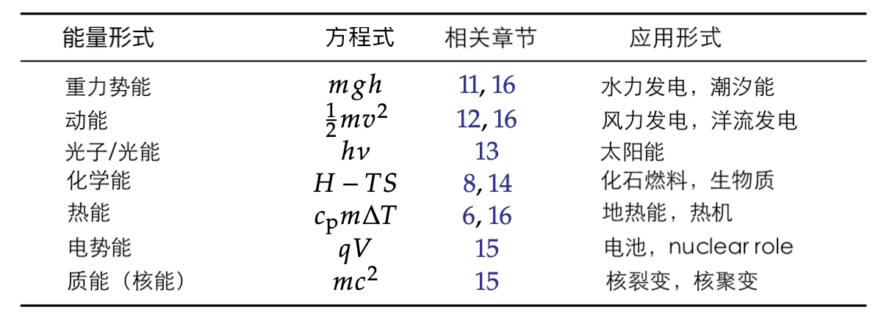
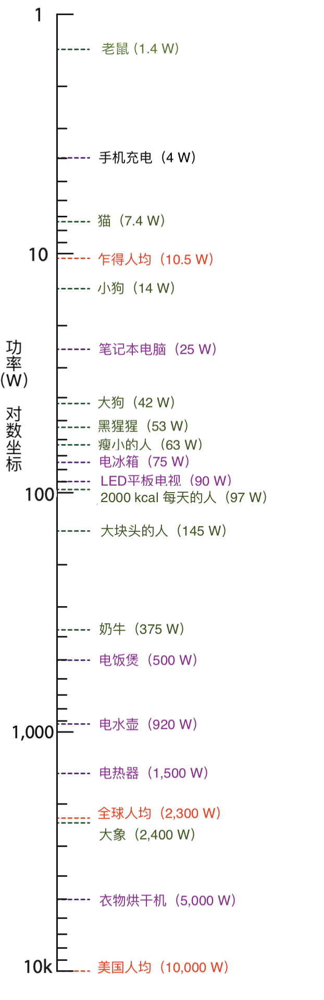

5 能源和功率单位
==================

本章为理解本书的其他内容提供了基础，让学生们学会解释和换算单位，同时在这一过程中建立有用的直觉。
:ref:`附录 A.10<A.10>` 提供了一些使用单位和单位换算的技巧。

与大多数章节不同的是，这一章并没有讲述一个故事，也没有提升我们对世界的看法。但它为我们奠定了基础，
让我们能够在以后的章节中开始关注能源使用中的重要问题。希望我们的耐心会得到回报。

5.1 能量（J）
------------------

首先，什么是能量？

.. _def5.1.1:

  **定义 5.1.1:** :term:`能量<energy>`\ 被定义为做功的能力。在物理学中，
  「做功」被明确定义为在一定距离施加力\ [#]_ 。「做功（work）」一词的口语用法与此相对吻合，
  推着一个大沙发在地板上行走（在一定距离施加力）或将一个沉重的箱子举到架子上都感觉像是在做工，
  会让人感到疲惫。

.. [#] 这个定义适用于运动与力的方向一致的常见情况，如在平地上推箱子、在路上推动汽车或举起重物。

力的 :term:`SI<SI>` 单位是牛顿（N），分解成更基本的单位是 kg · m/s\ :sup:`2`。
记住这个单位的最佳方法是牛顿第二定律： 𝐹 = 𝑚𝑎（力等于质量乘以加速度）。质量的单位是 kg，
加速度\ [#]_ 的单位是 m/s\ :sup:`2`。

.. [#] 加速度是速度的变化率。速度的单位是 m/s，因此速度的变化率就是 m/s/s，或 m/s\ :sup:`2`。
   有些学生可能知道地球表面的重力加速度是 9.8 m/s\ :sup:`2`，这也是一种记忆方法。

由于功是力乘以距离，功（也就是能量）的单位是牛顿乘以米，即 N · m。因此，在 1 米的距离上施加 1 牛顿的力，
就是 1 :term:`焦耳<Joule>`\ （J）的功，需要 1 焦耳的能量才能完成。表 5.1 提供了相关示例（单位前缀的含义见 :doc:`/Notation`）

.. csv-table:: **表 5.1:** 常见活动的近似能量。第一个高速公路的例子只有动能，第二个例子是整个过程的能量消耗。
  :name: tab5.1
  :class: booktabs
  :header: 活动,能量

  扔足球,15 J
  举起装满的书包,100 J
  快投棒球,120 J
  射出的子弹,5 kJ
  给手机充电,30 kJ
  高速路上的汽车,675 kJ
  人类的每日饮食,8 MJ
  高速路上开车一小时,250 MJ

.. _exp5.1.1:

  **示例 5.1.1:** 用几个例子\ [#]_ 说明力乘以距离，前两个例子就相当于一焦耳的能量：

  - 将书本推过桌子，施加 2 N 的力并使其滑动 0.5 m，相当于 1 J 的功。
  - 在地上推火柴盒大小的玩具小车可能只需要 0.1 N 的力。把它推过 10 m 的距离才能产生 1 J 的能量。
  - 在平地上的汽车可能需要 150 N 的力才能克服摩擦力开始前进。那么推动一辆汽车 5 m 需要 750 J 的功。

.. [#] 像这样的例子，是陈述而不是问题，你可以这样练习一下：盖住其中一个数字，然后用其它可用的信息求解。这样，每句话都可以看作是好几个例题！

将 N 写成 kg · m/s\ :sup:`2`，我们发现能量单位为 J = N · m = kg · m\ :sup:`2`/s\ :sup:`2`。
这看起来像是质量乘以速度的平方。Box 5.1 探讨了这一点的意义。

.. _box5.1:

.. admonition:: Box 5.1: 这些单位很有道理！

  看看著名的方程 𝐸 = 𝑚𝑐\ :sup:`2`。能量是质量乘以光速的平方。这单位没错！\ [*]_\ 

  另外，:term:`动能<kinetic energy>`\ 的定义是 K.E. = 1/2 𝑚𝑣\ :sup:`2`，
  单位还是质量乘以速度的平方。\ [*]_\ 
  
  重力势能是质量乘以高度\ [#]_ 。重力是质量（𝑚）乘以重力加速度\ [#]_ （𝑔），因此，\ [*]_\ 
  通过高度（h）提升（施加与重量相等的力）获得的势能为 P.E. = 𝑚𝑔h。我们来看它的单位：\ [*]_\ 

  𝑚𝑔h → kg · m/s\ :sup:`2` · m = kg · m\ :sup:`2` / s\ :sup:`2` = J.

.. [#] 又一个能量（功）为力乘以距离的例子。
.. [#] 抵抗重力所需的力就是 𝐹 = 𝑚𝑎 = 𝑚𝑔
.. [*] {-}关于质能，参考第 15 章。
.. [*] {-}关于动能，参考第 12 章。
.. [*] {-}关于重力势能，参考第 11 章。
.. [*] {-}关于量纲分析，参考附录 A.10。

在本书中，我们还会遇到其他描述能量的方法，但如果需要，\ **任何能量单位都可以转换成焦耳**。
本章后面的内容将详细介绍其他能量单位，我们必须认识这些单位，才能在生活中解读有关能量的信息。

5.2 能量的形式和能量守恒
-------------------------

能量的表现形式多种多样，我们将在本书\ :doc:`第三部分</Part3/index>`\ 的具体应用章节中详细介绍。
现在，我们只列出它们的名称，并指出相关章节和应用，如表 5.2 所示。

  **表 5.2:** 能量形式。所有形式之间都可能发生转换。化学能在这里用吉布斯自由能表示。

物理学的一个基本原理是能量守恒，我们认为在任何系统中，能量守恒永远不会被违反\ [#]_ 。这意味着，
能量可以从一种形式流向另一种形式，但永远不会被创造或毁灭。

.. [#] 唯一的例外是在宇宙的尺度和时间上。但即使是在银河系这样大的尺度上，在数百万年的时间里，
  我们都有理由认为能量守恒是不可侵犯的。令人着迷的是，能量守恒源于时间本身的对称性：
  如果宇宙的定律和常数在一定时间跨度内是相同的，那么在这样的时间内能量是守恒的——
  这一概念我们可以追溯到埃米·诺特（Emmy Noether）。更多信息，请参阅附录 D.2。

.. _box5.2:

.. admonition:: Box 5.2: 能量：物理学中的货币

  将能量守恒视为物理学中的\ **货币**\ ，不失为一种概念化的方法。它可以转手，但不会在交换中被创造或毁灭。
  银行账户中的大额余额就像潜在的能量：可以用来消费。转换成另一种形式的能量，如热能或动能，就像花钱一样。
  消耗能量的速度称为\ **功率（power）**\ 。

.. margin::

  .. figure:: ../images/fig5-1.png
    :name: fig5.1

    **图 5.1:** 苹果从树上掉落时，势能（P.E.）转换为动能（K.E.）。总能量始终相同（此处为 7 J）。
    苹果在获得动能（失去势能）的过程中速度加快。当它落到地面静止时，能量将转化为 7 J 的热量（引起的温升太小，难以察觉）。

例 5.2.1 列出了一些我们熟悉的能量转换，图 5.1 提供了一个示例。
附录 D.2.2 则更全面的叙述了宇宙中的能源和日常使用之间的联系。

.. _exp5.2.1:

  **示例 5.2.1:** 关于能量转换的几个例子：

  - 悬崖边上的岩石具有重力势能。当它被推下悬崖时，它以势能换取动能（速度），向地面飞去。
  - 摆不断交换动能和势能，在没有摩擦影响的情况下，可以持续一段时间。
  - 一根炸药的能量储存在化学键中（一种势能）。点燃后，爆炸材料在几分之一秒内变得非常热，将化学能转化为热能。
  - 炸药爆炸产生的热物质火球迅速膨胀，将空气和附近的物体高速推开，从而将热能转化为动能。
  - 太阳光（光子）照射到黑色停车场表面，光能转化为热能，使其升温。
  - 铀原子核分裂，释放出核（势能） 能，使粒子高速飞出（动能）。这些粒子撞击周围的粒子，将动能转化为热能。
  - 燃烧化石燃料或核裂变产生的热能可用于制造蒸汽，蒸汽驱动涡轮机（动能），进而产生电能（电压、电流）。

任何一种形式的能量（如表 5.2 所示）都可以直接或间接转换成另一种形式的能量。在每一次转换中，
所有能量都会被计算在内。在一般情况下，能量会分支成多种路径，因此我们无法以 100% 的效率获得想要的能量。
例如，上述摆锤的例子最终会将能量转化为搅拌空气（动能）和支点处的摩擦（热能）。
搅拌空气最终会通过空气的内部（粘性）摩擦转化为热量。

一个有用的说明是，热能实际上只是单个原子和分子的随机运动，即动能。因此，在例 5.2.1 中的核裂变中，
核碎片的初始动能本质上已经是热能，只是温度比周围物质更高（速度更快）。通过撞击周围的原子，\ [*]_\ 
多余的速度扩散到介质中，在提高介质温度的同时，也「冷却」了被减速的碎片本身。

.. [*] {-}动能和热能之间的区别在于一致性（coherence），比如我们用雨滴的总体运动或速度来描述其动能。
  与此同时，雨滴内的水分子以每秒超过 1000 米的高速\ **随机**\ 运动。

如果考虑到所有可能的能量转换路径（paths）\ [#]_ ，我们相信它们总是守恒的。没有任何损失\ [#]_ 。在我们研究的任何物理过程中，
能量都不会被创造或破坏。它只是从一种形式流向另一种形式，通常会分叉成多个平行的路径。其总和总是与起始时相同。
附录 D.2.3 为那些有兴趣更好地理解能量最终去向的人提供了一个补充，并解释了为什么「热能损失」实际上并不是一种损失，
而只是能量的另一个储存库。

.. [#] 有时也叫通道（channels）。
.. [#] 事实上，这一原理已经非常成熟，以至于人们通过核反应过程中原本未被计算的能量发现了新粒子（如中微子）。

5.3 功率（W）
-------------------------

在了解各种常见的能量单位之前，我们应该先了解一下非常重要的功率的概念和单位。

.. _def5.3.1:

  **定义 5.3.1:** :term:`功率<power>`\ 被简单定义为单位时间内的能量：多少时间内消耗了多少能量。
  因此，国际单位制（\ :term:`SI`）中是 J/s，我们将其命名为瓦特、瓦（W）。

虽然能量是做功的能力，但它并不涉及做功的速度。功率是能量消耗的速度。图 5.2 提供了我们熟悉的动物和电器的典型功率水平。

.. _exp5.3.1:

  **示例 5.3.1:** 举起一个 10 kg 的箱子（其重力约为 100 N）超过 2 m 的垂直距离需要约 \ [*]_\ 
  200 J 的能量。如果在一秒钟内完成，则需要 200 W（一秒钟 200 焦耳）。将同样的任务延长到 
  4 秒钟内完成只需要 50 瓦。

.. [*] {-}重力为 𝑚𝑔。在本例中，𝑚 为 10 kg。如果我们苛求的话， 𝑔 = 9.8 m/s\ :sup:`2`，
   但为了方便起见，我们通常可以使用 𝑔 ≈ 10 m/s\ :sup:`2`，而不会有明显的精度损失。

  **图 5.2:** 为了便于比较和建立直觉，列出一些典型的功率水平。绿色条目对应新陈代谢功率\ :cite:`c33`。
  紫色条目为设备和电器。橙色条目为社会（非代谢）人均能源使用量。可以看到，以产生热量为功能的设备需要的能量最大。
  "电热器"条目指的是微波炉、烤面包机、房间加热器或插入电源插座的吹风机。请勿将这里的数字视为确定或精确的数字，
  因为几乎所有涉及到的事物都会因具体情况而有所不同。

为了让单位更好用，我们通常会在单位前面乘上几个 1000 倍。比如我们有 W、kW、MW、GW、TW 等单位。作为参考，
一个大型大学校园需要几十兆瓦（MW）的电力。大型发电厂通常在 1-4 GW 之间。我们可能用到的各种单位，
请参见表 5.3，更完整的单位乘数请参见\ :doc:`本书的符号</Notation>`。

.. margin:: 

  .. csv-table:: **表 5.3:** 
    :name: tab5.3
    :class: booktabs
    :header: 系数,单位,参考对应物

    1,W,手机；电脑
    10\ :sup:`3`,kW,微波炉
    10\ :sup:`6`,MW,学校；社区
    10\ :sup:`9`,GW,发电厂；城市
    10\ :sup:`12`,TW,社会尺度

虽然这在本课程中不会经常出现，但值得一提的是，常用的马力单位相当于 745.7 W（1 hp = 745.7 W）。
即一台 100 马力的汽车功率约 75 kW。

.. _5.4:

5.4 千瓦时（kWh）
------------------------

.. _def5.4.1:

  **定义 5.4.1:** 千瓦时（:term:`kilowatt-hour`）是指在一小时内以 1 kW 的速度消耗能量所需要的总能量（不是功率），
  是居民用电的首选单位。

这个单位经常引起混淆，但其实非常简单。千瓦时是 1 千瓦乘以 1 小时。因此，它是功率乘以时间，
也就是能量（因为功率是随时间变化的能量）。

.. _exp5.4.1:

  **示例 5.4.1:** 假设一个额定功率为 1,000 W（1 kW）的房间加热器并运行一小时。恭喜你，
  刚刚用掉了 1 kWh。

  或者，打开一个 100 W 的白炽灯泡（0.1 kW），让它亮 10 个小时：也是 1 kWh！
  
  如果打开一个 500 W 的电饭煲（0.5 kW）半小时呢？那就是 0.25 kWh。

直接换算成焦耳也很简单，因为 1 kWh 等于 1,000 J/s，1 小时等于 3,600 秒。
因此，1 kWh 是 1 kW 乘以 1 小时，即 1,000 J/s 乘以 3,600 s，因此等于 3,600,000 J，
或 3.6 MJ。有时还会出现一个相关的计量单位：瓦特小时（Wh）。它们大致相同，
这相当于 1 J/s 乘以 3,600 s，即 3,600 J = 3.6 kJ。\ [#]_ 

.. [#] 1 Wh 是 1 kWh 的千分之一，这并不奇怪。

.. _box5.3:

.. admonition:: Box 5.3: 别这么做……

  如果你听到有人说「千瓦/小时」，这很可能是一个错误\ [#]_ ，它的副作用是让人们误以为「千瓦」是一个能量单位，
  而不是一个功率单位。千瓦是一种能源使用率（速度）： 每秒 1,000 焦。

有些人容易混淆 kW 和 kWh\ [#]_ 。kW 是功率单位，也就是能源使用的速度。把它想象成一个速度计：
你（在空间或能量中）移动的速度有多快？kWh 是功率乘以时间，成为一种能量。它更像里程表：
你积累了多少（距离或能量）？就像距离是速率（速度）乘以时间一样，能量也是速率（功率）乘以时间。

.. [#] 从字面上看，千瓦/小时是一种能量交换的加速度。这个单位有时会用到，但通常不是人们的本意。
.. [#] 方框 5.3。

.. _exp5.4.2:

  **示例 5.4.2:** 我们将以灯泡为例探讨千瓦时。如果灯泡标称的功率为 100 W\ [#]_ ，那么它要消耗多少电能呢？
  
  这取决于它亮了多久。如果灯泡一直不亮，则不耗电。如果只开 10 秒钟，它的耗电量就远远低于开一天的耗电量。

  灯泡的特性是它开启时所消耗的功率——这里是 100 W。用汽车和速度计来类比，这就好比说汽车以恒定的速度行驶\ [#]_ ，
  然后问它能行驶多远。那么，这取决于它在高速行驶中花费了多少时间。

  因此，千瓦时（能量）是一个随时间增加的累积量。另一方面，千瓦是能量消耗的速率。

.. [#] 比如一个白炽灯。
.. [#] 比如 30 m/s; 67 m.p.h.; 108 k.p.h.
.. _5.5:

5.5 卡路里（kcal）
------------------------

卡路里（calorie）及其同类单位是描述化学和热过程的常用单位。

.. _def5.5.1:

  **定义 5.5.1:** :term:`卡路里<calorie>`\ 的定义是将 1 克水（因此也是 1 mL 或 1 cm\ :sup:`3` 或 1 cc）
  加热 1 ℃ 所需的能量（图 5.3）。一卡路里（calorie，注意小写的 "c"）是 4.184 J 的能量。

  一大卡（Calorie，注意大写字母 "C"）\ [#]_ 是 1,000 卡路里或 1 千卡（1 kcal），相当于 4,184 J。
  很自然，它是将一千克（或一升；1 L）水加热 1 ℃ 所需的能量。我们后面尽可能使用千卡（kcal）来表示。

  美国的食品标签常以卡路里为单位，描述我们所吃食物含有的能量\ [#]_ 。许多其他国家也明智地使用 kJ 或 kcal 来量化食物的能量。

.. [#] 这可能会赢得科学界最愚蠢的惯例奖：永远不要把单位定义为区分大小写，因为在口语中无法区分！
.. [#] 人体新陈代谢与加热水不同，但所涉及的能量仍可计入以加热水为定义的能量单位中。它仍然只是能量。

  **图 5.3:** 根据卡路里的定义，在一克水中加入 50 卡路里，水温就会升高 50℃。

.. _exp5.5.1:

  **示例 5.5.1:** 将 30 mL（30 g）水加热 5℃ 需要 150 cal，即 600 J 多一点。

  将 40 kcal 的能量注入一瓶 2 L（2 kg）的水，可将其加热 20℃。
  
  喝下 250 mL 冰水并将其加热到体温（从而使温度升高约 35℃），需要大约 8,750 cal 或 8.75 kcal 或 36 kJ 多一点的能量。

通常只需记住卡路里和焦耳之间的换算系数约为 4.2，如果进行粗略计算，用 4 也可以。\ [*]_\ 

1 cal = 4.184 J ≈ 4.2 J ∼ 4 J

1 kcal = 4,184J ≈ 4.2 kJ ∼ 4 kJ

.. [*] {-}1 cal 恰好等于 4.184 J，除了说明这是水的一种特性（称为\ :term:`比热容<heat capacity>`）之外，并无其他深层意义。

两个例子将有助于巩固千卡（在本课中比小得多的卡路里更有用）的使用。

.. _exp5.5.2:

  **示例 5.5.2:** 典型的饮食习惯相当于每天摄入约 2,000 千卡的食物能量。仔细想想，
  2,000 千卡/天就是一个功率（单位时间内的能量）。我们可以将千卡换算成焦耳，将一天换算成秒，
  从而换算成瓦特。2,000 kcal 等于 8.368 MJ。一天有 86,400 秒。二者相除就非常接近 100 W。\ [#]_ 

.. [#] 在这里进行精确计算的意义不大（ 96.85 W），因为认为一个人每天的饮食热量正好是 2,000.00 
   kcal 是非常荒谬的想法。每天的热量可能至少相差 10%，个体差异甚至更大，因此 100 W 只是一个方便的近似值。

第二个例子紧扣千卡的定义：加热水。

.. _exp5.5.3:

  **示例 5.5.3:** 假设你想将半升（0.5 kg）水从室温（20 ℃）加热到沸腾（100 ℃）。
  由于 1 kcal 可以将 1 kg 水加热 1 ℃，因此同样的能量可以将 0.5 kg 水加热 2 ℃。\ [#]_ 
  将温度升高 80 ℃ 需要 40 kcal 或 167 kJ。

  如果以 1,000 W（1,000 J/s）的速度加热水，则需要 167 秒使水达到沸腾温度。

.. [#] 确保你理解这一点。通过理解，我们学到的是概念，而不是公式，前者更强大、更持久。

请注意，我们在例 5.5.3 中并没有应用明确的公式。通过逐步推进，我们试图保持直观性。\ [*]_\ 
我们可以写出一个公式，但认识到所需的能量应与水的质量和温度升高的幅度成比例，我们隐含地即时创建了公式。
希望这种方法能加深对概念的理解，而把公式印在纸上可能会短路理解的过程。

.. [*] {-}这将是一个绝佳的机会，你可以像专家一样创建自己的公式来捕捉想法！附录 A.8 更深入地讨论了这种学习方法。

5.6 英热单位（British Thermal Unit, Btu）
-------------------------------------------------

我们为什么要浪费时间讨论神秘的英制热量单位（\ :term:`Btu<Btu>`）？\ [*]_\ 
这是因为美国能源信息署（\ :term:`EIA`）提供的全球能源使用数据是以英热单位为基础的。更具体地说，
国家规模的年度能源支出是以 10\ :sup:`15` Btu 为单位计量的。此外，美国的取暖设备\ [#]_ 也是以 Btu/hour 为单位的，
这是一种可以转换为瓦特的功率单位。

.. [*] {-}我们需要在本章中介绍该单位，以便了解美国的能源情况，本书稍后还会提到它。
.. [#] 热水器、火炉、空调、烤箱和炉灶。

.. _def5.6.1:

  **定义 5.6.1:** 英热单位的定义和 kcal 很类似\ [#]_ 。1 Btu 是将 1 磅水加热 1 华氏度所需的能量。

  以焦耳为单位，1 Btu 约为 1,055 J，与 1 kJ 相差无几。

.. [#] 回想一下，1 kcal 是将 1 kg 水加热 1 ℃ 所需的能量。

我们可以用下面的方法来理解焦耳的换算：一磅约等于半公斤，华氏一度约等于摄氏半度。因此，
1 Btu 大约等于四分之一千卡。事实上，1,055 J 接近于 4,184 J 的四分之一。

.. _box5.4:

.. admonition:: Box 5.4: Quads: qBtu

  美国使用 quadrillion Btu 表示国家规模的年度能源支出。用 qBtu 表示，或非正式地称为 Quads。
  1 qBtu 约为 10\ :sup:`18` J\ [#]_ 。

  美国每年使用约 100 Quads。由于一年约有 3.16 × 10\ :sup:`7` 秒\ [#]_ ，用焦耳能量除以秒，
  我们可以得出美国的功率约为 3 × 10\ :sup:`12` W（3 TW），约为每人 10,000 W 的能源\ **使用率**。

.. [#] 准确地说是 1.055 × 10\ :sup:`18` J。
.. [#] 一个有趣和方便记忆的方式，是每年约有 𝜋 × 10\ :sup:`7` 秒。

.. _exp5.6.1:

  **示例 5.6.1:** 对于以 Btu/hr 为单位的设备，我们可以通过 1 Btu/hr 表示每 3,600 秒 1,055 焦耳，
  即 0.293 W 来表示功率。

  因此，额定功率为 30,000 Btu/hr 的热水器实际功率为 8,800 W。

  让我们先来了解一下以这个速度加热洗澡水需要多长时间。我们有两种方法：

  1. 以 30,000 Btu/hr 的速度将 15 加仑\ [#]_ （125 磅）水从 68 华氏度的低温加热到 131 华氏度的高温需要多长时间？
  我们必须以 30,000 Btu/hr 的速度输入 125 × 63 = 7,900 Btu 的能量，因此需要 7,900/30,000 小时，
  即 15 分钟多一点。

  2. 换用国际单位制，15 加仑是 57 L（57 kg），使用 8,800 W\ [#]_ 的功率从 20 ℃ 加热到 55℃。
  由于 1 千卡可以将 1 千克水加热 1 摄氏度，因此将 57 千克水加热 35 摄氏度需要 57 × 35 千卡，
  即 57 × 35 × 4，184 J = 8.35 MJ，在 8,800 W 的功率下需要 950 秒，也就是刚刚超过 15 分钟（令人欣慰，答案是相同的）。

.. [#] 典型的淋浴水流约 2 加仑或 ～8 L 每分钟。
.. [#] 根据上面的计算，30,000 Btu/hr 相当于 8,800 W。

5.7 Therms
----------------

我们很少会遇到这个单位，但在此将其包括在内，因为美国的天然气账单通常使用 :term:`Therms<Therm>` 这个单位。
本书的部分目的是让读者更深入了解能源，以及如何比较不同的能源计量单位（例如，公用事业账单上的单位）
因此，这里介绍一下这个单位。\ [#]_ 

.. [#] 第 20 章将探讨从公用事业账单（水、电、煤气等）中可以学到什么。

.. _def5.7.1:

  **定义 5.7.1:** 1 :term:`Therm` 是 100,000 Btu，或 1.055 × 10\ :sup:`8` J，或 29.3 kWh.

.. _box5.5:

.. admonition:: Box 5.5: 为什么用 Therms？

  采用 Therm 单位的部分原因是，100 立方英尺天然气（CCF 或 100 CF）相当于 1.036 Therms，
  方便计量。并且，一加仑（3.785 升）液态丙烷气体\ [#]_ 含有 91,500 Btu，相当于 0.915 Therms。
  因此 Therms 这个单位方便计量天然气（100 立方英尺）或液态丙烷（一加仑）的热量。

.. [#] 在缺乏天然气管道基础设施的情况下，丙烷经常被用于替代天然气。

.. _exp5.7.1:

  **示例 5.7.1:** 把刚注入热水器水箱中的冷水加热，可能需要大约 10,000 kcal 的能量\ [#]_ 。换算成 Therm 单位是多少？

  我们分两步进行换算：首先，10,000 kcal 等于 41.84 MJ，按每英热单位 1,055 J 计算，约为 40,000 Btu，
  相当于 0.4 Therms，需要约 40 立方英尺的天然气，或略低于半加仑（约 2 升）的液态丙烷。\ [*]_\ 

  如果热水器的额定功率为每小时 30,000 Btu，那么完成这项工作需要 1 小时 20 分钟。

.. [#] 按 200 升容量计算，在 5 摄氏度下放入冷水并加热至 55 摄氏度，需要 200 kg × 50 ℃ kcal 的热量。
.. [*] {-}我们不妨从这个例子思考这样一个概念：只需 2 升液体燃料，就能将 200 升水加热到 50 摄氏度，
   燃料只有水的体积的 1%。如果将水加热至沸腾，则需要两倍的燃料，即水量的 2%。这似乎很划算，
   尤其是对于那些想烧水却不得不拖着燃料到处跑的背包客来说。如果将热量导入水中的效率不高，
   可能需要 10% 的燃料量。

5.8 电功率
-------------------

电子相互作用受电荷相互推动的影响。在本课程中，我们只需了解几个概念。首先是电压。

:term:`电压<voltage>`\ 是\ **电势**\ 的度量单位，单位为伏特（:term:`Volt`, V），
可以看作是某物被举起的高度\ [#]_ 。电压越高，就好像放得位置越高，可以释放出更高的能量。

.. [#] 这让电势看起来很像重力势能。

:term:`电荷<charge>`\ 在电场力的作用下四处移动，被移动的电荷量所起的作用类似于重力环境中的质量。
电荷的单位是\ :term:`库仑<Coulomb>`\ （C），我们在正常情况下遇到的最小电荷单位来自质子（+1.6 × 10\ :sup:`-19` C）
或电子（-1.6 × 10\ :sup:`-19` C）。

.. _def5.8.1:

  **定义 5.8.1:** 电荷 q 在电压 V 下的能量为：

  .. _eq5.1:

  .. math:: E = qV \tag{5.1}

  1 库仑的电荷在 1 V 的电势下有 1 J 的能量。

:term:`电流<current>`\ 是电荷流动的速度，通常用字母 𝐼 表示。想象一下，在导线上设置一个收费站，
计算单位时间内有多少电荷（或累计电荷量）通过闸门。这就产生了定义 5.8.2。

.. _def5.8.2:

  **定义 5.8.2:** 电流的单位是安培（Amps\ [#]_ ），定义为每秒 1 库伦，1 C/s。

.. [#] 正式写法是 Amperes。

在一伏特电压下每秒移动一个库仑的电荷，就构成了每秒一焦耳的能量，而这就是一瓦特。
将定义 5.8.1 和定义 5.8.2 的概念结合起来，我们就能定义电功率。

.. _def5.8.3:

  **定义 5.8.3:** 电功率就是电流乘以电压：

  .. _eq5.2:
  
  .. math:: P = IV \tag{5.2}

  其中电流 𝐼 单位是安培，电压 V 单位是伏特。

.. _exp5.8.1:

  **示例 5.8.1:** 美国家庭的常规电源插座通常都有最大电流为 15 或 20 A 的断路器。电压为 120 V 时\ [#]_ ，
  最大功率分别为 1,800 W 或 2,400 W。分别为 1,800 W 或 2,400 W。\ [#]_ 

.. [#] 这样表示的电压同样适用于交流电（AC）的性质。
.. [#] 安全规定限制连续使用功率不得超过断路器电流容量的 80%，因此实际限制功率分别为 1,400 W 和 1,920 W。
   这就是为什么图 5.2 中的「电热器」最高功率约为 1,500 W：电路/安全限制。

现在，我们终于可以了解一下电池能储存多少能量了。电池的额定值有两个数字：电压和充电容量。
由于电流是电荷量除以时间，因此电流和时间相乘的结果就是电量\ [#]_ 。
那么电池的充电容量就是安时（Ah）或毫安时（mAh）。由于电流乘以电压等于功率（公式 5.2），
因此安时（Ah）乘以伏特（V）等于瓦时（Wh），这是我们在\ :ref:`第 5.4 节<5.4>`\ 中熟悉的能量单位。

.. [#] 例如，持续 100 秒的 0.1 安培（每秒 0.1 库仑）的电流会产生 10 库仑的电荷流。

.. _exp5.8.2:

  **示例 5.8.2:** 典型的 9 伏电池容量为 500 毫安时。这是多少能量？

  500 mAh 等于 0.5 Ah。乘以 9 V，得到 4.5 Wh。回想一下，1 Wh 等于 1 J/s 乘以 3,600 s（一小时），
  即 3,600 J，所以 4.5 Wh 等于 16.2 kJ。

  我们可以用这块电池为 1 W 的 LED 阵列供电多长时间？我们往多里说（16.2 kJ 除以 1 J/s）是 16200 秒，
  或者发现 4.5 Wh 电池可以在 4.5 小时内提供 1 W 的电力。这都一样。\ [#]_ 

.. [#] 从多个方向解决问题不仅可以验证答案，还能提高灵活性。

5.9 电子伏特 (eV)
--------------------

电子伏特（:term:`electron-volt`, eV）是原子尺度能量的首选单位。因此，它非常适合讨论单个化学键的强度、
原子发出的单个\ :term:`光子<photon>`\ 的能量以及每个原子或分子的热能\ [#]_ 。
我们在核物理中也使用 eV，但必须将其放大一百万倍才好用，即「兆电子伏特」，MeV。

.. [#] 实际上，这只是粒子的动能。

我们已经在第 5.8 节中介绍了理解电子伏特的所有相关概念。将其单独列为一节的主要原因是为了使其在目录中单独出现，
便于查找和参考。其大小就根据\ :ref:`定义 5.8.1<def5.8.1>` 而来。

.. _def5.9.1:

  **定义 5.9.1:** 一电子伏特的能量就是推动一个电子的电荷（\|𝑒\| = 1.6×10\ :sup:`-19` C）
  通过 1 V 的电势的能量：

  .. _eq5.3:
  
  .. math:: 1 eV = 1.6\times 10^{-19} C\cdot1 V =1.6\times 10^{-19} J \tag{5.3}
  
电子伏特的能量为 1.6 × 10\ :sup:`-19` J，是一个很小的能量。但它恰好可以描述单个原子的能量过程。

.. _exp5.9.1:

  **示例 5.9.1:** 当 12 克碳（1 :term:`mole`\ 或 6×10\ :sup:`23` 个原子\ [#]_ ）
  与氧气反应生成 CO\ :sub:`2` 时，会释放出约 394 kJ 的能量\ [#]_ 。
  以电子伏特为单位，\ **每个碳原子**\ 释放多少能量？
  
  由于我们有 1 mole 或 6×10\ :sup:`23` 个碳原子，我们用总能量（3.94×10\ :sup:`5` J）除以原子数，
  得到每个原子 6.5×10\ :sup:`-19` J。这比 1 eV（1.6 × 10\ :sup:`-19` J）稍大一点，两者相除非常接近于每个原子 4 eV。
  
  由于二氧化碳的碳原子和两个氧原子之间总共有四个键\ [#]_ ，因此每个键约贡献 1 eV。化学键的能量通常都在这个范围内，
  这凸显了电子伏特这个单位在原子级别的实用性。

.. [#] 化学入门/复习资料见附录 B。
.. [#] 化学书中的表格通常会包含这类信息。
.. [#] 每个碳-氧连接都是双键，即有两个电子参与连接，总共有四个电子。
.. _5.10:

5.10 光的能量
------------------

光能及光谱将在第 13 章中更广泛的探讨，但为了完整起见，这里也介绍一下主要概念。

光可以用来描述\ :term:`电磁波谱<electromagnetic spectrum>`\ 的任何部分，从无线电波和微波，
到红外线、可见光、紫外线，再到 X 射线和伽马射线。就像原子一样，
光也被「量化」成不可分割的最小单位──这种粒子称为\ :term:`光子<photon>`。
单个光子的能量取决于其\ :term:`波长<wavelength>` 𝜆（希腊字母 lambda）
或\ :term:`频率<frequency>` 𝜈（希腊字母 nu）\ [#]_ 。

.. [#] 两者通过光速 𝑐 联系起来，𝜆𝜈 = 𝑐。

.. _def5.10.1:

  **定义 5.10.1:** 光子的能量为：

  .. _eq5.4:

  .. math:: E = h\nu = \frac{hc}{\lambda}. \tag{5.4}
  
  其中，h = 6.626 × 10\ :sup:`-34` J·s 是\ :term:`普朗克常数<Planck’s constant>`，
  𝑐 ≈ 3.0 × 10\ :sup:`8` m/s 是光速。

.. _exp5.10.1:

  **示例 5.10.1:** 可见光的波长为 0.4-0.7 𝜇m\ [#]_ ，
  对应的光子能量为 2.8–5.0 × 10\ :sup:`-19` J。

.. [#] 1 微米（𝜇m）是 10\ :sup:`-6` m。

我们还常用电子伏特（eV）来表示光子能量，见定义 5.10.2。

.. _def5.10.2:

  **定义 5.10.2:** 给定波长（𝜇m），光子的能量用 eV 单位为：

  .. _eq5.5:
  
  .. math:: E_{eV} = \frac{1.24}{\lambda(\mu m)}eV \tag{5.5}
  
.. _exp5.10.2:

  **示例 5.10.2:** 可见光光谱的红色端（约 0.7 𝜇m）对应的光子能量约为 1.8 eV，
  而蓝色端（约 0.4 𝜇m）对应的光子能量为 3.1 eV。

5.11 总结
----------------------

每一章都有一个总结，通常是提炼本章的主要内容或提出最后的想法。这里没有必要做这样的陈述。
虽然我们可以强调一下这样的概念，即能量总是可以用焦耳表示，或转换成本章所述的任何单位。
同样重要的是，能量是守恒的，它只是从一种形式交换到另一种形式，但永远不会真正消失或从哪里突然冒出来。

学生们可能希望看到所有上文讨论过的单位之间的转换表──这将是一张多么漂亮的表格啊！但是，
出于以下三个原因，我们有意忽略了它：

1. 它可能会阻碍你认真学习教材；
2. 本章后面的习题中会要求你做一些这样的事情；
3. 这将是你自己设计和制作转换表的绝佳机会。这样你就真正拥有了它。\ [*]_\ 

.. [*] {-}多棒的注意，试试看吧！

5.12 思考题
----------------------

（略）