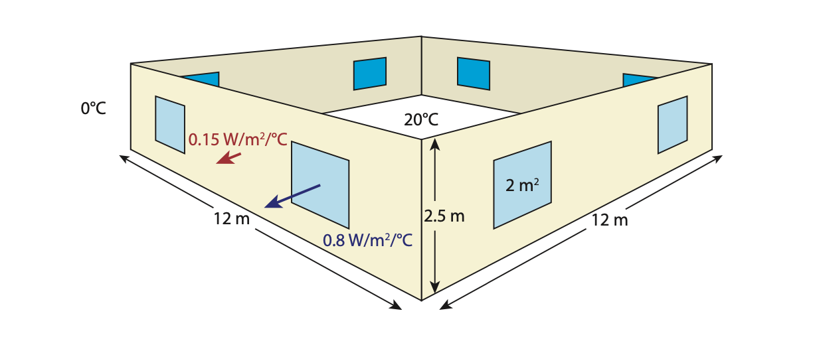
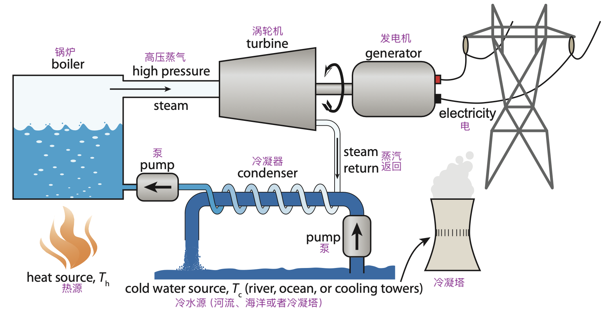
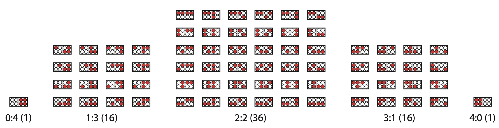
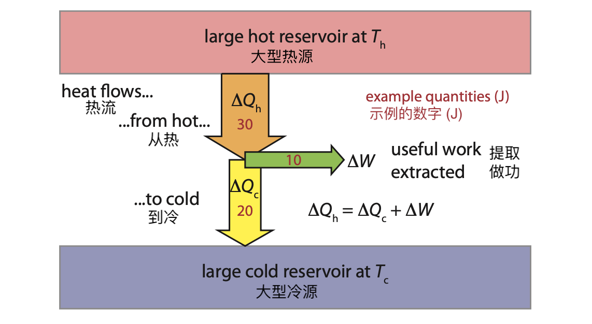

6 利用热能做功
====================

我们已经在两种情况下遇到过热能。第一次是红外辐射（\ :ref:`式 1.8<eq1.8>`\ ），
第二次是千卡的定义（\ :ref:`5.5 节<5.5>`\ ）。除此之外，热通常被视为能量转换链中的一种「废物」，
如摩擦、空气阻力等。好像暗示着热量是没有价值的无用副产品。

然而，我们今天使用的能源中有 94% 是热能\ :cite:`c34`，\ [*]_\ 我们燃烧了大量的物质来获取能量\ [#]_ ！
有时，我们确实需要热能，但我们如何利用它来驾驶飞机、推动汽车和点亮屏幕呢？
本章旨在阐明热能的使用方式，并探讨热能做功的效率极限。

.. [*] {-}\ :cite:`c34`: U.S. Energy Inform. Administration (2011), Annual Energy Review
.. [#] 风能、太阳能和水力发电是例外。

与前一章一样，这个话题与本书的整体轨迹略有偏离，本书的目的是逻辑坚实地叙述我们\ **不能**\ 继续做什么，
我们\ **可以**\ 用什么方法来改变方向，以及最后如何实现这种改变。然而，我们利用热能的方式是故事的关键部分，
它关系到当前和未来满足我们能源需求的途径。

6.1 产生热量
-----------------

在深入探讨散热问题之前，让我们先快速了解一下各种发热方式。

.. _exp6.1.1:

  **示例 6.1.1:** 产生热量的方法，大致按复杂程度排列：

  1. 双手摩擦（或其他形式的摩擦）。
  2. 收集阳光，可能的话，将其集中起来以获取热量；在室外晾晒衣服，通过窗户让阳光温暖房间，这是现实中的例子。
  3. 在有条件的地方获取\ :term:`地热<geothermal>`。
  4. 在壁炉或火炉中燃烧木材。
  5. 燃烧化石燃料直接供暖；燃气通常用于家庭取暖、烧水和烹饪。
  6. 让\ :term:`电流<current>`\ 通过盘着的线圈，它会变红发热；常见于烤面包机、吹风机和电热器。
  7. 用电驱动\ :term:`热泵<heat pump>`\ （第 6.5 节）。
  8. 让核材料在受控的链式反应中发生裂变。
  9. 制造足够热的等离子体来维持核聚变——就像太阳数十亿年来所做的那样。

6.2 热容量（比热容）
------------------------------

首先，我们将一个基本的热学概念与\ :ref:`第 5.5 节<5.5>`\ 中的\ :term:`卡路里<calorie>`\ 联系起来。
将 1 千克水加热 1 摄氏度需要 1 千卡，这实际上就是定义了水的比热容（:term:`Heat Capacity`）。按国际单位制，
水的比热容为 4,184 J/kg/℃\ [#]_ 。很少有物质能达到水的比热容。大多数液体，如酒精，往往在 2,000 J/kg/℃ 的范围内。
大多数非金属固体（甚至空气）的比热容约为 1,000 J/kg/℃。金属在 130-900 J/kg/℃ 之间，轻金属在最高点，重金属在最低点\ [#]_ 。
表 6.1 提供了一些常见物质的比热容。

.. [#] 在温度变化方面，摄氏度和开尔文是可以互换的，因为二者之间只有一个恒定的偏移量，
   所以温度的任何变化在二者中都是相同的测量值。
.. [#] 这里的规律是，含有氢等轻原子的水或酒精等物质的热容量，比含有较重原子的金属等物质的热容量大。

 .. csv-table:: **表 6.1:** 常见材料的比热容
    :name: tab6.1
    :class: booktabs
    :header: 物质,J/kg/℃

    钢铁,490
    石头，混凝土,750-950
    玻璃,840
    铝,870
    空气,1005
    塑料,1100-1700
    木头,1300-2000
    酒精,2400
    肉,3500
    水,4184

知道了物质的比热容，我们就可以计算出提高其温度需要多少能量。一个有用的近似准则是将水视为 4,000 J/kg/℃，
将所有其他物质（空气、家具、墙壁）视为 1,000 J/kg/℃。混合物，如食物，由于含水量高，可能介于 2,000-3,500 J/kg/℃ 之间。
如果不太清楚，1,000 J/kg/℃ 绝对不会太离谱。用来估算的话，只有高含水量\ [#]_ 或金属\ [#]_ 才会偏离这个值。

.. [#] 最高就是 4,000 J/kg/℃。
.. [#] 钢等较重金属为 500 J/kg/℃；铝等轻金属接近 1,000 J/kg/℃。

.. _exp6.2.1:

  **示例 6.2.1:** 一辆重 2000 kg 的小卡车正在运输一个一立方米的水箱。
  将整个系统的温度提高 5 ℃ 需要多少能量？

  一立方米水（1,000 L）的重量为 1,000 kg，热容量约为 4,000 J/kg/℃；卡车主要是钢材，
  因此我们猜测为 500 J/kg/℃。分别乘以各自的质量和 5 ℃ 的温度变化，得出加热水的热量为 20 MJ，
  加热卡车的热量为 5 MJ，总计 25 MJ。\ [#]_ 

.. [#] 注意到加热水需要更多的能量，即使它的质量只有小卡车的一半。

要使用比热容进行计算，请尝试用直观的方式，而不是某种算法公式\ [#]_ 。以下内容对你来说应该很有意义，
并能帮助你如何将这些碎片组合在一起：加热\ **较大的质量**\ 或使温度升高\ **较大的温差**\ 需要\ **更多的能量**\ 。
它们都成正比。从单位中也可以看出，要从以 J/kg/℃ 为单位的比热容转换为以 J 为单位的能量，我们需要乘以质量和温度的变化。

.. [#] 不过，这对学生来说是一个很好的机会，可以让他们自己写出一个公式，从而让他们明白这个概念，
   并且能够体会到公式、方程只是捕捉一个概念。此外，符号的选择其实是任意的，这种体验会强化这一点。

.. _exp6.2.2:

  **示例 6.2.2:** 计算将一件 30 kg 的家具\ [#]_ 加热 8 ℃ 所需的能量，我们先用比热容乘以质量，
  以体现「较大的质量」的影响，然后再乘以温度变化，以体现「较大的温差」。这个例子中，我们得到 240 kJ。

.. [#] 假设为 1,000 J/kg/℃。

6.3 家庭供暖/制冷
---------------------

我们个人对热能的体验通常是生活空间的供暖、水或食物的加热等。事实上，在住宅和商业建筑中，
大约三分之二的能源使用与热能任务有关，如加热或冷却房间温度、加热水、冰箱冷藏食物、烘干衣物和烹饪。

说到家庭供暖（或制冷），我们可能会关心两件事：

- 需要多长时间才能将温度降低一定程度；以及
- 将其保持在所需温度需要多少能量。

前者取决于房子里有多少东西\ [#]_ ，要产生多少 Δ𝑇 以及产生热量\ [#]_ 的功率大小。
所需的能量是质量乘以 Δ𝑇 再乘以通用的 1,000 J/kg/℃ 比热容。所需时间就是能量除以功率。

.. [#] 包括墙壁、家具和空气。
.. [#] 如果是制冷的话就是移除热量。
.. _exp6.3.1:

  **示例 6.3.1:** 用两个 1,500 W 的加热器将可移动房屋的内部温度从 0 ℃ 加热到 20 ℃ 需要多长时间？
  我们假设必须加热大约 6,000 kg 的物质\ [#]_ 。

  第一项工作是计算所需能量，然后除以功率得出时间。我们使用 1,000 J/kg/℃ 这个对很多东西都有效的比热容。
  
  将比热容乘以质量和温度变化，得出 120 MJ 的能量。以 3,000 W 的功率计算，注入这么多能量需要
  40,000 秒，也就是大约 11 个小时。

.. [#] 只有 300 kg 是空气，需要加热的大部分是墙壁、地板和天花板。

需要多少热量保持温度，取决于热量是如何通过窗户、墙壁、天花板、地板和透气的间隙流出（或流入）室内的。
但它也线性地受室内外温差 Δ𝑇 的影响。一座房屋的相关特性可以用热损失率来表示，单位为瓦特/摄氏度\ [#]_ 。
这个单一的数字表示维持一定的室内外温差 Δ𝑇 所需的功率。Box 6.1 举例说明了如何计算房屋的热损失率，
示例 6.3.2 则将计算结果应用于实际情况。

.. [#] 也可以用瓦特/开尔文。

  **图 6.1:** Box 6.1 中房屋模型的外墙和窗户。地板和天花板未显示。以 2 W/m\ :sup:`2`/℃ 为单位的数字是 U 值，
  在本例中代表了最佳工程实践。大多数房屋的 :term:`U 值<U-value>`\ 会比这一数值大 2-6 倍。不要忘记真正房屋有门！

.. _box6.1:

.. admonition:: Box 6.1: 住房建筑

  最好的做法是将房屋建造得非常舒适，符合「被动式房屋」的标准，与外部接触的表面\ [#]_ 
  能达到\ **每平方米** 0.15 W/℃，窗户能达到每平方米 0.8 W/℃。\ [*]_\ 

  让我们假设一个房子占地面积为 12 m ✖️ 12 m 的正方形，墙高 2.5 m，四面墙上各有两扇窗户，
  每扇窗户的面积为 2 m\ :sup:`2`（图 6.1）。天花板和地板的面积都是 144 m\ :sup:`2`，
  墙的面积是（周长乘以高度）48 ✖️ 2.5 = 120 m\ :sup:`2`。 减去 8 扇窗户的面积（16 m\ :sup:`2`），
  剩下的 104 m\ :sup:`2` 就是墙壁的面积。那么，房子窗户的热损失率就是 13 W/℃，墙壁、地板和天花板是
  59 W/℃，总计 72 W/℃。
  
  精心建造的房屋的热损失率可能是这一数值的两倍，而一般的房屋（几乎不注重热效率）的损耗率为它的 3-6 倍，
  那就是几百 W/℃ 了。当然，较小的房屋热量流动面积较小，损耗率也较小。

.. [#] 外墙、天花板和地板。
.. [*] {-}用于描述墙壁和窗户热损失特性的数字称为 :term:`U 值<U-value>`\ ，单位为 W/m\ :sup:`2\ /℃，数值越低，表示隔热性能越好。
   在美国，建筑材料用一个反比指标来描述，称为 :term:`R 值<R-value>`，单位是丑陋的 ◦F ·ft\ :sup:`2` · hr/Btu。
   两者在数值上的关系为 𝑅 = 5.7/𝑈，因此我们的「被动式房屋」墙体的 R 值为 𝑅 ≈ 38，
   窗户的 R 值为 𝑅 ≈ 7，这两个值都相当不错，但也很难达到。

.. _exp6.3.2:

  **示例 6.3.2:** 让我们比较一下在室外温度为 0 ℃（冰点）的情况下，将三间不同房屋的温度保持在 20 ℃ 的条件。
  首先是 Box 6.1 中描述的一栋建造得非常舒适的房屋，我们将热损失率四舍五入到更方便的 75 W/℃。
  我们继续假设建造得还不错的房屋热损失率为 150 75 W/℃，而更一般的房屋\ [#]_ 为 300 75 W/℃。

  温差 Δ𝑇 为 20 ℃，因此我们的超级舒服的房子需要 75 W/℃ 乘以 20 ℃，即 1,500 W 来保暖\ [#]_ ，
  而普通的房子需要 3,000 W，简陋的房子需要 6,000 W。

.. [#] 不太注重热效率。
.. [#] 只需要一个加热器。

一旦我们了解了在房屋中保持一定温度（Δ𝑇）所需的功率，我们就可以预测房屋加热器的行为。
加热器通常要么全开，要么关闭。温度调节是通过打开和关闭加热器来实现的，通常由恒温器控制。
给定加热器的额定功率\ [#]_ ，我们就可以直接预测其占空比（:term:`duty cycle`）：在某个特定的 Δ𝑇 条件下，
加热器需要开启多长时间才能产生满足功率需求的平均输出。

.. [#] 额定功率就是满负荷运转时的功率。

在合理的世界，加热器的功率单位是 W（或 kW）。而在美国，许多电器的计量单位是 Btu/hr。
由于 1 Btu 等于 1,055 J，1 hr 等于 3,600 s，因此 1 Btu/hr 等于 0.293 W\ [#]_ 。
全屋加热器（有时以火炉的形式）的额定功率可能为 30,000 Btu/hr（约 10 kW），在这种情况下，
示例 6.3.2 中的三种房屋需要加热器在大约 15%、30% 及 60% 的时间内开启，以维持三间房屋的 Δ𝑇 = 20°C。

.. [#] 1,055 J in 3,600 s is 0.293 J/s.

我们还可以评估上述加热器在三种房屋中可维持多少 Δ𝑇 。如果一个房子需要 100 W/℃，并且还有一个 10,000 W 的加热器，
那它可以维持 100℃ 的温度差\ [#]_ 。因此，如果为示例 6.3.2 中的三种房屋配备 10 千瓦（∼30,000 Btu/hr）的加热器，
它们的 Δ𝑇 值分别为 133◦C、67◦C 和 33◦C。显然建造严实的房屋不需要安装如此大功率的加热器。
建筑质量较差的房屋在加热器满负荷运转时可保持 Δ𝑇 = 33◦C 的温差，这意味着如果室外温度降至 -13◦C （8.6◦F）以下，
室内温度将无法保持在 20℃ 以上\ [#]_ 。

.. [#] 首先，这个数字高得离谱！其次，与其依赖公式或记忆来判断 100 W/℃ 和 10,000 W 应该相除还是相乘，
   不如试着将每种单位的含义内化，或者至少将单位作为一种指示。然后，适当的数学运算就会变得更清晰。
.. [#] 其他可能的选择是忍受较低的内部温度或搬到更暖和的地方。

冷却房屋（或冰箱内部，以及其他东西）也是一个热力学过程，但在这种情况下，需要从较冷的环境中移除热能。
移除热能是更困难的一件事，人类利用热源（从用火开始）的历史非常长，相比之下，我们能够按需制冷的历史却非常短\ [#]_ 。
第 6.5 节将介绍这在原理上是如何实现的。这里只需注意空调的额定值使用的单位与加热器相同：
在单位时间内可以移动多少热能（从较冷的环境中移出）。在国际单位制中，我们使用 W。在美国，单位是 Btu/hr。

.. [#] 事实上，保暖（warmth）这个词我们已经用了很久，但「保冷 coolth」这个词却还没有发明出来。

6.4 热机
---------------

现在我们要讨论的是，热能除了直接为房屋供热之外，还可以用来做其他事情。我们常说汽车发动机烧汽油，
但把燃烧燃料说成是纯粹的热力作用，好像有些奇怪，因为在燃烧汽油的内燃机汽缸内发生的似乎更像是小型爆炸，
而不仅仅是产生热量。这么说并没有错，但也不是事实的全部。从根本上说，这一过程仍然始于放热事件。
当燃料-空气混合物点燃时，气缸内的温度急剧上升。为了了解直接后果是什么，我们来看看理想气体定律：

.. _eq6.1:

.. math:: PV=N k_B T. \tag{6.1}

\ [*]_\ 

𝑃、𝑉 和 𝑇 是压力、体积和温度（单位为 N/m\ :sup:`2`、m\ :sup:`3` 和开尔文）。𝑁 是原子或分子的数量，
𝑘\ :sub:`B` =1.38×10\ :sup:`-23` J/K 是\ :term:`玻尔兹曼常数<Boltzmann constant>`，
我们将在第 13.2 节中再次看到这个常数。点火时温度上升很快，气缸容积来不及改变\ [#]_ 。
式 6.1 告诉我们，在其他条件不变的情况下，当温度升高时，压力也必须随之升高。压力的增加将活塞推开，
增加气缸容积并做功\ [#]_ 。但这一切都始于温度的急剧升高。

.. [*] {-}这是物理学家的版本，与化学家的 𝑃𝑉 = 𝑛𝑅𝑇 略有不同。两者的比较见附录 B.4 节。
.. [#] 活动活塞允许容积发生变化，但是在较慢的时间尺度上。
.. [#] 这里，功可以用压力乘以体积的变化来测量。因为压力是单位面积上受到的力，而功的单位是力乘以距离。
   这也是功的一种定义。

最通俗地说，热量试图从热的地方流向冷的地方──从一锅热汤中流出，或从周围的空气中流向冷饮，或从沙滩上的热沙中流向你的双脚。
这种流动的一部分可以表现为物理上的功，此时系统可以说是在发挥热机的作用。

.. _def6.4.1:

  **定义 6.4.1:** :term:`热机<heat engine>`\ 的定义比较宽泛，是指任何能将热量或热能转化为机械能的系统：移动物体。

.. _exp6.4.1:

  **示例 6.4.1:** 热机的几个例子：热量驱动运动

  1. 汽车车顶上的热空气上升，获得动能和重力势能；
  2. 风与此非常相似，接触到被太阳加热的地面的空气会上升，并获得大气尺度的动能； 
  3. 内燃机汽缸内的温度突然升高，促使汽缸内的气体迅速膨胀； 
  4. 发电厂中的蒸汽在涡轮机中急速流动，因为蒸汽要流向冷凝器。

最后一个例子值得用图表来说明，因为这个过程在我们的生活中非常重要：我们几乎所有的发电方式──
不管是用化石燃料，还是核裂变──都使用这种方式。图 6.2 展示了这一基本形式。表 6.2 的数据显示，
我们 98% 的电力都是由连接着涡轮机的发电机产生的，而 84% 的电力都是由热力过程作为涡轮机的动力（最常见的形式是蒸汽）产生的。

  **图 6.2:** 发电厂的示意图，温度为 𝑇\ :sub:`h` 的热源产生蒸汽，蒸汽流向冷凝器，在冷凝器中，
  蒸汽通过与水体或蒸发冷却塔提供的冷源（𝑇\ :sub:`c`）接触，冷却并还原为液态水。一路上，
  奔腾的蒸汽转动连接发电机的涡轮机，输出电力。大多数使用化石燃料、核能、
  太阳能热能或地热资源的发电厂都采用这种基本布置。

.. csv-table:: **表 6.2:** 发电形式。大部分是利用自然界中的热能，几乎都采用了涡轮机和发电机。2018 年数据来自 \ :cite:`c34` 中的表 8.2a。
  :name: tab6.2
  :class: booktabs
  :header: 发电来源,占比,使用热能？,使用涡轮发电机？

  天然气,35.3,✓,✓
  煤炭,27.3,✓,✓
  核能,19.2,✓,✓
  水力,7.0,,✓
  风能,6.6,,✓
  太阳能光伏板,2.2,,
  生物质,1.5,✓,✓
  石油,0.6,✓,✓
  地热,0.4,✓,✓
  太阳热能,0.09,✓,✓

6.4.1 熵和效率极限
+++++++++++++++++++++++++

一个深奥而强大的物理学原理限制了，从温度为 𝑇\ :sub:`h` 的热源流向温度为 𝑇\ :sub:`c` 的冷源的热流中，
可以提取多少有用的功。这就是\ :term:`熵<entropy>`。你不需要完全掌握熵这个深奥而微妙的概念，
就能跟上本章的内容，理解熵在限制热机效率方面所起的作用。不过，这是一个令人兴奋的话题，我们将对它稍作了解。

.. _def6.4.2:

  **定义 6.4.2:** 熵是一个系统在保持相同内能的情况下\ [#]_ ，在微观层面有多少种组织方式的度量。

.. [#] 例如，恒温、恒压、恒容。

对于那些期望将熵定义为对\ **无序**\ 的度量\ [#]_ 的人来说，这个定义可能会让他们感到晦涩难懂。
考虑一种保持恒压、恒容、恒温的气体──从而固定气体中的总能量。组成气体的原子/分子可以排列成数量惊人的多种构型：
例如，每个分子的位置、速度、旋转速度、旋转轴方向或振动状态的任意组合──所有这些都保持着相同的总能量。

.. [#] 熵确实与无序\ **有关**\ ，因为在一团乱麻中摆弄火柴的方法比整齐堆放火柴的方法要多得多。

.. _exp6.4.2:

  **示例 6.4.2:** 举例说明：一个微小的系统包含 3 个分子，分别标为 A、B 和 C，它们的总能量为 6 个单位。
  它们可以各自拥有 2.0 个单位的能量，也可以分别拥有 1.2、1.8 和 3.0 个单位的能量，
  或者 3.2、0.4 和 2.4 个单位的能量，或者无数种组合中的任何一种，加起来还是那么多的总能量。
  熵提供一种衡量可能出现多少种组合\ [#]_ 的尺度。

.. [#] 详细说明计数方案超出了本书的范围，但也许重要的是要了解能级是离散的，或者说是量化的，
   这就避免了无限多钟可能的能量组合。

  **图 6.3:** 一个装有 4 个某种原子或分子（白色）和 4 个另一种原子或分子（红色）的盒子，如果物种平均分配，使左右两边各有两种原子或分子，就会有更多的构型（括号中的数字）。熵与一个系统（在同一能级上）的分布方式有关，其作用是使无序混合优于（不可能的）有序分离。

.. _exp6.4.3:

  **示例 6.4.3:** 为了阐明熵与无序之间的联系，请想象一个同时包含 N 和 O 分子的公平盒子。如图 6.3 所示，完全混合的排列具有更多的可能构型，因此熵最大。自然界 在封闭系统中不会产生自发组织\ [#]_ 。

.. [#] 然而，如果其他地方的熵增加与某一地方的熵降低相平衡，那么熵降低也是可能的：生命组织了物质，但却以更广阔的宇宙中熵增加为代价。

热力学第一定律是我们已经接触过的能量守恒定律：

.. _def6.4.3:

  **定义 6.4.3:** 热力学第一定律：封闭系统的能量是守恒的，如果没有任何东西（包括能量）进入或离开系统边界，能量就不会发生变化。

现在，我们可以学习第二定律了。

.. _def6.4.4:

  **定义 6.4.4:** 热力学第二定律：封闭系统的总熵永远不会减少。

正是熵决定了热量的流向（从热到冷，如果保持不变），并从深层意义上定义了 “时间之箭”。

.. _box6.2:

.. admonition:: Box 6.2: 时间之箭

  想想看，如果有人给你播放石头溅进水里、咖啡杯摔碎在地板上或冰柱融化的视频，你会毫不费力地分辨出视频的正向播放和反向播放。
  
  你会得出结论，反向动作是荒谬的，根本不可能发生。散落在地板上的陶瓷碎片永远不会自发地组合成一个杯子并从地板上跃起！能源 不是障碍，因为所有形式的总能量前后都是一样的。而是熵：越有序的状态越不可能自发出现。要想了解熵是如何无处不在，想象一下，要发现一段倒着播放的 “假 ”视频是多么容易。

这两条热力学定律，加上我们即将看到的量化熵变化的方法 变化的方法，我们就能计算出热机在做功时所能达到的最大效率。热机做功的最高效率。如果我们 从温度为 𝑇 的热水浴30 中吸取一定量的热量 Δ𝑄 ，然后 hh 允许将部分能量作为有用功 Δ 輸出，则 我们必须让剩余的能量以热量 (Δ𝑄c) 的形式流入温度为 𝑇 的冷浴中。图 6.4 是这一过程的示意图。热力学第一定律31 要求 Δ𝑄 = Δ𝑄+Δ𝑄，或者说从热浴中提取的所有热量 hc 都体现在外部功中并流向冷浴：没有任何损失。

  **图 6.4:** 热机能量平衡。在能量守恒的前提下，从热浴流向冷浴的热量可以在此过程中做有用功Δ≠能量守恒（Δ𝑄h = Δ𝑄c+Δ≠），其中Δ𝑄是热流。熵约束限制了Δ所得的大小。箭头宽度与能量成正比，红色数字是文中使用的示例能量值。

那么熵从何而来呢？根据定义 6.4.5，从热水浴中提取热量 Δ𝑄h 会导致热水浴的熵变。

.. _def6.4.5:

  **定义 6.4.5:** 

6.5 热泵
---------------

6.6 总结：热能
---------------------

有时，我们只想要热量。烹饪、家庭取暖和材料加工都需要直接加热。燃烧化石燃料、木柴、生物燃料、提取地热能，
或者只是让太阳温暖我们的房屋，都是直接利用热能。比热容告诉我们改变物体温度需要多少热能，
如果缺乏更具体的信息，我们可以使用 1,000 J/kg/℃ 进行粗略的推测。
我们还了解了如何使用\ :term:`热损失率<heat loss rate>`\ （如 200 W/℃）来估算家庭供暖需求。

但事实证明，我们使用热能的目的远不止于此。我们约 84% 的电力都是由热机产生的，
热机利用热流驱动涡轮转动，带动发电机发电。热机所能达到的最高效率受熵的限制，为 𝜀 < Δ𝑇/𝑇\ :sub:`h`，
尽管在实践中，我们往往比热力学极限低两倍或更多。无论如何，热能在我们社会的运行中发挥着巨大的作用。

热泵就像反向的热机：通过做功驱动热能逆向流动。任何制冷或冷却系统都可能使用这种方法。
由于热泵只需要\ **移动**\ 热能，它们移动的每焦耳能量只需要一小部分焦耳就能完成，
因此热机是非常聪明和高效的设备。

6.7 思考题
-----------------

（略）