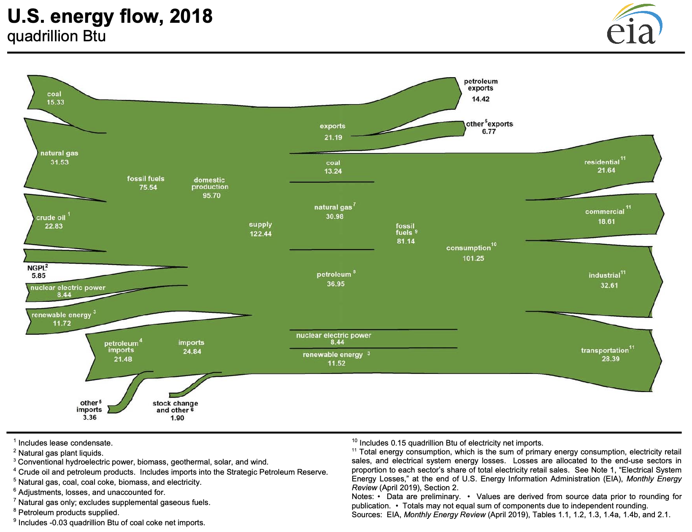
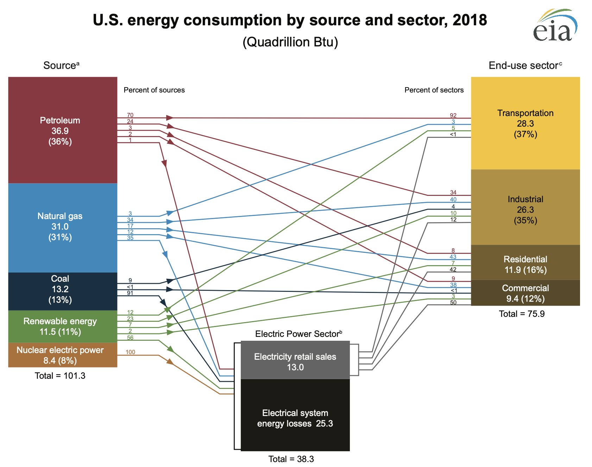
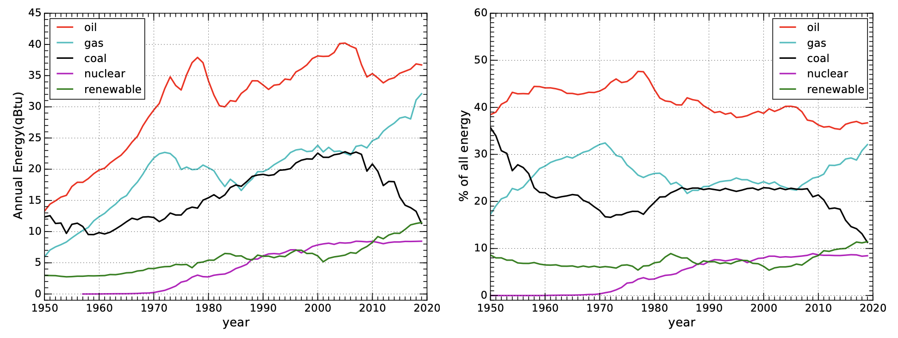
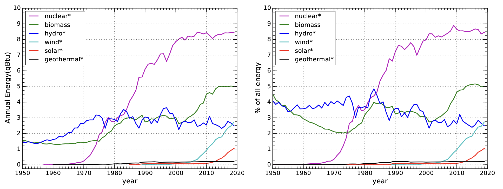
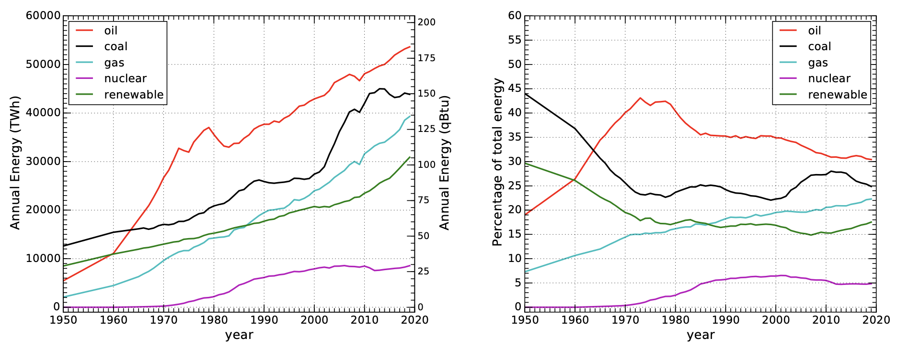
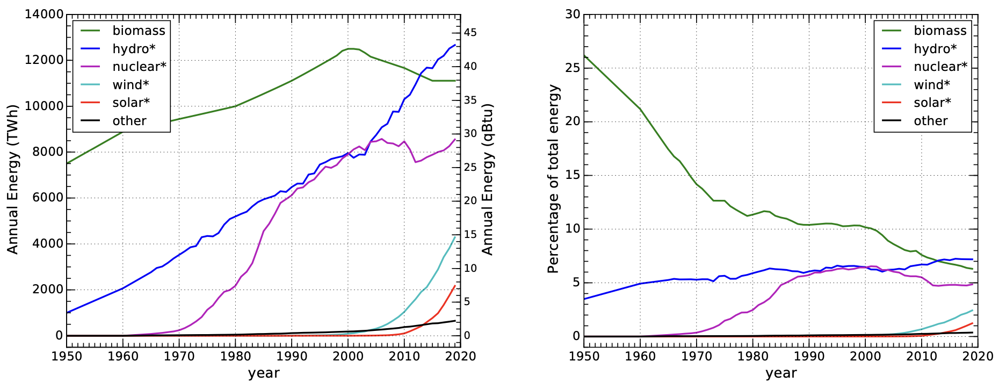
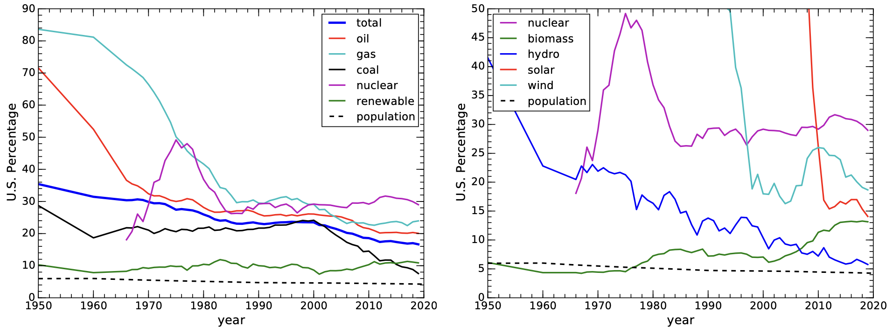

7 能源使用情况
====================

既然我们已经掌握了常用的能量单位和热力学过程，就可以查看各种能源数据，并对这些信息加以理解，
从而进行有意义的交叉比较。在本章中，我们将对不同种类的能源在国内和全球、过去和现在所扮演的角色进行透视。

本章中的大部分信息来自美国能源信息署（Energy Information Administration, :term:`EIA`）
的《年度能源报告 (Annual Energy Review) 》\ :cite:`c34`，瓦茨拉夫﹒斯米尔（Vaclav Smil）的全球数据汇编，
和英国石油公司（BP）的《世界能源统计报告 (Statistical Review of World Energy) 》\ :cite:`c16`。
除非另有说明，本章假定美国的数据来自前者，全球的数据来自后两者，就不逐一引用了。

7.1 美国年度能源报告
----------------------------

在 2011 年之前，美国《年度能源报告 (\ :term:`AER`) 》一直是作为年度报告编制的。在那之后，
其形式改为通过网页界面提供数据产品，而不是单一的文件了。AER 提供了大量令人印象深刻的详细信息，
而我们在本书中将只涉及一点表面内容，即高层次的总览数据。后面的章节有时会依赖更深层次的信息，
提供各州使用水电、太阳能、风能等的情况。但目前，我们主要关注《年度能源报告 (\ :term:`AER`) 》的第 1 部分，
即「能源概述（Energy Overview）」。

7.1.1 能源流
++++++++++++++++++++

AER 第 1.0 节是一页 PDF 格式的图表，一目了然地传达了进出美国的能源流。图 7.1 显示的是 2018 年版本。

  **图 7.1:** 美国 2018 年的能源流。可惜单位用的是百万亿英热单位（qBtu）。来自美国 EIA。

根据以往的经验，很多学生都不喜欢这个图表。但首先，它是 EIA 的产品，不是本书的创作。其次，
只要掌握了窍门，它其实并不难理解。

资源从左边进来。消耗或出口在右边。这种形式保证了总输入必须与总输出相匹配\ [#]_ 。
我们还能一目了然地各类目之间的大小对比。

.. [#] 也就是说，不会在库存中储存或提取大量能源。

为了理解这张图，让我们从中间部分开始。在中间偏左的位置，我们可以看到总供应量为 122.44 qBtu。
其中，我们消耗 101.25 qBtu（中间右侧），剩余的 21.19 qBtu 出口。现在，我们将注意力集中在中间一栏，
这是关于能源分配\ [#]_ 的一个很好的可视化和量化快照。从中我们可以看出，煤炭占 13%，天然气占 31%，
石油占 36.5%，核能占 8%，可再生能源占 11.5%。\ [#]_ 

.. [#] 幸运的是，总消耗量非常接近 100 qBtu，因此以 qBtu 为单位的每个来源的消耗量近似于百分比！
.. [#] 可将化石燃料分为固体（煤）、液体（石油/原油）和气体（天然气；与液体汽油不同，后者属于石油产品）三种形式。

图的右侧显示了能源流向的部门，住宅（家庭）、商业（企业）、工业（制造业）和运输（个人和商业/航运）
大致相同。在这幅图中，我们完全无法了解每种能源对每个部门的贡献程度\ [#]_ ，这将在下一节中介绍。

.. [#] 例如，我们无法知道工业部门使用了多少煤炭。

最后，左侧显示的是投入，最上方是国内化石燃料供应（来自国内的产量），中间是核能和可再生能源，
最下方是进口。从中可以了解到，我们出口一些煤炭\ [#]_ ，几乎所有的天然气和 100% 的核能都来自国内，
62% 的石油来自国内的原油生产。

.. [#] 例如，开采的 15.33 qBtu 供应量大于我们消耗的 13.24 qBtu。

图表中还能获得其他信息。不要害怕用减法或除法来帮助新发现。（你还能从这些数字中发现什么？）

.. _box7.1:

.. admonition:: Box 7.1: 100 个百万亿？那又怎样？

  让我们更直观地了解这一规模是多大。美国一年的发电量为 100 qBtu，约合 10\ :sup:`20` J，
  一年有 3.156 × 10\ :sup:`7` 秒\ [#]_ ，这意味着美国的电力预算刚刚超过 3 TW（3 × 10\ :sup:`12` W）。
  分配给 3 亿多人，每人平均约 10,000 W\ [#]_ 。正如我们在 :ref:`5.5 节<5.5>`\ 中所看到的，
  人类的新陈代谢大约为 100 W。这相当于每个美国人拥有 **100 个能源仆人**！难怪我们比过去的皇室成员生活得还好。
  尽管美国的人均能源使用量约为全球的 4.5 倍（约占全球能源使用量的 20%，全球人口的 5%\ [#]_），
  地球上的普通公民仍然平均拥有 20 多个能源仆人，这几乎完全归功于化石燃料。化石燃料毫无疑问地改变了世界。

.. [#] 小窍门：一年大约有 𝜋 × 10\ :sup:`7` 秒。
.. [#] 这在表 3.4 和 Box 5.4 中都提到了。
.. [#] 由于消费主义、饮食习惯、舒适标准、独立住房和交通的盛行，美国的能源使用量远高于平均水平。

7.1.2 来源和使用情况
+++++++++++++++++++++++

图 7.2 提供了能源如何从源头流向使用部门的更详细分类\ [#]_ 。换句话说，可以看到在 2018 年消耗的 101.25 qBtu 能源中，
各个来源分别有多少，以及又有多少流向各个最终使用部门。例如，我们可以看到，91% 的煤炭和 100% 的核能用于发电，
92% 的运输以石油为基础。

.. [#] 注意来源和使用部门的方框中的数字与图 7.1 中的数字一致，误差在四舍五入之内。

请注意中间偏下方代表电力的黑灰色块。从左边的所有来源获取电力，而所有部门都要消耗电力。此外，
在用于发电的 38.3 qBtu 热量中，只有 13.0 qBtu（34%）可以作为电能输出，这是因为热损耗的缘故，
这在第 6 章中已有介绍。

  **图 7.2:** 美国 2018 年能源来源和最终用途，摘自 :term:`AER` 第 2.0 节。图块旁的小数字代表百分比。非百分比数字单位为 qBtu。来自美国 EIA。

原则上，可以（而且最好）在箭头进入和离开电力部门的地方标注百分比，如示例 7.1.1 那样，
好在已有足够的信息来计算这些百分比。如果没有这些百分比，可能会有点误导我们。比如，只有 17% 的天然气直接用于居民部门，
但一部分天然气会用来发电，然后再流向住宅。因此，居民部门中最终来自天然气的比例并不准确，它要高于图中显示的 43%。

劳伦斯-利弗莫尔国家实验室（ Lawrence Livermore National Lab）也提供了一个类似的图表，
其中结合了图 7.1 和图 7.2 的一些元素\ :cite:`c35`。\ [#]_ 

.. [#] :cite:`c36` 还用动画生动展示了这些数据。

.. _exp7.1.1:

  **示例 7.1.1:** 让我们通过图 7.2 中的数字来计算，天然气在居民部门能源使用中所占的比例。
  采用同样的方法，即将电力的贡献纳入其中，可以得到其它部门的情况。

  首先，在 11.9 qBtu 的居民能源预算中，43% 直接来自天然气，即 5.1 qBtu。\ [#]_ 

  然后考虑发电，35% 的天然气用于发电，我们可以计算出这一部分为 10.9 qBtu。\ [#]_ 
  
  因此，在进入电力系统的 38.3 qBtu 总能量中，有 10.9 qBtu（28%）来自天然气。\ [#]_ 
  
  假定 34% 的发电效率\ [#]_\ 适用于所有能源（接近实际情况），我们可以说 28% 的电力输出来自天然气，
  则有 13.0 qBtu（输出的电力）的 28% 是 3.7 qBtu。
  
  但并非所有电力都进入了居民部门。在 11.9 qBtu 的电力输出中，有 42% 或 5.0 qBtu 给了居民部门。
  我们可以假设，在这 5 qBtu 的电能中，28% 来自天然气，如上文所述。因此，流入居民部门的天然气发电量是 1.4 qBtu。
  
  我们可以将这 1.4 qBtu 的天然气发电与 5.2 qBtu\ [#]_ 的天然气直接用量相加，得到居民部门有 6.6 qBtu 的能源来自天然气──
  直接或通过电力系统。与居民部门的 11.9 qBtu 总量相比，天然气占其能源使用量的 55%，而不是所列的 43%。
  这下我们算明白了。

.. [#] 核对一下，我们注意到蓝色箭头的一侧有 31.0 qBtu 的 17%，即 5.3 qBtu 的天然气用于居民部门，
   与另一侧得到的 5.1 qBtu 非常接近（四舍五入误差，基本一致）。
.. [#] 31.0 qBtu 的 35%。
.. [#] 如果图 7.2 能在蓝色箭头进入发电方框的位置印上一个蓝色的 28，岂不更好？
.. [#] 输入的 38.3 qBtu 能源可生产 13.0 qBtu 的电力。
.. [#] 这是之前两个估计值的平均值。

.. margin:: 

  .. csv-table:: **表 7.1:** 以\ :term:`等效热值<thermal equivalent>`\ 计算的 2018 年美国能源消耗。
    :name: tab7.1
    :class: booktabs
    :header: 能源,qBtu

    石油 Petroleum,36.88
    天然气 Natural Gas,31.09
    煤炭 Coal,13.25
    核能 Nuclear,8.44
    生物质 Biomass,4.98
    水力发电 Hydroelectric,2.77
    风能 Wind,2.48
    太阳能 Solar,0.92
    地热 Geothermal,0.21

7.1.3 一些细节
++++++++++++++++++++

.. margin::

  .. figure:: ../images/fig7-3.png
    :name: fig7.3

    **图 7.3:** 2018 年美国的能源来源。:ref:`图 7.6<fig7.6>` 显示了全球的情况。

再深入研究一下《年度能源报告》，其 1.3 节提供了更加详细的能源消耗分类，把「可再生」类别细分分为不同的部分，
如表 7.1 和图 7.3 所示。

总体上，2018 年美国 80% 的能源来自化石燃料。不到 2.5% 来自风能，不到 1% 来自太阳能，
其他 16% 主要以核能、生物质能和水电的形式存在。大部分可再生能源来自生物质能，如燃烧木材。
世界范围内的情况非常相似，大约 80% 的能源来自化石燃料。化石燃料仍然是我们的主要能源。
表 7.2 分别列出了美国和全球的电力来源。

.. _box7.2:

.. admonition:: Box 7.2: 等效热值（Thermal Equivalent）

  请注意，为了更有意义地将一种能源与另一种能源进行比较，EIA 以及表 7.1 通常会对某些能源采用一个热转换系数。
  化石燃料以其热能含量为表征，这是有道理的，因为燃烧化石燃料是为了获得热能。热能通常会转化为电能，
  但并非总是如此。与此同时，一些能源，如太阳能、水电、风能、核能和地热能，几乎完全用于发电，
  因此最容易通过电力输出而非热能输入来衡量（热能输入对太阳能、风能和水能毫无意义）。

  将电能输出乘以约 3 倍，就得到了等效热值\ [#]_ 。其解释是：要获得相同的结果，需要多少化石燃料（热能）？
  因此，当表 7.1 显示太阳能发电量为 0.92 qBtu（约占总发电量的 1%）时，实际太阳能发电量要小 3 倍，
  但这种做法是公平的，因为现在我们可以直接将太阳能与化石燃料进行比较。将电能输出与热能输入混为一谈，
  会使可再生能源与化石燃料相比显得贡献较小。

.. [#] 实际系数就是上文讨论的电力转换效率的倒数（效率为 34%，因此为 1/0.34）。随着时间的推移，
   EIA 所采用的转换效率也在缓慢上升，并在 AER 附录 A6 中进行了记录，目前为 37.5%，转换系数为 2.67。

.. csv-table:: **表 7.2:** 2018 年美国和全球各种来源的电力的百分比。生物质包括燃烧木材和废弃物。数据来自 :cite:`c34` 的表 7.2a 和 :cite:`c37`。
  :name: tab7.2
  :class: booktabs
  :header: 区域,煤,天然气,石油,核能,水力,风能,太阳能,生物质,地热

  美国,27.3,34.9,0.6,19.2,7.0,6.5,2.3,1.5,0.4
  世界,38.0,23.0,2.9,10.1,16.2,4.8,2.1,2.4,0.5

  **图 7.4:** 美国一次能源消费近况。三种化石燃料和核能分别显示，所有可再生能源归为一组。
  请注意，在该图的末尾，煤炭的消耗量缩减到与可再生资源并列。右图显示的是能源总量的百分比。
  大多数线条都相当平缓，近年来的主要变化是天然气取代了煤炭。

7.1.4 能源趋势
++++++++++++++++++++

我们不仅要了解当前的能源状况，还要了解过去几十年以及可能在不久的将来出现的趋势。
AER 第 1.3 节的数据，按照表 7.1 所列类别，可追溯到 1950 年。

图 7.4 显示了过去 70 年化石燃料的发展趋势，以及次要的非化石能源的缓慢增长。最近有消息称，
在美国，可再生\ [#]_ 能源作为一种能源已经超过了煤炭。确实，这两条线基本上在图的右侧相交，而且趋势表明，
未来的排名会发生明显的逆转。不过，请注意，这一结果主要是由于发电厂用天然气取代了煤炭。
天然气的急剧上升几乎完全对应煤炭的下降，而可再生资源的上升则较为平缓。因此，
与其说是可再生能源取代了煤炭，不如说是天然气取代了煤炭。
图 7.4 还显示了每种能源在所有能源中所占的百分比。几十年来（1980-2010 年），
煤炭和天然气的比例基本持平，而石油的比例几乎是煤炭和天然气的两倍。最近，天然气正在接近石油，
而煤炭则急剧下降。

.. [#] 「可再生」这个术语将在第 10 章完整解释。

  **图 7.5:** 美国非化石能源消耗近况：核能、水电和生物质能一直占主导地位，而风能和太阳能正逐渐崛起。
  星号表示等效热值（见 Box 7.2）。右图为占能源总量的百分比。除了核电在中间的几年迅速崛起外，
  最近几年开始增加的风能和太阳能（尽管仍只占百分之几）是最令人感兴趣的发展。

图 7.5 中的非化石能源消耗与核电一起，明确了图 7.4 中「可再生能源」曲线的细分组成。从中我们可以看出，
核能在非化石能源中占主导地位，从 1970 年到 2000 年迅速上升，此后保持稳定。在过去的 50 年中，
水电一直非常稳定，但其他能源超过了它，降低了它的排名。1980 年前后生物燃料的激增似乎主要是由于木材燃烧的增加，
而接下来的激增（2000-2010 年）则是由于生物燃料──主要是乙醇。风能对 100 qBtu 总消耗预算的贡献率接近 3%，
每年增长约 0.2%。太阳能也在不断增长，最近已达到 1% 的水平，但增长速度比风能慢。地热的贡献微乎其微，
并将继续如此。

7.2 全球能源情况
----------------------------

.. margin::

  .. figure:: ../images/fig7-6.png
    :name: fig7.6

    **图 7.6:** 2018 年世界能源来源。图 7.3 显示了美国的情况。

正如图 7.6 和图 7.7 所示，全球情况与美国的情况并无显著不同，这并不令人惊讶。化石燃料占主导地位，
石油居首位。此外，虽然核能和可再生能源在美国具有可比性，但在全球范围内却并非如此，原因将在下文讨论。
请注意，对全球能源的不同评估可能会得出不同的百分比，这取决于是否使用等效热值（见 :ref:`Box 7.2<box7.2>`）。

  **图 7.7:** 世界一次能源消费近况。三种化石燃料和核能分别显示，可再生能源合并为一组。
  右图显示的是在总体中所占的百分比。

图 7.8 显示了最近几十年非化石能源的情况。这里我们可以看到，全球可再生能源超过核能的很大一部分原因是生物质能。
这是有道理的，因为生活水平较低的国家更有可能燃烧木材，而较少使用核能。

  **图 7.8:** 全球非化石能源消费近况。星号表示使用等效热值。右图显示了每种能源占总能源消耗的百分比。
  1950 年，生物质能占全球能源的四分之一。

.. _box7.3:

.. admonition:: Box 7.3: TWh vs. qBtu

  你可能已经注意到，一旦我们不再使用以 qBtu 为单位表示能量的 AER 数据，图表（图 7.7）
  上的单位就变成了太瓦时（TWh）。太是 10\ :sup:`12`，1 TWh 是 10\ :sup:`12` Wh。
  我们使用 kWh 比 Wh 更频繁，所以 TWh 相当于 giga-kWh，或 GkWh。1 kWh 是 3.6 × 10\ :sup:`6` J，
  所以 1 TWh 是 3.6 × 10\ :sup:`15` J。而 1 qBtu 是 1.055 × 10\ :sup:`18` J。
  全球能源情况的图中也将 qBtu 放在右侧，以便于比较。

  本节的数据来源\ :cite:`c16`\ 混合了热能输出和电能输出，因此，根据 :ref:`Box 7.2<box7.2>` 所述，
  图中某些类别（图例中的星号）乘以了 3.06。\ [*]_\ 

.. [*] {-}\ :cite:`c16`\ : Smil (2017), Energy Transitions: Global and National Perspectives

7.2.1 美国在全球的比重
++++++++++++++++++++++++++++++++++++

最后，我们来看看美国各种能源的消耗量与全球总消耗量的对比，以帮助进行本书中的一些讨论。\ [*]_\ 
图 7.9 左边显示的演变包含了对地缘政治的重要洞察。1950 年，美国使用了全球 84% 的天然气和 72% 的石油。
当时，美国人口仅占世界人口的 6%，但美国人使用的石油和天然气却是全球平均水平的十倍以上，
大大超过了世界其他国家的总和。由于每年的能源使用就是功率（power）的定义，
我们可以理解美国在这个时代是如何成为名副其实的超级大国（superpower）的。
模仿一下比尔·克林顿的口号：是资源，傻瓜。(Bill Clinton: It’s the economy, stupid.)

.. [*] {-}这可能是一些美国人怀念 20 世纪 50 年代「光辉岁月」的一个原因。就美国能源份额所起的作用而言，
   渴望回到那个时代的愿望是不太可能实现的。

  **图 7.9:** 左图在图 7.4 和图 7.7 基础上，显示了美国能源消耗占全球比重的历史趋势。整体上看，
  世界正在追赶早期的领先者。美国在二十世纪中叶是名副其实的「超级大国」。底部的虚线代表美国人口在全球人口中所占的比例，
  因此高于这条线的能源使用量意味着比平均比例高，所有能源类别都是如此。右图在图 7.5 和图 7.8 基础上，
  显示了美国使用可再生能源和核能的百分比。作为太阳能和风能的先行者，也确实体现了这是一个以创新著称的国家。

图 7.9 左边较粗的深蓝色线条代表所有能源的总和。1950 年前后，美国人使用了全球能源总量的三分之一，
相当于非美国人人均使用全球能源总量的近 8 倍\ [#]_ 。如今，这一比例接近 4。

图 7.9 右边同样考察了美国的可再生能源份额。唯一呈上升趋势的是生物质能，这是由于使用乙醇的强制法案\ [#]_ 。
但在整个图中，它只是一个小角色。有趣的是太阳能和风能，在世界其他国家加入之前，美国作为技术先驱，
最初在全球占有很大份额。

.. [#] 计算过程：6% 的人口使用 35% 的能源，94% 的人口使用 65% 的能源，两者相比：
   (35/6)/(65/94) ≈ 8.4。
.. [#] 更多关于生物燃料的内容见第 14 章。

7.3 总结：Go to the Source
----------------------------

本章有两个目的：首先是向学生介绍有关国家和全球能源生产的可靠信息来源；其次是介绍能源使用情况。
我们看到的是这样一幅图景：世界仍然牢牢受制于化石燃料，而化石燃料的年用量还在不断增加。
风能和太阳能正在取得进展，但迄今为止仅达到百分之几的水平。相对于人口总数而言，
美国在全球能源中扮演了一个超重的角色，尤其是在二十世纪中期。

7.4 思考题
---------------------

（略）