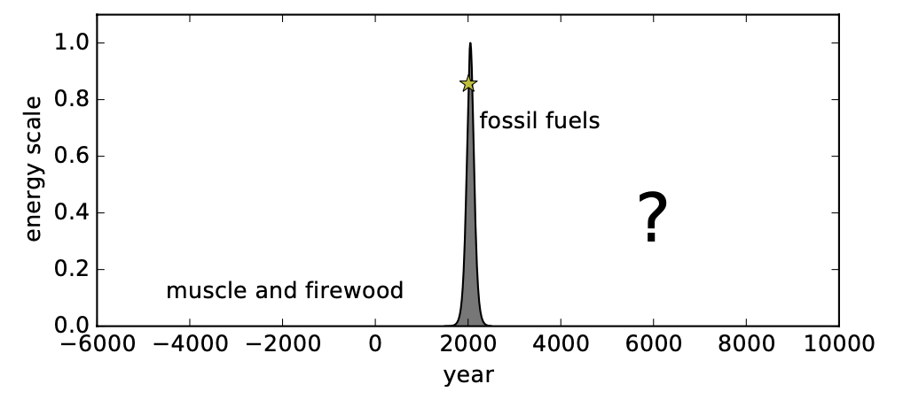
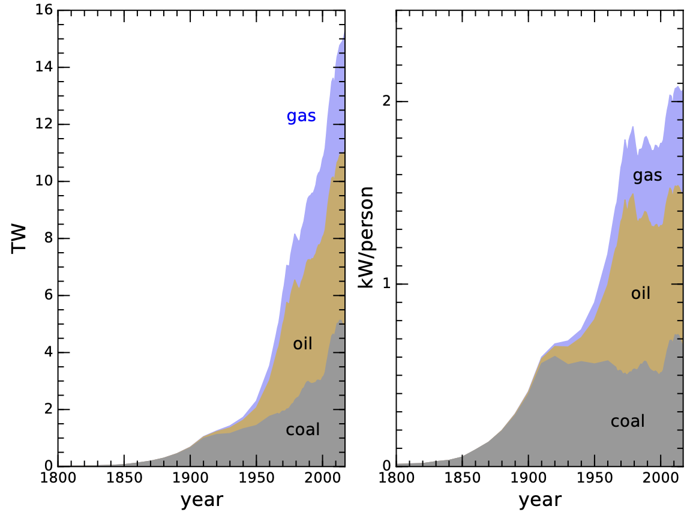
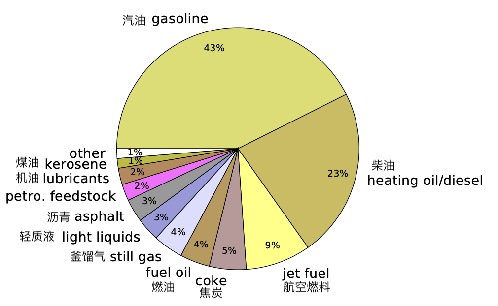
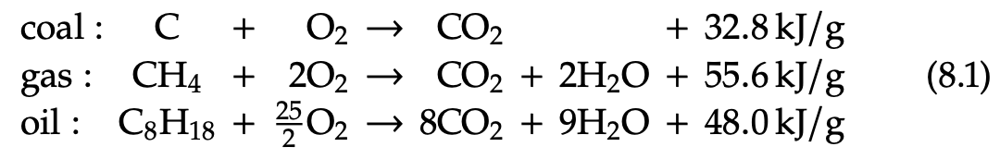
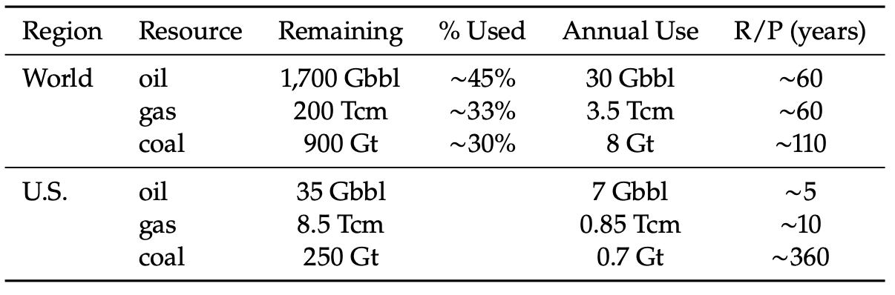
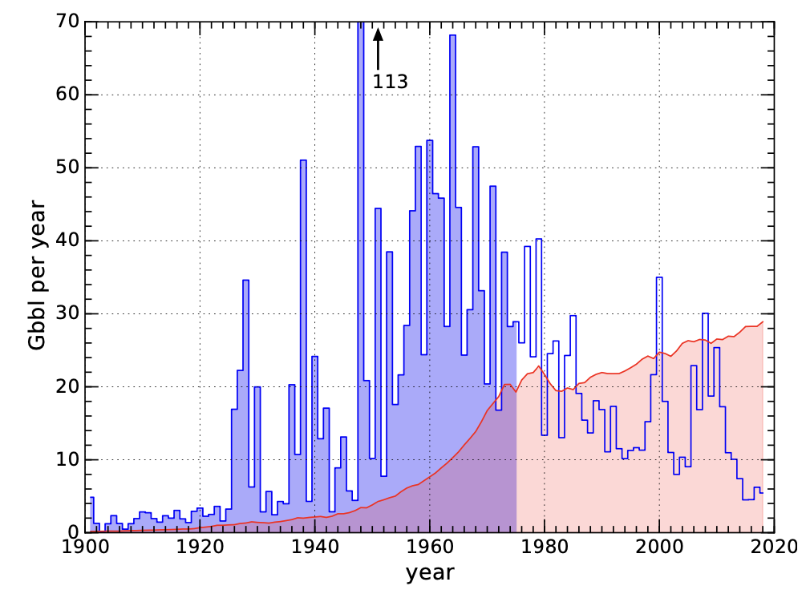
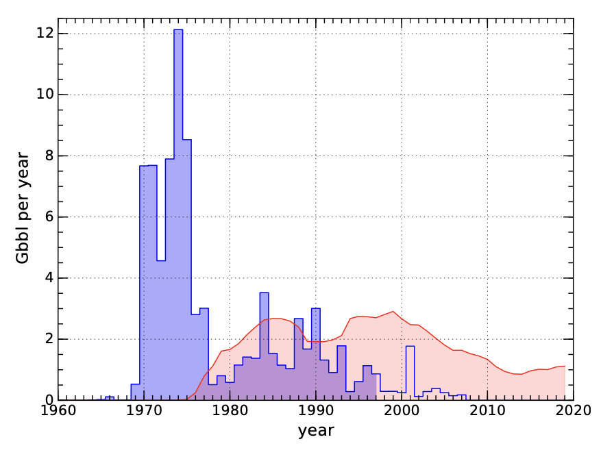
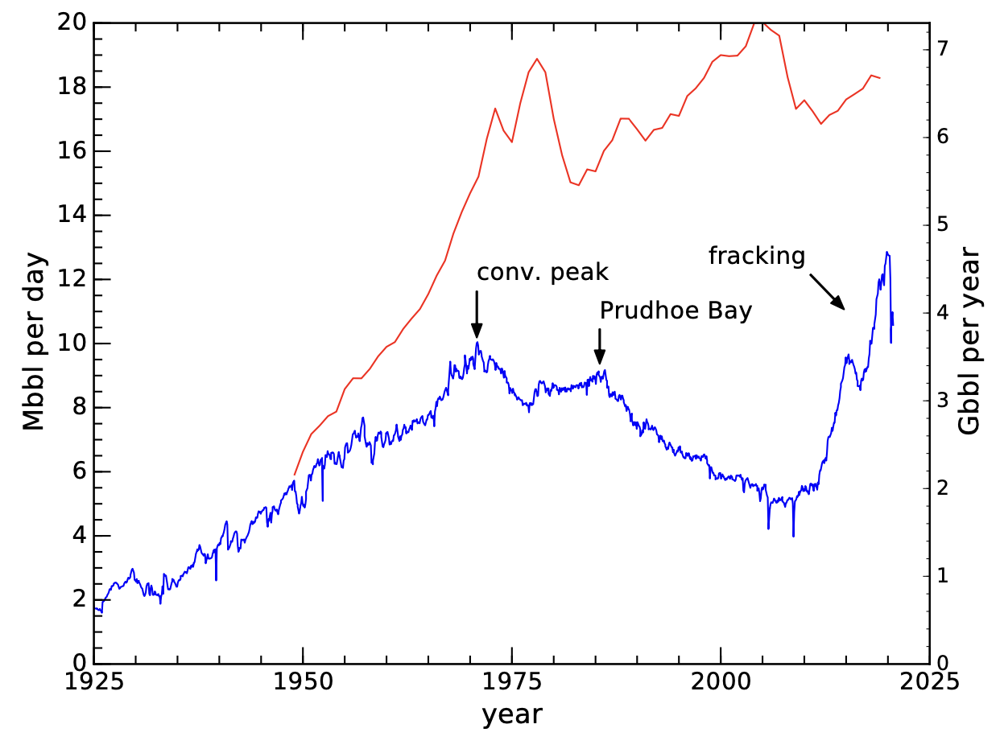
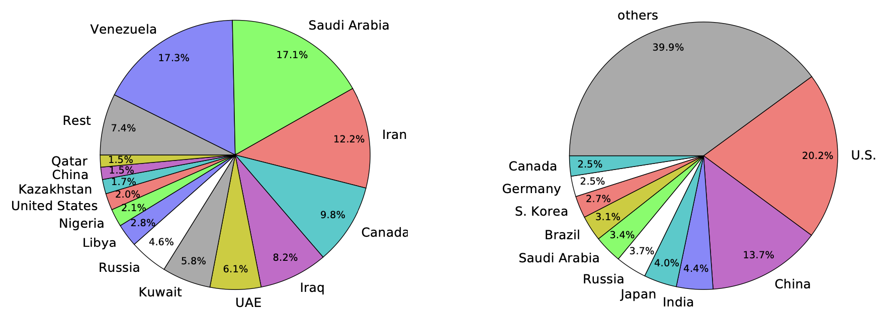

8 化石燃料
=================

我们现在准备进入本书的核心内容：评估全球能源需求和前景。在人类历史的大部分时间里，
我们使用的能量来自食物驱动的人和家畜的肌肉力量，以及燃烧木柴、利用风力和水流（所有这些都来自太阳能）。
后来，一件最了不起的事情发生了：化石燃料的发现和广泛利用。化石燃料所提供的丰富能源深刻地改变了人类的生存条件，
因此，对于生活在 200 年甚至 100 年前的人来说，我们现代世界的许多事物就像是魔术。

化石燃料仍然完全主导着我们的能源体系。每个国家都在一定程度上依赖化石燃料，尤其是在交通方面。
尽管化石燃料不可能成为我们的未来──因为有限的资源会枯竭以及气候变化问题──
但至关重要的是，我们必须审视这些现代生活的支柱，评估是什么让它们既神奇又可怕，以及我们对未来的期望。
正视化石燃料这一严峻而又未被充分认识的现实，将使我们更加渴望了解化石燃料的未来，
这也是后续章节所要讨论的内容。

8.1 有史以来最重要的图示
----------------------------

（下面文字暂时为机翻）

到目前为止，我们已经对人类的努力有了一些大局观。首先，我们从物质和经济两个方面说明了持续增长的荒谬性，得出结论认为，增长必须局限于一个暂时的阶段，不可能无限期地持续下去。接下来，我们研究了人口的现实情况，以了解这一故事可能如何发展。然后，我们研究了宇宙的规模，地球在浩瀚的虚空中是多么微不足道，并探讨了殖民化的极端困难--将重点放在应对我们在地球上所面临的挑战上。

.. margin::

  .. figure:: ../images/fig8-a.png
    :name: fig8a

为了说明化石燃料在过去和现在都有多么重要，我们在探讨化石燃料的具体细节之前，再次从广阔的视角来审视我们的能源发展轨迹。这幅图景有可能重塑个人对未来的看法。

如果你能积极参与创作，结果可能会更有影响力。因此，找一些纸张、信封背面或其他东西。画一条横轴作为时间轴。左边缘标注为 -10,000年（过去）。右边是+10,000 年（未来）。中间为 0（现在；见页边示例）。纵轴代表全球能源生产，以线性比例表示。长期以来，这个数字太小了，在地面上根本看不到。直到大约 200 年前，它才变得清晰可见。因此，在从-10,000 到 0 的前 98% 范围内，画一条紧贴地面的线1。因此 画一条平滑的曲线，将前一条线连接到现在（图的中间部分）的陡峭上升部分，利用大部分或全部可用的垂直空间。

.. margin::

  .. figure:: ../images/fig8-b.png
    :name: fig8b

这就是经典的 "冰棍 "图，适用于我们世界的许多物理属性：人口、二氧化碳、温度，以及目前的能源使用。在曲线的长平部分，我们的能源来自木柴和肌肉（包括动物和人类的劳动）。但是，突然发生的转变性增长实际上是化石燃料的故事。即使在今天，在水电、核能、太阳能、风能、地热能和潮汐能的组合中，化石燃料仍然占到总量的 80% 以上。

让我们继续以化石燃料为背景进行分析。化石燃料是一种有限资源，因此我们大致知道其曲线应该是怎样的。它必须回落到零，并像过去一样驶向未来：零。人们可能会争论化石燃料使用量达到峰值的确切时间，但由于种种原因，我们完全有理由把它定在本世纪的某个时候。如果你想让曲线在下降之前再攀升一些，我们将视个人喜好而定，但不要走得太远。本世纪结束时，从 0 到 +10,000 的距离只占 1%，所以不要让峰值离曲线中间太远。一旦转为下降，曲线很可能看起来相当对称，在短时间内回到零点并保持在那里。

无论个人选择如何，只要保持理性，我们都会看到相同的基本图景（如图 8.1 所示）：化石燃料只是我们与历史相关联的时间尺度上的一个小插曲。我们生活在一个极不正常的时代。3 由于这种上升趋势已经持续了几代人，因此对大多数人来说，这似乎是完全正常的：这是我们或我们遇到过的任何人所了解的唯一现实。由于缺乏洞察力，孩子会认为他们的生活环境是正常的，无论多么贫困或优越：这是他们唯一知道或见过的世界。同样，我们接受并将我们当前的世界定义为正常--即使历史的视角最终认为过去的一两个世纪是人类经历中最疯狂的不寻常时期，就像一场烟花秀。

  **图 8.1:** 化石能源的历史。直到现在，化石燃料仍是人类能源的主要来源。我们也知道，从长远来看，
  人类的能源应该是什么样的。最大的问题是，在化石燃料耗尽或废弃之后，人类历史的后半段会是什么样子。
  根据本章后面提到的文献，黄色星标是我们对目前状况的一种猜测，表明资源几乎耗尽了一半。

图 8.1 应该会激发出一大堆问题。我们在曲线的哪个位置？何时达到峰值？下降阶段的标志是能源匮乏加剧，还是可再生能源未来的到来？与现在相比，遥远的未来是否更像过去（肌肉和木柴）？这些情节是否会改变我们对世界的理解以及我们自己对未来的规划？唯一公正的结论是，我们真的不知道未来会如何发展。4 我们可以把左边标注为 "肌肉和木柴"，把尖峰标注为化石燃料，但右边唯一可信的是一个巨大的问号。

图 8.1 的构思并非本教科书的原创，在过去半个多世纪里，它曾以不同的形式出现过[38]。在过去的半个多世纪里，我们曾以不同的形式对其进行过描述[38]。当有人声称他们认为到本世纪末会发生什么时，请想想这幅图。我们的许多假设都是基于最近的、不正常的过去。在定义未来时，所有的赌注都打完了。 从某种意义上说，那些正确地指出我们不能指望自己有足够的智慧来预见未来的人是正确的--但也许是以一种无意的对称方式。未来可能会比我们目前的梦想更加令人沮丧。 这也会让许多人大吃一惊。我们需要以谦卑的态度对待未来，抛开对事物发展方向的先入为主的观念，这样我们现在就可以做出选择，帮助确定未来的发展方向。 想当然是冒险之举。只有承认可能出现灾难性的结果，我们才能采取措施降低这种可能性。放弃是我们可能做出的最危险的举动。

.. _box8.1:

.. admonition:: Box 8.1: 可再生资源能拯救我们吗？

  在图 8.1 中，化石燃料能源必须恢复到工业化前的水平，但这并不意味着人类社会必须恢复到工业化前的能源水平。毕竟，我们现在可以利用太阳能、风能、核能和水能。然而，仅靠这些资源，我们将很难达到今天的能源水平。更令人不安的是，在一个没有化石燃料的世界里，我们可能无法维持高科技方法。目前还没有人能够证明这一点。此外，在没有做好充分准备的情况下失去如此重要的资源，可能会损害我们的能力。简而言之：我们根本不知道。图 8.1 中的问号是我们能做出的最中肯的陈述。

请注意，图 8.1 并不是要预测未来的发展方向。但是，它可以提供一个理智的检验，让我们承认我们真的不知道，从而抵消人们对技术奇迹般的未来的普遍乐观情绪。说我们不知道未来会发生什么怎么会是错呢？然而，伴随着这种不确定性的是一线希望：如果未来是如此的不确定和没有剧本，那么也许我们有能力编写剧本，让自己走上一条可行和愉快的未来之路。如果我们选择这样做，最重要的是在这个过程中不要忽视大自然施加的限制。

8.2 概述：煤、石油和天然气
----------------------------

化石燃料主要有三种形式：煤、石油和天然气。它们本质上是古代太阳能的一种形式，植物曾将其捕获并储存为化学能，在地下封存了数百万年。化石燃料的零星、低水平使用可以追溯到几千年前，但现代化石燃料的真正使用始于十八世纪的英国煤炭。图 8.2 清楚地表明，直到 19 世纪中期工业化开始起步，煤炭的使用才真正兴起。人们可能会怀疑化石燃料使用量的增加只是人口增长的反映，但事实证明这是错误的。图 8.2 右侧用全球人口数量除以化石燃料使用量，可以看出在这一时期，人均能源使用量也在急剧上升，因此左侧面板中的指数现象是人口数量增加和人均能源使用量增加的综合结果。更多的人口和更多的人均使用量。如今，全球化石燃料的平均使用率略高于 2000 瓦/人。从图 8.2 中我们可以看出，煤炭的真正增长始于 1850 年左右，石油始于 1915 年左右，天然气始于 1970 年左右。

8.2.1 煤
++++++++++++++++

煤看起来像黑色岩石，是植物物质沉积后的残余物，变成泥炭，经过掩埋加热/压缩，形成一种大部分为碳的物质，可以与氧气燃烧产生热量。热量可以用来制造蒸汽，然后为机械或涡轮机提供动力，从而产生电力。热量也可直接用于材料加工，如在高炉中制造钢水。

  **图 8.2:** 全球化石燃料的历史使用量，可视为图 8.1 中峰值左侧的放大图。三种燃料叠加在一起，因此天然气的贡献最小，而不是最大。左侧是以太瓦为单位的原始使用率，右侧是人均使用率，这表明左侧的上升不仅仅是人口增长的反映[16]。

十八世纪末，煤炭开启了工业革命的大门，使机车（火车）、机械化制造、大规模材料加工和加热应用成为可能。有点循环论证的是，蒸汽机的第一个主要用途是在煤矿中抽水，以加速煤炭的开采。煤。这一事实进一步凸显出，工业革命从一开始就以化石燃料资源为核心。

如今，在美国，煤炭占能源消费总量的 13%，比 2000 年的 23%大幅下降。就全球而言，煤炭仍占一次能源使用量的 25%。美国绝大部分煤炭（91%）用于发电，其余用于需要大量热量的工业生产。煤的质量差别很大。表 8.1 列出了四大类煤炭的特性。无烟煤是煤中之王，但现阶段已基本消耗殆尽。能量含量较低的煤种含有较多的不可燃物质，如 SiO2、Al2O3、Fe2O3 和水。

.. csv-table:: **表 8.1:** 煤炭分为四个等级，能量含量和价值依次递减。无烟煤已基本耗尽，如今已难得一见。[39, 40]
  :name: tab8.1
  :class: booktabs
  :header: 品级,含碳量(%),能量密度(kcal/g)

  无烟煤,86-97,6-8
  烟煤,45-86,5.5-8
  亚烟煤,35-45,4.5-6.5
  褐煤,25-35,2.5-5

8.2.2 石油
++++++++++++++++

石油--又称石油--在我们的世界中无处不在，它是汽油、柴油、煤油、润滑油、焦油/沥青甚至大多数塑料的来源。几乎所有的交通工具：飞机、火车、汽车和轮船都使用石油能源。

石油于 1850 年左右首次进入现代社会，第一口钻井于 1858 年在宾夕法尼亚州打成。石油早期用于煤油灯。第一台商用内燃机紧随其后于 1859 年问世，1876 年在尼古拉斯-奥托（Nikolaus Otto）的手中形成了基本的现代形式。第一辆使用汽油内燃机的量产汽车由卡尔-本茨（Karl Benz）于 1885 年研制成功，亨利-福特（Henry Ford）的 T 型车则于 1913 年开始批量生产。在此期间，电动汽车出人意料地更受欢迎、 但由于续航里程、快速加油和成本等方面的优势，电动汽车很快让位于汽油汽车。

目前，石油占美国能源消耗的 37%。70% 的石油用于运输（92% 的运输能源以石油的形式存在），另外 24% 用于工业生产。在全球范围内，石油使用量占能源消耗总量的 31%，略低于美国。

从地下开采的石油通常被称为原油，主要由不同长度的碳氢链组成。较轻的分子（较短的碳氢链）--以辛烷值表示（图 8.3）--可用于制造汽油，而较重的（较长的）分子则存在于焦油/沥青、润滑油中，或用作塑料的 "石化原料"。精炼过程按链长分离成分，生产汽油、煤油、柴油、取暖油、润滑油、焦油等。如图 8.4 所示，92% 的原油用于某种形式的能源生产（燃烧），8% 用于生产石化产品。

  **图 8.3:** 辛烷（C8H18，含有 8 个碳原子和 18 个氢原子）是石油中较短/较轻的碳氢链之一，也是汽油的典型成分。具有相同基本设计的较长碳链存在于润滑油、焦油和塑料原料中。

  **图 8.4:** 一桶石油的部分使用量，摘自 [41]。除沥青、石油化工原料、润滑油和 "其他 "外，所有石油都被燃烧作为能源，燃烧量占 92%。静止气体包括气态的甲烷、乙烷、丙烷和丁烷，而轻质液体也主要是液态的丙烷和丁烷。可乐不是软饮料。

石油以桶（bbl）为单位，相当于 159 升（42 加仑）。每桶原油含有约 6.1 GJ 的能量（1,700 千瓦时；5.8 MBtu）。作为参考，全球每年消耗约 300 亿桶原油（美国每年消耗约 70 亿桶，即每天消耗 2000 万桶）。没有一个国家的石油日产量超过 1200 万桶。

为了说明石油的特殊性/稀有性，在地球上随便钻一个地方找到石油的几率约为 0.01%。这是因为制造石油必须满足许多地质条件：

1. 有机物必须沉积在缺氧的环境中才能抑制分解，就像死掉的动植物残骸沉积在静止的浅海底部一样；
2. 有机物必须被埋在至少 2 千米深的岩石下，以便将大分子有机物 "裂解 "成适当大小的有机物，例如辛烷（图 8.3）；
3. 这种物质不能低于大约 4 千米的岩石，否则压力会 "过度裂解 "分子，形成天然气（如果被困在地下，仍然有用）；
4. 必须在容纳高压油类的透水多孔岩石（图 8.5）上建造一个不透水的盖岩结构，以防止油类泄漏。

石油矿藏非常稀少，而且往往集中在世界上的某些地区，在这些地区，古老的浅海海底和地质活动共同作用，将有机物质封存起来，并进行适当的转化。这一过程需要数百万年才能完成，而我们消耗石油资源的速度是其补充速度的 10 万倍。

许多早期的油井都是 "涌油井"--在足够大的压力下，不费吹灰之力就能把油推到地表。现代开采就没那么幸运了，因为容易开采的石油已经耗尽。为了将石油从多孔的岩石中推出或拉出，人们使用了多种技术，包括泵、高压注水、弯曲钻井路径以钻出石油。或通过加压流体压裂地下岩石。通过加压流体压裂地下岩石。随着时间的推移，还需要进行更多的工作才能将石油从地下开采出来。

8.2.3 天然气
++++++++++++++++

天然气是许多人熟悉的家庭热源（炉灶、热水、火炉），但也是电力生产和工业加工的主要来源（通常用于火炉/炉子的直接加热）。通过哈伯工艺，天然气还被广泛用于化肥生产。

天然气主要是甲烷（CH）。其形成过程与石油类似，但在地下更深处，压力更高，长链碳氢化合物被分解成单碳甲烷分子。我们发现天然气被困在地下储层中，通常位于石油矿藏之上（图 8.5）。因此，石油钻探作业通常也会产出天然气。钻井后，天然气本身往往会自由流出，因为它处于高压之下，不像石油那样具有粘性。天然气的首次商业应用始于 1821 年纽约的一口天然气井，随后于 1836 年在费城铺设了用于街道照明的管道。由于其密度比煤或石油低 与煤炭或石油相比，天然气的密度较低，因此收集、储存和运输天然气通常并不现实，这强烈支持使用管道基础设施来输送天然气。由于缺乏管道基础设施，天然气的广泛使用一直推迟到 1970 年左右。也可以将天然气液化（称为液化天然气），方法是将天然气冷却到摄氏零下 160 度，然后用低温容器储存/运输。

天然气占美国能源消耗的 31%，占全球能源消耗的 22%。 由于向消费者输送天然气需要管道基础设施，偏远地区通常无法利用这一资源。与煤炭或石油相比，美国天然气的用途更加多样化：35% 用于发电，34% 用于工业，29% 用于住宅和商业供暖。

8.3 化学能
-----------------

当可燃物质在有氧气的情况下被点燃时，化学能会以热能的形式释放出来。附录 B 中的 B.3 节（第 379 页）提供了一些背景知识。

化石燃料的化学原理都是一样的。三个关键反应 煤、甲烷和辛烷的化学式为：

上述能量表示每克输入燃料可获得的总能量。表 8.2 提供了化石燃料燃烧的几个关键属性。燃料燃烧。能量密度（单位为千焦/克，通常为千卡/克）是衡量燃料有效性的重要指标。以千卡/克为单位，我们可以与美国的食品标签进行比较，其中脂肪约为 9 千卡/克，而碳水化合物和蛋白质约为 4 千卡/克。

.. csv-table:: **表 8.2:** 
  :name: tab8.2
  :class: booktabs
  :header: 燃料,典型化学式,摩尔质量,kJ/mol,kJ/g,kcal/g

  煤,C,12,393.5,32.8,7.8
  天然气,CH\ :sub:`4`,16,890.3,55.6,13.3
  石油,C\ :sub:`8`\ H\ :sub:`18`,114,5471,48.0,11.5

请注意，化石燃料更像脂肪（接近 10 千卡/克），而不是碳水化合物（4 千卡/克）。

.. _box8.2:

.. admonition:: Box 8.2: 顶级的能量密度

  为了正确看待这些能量密度，并证明化石燃料有多么神奇，请看炸药 TNT 的能量密度仅为 1.0 千卡/克。但与 TNT 相比并不公平，因为炸药必须携带氧气。氢气的化学能密度为 34 千卡/克，位居榜首，这是因为 氢是一种轻原子。如果像火箭那样必须携带氧气，那就不公平了、 例如，火箭必须携带氧气，那么氢气加氧气的能量密度就会降低到 3.8 千卡/克。因此，火箭燃料和炸药一般都在几千卡/克的范围内。除了氢气，很少有化合物的能量密度超过甲烷。因此，粗略地说，15 千卡/克大约是化学标尺的最高值。

8.4 化石燃料的利与弊
----------------------------

8.4.1 美妙之处
+++++++++++++++++++++++++++

能量密度： 我们在第 8.3 节中看到，化石燃料的能量密度相当可观：大约是化学所能提供的最好的能量密度。任何超过 10 千卡/克的物质在能量上都是 "超级食物"。表 8.3 将化石燃料与其他物质进行了比较，从中我们可以看出，化石燃料的能量密度比电池储能高出两个数量级。

安全： 化石燃料的能量密度比炸药大，但不具有特别的爆炸性！化石燃料的安全性是一大卖点。当然，汽油可以燃烧，但真正燃烧的是与氧气混合的蒸汽。如果你（愚蠢地；请不要这样做！）把火柴扔到一碗汽油上，你肯定会得到一些热闹的火光，但汽油不会爆炸。只有水池上方的蒸汽会着火。想想你一生中见过多少汽车，其中又有多少爆炸过。你见过多少辆失事的汽车，其中又有多少辆发生了爆炸？汽油爆炸事故并非不可能发生，但非常罕见。

便宜： 化石燃料是地球上生物和地质过程的副产品。它们基本上是免费的--至少我们历来认为自然资源是我们可以攫取的。它们有多便宜？以 15 美元/小时的价格雇佣一名体力劳动者每周工作 40 小时，使用 100 瓦的机械动力（例如挖掘），一周的成本为 600 美元。以这个价格计算，我们可以获得 4 千瓦时的工作。以电费计算，同样 4 千瓦时的电费在通常情况下为 0.60 美元（比人力便宜 1000 倍）。汽油一加仑含 37 千瓦时，价格为 4 美元，只需 0.43 美元。效率差异和机器的人工成本也是因素之一。但这一点应该足够清楚。

完美储存： 实际上，化石燃料是一种长期储存古老阳光的形式，这些阳光被植物物质捕获，（有时通过动物摄取）最终以化学能的形式被埋藏在地下。与充电电池、飞轮，甚至水力发电水库（抽水蓄能）等其他储存形式相比，化石燃料的优越性令人震惊。化石燃料矿藏已有数千万年或数亿年的历史。试着找找能保持这么久电量的电池吧！看似永久性的人造水坝/水库也不可能维持如此长的时间，哪怕是千分之一。再加上化石燃料优越的能量密度，化石燃料也许是除核材料之外，我们可以利用的最好的能源储存方式。

粮食生产： 农业绿色革命 化石燃料。化石燃料不仅为机械化耕作 化石燃料不仅为机械化耕作提供了动力（犁更大的土地、快速收获和加工农作物 快速收割和加工农作物），而且最重要的化肥也来自天然气。

技术催化剂： 化石燃料为广泛的机械化和电气化打开了大门，彻底改变了我们的生活方式。尽管化石燃料发挥了核心作用，但我们很难说，如果没有化石燃料，我们今天享受的许多福利--无论是医疗保健、技术、科学知识还是舒适的生活水准--都是不可能实现的。我们在这个世界上所庆祝的许多事情都是在化石燃料的支持下实现的。

8.4.2 丑陋之处
+++++++++++++++++++++++++++

气候变化： 没有什么是免费的。化石燃料也带来了许多弊端。如今，许多人最关心的问题就是气候变化，因为二氧化碳的排放是燃烧不可避免的后果（公式 8.1）。从化石燃料中提取能源，别无选择，只能接受大量的二氧化碳作为副产品。我们将在第 9 章讨论气候变化的细节，但现在只想说，大气中二氧化碳的增加改变了地表通过大气向太空辐射热量的效率，从而改变了地球的平衡温度。人们对这一物理机制非常了解，而化石燃料燃烧产生的二氧化碳量 足以解释大气中二氧化碳的增加。不那么确定的是，复杂、非线性、相互关联的气候系统将如何反应，以及加剧问题的正反馈是否会压倒抑制后果的负反馈。与此同时，化石燃料给我们带来了一个全球规模的问题，其严重程度尚不确定，最终可能会让我们和其他物种付出惨重的代价。

人口助推器：人类对地球的人口压力也可以通过农业机械化和化肥原料（绿色革命）追溯到化石燃料。由于许多新的全球性挑战--森林砍伐、渔业崩溃、物种减少、气候变化--都与人口息息相关，也许所有这些弊端都可以归咎于化石燃料--因为如果我们从未发现或利用化石燃料，这些问题恐怕不会以目前的规模存在。

军事冲突： 化石燃料是如此珍贵的资源，以至于资源的获取和控制在许多武装冲突中发挥了关键作用。换句话说，有多少人因为争夺这些珍贵的资源而丧生？中东地区是世界上石油资源最丰富的地区，很难将中东地区错综复杂的关系与这一事实割裂开来。

环境污染： 开采化石燃料对环境造成的影响具有相当大的破坏性。我们曾目睹油轮坠毁，给海滩和野生动物涂上焦油污泥。2010 年的 "深水地平线 "钻井平台故障将大量石油喷入海洋。煤炭开采会使山顶裸露，尾矿污染当地水源。水力压裂（压裂法）会污染地下水供应。天然气井--包括压裂现场--经常向大气中泄漏甲烷，甲烷作为温室气体，在短时间内比二氧化碳强 80 倍。

药物成瘾： 最后，化石燃料是有限的这一事实可能被视为一个严重的负面因素。诚然，取之不尽、用之不竭的化石燃料将对气候变化问题产生毁灭性影响。撇开这一点不谈，化石燃料的继承可能会被视为一种诱饵和交换把戏。我们完全是在化石燃料廉价可用的背景下发展到今天的，我们根本不知道在后化石世界我们能否继续以类似的标准生活。化石燃料已经持续了足够长的时间（几代人），以至于看起来很正常。我们认为它们是理所当然的，并没有为一个没有这些关键资源的可行世界制定总体规划。没有石油，航空旅行、轮船、火车和长途卡车运输将如何进行？ 目前的情况岌岌可危。未能为后化石世界做出明智的规划本身并不是化石燃料的过错。但是，化石燃料的禀赋恰好为我们的地球提供了足够大的资源，足以对气候造成危害，也足以让我们陷入自满。如果化石燃料 如果数量少得多，我们就不太可能落入陷阱。这就是 这就是第 2 章中提到的 "从帽子里蹦出来的兔子"：只要得到一只兔子，我们就会期待永远有兔子。

8.4.3 平衡？
+++++++++++++++++++++++++++

化石燃料对人类的影响是净正面还是净负面可能无法回答（表 8.4 是前两个小节的总结）。化石燃料通过改善技术和医疗保健挽救了多少生命？冲突、污染和交通事故摧毁了多少生命？通过农业生产力的大幅提高--以及通过更好的医疗保健--它创造了多少生命？它直接通过开采促进了栖息地的丧失，又通过提高农业生产率间接促进了人口增长，从而毁灭了多少物种？有时，我们甚至很难决定把这些影响归为哪一类。例如，在时间的长河中，我们是否会认为化石燃料创造的所有生命都是好事？如果结果是过剩、崩溃和数十亿人前所未有的苦难，那么也许不是。这真是一团糟。

从本质上讲，人类正在无计划地在地球上进行这场全球规模的未经授权的实验。这样的事情从未发生过，所以我们不知道结果会如何。我们有大量证据表明，过去的文明曾过度扩张并最终崩溃[43]，但我们无法找到一个合适的类比对象来成功驾驭化石燃料现象。与此同时，许多迹象表明我们有理由对此表示严重关切。

8.5 化石燃料的未来
--------------------------

8.5.1 几种情景
+++++++++++++++++++++++++++

图 8.1 挑衅性地断言，化石燃料的使用量必须在相对较短的时间内（一两个世纪内）降至基本为零。这一事实本身并不能将我们的未来定义为从悲惨到辉煌，但考虑到化石燃料在我们取得今天的成就过程中所发挥的根本性重要作用，我们需要仔细考虑这一问题。零化石燃料的回归可以有多种形式：

1. 我们发现了一种新的廉价能源，这种能源尚未为人所知，也未得到重视，但却能改变游戏规则，从而迅速放弃仍留在地下的化石燃料。
2. 已知的可再生能源（太阳能、风能）被开发到有效优于化石燃料的程度，这样，在化石燃料真正耗尽之前，市场力量自然会让我们放弃化石燃料。
3. 对气候变化的担忧导致在政治上对使用化石燃料实施财政抑制，从而使我们放弃使用化石燃料--尽管成本可能更高，在政治上会引起争议，而且不会在全球范围内采用。
4. 化石燃料开采难度的增加导致其价格上涨，最终迫使市场接受更不方便、更昂贵的能源形式。
5. 我们无法找到合适的替代品来替代这种珍贵而独特的资源，因此全球地缘政治越来越以争夺剩余燃料为中心，很可能引发破坏性的资源战争。
6. 也许与前一点一起，社会慢慢地陷入能源匮乏的状态，农业能力下降，地球上的人口数量和生活水平下降。

我们无法预测这些路径中的哪一条可能会出现，但不难发现其中任何一种说法的拥护者。本书第三部分涉及化石燃料的替代品，第17章总结了各种替代品面临的实际挑战。由此得出的一个教训是，化石燃料在一系列考虑因素上都击败了替代品，从而在两类替代品之间留下了差距。如果不是因为供应有限和气候问题，我们就没有动力去采用成本更高的劣质能源。但首先，我们应该简单了解一下未来开采化石燃料的前景。有形资源的局限性有多大？

8.5.2 时间尺度
+++++++++++++++++++++++++++

评估资源可用性时间尺度的最简单方法是 :term:`R/P 比率<R/P ratio>`\ ：储量与产量之比。
这个概念非常直观：如果你的银行账户里有 10,000 美元，并且每月倾向于花费 1,000 美元用于生活开支，那么你可以预测，如果没有额外的收入，你将能够使用 10 个月。因此，如果我们有了地下剩余资源的估计值和当前的使用率，我们只需除以就可以得到一个时间尺度。

表 8.5 列出了三种化石燃料在全球和美国的探明储量、全球迄今为止的估计使用量、消耗率以及 R/P 比率给出的时间尺度。

  **表 8.5:** 

全世界已经消耗了 1.5 万亿桶石油，与 1.7 万亿桶的探明储量几乎相等，这表明我们的石油资源已经消耗了一半左右。当然，我们可以预期会有更多的资源被发现并增加到已探明储量中，但现在全球的勘探已经相当深入，我们 但现在全球的勘探情况已经相当不错了，我们不会期待会出现巨大的惊喜，比如另一个隐藏在中东地区的大型石油矿藏。请注意，就天然气而言，美国的估计总资源量（我们认为在已探明储量之外还可能发现的资源量）约为 55 Tcm，可供使用 60 多年。

由于每种形式使用的单位不同，因此很难直接比较三种形式的剩余资源。不过，我们可以用能量单位来比较每一种形式。这样，全球的 石油、天然气和煤炭的全球储量分别相当于 10、8 和 20 ZJ 的剩余量。到目前为止，我们已经消耗了 8、4 和 8 ZJ 的石油、天然气和煤（表 8.6）。这些是表 8.5 中估计消耗量的基础。请注意，石油和天然气的剩余能量大致相当，而煤炭的剩余能量大约是石油和天然气的两倍。

因此，煤炭似乎是我们最丰富的化石燃料，这引发了两点评论。首先，就二氧化碳排放量而言，煤炭是最严重的污染源，每单位能源的二氧化碳排放量大约是其他化石燃料的两倍（见第 9 章）。其次，要谨慎相信煤炭的储量估计，因为煤炭的储量往往被大大高估，然后又被大幅削减。例如，英国不得不在 1970-2000 年间将其煤炭储量估计值下调至原来的 1%左右，因为大部分估计资源被证明位于太薄、太难商业化的煤层中[47]。

对某些人来说，表 8.5 中的 R/P 数字可能看起来短得惊人，而对另一些人来说，这可能意味着有足够的时间来制定替代能源战略。无论如何，本世纪都至关重要。但同样重要的是要认识到，情况并不像 R/P 比率那么简单。虽然它提供了一个有用的标尺56 ，但我们应该考虑这些细微差别：

1. 生产（也就是消费）率并不稳定，但总体上随着时间的推移而增长（持续增长会缩短时间尺度）。
2. 新的勘探和发现增加了储量（延长了时间尺度），但最近的成功率越来越低。
3. 石油开采技术的进步增加了可开采石油的数量（延长了时间尺度）。
4. 地质挑战限制了生产速度（延长时间范围，但也限制了资源的可用性）。
5. 如果找到更好的替代品，需求（因此产量）可能会急剧下降。

第 4 点值得阐述。我们不应该把化石燃料储备看作是一个我们可以任意提取资金的银行账户，或者看作是一个洞穴般的地下湖泊，只等着我们想把什么稻草塞进去就把什么稻草塞进去。首先，煤炭不会流动，需要耗费大量体力才能揭露和清除。清除速度取决于煤层的厚度、煤层的深度以及周围岩石的挖掘难度。即使是石油，也不是在某个荡漾的储层中，而是渗透到多孔的岩石中，这就限制了粘性流体从岩石中流出并进入泵管的速度。天然气最容易从岩石中流出，但在现阶段，美国已经开始使用 "致密天然气"，这种天然气不容易从岩石中流出，因此美国采用了压裂岩石的技术，为天然气的流动打开通道。同样的技术也被用于开采 "致密油"，否则就无法用常规方法从地下抽出。

在任何情况下，我们显然都会首先追求最容易获得的资源：低垂的果实。随着时间的推移，我们不得不去寻找更困难的资源。除了地质因素，还有一个简单的事实 我们并不拥有无限的开采机器，这限制了化石燃料的开采速度。同样值得指出的是，钻探更深的地方并不会继续带来红利，第 8.2.2 节指出，埋藏太深的石油会被 "裂解 "成天然气。

.. margin::

  .. figure:: ../images/fig8-6.png
    :name: fig8.6

    **图 8.6:** 基于相同的初始历史（红点为 "现在"）和相同的剩余量（蓝色阴影区域），有限再资源出现了三种情景。每个情景下的红条代表资源衰退前的剩余时间。详见正文。

图 8.6 展示了有限资源的三种可能轨迹。最左侧对应的是 R/P 比率：如果我们将消耗量锁定在一个稳定值上，以现在的使用率我们还能使用多久？第二幅图假定我们继续保持上升的轨迹，与 R/P 比率相比，资源耗尽前的时间会缩短（使用速度越来越快）。这两种情况都有各自的不现实之处--第二种情况是由于上述开采的物理限制（不是自由流动的资源）。第三种情况更符合实际：达到峰值，然后对称下降。这就是化石燃料资源的实际表现。所有三种情况都可能对系统造成冲击，但要注意的是，（现实的）峰值情况带来的供应下降的创伤是最快的，远远早于 R/P 比率所显示的时间。

8.5.3 数据中的线索
+++++++++++++++++++++++++++

尽管存在上述不确定因素，但我们可以肯定地说，地球上的化石燃料供应是有限的，要消耗这种资源，首先必须通过勘探发现矿藏，然后将其开发成活跃的油井。即使在已知有石油的地区，每十口勘探井中也只有一口取得成果。在地球上随机地点开采石油的几率约为 0.01%。第 8.2.2 节指出了生产石油必须经历的一系列事件。

图 8.7 显示了常规石油的发现历史。从图中我们可以看到，石油发现在 50 多年前达到顶峰。由于我们无法开采尚未发现的石油--就像我们无法拥有尚未设计出来的 iPhone 机型一样，消费（红色）曲线下的面积最终一定不会大于发现数据（蓝色）下的面积。因此，无论通过何种方式，消费都不可避免地会在某个时刻达到峰值并随之下降。请注意，对称曲线会在资源消耗到一半时达到峰值。

  **图 8.7:** 历史上常规石油的发现率（蓝色），以每年发现的十亿巴（Gbbl）为单位[48]。红色曲线显示全球常规原油的年消耗量。大约在 1985 年之前，我们每年发现的石油往往多于我们使用的石油，但发现率在几十年前达到顶峰，现在随着我们完成地球再资源的勘探工作，发现率正在下降。蓝色区域等于红色曲线下的区域，红色曲线本身代表迄今为止使用的石油量。这实际上意味着，我们已经使用了截至 1976 年发现的所有石油，现在我们的银行账户（石油储备）在不断减少--我们每年的收入（新发现的石油）少于我们的支出（消费）。

图 8.7 中的信息也可以转换成资源还剩多少年的问题。对于任何给定的年份，剩余资源总量可以评估为迄今为止的累计发现量减去累计消耗量。然后除以该年的年产量（与消耗量相同），就可以估算出剩余时间（R/P 比率）。图 8.8 显示了结果。

  **图 8.9:** 北海（英国）的石油发现量（蓝色，单位为千兆桶/年）在 20 世纪 70 年代达到顶峰，现已基本结束。产量（红色）滞后于发现量，随着最后一批已发现石油（无阴影的蓝色轮廓）的开采，产量将无法再继续下去。图例与图 8.7 一致。

在产油区，我们已经看到过无数次这样的故事。大约 50 年前，北海石油的发现让英国进入了石油行业（图 8.9）。起初，发现率很高，随后的 20 年里发现率一直不高。由于发现已经停止，似乎再也找不到什么了。产量呈现双峰结构--可能与 1980 年前后的发现低潮相呼应--但无论如何，开采已接近尾声。已发现的石油（实际上是 1996 年之后发现的石油；图 8.9 中没有阴影）只剩下大约 6%：可抽出的石油不多了。

美国也经历了类似的历史（图 8.10），常规石油的发现在 1950 年左右达到顶峰，产量在二十年后的 1970 年左右达到顶峰。尽管一些石油地质学家（特别是 M. King Hubbert）根据之前的发现高峰和简单的逻辑指出这种情况不可避免，但没有人希望这种情况发生。美国 自石油时代开始以来，美国一直是最大的石油生产国，而现在正在下滑。峰值和随后的下降引起了极大的焦虑，并激发了人们寻找和开发更多石油资源的巨大努力，最终在阿拉斯加的普拉德霍湾发现了石油--这就是 80 年代中期第二次（较低）峰值的原因。但随后的几十年里，石油资源又开始下降，这让许多人感到懊恼。

  **图 8.10:** 图 8.10：美国石油生产历史（蓝色；来自文献[49]）和消费历史（红色；来自文献[34]），单位为百万桶/天（左轴）和十亿桶/年（右轴）。从图中可以看出，1970 年左右传统产量达到顶峰，1985 年左右阿拉斯加普拉德霍湾的产量达到第二个顶峰，最后在过去十年中，由于水力压裂法的应用，产量急剧上升。蓝色和红色曲线之间的差距由进口量弥补。2020 年水力压裂法产量的下降与 COVID 大流行相吻合，因此尚不清楚美国的石油产量是否会继续攀升，或者是否已经过了峰值。

接下来发生了一些意想不到的事情，对于那些试图自信地预测未来的人来说，这可能是一个警示故事。"压裂 "热潮打开了通往 "致密 "油藏的通道，而这些油藏以前是无法进行常规钻探的。其历史如图 8.10 所示。

压裂热潮会持续多久？需要了解的一个方面是，常规油井需要大约十年的时间才能完全 "开发 "出来，即使在个别油井达到峰值后，其产出率也会在多年内持续下降。请注意图 8.10 中曲线的近似对称性以及 2010 年之前的缓慢下降阶段。压裂 "游戏" 是快速的：一旦小区域被压裂和泵送，整个过程可在几年内结束。因此，图 8.10 右侧的压裂热潮当然有可能像开始时一样戛然而止--容易开采的油田首先被开采，留下产量较低的油田，使这一热潮进入衰退阶段。无论如何，将美国当前的石油生产状况视为 "新常态 "似乎为时尚早。

8.5.4 地缘政治
+++++++++++++++++++++++++++

另一个值得一提的问题是地缘政治。世界上大部分已探明储量并不属于石油消费量最高的国家。图 8.11 显示了哪些国家拥有最大的石油储量，但需要注意的是，委内瑞拉和加拿大的石油储量属于重油，较难开采并提炼成汽油等较轻的形式，这使得中东（沙特阿拉伯、伊朗、伊拉克、阿联酋和科威特）成为轻质原油的 "真正 "领导者，这些原油以辛烷等更有用的短链碳氢化合物分子为主（图 8.3）。有一件事应该引起美国人的警惕，那就是绕着圈子寻找亲密盟友。除了拥有重油的加拿大，其他国家的情况并不令人放心。美国已探明的石油储量为 350 亿桶。按照每天消耗 2,000 万桶的速度计算，如果我们只使用自己的供应，那么只需要 5 年时间。然而，探明储量是一个保守的数字，往往低于估计的总资源量：勘探可以增加探明储量。美国的估计资源量接近 2,000 亿桶，以目前的消耗速度计算，如果不进口，仅能维持不到 30 年。这些较短的时间尺度在一定程度上缓解了人们对气候变化的担忧，但对于完全依赖化石燃料的全球经济来说，或许是个坏消息。

  **图 8.11:** 左图为美国能源信息管理局提供的各国已探明石油储量分布图。委内瑞拉和加拿大的石油属于重油，比中东地区的轻油更难开采和加工。右图是十大石油消费国的石油消费量（美国能源信息署）。请注意，美国拥有 2% 的石油，却消耗了约 20% 的年产量。

由于开采速度可能是一个限制因素，因此经常出现的情况是，在资源耗尽一半时，生产速度开始放缓（达到峰值），从而在一段时间内形成一条对称的使用曲线。随着时间的推移，使用曲线也会发生变化。这表明，如图 8.6 所示，峰值可能早于 R/P 比率所产生的时间尺度。一旦世界石油产量超过峰值，一系列由恐慌引发的破坏性事件就会接踵而至，使我们更难（更不可能）开始一个以可再生为中心的后化石世界。方框 8.3 和方框 8.4 描绘了令人担忧的情景。

.. _box8.3:

.. admonition:: Box 8.3: 资源战争

  想象一下石油价格从目前的 50 美元/桶攀升到 100 美元/桶的情景。一些主要的石油生产国意识到，随着石油供应不可避免地减少，这种珍贵的资源只会变得越来越值钱，因此它们会决定，其经济在 50 美元/桶的价位上运行良好，因此可以在 100 美元/桶的价位上出售一半的石油，并获得相同的收入。从市场上撤走这些石油会进一步推高油价，使其达到每桶 150 美元，这时其他国家可能会开始玩同样的游戏，但现在只卖三分之一的石油就能获得同样的收入。由此产生的多米诺骨牌效应将引发国际危机，一些军事强国将以世界警察的身份介入，以确保这一全球重要资源的持续流通。 其他拥有军事实力的国家将反对这一个国家对全球石油供应重要环节的推定和控制，并有可能卷入资源战争。可悲的是，这种事态发展会消耗大量能源和其他资源来达到破坏性目的，而不是将这些资源用于建设性活动，如建设后化石可再生能源基础设施。

.. _box8.4:

.. admonition:: Box 8.4: 能源陷阱

  如果我们发现自己处于能源资源逐年减少的状态--过于紧紧抓住化石燃料这种廉价且基本优越的能源资源--我们将很难在政治上摆脱困境，因为要摆脱困境就意味着要通过可再生基础设施来摆脱化石燃料。但是，这样一项巨大的事业需要大量的能源投资。而能源正是供不应求的东西。要开始这一转型，社会就必须在能源衰退危机中自愿做出更大的牺牲，将能源用于这项长达数十年的计划。投票给一个会在短期内结束该计划并带来即时能源缓解的政治家的诱惑可能会让人难以抗拒。换句话说，我们可能会陷入能源陷阱。尽管气候变化带来的危险显而易见，但全世界在摆脱化石燃料方面仍面临重重困难。如果转用可再生能源是一件简单、廉价和优越的事情，那么它早就已经实现了。也许我们还停留在苍蝇纸上。

8.6 总结：神奇的、可怕的、局限的
----------------------------------------

历史很可能将这一时期视为化石燃料时代，而不是工业时代。化石燃料是这个不寻常时代无处不在的决定性特征。
没有化石燃料，就不可能有现在的技术水平、全球人口或令人印象深刻的知识大厦。因此，
我们对这三种神奇的资源感激不尽。也许，任何星球上第一个发现并使用化石燃料的物种\ [#]_ 都会走出类似的疯狂轨迹，
甚至会暂时进入太空，就像我们一样。

.. [#] 这是一种合理的推测，因为化石燃料是数十亿年演化的结果，它是由支持丰富生态系统的行星上埋藏的生物质产生的，
   地球是我们所知的唯一的生态系统（见 :ref:`18.4 节<18.4>`）。

化石燃料带来了许多不利因素，如气候变化、潜在的人口过剩（以及对地球造成的各种压力）、污染和环境破坏。
更微妙的是，对化石燃料近乎完全的依赖改变了人类的期望，一旦化石燃料不再可用，人类可能无法适应。
优越的替代品无法保证，而劣质的替代品也可能无法被优雅地采用。

关于化石燃料，我们可以肯定的一点是，它的供应是有限的。可以说，我们已经接近了开采的中点\ [#]_ ，
自然地，最容易开采的资源被优先收获了。随着开采难度的增加，供应率（相对于需求）可能会成为限制因素，
远远早于 :term:`R/P 比率<R/P ratio>`\ （剩余开采年限）显示出「枯竭」（见 Box 8.5）。
回想一下，化石燃料并不等同于一个允许以任意规模和速度提取的单一银行账户。

.. [#] 尤其是对最难替代的石油资源来说。

.. _box8.5:

.. admonition:: Box 8.5: 总有一天用完？

    化石燃料不会在某一天，甚至某一年突然枯竭（见\ :ref:`图 8.6<fig8.6>`）。
    随着发现的矿藏越来越小并且难以开采，化石燃料的产量将在几十年内慢慢减少。从这个意义上说，
    化石燃料的「枯竭」不会是人类历史上突然发生的、让我们陷入恐慌混乱的事件。然而，过了高峰期，
    可利用的化石燃料逐年减少，这本身就会带来一系列的困境。在最好的情况下，
    替代能源的快速增长足以抵消化石燃料供应的减少。但挑战是巨大的，很难保证一定成功。

鉴于日益减少的化石资源在我们的世界中扮演着重要角色，如今可再生能源的贡献微乎其微──正如第 7 章所述──
就更加令人担忧了。至少 50 年前，许多人就已经意识到了这一命运，但化石燃料的使用量却一直在增加，
而替代能源的增长却乏善可陈。部分原因是与替代品相比，化石燃料成本低，使用方便\ [#]_ 。另一个原因是缺乏意识。
在我们这个以\ **新**\ 闻为导向的社会中，有时旧的──但同样重要的──故事很难持续传播。

.. [#] 人们有理由问，为什么不提高价格来阻止化石燃料的使用并促进替代品的开发？见 Box 8.6。

.. _box8.6:

.. admonition:: Box 8.6: 为什么不涨价？

    如果从资源稀缺和气候变化的角度来看，继续依赖化石燃料是有风险的，那么为什么价格仍然很低？
    政府为什么不提高价格？
    
    这里的新手错误在于假定成年人说了算。其实是市场说了算。政府可以征收税收和关税，但不能太过分，
    不然选民就会反对。全球竞争而没有一个全球政府，会惩罚那些增加自己国民生活成本的国家。
    最后，牺牲短期利益换取长期利益并不是人类的强项，尤其是面对不确定性的时候。
    很难让一代又一代的人相信一个从未出现过的未来问题。\ [*]_\ 

.. [*] {-}译注：我想这里隐含的意思是很难让这一代人让利给后几代人。

8.7 思考题
----------------------

（略）