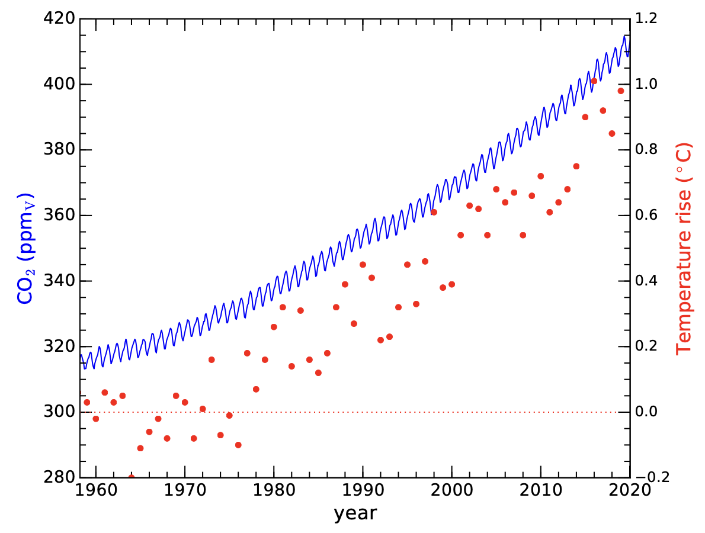
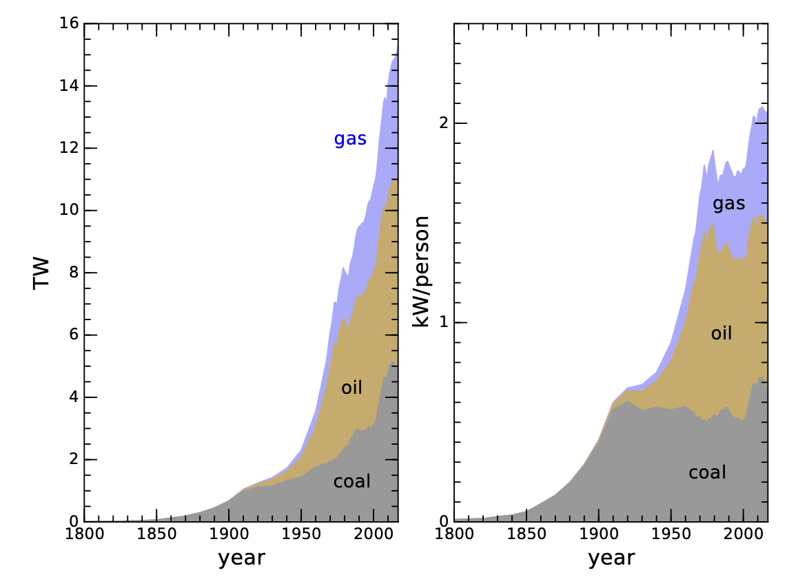
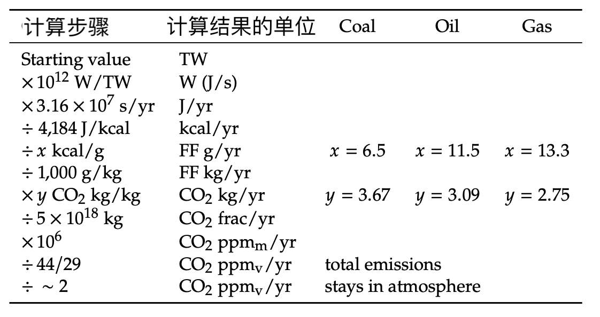
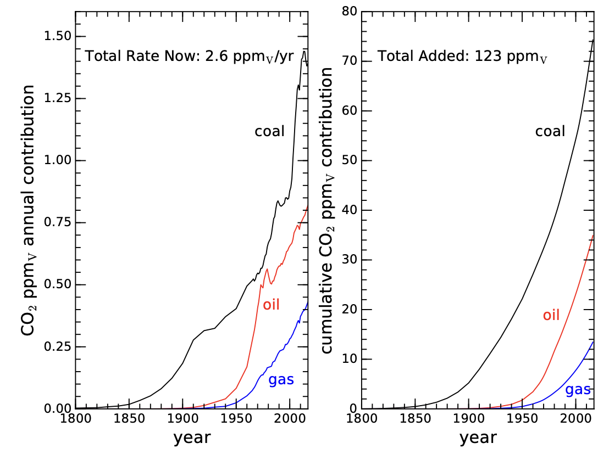
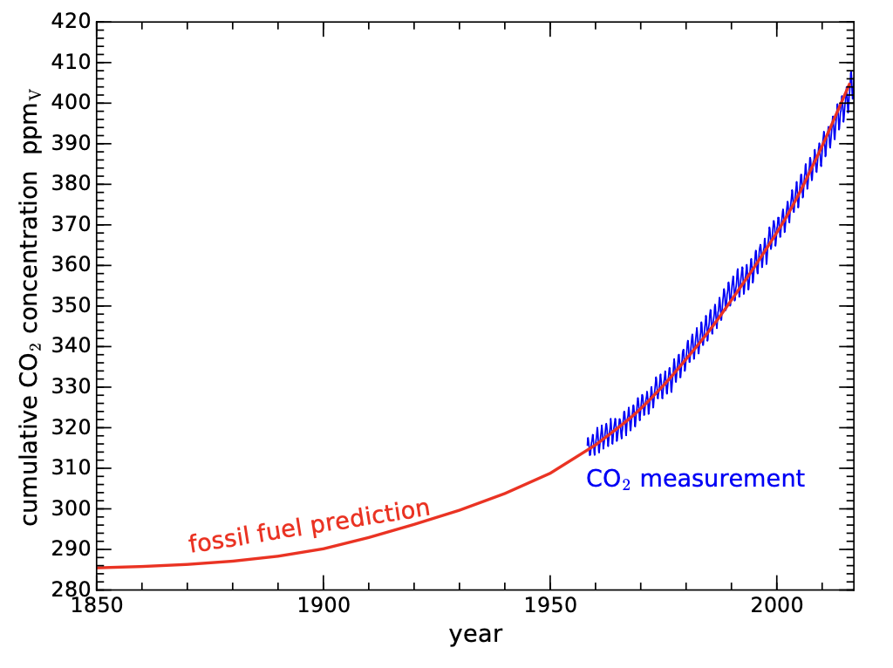
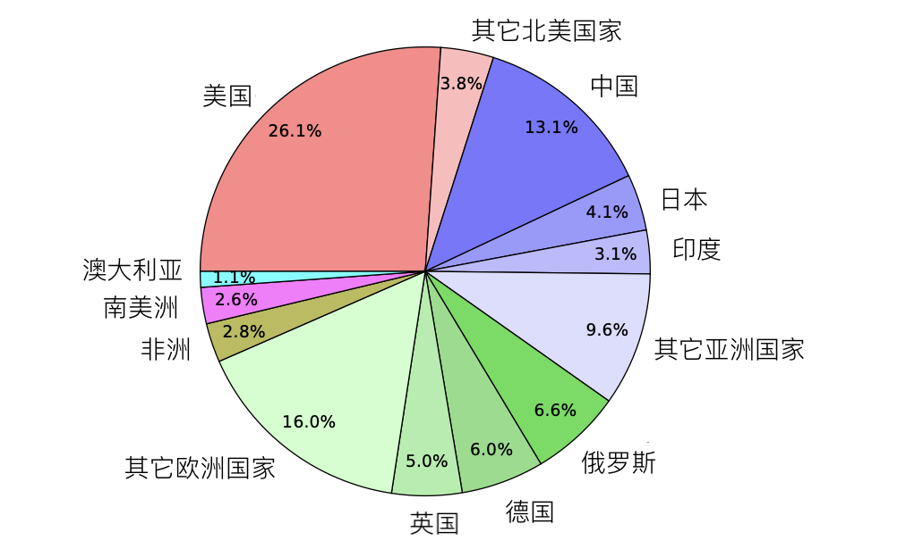
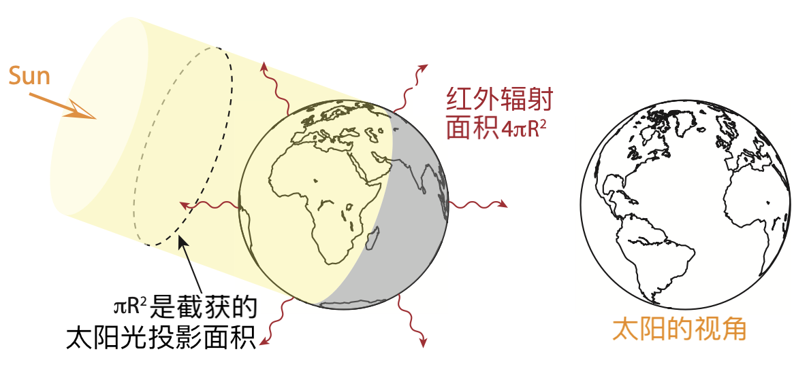
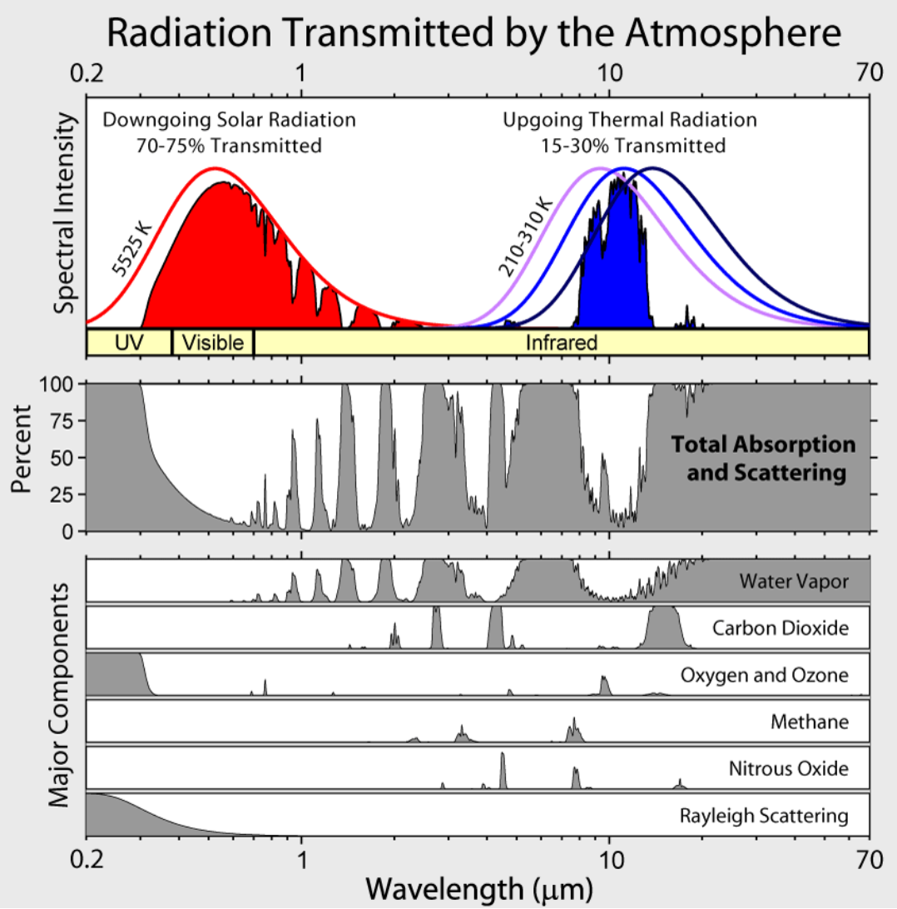
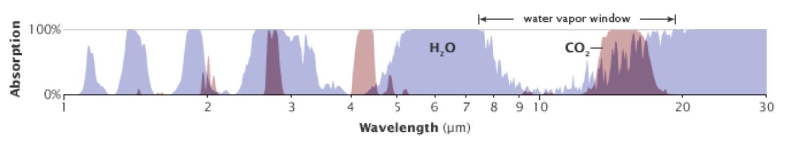
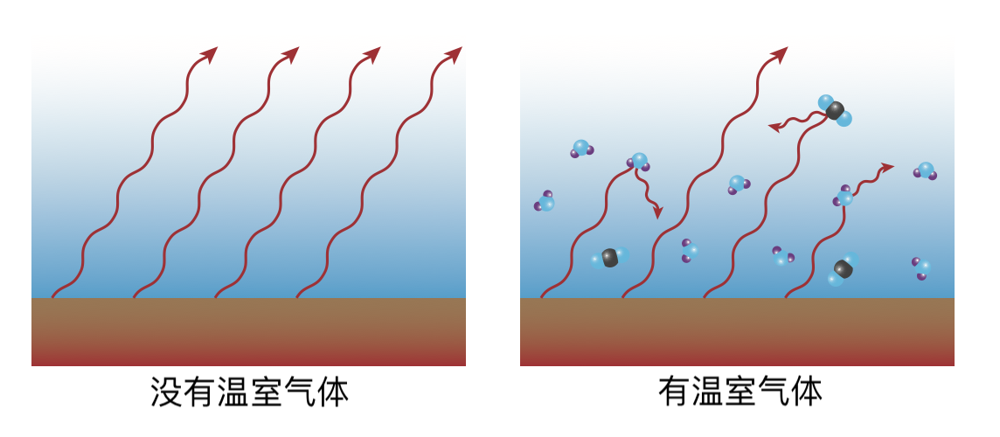

9 气候变化
===============

气候变化是我们对能源巨大的胃口引发的全球性问题中最大的一个，
是由燃烧化石燃料所产生的二氧化碳（CO\ :sub:`2`\ ）在大气中累积所造成的。
本章旨在对气候变化的科学基础进行实事求是的阐述，不给那些（成功得令人震惊的）虚假宣传留下任何余地，
这些宣传让这个问题看起来充满不确定性。虽然我们复杂的气候系统的\ **响应**\ 在细节上更难预测一些，
但其核心物理学原理是无可辩驳的。我们将看到，二氧化碳含量的上升并不神秘，就是源于化石燃料。
我们还将探讨几种情况，将二氧化碳的上升与温度变化的后果联系起来。

9.1 二氧化碳的来源
-------------------------

当今的气候变化主要是由于燃烧化石燃料导致大气中的 CO\ :sub:`2` 浓度增加造成的。

化学上的原理毫无争议（式 :ref:`8.1<eq8.1>`）：为获取能量而燃烧化石燃料的过程中，产生了  CO\ :sub:`2` 
和 H\ :sub:`2`\ O。表 9.1 扩展了第 8 章中介绍的化石燃料的属性，增加了 CO\ :sub:`2` 相关的信息。

.. csv-table:: **表 9.1:** 化石燃料的燃烧特性，增加了每克燃料和每兆焦耳输出能量对应的 CO\ :sub:`2` 排放量
  :name: tab9.1
  :class: booktabs
  :header: 燃料,典型化学式,摩尔质量,kJ/mol,kJ/g,kcal/g,CO\ :sub:`2` g/g,CO\ :sub:`2` g/MJ

  煤,C,12,393.5,32.8,7.8,3.67,172
  天然气,CH\ :sub:`4`,16,890.3,55.6,13.3,2.75,49
  石油,C\ :sub:`8`\ H\ :sub:`18`,114,5471,48.0,11.5,3.09,64

本章主要关注表 9.1 的最后两列：

1. 质量比：每克输入燃料产生多少克\ [#]_ CO\ :sub:`2` ；

2. 碳强度：每单位能量产生多少克 CO\ :sub:`2`。单位能量产生多少克 CO\ :sub:`2`。

.. [#] 也可以用其它质量/重量测量单位

可以看到，所有形式的化石燃料产生的 CO\ :sub:`2`，\ **其质量比都约为 3**，煤的能量密度较低、
质量比稍高\ [#]_ ，因此其碳强度是天然气的两倍多。

.. [#] 煤炭每克燃料产生的 CO\ :sub:`2` 更多，因为其他化石燃料含有氢元素，它不仅增加了能量释放，且不会形成 CO\ :sub:`2`。

.. _exp9.1.1:

  **示例 9.1.1:** 汽车每加满一箱汽油大约会产生多少 CO\ :sub:`2`？
  
  一个典型的油箱可装约 50 升汽油（13 加仑）。汽油的密度为 0.75 kg/L，因此一箱汽油的质量约为 38 kg。
  质量比使用便于计算的 3，我们可以得到，一箱汽油将产生大约 110 kg 的 CO\ :sub:`2`，这可不是一个小数目！

9.1.1 测量的 CO\ :sub:`2`
++++++++++++++++++++++++++++++++

从 1958 年开始，斯克里普斯（Scripps）海洋研究所的 Dave Keeling 在太平洋中部\ [#]_ 的莫纳罗亚山
（Mauna Loa）山顶记录大气中的 CO\ :sub:`2` 浓度。除了看到由于光合作用\ [#]_ 的季节性变化，
导致 CO\ :sub:`2` 浓度每年都有周期性变化，他还发现 CO\ :sub:`2` 浓度在逐年稳定上升。
这种测量一直持续到现在，它被称为「基林（Keeling）曲线」，如图 9.1 所示。

.. [#] 远离大陆的影响
.. [#] 植物在叶片生长和死亡的过程中，会季节性地吸收和释放二氧化碳。

  **图 9.1:** 蓝色曲线（左轴）是过去 60 年中在夏威夷 Mauna Loa 测量的 CO\ :sub:`2` 含量，
  显示出持续的加速上升的趋势，目前每年上升约 2.6 ppm\ :sub:`v` :cite:`c50`。在这一趋势的基础上，
  还可以看到光合作用引起的季节性变化。工业化前的水平约为 280 ppm\ :sub:`v`，
  我们人为增加了约 130 ppm。红点（右轴）显示了同期的全球平均温度\ :cite:`c51`。目前，全球平均温度已升高 1°C。
  请注意，1997 年的《京都议定书》和 2015 年的《巴黎协定》（方框 19.4）并未明显遏制 CO\ :sub:`2` 排放的上升轨迹。

刚开始测量时，大气中的 CO\ :sub:`2` 含量按体积算不到百万分之 320（ppm\ :sub:`v`），即小于 0.032%。
而现在，我们已经超过了 410 ppm\ :sub:`v`。

地球两极等极寒区域历史悠久的冰盖中，会留存几十万年前冻结其中的微小气泡，
对格陵兰冰盖中约 10 万年前和南极冰盖中 80 万年前的气泡的测量表明，
CO\ :sub:`2` 含量在 180-280 ppm\ :sub:`v` 之间波动，在冰期之间的温暖时期（间冰期）达到较高水平。
至少在化石燃料时代之前的一千年里，CO\ :sub:`2` 稳定在 280 ppm\ :sub:`v` 左右。

9.1.2 预测的 CO\ :sub:`2` 
++++++++++++++++++++++++++++++++

  **图 9.2:** 全球化石燃料的历史使用量，与图 8.2 相同\ :cite:`c16`。左边是以 TW 为单位的总使用量，
  右边是人均使用量。三种化石燃料相互累加，因此天然气的贡献最小，而不是最大。例如，在左侧面板的右边缘，
  煤炭从 0 到 5 TW，石油从 5 到 11（因此 6 TW 来自石油），天然气从 11 到 15，表明 4 TW 来自天然气。
  左侧面板清楚地表明，化石燃料的使用量仍在急剧上升，因此二氧化碳排放量也在上升。

我们在图 8.2（这里再放一次，图 9.2）中看到了全球化石燃料（煤炭、石油和天然气）的使用历史。同时，
表 9.1 给出了每种燃料每千克或每焦耳的 CO\ :sub:`2` 排放量。将这两部分结合起来，
就可以估算出全球 CO\ :sub:`2` 的历史排放量。表 9.2 和方框 9.1 说明了如何从图 9.2 的化石燃料使用量
（TW）估算大气中的 CO\ :sub:`2` 浓度。

.. _box9.1:

.. admonition:: Box 9.1: 根据 TW 计算 CO\ :sub:`2` ppm\ :sub:`v`

  我们以石油为例。在图 9.2 中，我们似乎从石油中获得了约 6 TW 的能量（煤炭 5 TW，天然气 4 TW）。
  乘以 10\ :sup:`12` 将单位换成 W（J/s），再乘以每年 3.156 × 10\ :sup:`7` 秒，
  得出全球每年从石油中获得的能量：1.9 × 10\ :sup:`20` J/yr。表 9.1 中，石油的热量约为 11.5 kcal/g，
  因此还需要将 J 换算成 kcal（除以 4184），可得出每年使用 4.5 × 10\ :sup:`16` kcal，
  因此每年使用 3.9 × 10\ :sup:`15` g 石油，或每年使用 3.9 × 10\ :sup:`12` kg 石油\ [#]_ 。
  表 9.1 显示，每燃烧 1 kg 石油产生 3.09 kg CO\ :sub:`2`，
  即石油产生的 CO\ :sub:`2` 为 1.2 × 10\ :sup:`13` kg/yr。不出意外地，
  用表 9.1 中的 64 g/MJ 2 和 1.9 × 10\ :sup:`14` MJ/yr 可得出相同的答案。
  最后，将单位转换为 ppm 的工作在正文和表 9.2 的下半部分给出。

.. [#] 以每桶 120 kg 来算，这就是每年 300 亿桶石油，可以用这个检验一下我们的计算。

  **表 9.2:** 将 TW 换算成 CO\ :sub:`2` ppm\ :sub:`v` 的步骤。FF 指化石燃料，
  可以是煤、石油或天然气，每种燃料使用右侧对应的数值分别计算。

大气的总质量约为 5 × 10\ :sup:`18` kg，是用每平方米面积上的 10,000 kg 空气\ [#]_
乘以地球表面积 4𝜋𝑅\ :sub:`⊕`\ :sup:`2` 所得。将石油产生的 1.2 × 10\ :sup:`13` kg 二氧化碳除以大气的质量，
得出 2.4 × 10\ :sup:`-6`，即百万分之 2.4。坚持住，我们就要完成计算了。
我们计算的数量是按质量计算的百万分之一（ppm\ :sub:`m`），而不是传统的按体积计算的百万分之一（ppm\ :sub:`v`）。
由于空气的摩尔质量\ [#]_ 平均为 29 g/mol，而 CO\ :sub:`2` 为 44 g/mol，
因此 CO\ :sub:`2` 的质量浓度比空气中的体积浓度高出 44/29 倍，即 1.52 倍。因此，
我们将 2.4 ppm\ :sub:`m` 的结果除以 1.52，得到 1.6 ppm\ :sub:`v`。最后的修正是，
只有约一半的 CO\ :sub:`2` 会留在大气中，因此现在我们每年从石油中向大气中排放 0.8 ppm\ :sub:`v`。

.. [#] 将 101,325 Pa 的标准大气压除以 𝑔 ≈ 9.8 m/s，得出的结果与实际值非常接近。
.. [#] 空气中约有 75% 的 N\ :sub:`2`\ （28 g/mol），25% 的 O\ :sub:`2`\ （32 g/mol）。

图 9.3 分别以年排放增长量和累计排放量的形式显示了最终的计算结果。我们发现，
尽管目前石油和煤炭每年提供的能量大致相同，但煤炭的碳排放要高得多\ [#]_ 。
事实上，从图 9.3 左侧面板中的黑色曲线一直高于其他两条曲线就可以看出，煤炭一直是最主要的 CO\ :sub:`2` 来源。
总之，估算的结果让我们看到，CO\ :sub:`2` 水平每年上升 2.6 ppm\ :sub:`v`，
其中一半多一点是煤炭造成的（1.4 ppm\ :sub:`v`/yr）。

.. [#] 既然煤炭是最糟糕的燃料，为什么我们还要继续使用呢？因为更换基础设施非常昂贵，
   而且化石燃料的开采不像银行账户那样可以任意提取。即使每个人都想──但他们并不想──
   我们也不可能突然改用其它燃料，且可以继续满足所有需求。

将随着时间而不断上升的排放量相加，按照这种估算方法，我们已经使大气中的 CO\ :sub:`2` 增加了 123 ppm\ :sub:`v`\ [#]_ ，
其中 75 ppm\ :sub:`v`\ （61%）归因于煤炭（图 9.3 右侧面板）。

.. [#] 非常接近 130 ppm\ :sub:`v` 的观测值了！

  **图 9.3:** 消耗化石燃料产生的 CO\ :sub:`2` 历史排放。根据化学性质估算，
  并假定 CO\ :sub:`2` 有一半留在大气中，另一半被海洋和陆地吸收。单位为百万分之一体积。
  左侧面板显示的是年增加量，目前是每年增加 2.6 ppm\ :sub:`v`，与图 9.1 中的斜率一致。
  右侧面板是迄今为止的累积排放量，基本上是将左侧面板中的所有年排放量相加。
  这些曲线不像图 9.2 中那样堆叠在一起，因此每条曲线都可以直接从纵轴上读数。请注意，
  在左侧面板中，石油和天然气的排放量仍在上升，即我们每年的 CO\ :sub:`2` 排放量都比前一年多。

如图 9.4 所示，将图 9.3 右侧面板中的三项相加，并将结果绘制在基林曲线\ [#]_ 之上，
我们会发现它们几乎完美重叠。

.. [#] 即实际的 CO\ :sub:`2` 测量结果。

  **图 9.4:** 化石燃料对 CO\ :sub:`2` 的贡献（红色）与二氧化碳测量值（蓝色）的对比。
  红色曲线的起点为 285 ppm\ :sub:`v`，49% 的二氧化碳排放停留在大气中。重合度非常好，令人信服。

根据化石燃料的使用量计算出的曲线与基林曲线如出一辙，因此，大气中过量的 CO\ :sub:`2` 从何而来并不神秘。
化石燃料的化学性质和历史使用情况并无争议。化石燃料燃烧产生的 CO\ :sub:`2` 有多少留在大气中，
有多少被海洋和其他「碳汇」吸收，这才是唯一的「猫腻」。根据经验，大约有一半留在大气中，
其余的则消失在海洋中\ [#]_ ，以及埋入地下的植物质中。如果不了解海洋和陆地的吸收机制，
我们就会将化石燃料产生的 CO\ :sub:`2` 高估两倍（见方框 9.2）。

.. [#] 因而使海洋酸化。

.. _box9.2:

.. admonition:: Box 9.2: 如果我们忽略海洋

  如果不对海洋和陆地的吸收进行校正，我们会得出什么结论？
  基于化石燃料定量计算的 CO\ :sub:`2` 含量上升没有任何问题，
  但我们会问为什么在实际测量数据上没有看到更大的上升。
  换句话说，要解释 CO\ :sub:`2` 过量的原因并不困难，更谈不上神秘。
  如果 CO\ :sub:`2` 的增加不是人类造成的\ [#]_ ，那么我们将面临一个真正的谜团：
  燃烧化石燃料所排放的 CO\ :sub:`2` 究竟去哪了？

.. [#] 通过燃烧化石燃料。

.. margin::

  .. csv-table:: **表 9.3:** 主要的 CO\ :sub:`2`\ 排放国，2018
    :name: tab9.3
    :class: booktabs
    :header: 国家,十亿吨/年,百分比

    中国,9.43,27.8
    美国,5.15,15.2
    印度,2.48,7.3
    俄罗斯,1.55,4.6
    日本,1.15,3.4
    德国,0.73,2.1
    前6国总计,20.49,60.4
    全球总计,34,100

9.1.3 CO\ :sub:`2` 的主要来源
++++++++++++++++++++++++++++++++

气候变化是一种全球现象。即使所有排放都来自一个国家或地区，大气环流也会将结果扩散到全球各地
──尽管穿越赤道的速度较慢。因此，这是一个全球性问题。但尽管如此，对主要排放者进行研究还是很有意义的。

  **图 9.5:** 迄今为止对 CO\ :sub:`2` 排放的累计贡献，按主要国家分组。主要来源国被明确列出，
  各大洲的其余国家被归入「其他」类别\ :cite:`c52`。

图 9.5 显示，美国是对累计 CO\ :sub:`2` 排放量承担最大责任的单一国家，
大约是第二大国家（中国）的两倍\ :cite:`c52`。目前，中国是最大的 CO\ :sub:`2` 排放国，
每年排放 9.4 Gt，而美国位居第二，每年排放 5.15 Gt。表 9.3 列出了排在最前的六大排放国，
它们合计约占每年 34 Gt 排放量的 60% :cite:`c53`。

9.2 升温机制
-------------------------

不可否认，我们大气中存在的过量 CO\ :sub:`2` 来自化石燃料的使用。但这又如何改变我们的气候呢？
大气中如此微小的成分（现在为 0.04%）怎么会造成如此大的麻烦？\ [*]_\ 
答案就在\ :term:`红外辐射<infrared radiation>` 中\ :cite:`c54`。
回顾一下\ :ref:`第 1.3 节<1.3 热动力学后果>`\ 的内容，这是能量离开地球的机制，
其功率受\ :term:`斯蒂芬-玻尔兹曼定律<Stefan-Boltzmann law>`
𝑃 = 𝐴\ :sub:`surf`\ 𝜎𝑇\ :sup:`4` 支配，
其中斯蒂芬-玻尔兹曼常数\ [#]_  𝜎 = 5.67 × 10\ :sup:`-8` W/m\ :sup:`2`/K\ :sup:`4` ，
而 𝑇 是辐射表面的温度（单位是 K）。

.. [*] {-} :cite:`c54` Pierrehumbert (2011), “Infrared radiation and planetary temperature”
.. [#] 速记法：5-6-7-8

  **图 9.6:** 地球截获的阳光在地球的投影面积（𝜋𝑅\ :sup:`2`）上，而整个表面辐射的面积是其四倍（4𝜋𝑅\ :sup:`2`）。

太阳以 1360 W/m\ :sup:`2` 的功率\ [#]_ 向地球大气层顶部输送能量。其中约 30% 的光──
准确地说是 29.3%──立即被云、雪反射，其次是被水和地形反射。剩下 70.7% 的光会在一个面积为
𝐴\ :sub:`proj` = 𝜋𝑅\ :sub:`⊕`\ :sup:`2` 的投影圆中被地球拦截（图 9.6）。但是，地球的总表面积是这个数字的四倍，
所有的地球表面都在向太空进行红外辐射。在完全平衡\ [#]_ 的情况下，吸收的能量等于辐射的能量：

.. _eq9.1:

.. math:: 0.707 \times 1360 W/m^2 \times 𝜋𝑅^2 = 4𝜋𝑅_⊕^2 \sigma 𝑇^4. \tag{9.1}

.. [#] 这被称为\ :term:`太阳常数<solar constant>`\ :cite:`c4`，将在第 10 章和第 13 章中再次出现。
.. [#] 不平衡意味着能量在累积或流失，导致变暖或变冷。即使在目前的条件下，距离平衡态也在 1 W/m\ :sup:`2` 以内。

𝜋𝑅\ :sub:`⊕`\ :sup:`2` 相抵消，整理得到温度：

.. _eq9.2:

.. math:: T^4=\frac{0.707 \times 1360 W/m^2}{4\sigma}, \tag{9.2}

计算得到 𝑇 ≈ 255 K 或 -18°C（约 0°F）。这比我们实际观测到的地球平均温度，即 288 K（15°C；59°F）
低约 33°C，这 33°C 的差异\ [#]_ 是由于温室气体──主要是 H\ :sub:`2`\ O──影响了热平衡，
阻止了大部分辐射从地球直接逃逸到太空。

.. [#] 地球上的生命适应并依赖于这 33°C 的温室效应。突然改变它会造成问题。

科学界已经非常了解这一机制了。在 288 K 的温度下，表面辐射发射的峰值波长\ [#]_ 约为 10 𝜇m。
大气并非在所有波长上都是透明的，其各种吸收特征如图 9.7 所示。
图中右上方的蓝色曲线是红外辐射的发射光谱。

.. [#] 我们将在\ :ref:`第 13.2 节<13.2 普朗克谱>`\ 中看到这是如何得到的（式 13.5）。

  **图 9.7:** 大气的透射/吸收光谱\ :cite:`c55`。顶部面板中红色是太阳的输入，
  蓝色是红外（热）辐射的输出。平滑曲线是对应太阳和地球温度的理论\ :term:`黑体<blackbody>`\ :term:`普朗克光谱<Planck spectrum>`。
  其中，红色曲线代表到达地球大气层顶部的阳光的谱分布，而红色填充部分则是到达地面后的谱分布。
  蓝色曲线（三个曲线中间的那个）是来自地面的辐射，但只有一小部分（蓝色填充区域）直接穿过大气层，
  其余部分被温室气体吸收了。下面的几个面板详细说明了光线被吸收或散射的谱分布位置。
  灰色区域表示吸收和散射，白色部分可视为透射部分──通常称为「窗口」。
  在总吸收下面的面板中列出了主要的贡献者（温室气体）。请注意，臭氧可以阻挡紫外线（UV），
  而瑞利散射则可以有效地散射来自太阳的蓝光，从而使天空呈现蓝色（蓝色位于「可见光」波段的左侧，
  而红色则位于右侧）。本图由 Robert Rohde 制作。

如图 9.7 所示，在有助于吸收热量的温室气体中，水蒸气占主导地位，其次是二氧化碳。请注意，
图中的蓝色填充部分\ [#]_ 与下面总吸收率图中的白色部分相对应\ [#]_ ，该「窗口」主要是水蒸气的作用。但是，
水汽窗口右侧──波长较长的一侧，被二氧化碳吸收谱的一部分盖住了，这在图 9.8 中看得更清楚。
图 9.7 中蓝色填充部分右侧的尖锐截止点，就是二氧化碳吸收造成的。随着大气中二氧化碳浓度的增加，
这一吸收特征会变得更宽，从而更深地切入逃逸辐射（蓝色填充部分）的右侧边缘，使逃逸辐射减少。

.. [#] 表示逃逸进太空的红外辐射
.. [#] 于是这个白色部分就是一个打开的「窗口」。

  **图 9.8:** 水和二氧化碳吸收光谱的另一个视图，更好地显示了两者在 10 𝜇m 窗口中的重叠部分。
  来自 Robert Rohde (NASA)。

.. margin::

  .. csv-table:: **表 9.4:** 温室气体的升温贡献\ :cite:`c56`
    :name: tab9.4
    :class: booktabs
    :header: 分子,Δ𝑇(°C)

    H\ :sub:`2`\ O,20
    CO\ :sub:`2` ,8.6
    O\ :sub:`3`\ （臭氧）,2.6
    CH\ :sub:`4`\ （甲烷）,1.5
    N\ :sub:`2`\ O（一氧化二氮）,0.5
    总计,33

如果有一部分红外辐射没有逃逸到太空中，而是被大气层吸收，那么整个星球就不能有效降温，
从而在式 9.2 中增加了一些偏移量──地球的情况是 33°C。在这 33 °C中，水蒸气的作用占 20°C，
二氧化碳占 8°C，剩下的 5°C 由臭氧、甲烷和其他次要因素造成（表 9.4）。另外，作为温室气体，
甲烷（CH\ :sub:`4`）的强度是等量  CO\ :sub:`2` 的 80 倍，其在大气中的浓度低于  CO\ :sub:`2`，
在大气中的停留时间也比较短（会被化学反应破坏）\ [#]_ 。我们之所以关注二氧化碳，
是因为人类活动──通过燃烧化石燃料──正在迅速改变二氧化碳的浓度。
广阔的海洋-空气界面意味着水的浓度是无法控制的，由于温暖的空气中含有更多的水分，
大气中水的浓度会简单地对温度做出反应，成为一个重要的反馈因子。水不是气候变化的驱动力，
但却是一个不能忽视的重要因素。

.. [#] 但由于钻井泄漏和永久冻土融化释放，甲烷排放的影响变得非常重要。

  **图 9.9:** 在没有温室气体的情况下，红外辐射不难逃逸到太空中（左图）。
  当存在温室气体时（右图），大部分红外辐射被温室气体分子吸收。
  这些分子随后会将吸收的能量作为新的红外辐射释放出来，但释放的方向是随机的，
  这样就会有一些能量返回到地面，从而使地表保持比没有温室气体时更高的温度。

天真地计算一下，从 280 ppm\ :sub:`v` 升至 420ppm\ :sub:`v`\ （增加 1.5 倍），
可能会将二氧化碳产生的 8.6°C 温室效应转化为 12.9°C（乘以1.5），增加的 4.3°C 就是人为的变暖效应\ [#]_ 。
但是，二氧化碳在 15 𝜇m 处的吸收已经饱和，因此随着二氧化碳的增加，吸收谱会变宽，
但它是二氧化碳浓度的对数函数，而不是线性函数。气候科学家通常用\ :term:`辐射强迫<radiative forcing>`\ 来表示各种因素的影响，
单位为 W/m\ :sup:`2`。

.. [#] 实际肯定不是这么计算的。

.. _def9.2.1:

  **定义 9.2.1:** 辐射强迫（:term:`radiative forcing`）用于描述太阳和红外辐射在单位面积上的功率（单位：W/m\ :sup:`2`）。
  各种影响因素或成分产生各自的辐射强迫。在平衡状态下，净\ [#]_ 辐射强迫为零。

.. [#] 加总所有正项和负项。

平均太阳强迫为：

.. _eq9.3:

.. math:: RF_\odot=1360 W/m^2 \times 0.707/4 \approx 240 W/m^2, \tag{9.3}

各项的含义在介绍式 9.2 时已经解释过了。考虑工业化前温室气体水平，我们可以求解温度\ [#]_ 为

.. _eq9.4:

.. math:: T=(\frac{RF_\odot}{\sigma})^{0.25}+33, \tag{9.4}

.. [#] 需要加上基准温室气体带来的 33°C

是 288 K，或约 15°C。如果我们增加（或减少）其他来源的辐射强迫，那就会增加（或减少）式 9.4 中的分子项。
在原始数量（CO\ :sub:`2,orig` = 280 ppm\ :sub:`v`）的基础上增加二氧化碳含量，产生的辐射强迫为：

.. _eq9.5:

.. math:: RF_{CO_2}=5.35ln(\frac{CO_2}{CO_{2,orig}}) W/m^2, \tag{9.5}

其中 ln() 是自然对数函数\ [#]_ 。我们目前的二氧化碳约 420 ppm\ :sub:`v` 计算其辐射强迫约 2.2 W/m\ :sup:`2`，
那么新的平衡温度是：

.. _eq9.6:

.. math:: T=(\frac{RF_\odot+RF_{CO_2}}{\sigma})^{0.25}+33 \approx 288.6, \tag{9.6}

.. [#] 反映了图 9.7 中二氧化碳吸收谱 15 𝜇m 处呈对数加宽的情况

比二氧化碳含量增加之前大约高了 0.6°C。我们可以把这个理解为温度变化敏感性：在给定的不平衡的辐射强迫条件下，
温度变化 Δ𝑇 是多少？在这里，2.2 W/m\ :sup:`2` 增加了 0.6°C，相当于每 W/m\ :sup:`2` 增加了 0.27°C。
但是，如果将已知的反馈机制包括在内──其中大部分是正反馈机制──每增加 1 W/m\ :sup:`2` 的辐射强迫，
温度会增加 0.8°C，这个就是\ :term:`气候敏感性参数<climate sensitivity parameter>`\ [#]_ 。

.. [#] 参见\ :cite:`c57`，其中有很好的概述和参考资料。

.. _def9.2.2:

  **定义 9.2.2:** 气候敏感性参数把辐射强迫与预期变暖程度定量地联系起来。根据目前的研究，
  每 W/m\ :sup:`2` 辐射强迫可导致 0.8°C 的升温。

因此，目前 2.2 W/m\ :sup:`2` 的额外（化石燃料增加的）辐射强迫\ [#]_ 带来 1.7°C 的温度升高（图 9.10），
这大约是前面不考虑反馈机制情况的三倍。

.. [#] 就是把 2.2 W/m\ :sup:`2` 乘以 0.8°C/(W/m\ :sup:`2` )

.. margin::

  .. figure:: ../images/fig9-10.png
    :name: fig9.10

    **图 9.10:** 随着二氧化碳浓度的增加，辐射强迫（左轴）增加，推动温度（右轴）上升。
    我们现在的二氧化碳浓度为 420 ppm\ :sub:`v`，对应的辐射强迫为 2.2 W/m\ :sub:`2`，
    最终温度上升 1.7°C（图中红色星标）。目前，温度只上升了 1.0°C（红点），等到海洋变暖，冰雪融化，
    温度将达到新的平衡。

.. _exp9.2.1:

  **示例 9.2.1:** 如果将二氧化碳浓度从工业化前的水平增加一倍，预计气温会上升多少？

  工业化前的二氧化碳浓度为 280 ppm\ :sub:`v`，因此翻一番会增加 280 ppmppm\ :sub:`v`，
  总计为 560 ppm\ :sub:`v`。辐射强迫为 5.35ln(2) ≈ 3.7 W/m\ :sup:`2`。
  再乘以每 W/m\ :sup:`2` 0.8 °C 的气候敏感性参数，就可以得出温度上升约 3.0°C
  （如果反馈机制，则为 1°C）。

正反馈机制非常重要，有以下因素：

1. 地球变暖意味着冰（冰川、北极冰盖）减少，导致反射的太阳光减少，从而增加式 9.3 中的吸收因子（0.707），
   增加太阳强迫。

2. 变暖的空气可以容纳更多的水蒸气──主要的温室气体，从而增加基准情况下的 33°C 温室气体贡献。

3. 环境变暖会导致森林干枯、荒漠化，加速植物质和泥炭的分解，造成更多的二氧化碳流失到大气中。

此外，还存在一些负反馈机制\ [#]_ ，但与正反馈相比，这些机制的作用要小得多。

.. [#] 目前而言，最重要的负反馈机制是红外辐射本身，它随着温度的升高而急剧增加（因为 𝑇\ :sub:`4`），
   通过更多的向外辐射热量来对抗温度的升高。但是这里说的负反馈，指的是除这一主要因素之外的影响机制。

全球气温已上升约 1.0°C :cite:`c58`。\ [*]_\ 请注意，即使我们不再向大气中多增加哪怕一个二氧化碳分子，
随着海洋\ [#]_ 慢慢达到新的平衡，温度也会继续上升。根据上述计算，我们预计在今天二氧化碳过量的情况下，
温度将在升高 1.7°C 左右稳定。因此，温度爬升已经完成了大约 55%。当然，还会增加更多的二氧化碳，
因此最终的气温升幅注定会更高。

.. [*] {-} :cite:`c58`\ ：National Oceanic and Atmospheric Administration (NOAA) (2019), Global Climate Report
.. [#] 海洋具有很大的热容量

9.3 可能的轨迹
-------------------------

从生成图 9.3 所用的数据出发，我们现在可以做一些假设，以了解在各种假想情况下，到 2100 年二氧化碳总量的上升和相应的 Δ𝑇 的增加会给我们的未来带来什么。

9.4 气候变化的后果
-------------------------

调高地球上的恒温器会产生太多影响，在此无法一一列举。显然，气候受到了影响--风暴频率和强度、降雨量、降雪量和供水量、季节持续时间，以及动植物物种适应变化的能力。我们改变气候的时间尺度远远超过了进化所能追踪的速度，除了微生物生命和昆虫，它们较短的世代更替允许作出更动态的反应。人类是漫长进化序列中的姗姗来迟者，进化序列以复杂的相互关联的方式为我们的生活奠定了基础，而我们还没有完全理解这些复杂的相互关联的方式。气候变化扰乱了这个系统，使我们无法准确预测一个或另一个物种从生命之网中消失的长期后果。

气候变化的后果在许多资料中都有详细阐述，不难找到。本着本书的精神，本节不是试图增加人们的普遍认识，而是旨在为学生提供一些工具，使他们能够定量地理解物理世界是如何对辐射强迫的变化做出反应的。具体来说，我们将集中讨论地球元素的升温过程和海平面的上升。

9.4.1 升温
++++++++++++++++

9.4.2 加热地球表面
+++++++++++++++++++++++++

9.4.3 海平面上升
+++++++++++++++++++++++++

9.5 我们能做些什么？
-------------------------

到目前为止，我们简要介绍了为什么气候变化现象是人类使用化石燃料所造成的，还没有谈及我们可以做些什么来应对气候变化。
在本节中，作者不会试图掩盖他对这一问题的个人看法，只是将尽量简短。

首先，巧妙的地球工程想法充满了狂妄自大的气息，似乎就像在坠落前挖一个足够快的洞来解决急速坠落的问题。
我们的整个问题在于，我们让自己相信，我们可以胜过大自然\ [#]_ 。这些不过是治标不治本罢了。

其实，根本原因非常简单：人类不受约束的野心\ [#]_ 。化石燃料、不断增长的追求、对森林和栖息地的破坏\ [#]_ 、
人口压力以及工业化的农业生产方式都是原因之一。这就是为什么它难以消除，根本原因是我们自己。
它充斥着我们所做的一切。我们是自己的对手。我们如何与自己作斗争？要做到这一点，需要诚实，
甚至需要集体的自愿牺牲并优先考虑地球的健康，而不是狭隘的短期人类利益。什么更重要？
是个人现在就试图实现他们所有的梦想，还是文明的长期延续？我们是否愿意收回自己的欲望，
让未来数十亿我们永远不会见面的人类和地球上无数其他物种也能享受生活？作为一个全球性的整体，
我们从未有过如此艰难的抉择，因此很难说智人能否做到这一点。

本书的最后几章，从第 18 章开始，讨论了造成我们的前景的人为因素，最后在第 20 章讨论了个人层面的应对策略。
这不是地球工程，但如果被广泛采用，个人行为改变导致的减排会产生巨大影响。

.. [#] 附录 D.6 对此有进一步讨论。
.. [#] 大自然刚刚打来电话，留下了这个神秘的信息「将军」。这是作者的文字梗，不受约束（unchecked），将军（check）。
.. [#] 消除碳汇，降低大自然的适应能力。

9.6 总结：气候变化问题十分严重
------------------------------------

尽管我们可以轻而易举地证明测量到的二氧化碳来自化石燃料，而且面对温室气体，温度均衡的物理学原理也很简单，
但令人震惊的是，我们并没有完全接受现实。也许这并不奇怪。气候变化是对某些经济和政治意识形态的明显冒犯，
这些意识形态希望我们让市场决定我们的道路，而不承担任何后果。但是，否认并坚持按照过去的方式行事，
并不是我们最明智的选择。气候变化清楚地表明，我们不能只做最赚钱的事。化石燃料的替代品既昂贵又不方便。
气候变化不利于商业发展，也对资本主义构成威胁，因为它限制了我们的雄心壮志。
难怪美国一直是最不愿意接受气候变化现实的国家之一，因为美国是最引以为豪的资本主义国家，
拥有巨大的人均能源需求，在过去的历史中对全球二氧化碳排放的贡献最大（:ref:`图 9.5<fig9.5>`）。

尽管气候变化是真实存在的，但它是否对人类文明的生存构成威胁却不那么明确\ [#]_ 。
适应气候变化的代价可能会很高\ [#]_ ，就人类的时间尺度而言，这些变化是渐进的，
可能是可控的──尽管绝对不是多么有趣的。

.. [#] 是世界末日，亦或只是非常痛苦？
.. [#] 放弃一些沿海地区，远离无法生存的气候区，减少人口以应对农业资源的减少，
   适应被剥夺了一些物种的新生态系统。

然而，资源\ [#]_ 中断会使市场陷入自由落体，刺激全球军事行动，可能在更短的时间内造成更大的破坏。
我们正在进行一场竞赛，看看哪种方案能在最快的时间内造成最大的问题。
如果幸运的话，第三种选择会出现，而不会带来如此大的困难。但请记住，
人类社会是一个高度非线性的结构，它可能会以比物理学控制的气候变化发展更快的速度变得面目全非。

.. [#] 比如能源、水、食品和矿产资源。

9.7 思考题
--------------------

（略）