9 气候变化
===============

气候变化是我们对能源巨大的胃口引发的全球性问题中最大的一个，
是由燃烧化石燃料所产生的二氧化碳（CO\ :sub:`2`\ ）在大气中累积所造成的。
本章旨在对气候变化的科学基础进行实事求是的阐述，不给那些（成功得令人震惊的）虚假宣传留下任何余地，
这些宣传让这个问题看起来充满不确定性。虽然我们复杂的气候系统的\ **响应**\ 在细节上更难预测一些，
但其核心物理学原理是无可辩驳的。我们将看到，二氧化碳含量的上升并不神秘，就是源于化石燃料。
我们还将探讨几种情况，将二氧化碳的上升与温度变化的后果联系起来。

9.1 二氧化碳的来源
-------------------------

当今的气候变化主要是由于燃烧化石燃料导致大气中的 CO\ :sub:`2` 浓度增加造成的。

化学上的原理毫无争议（式 :ref:`8.1<eq8.1>`）：为获取能量而燃烧化石燃料的过程中，产生了  CO\ :sub:`2` 
和 H\ :sub:`2`\ O。表 9.1 扩展了第 8 章中介绍的化石燃料的属性，增加了 CO\ :sub:`2` 相关的信息。

.. csv-table:: **表 9.1:** 化石燃料的燃烧特性，增加了每克燃料和每兆焦耳输出能量对应的 CO\ :sub:`2` 排放量
  :name: tab9.1
  :class: booktabs
  :header: 燃料,典型化学式,摩尔质量,kJ/mol,kJ/g,kcal/g,CO\ :sub:`2` g/g,CO\ :sub:`2` g/MJ

  煤,C,12,393.5,32.8,7.8,3.67,172
  天然气,CH\ :sub:`4`,16,890.3,55.6,13.3,2.75,49
  石油,C\ :sub:`8`\ H\ :sub:`18`,114,5471,48.0,11.5,3.09,64

本章主要关注表 9.1 的最后两列：

1. 质量比：每克输入燃料产生多少克\ [#]_\ CO\ :sub:`2` ；

2. 碳强度：每单位能量产生多少克 CO\ :sub:`2`。

.. [#] 也可以用其它质量/重量测量单位

可以看到，所有形式的化石燃料产生的 CO\ :sub:`2`，\ **其质量比都约为 3**，煤的能量密度较低、
质量比稍高\ [#]_\ ，因此其碳强度是天然气的两倍多。

.. [#] 煤炭每克燃料产生的 CO\ :sub:`2` 更多，因为其他化石燃料含有氢元素，它不仅增加了能量释放，且不会形成 CO\ :sub:`2`。

.. _exp9.1.1:

  **示例 9.1.1:** 汽车每加满一箱汽油大约会产生多少 CO\ :sub:`2`？
  
  一个典型的油箱可装约 50 升汽油（13 加仑）。汽油的密度为 0.75 kg/L，因此一箱汽油的质量约为 38 kg。
  质量比使用便于计算的 3，我们可以得到，一箱汽油将产生大约 110 kg 的 CO\ :sub:`2`，这可不是一个小数目！

9.1.1 测量的 CO\ :sub:`2`
++++++++++++++++++++++++++++++++

从 1958 年开始，斯克里普斯（Scripps）海洋研究所的 Dave Keeling 在太平洋中部\ [#]_\ 的莫纳罗亚山
（Mauna Loa）山顶记录大气中的 CO\ :sub:`2` 浓度。除了看到由于光合作用\ [#]_\ 的季节性变化，
导致 CO\ :sub:`2` 浓度每年都有周期性变化，他还发现 CO\ :sub:`2` 浓度在逐年稳定上升。
这种测量一直持续到现在，它被称为「基林（Keeling）曲线」，如图 9.1 所示。

.. [#] 远离大陆的影响
.. [#] 植物在叶片生长和死亡的过程中，会季节性地吸收和释放二氧化碳。

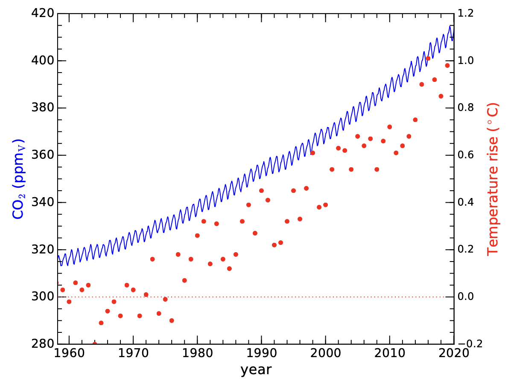

  **图 9.1:** 蓝色曲线（左轴）是过去 60 年中在夏威夷 Mauna Loa 测量的 CO\ :sub:`2` 含量，
  显示出持续的加速上升的趋势，目前每年上升约 2.6 ppm\ :sub:`v` :cite:`c50`。在这一趋势的基础上，
  还可以看到光合作用引起的季节性变化。工业化前的水平约为 280 ppm\ :sub:`v`，
  我们人为增加了约 130 ppm。红点（右轴）显示了同期的全球平均温度\ :cite:`c51`。目前，全球平均温度已升高 1°C。
  请注意，1997 年的《京都议定书》和 2015 年的《巴黎协定》（方框 19.4）并未明显遏制 CO\ :sub:`2` 排放的上升轨迹。

刚开始测量时，大气中的 CO\ :sub:`2` 含量按体积算不到百万分之 320（ppm\ :sub:`v`），即小于 0.032%。
而现在，我们已经超过了 410 ppm\ :sub:`v`。

地球两极等极寒区域历史悠久的冰盖中，会留存几十万年前冻结其中的微小气泡，
对格陵兰冰盖中约 10 万年前和南极冰盖中 80 万年前的气泡的测量表明，
CO\ :sub:`2` 含量在 180-280 ppm\ :sub:`v` 之间波动，在冰期之间的温暖时期（间冰期）达到较高水平。
至少在化石燃料时代之前的一千年里，CO\ :sub:`2` 稳定在 280 ppm\ :sub:`v` 左右。

9.1.2 预测的 CO\ :sub:`2` 
++++++++++++++++++++++++++++++++

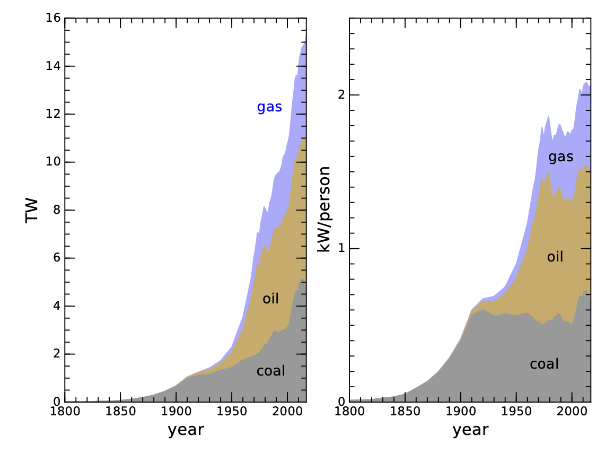

  **图 9.2:** 全球化石燃料的历史使用量，与图 8.2 相同\ :cite:`c16`。左边是以 TW 为单位的总使用量，
  右边是人均使用量。三种化石燃料相互累加，因此天然气的贡献最小，而不是最大。例如，在左侧面板的右边缘，
  煤炭从 0 到 5 TW，石油从 5 到 11（因此 6 TW 来自石油），天然气从 11 到 15，表明 4 TW 来自天然气。
  左侧面板清楚地表明，化石燃料的使用量仍在急剧上升，因此二氧化碳排放量也在上升。

我们在图 8.2（这里再放一次，图 9.2）中看到了全球化石燃料（煤炭、石油和天然气）的使用历史。同时，
表 9.1 给出了每种燃料每千克或每焦耳的 CO\ :sub:`2` 排放量。将这两部分结合起来，
就可以估算出全球 CO\ :sub:`2` 的历史排放量。表 9.2 和方框 9.1 说明了如何从图 9.2 的化石燃料使用量
（TW）估算大气中的 CO\ :sub:`2` 浓度。

.. _box9.1:

.. admonition:: Box 9.1: 根据 TW 计算 CO\ :sub:`2` ppm\ :sub:`v`

  我们以石油为例。在图 9.2 中，我们似乎从石油中获得了约 6 TW 的能量（煤炭 5 TW，天然气 4 TW）。
  乘以 10\ :sup:`12` 将单位换成 W（J/s），再乘以每年 3.156 × 10\ :sup:`7` 秒，
  得出全球每年从石油中获得的能量：1.9 × 10\ :sup:`20` J/yr。表 9.1 中，石油的热量约为 11.5 kcal/g，
  因此还需要将 J 换算成 kcal（除以 4184），可得出每年使用 4.5 × 10\ :sup:`16` kcal，
  因此每年使用 3.9 × 10\ :sup:`15` g 石油，或每年使用 3.9 × 10\ :sup:`12` kg 石油\ [#]_\ 。
  表 9.1 显示，每燃烧 1 kg 石油产生 3.09 kg CO\ :sub:`2`，
  即石油产生的 CO\ :sub:`2` 为 1.2 × 10\ :sup:`13` kg/yr。不出意外地，
  用表 9.1 中的 64 g/MJ 和 1.9 × 10\ :sup:`14` MJ/yr 可得出相同的答案。
  最后，将单位转换为 :term:`ppm` 的计算在正文和表 9.2 的下半部分给出。

.. [#] 以每桶 120 kg 来算，这就是每年 300 亿桶石油，可以用这个检验一下我们的计算。

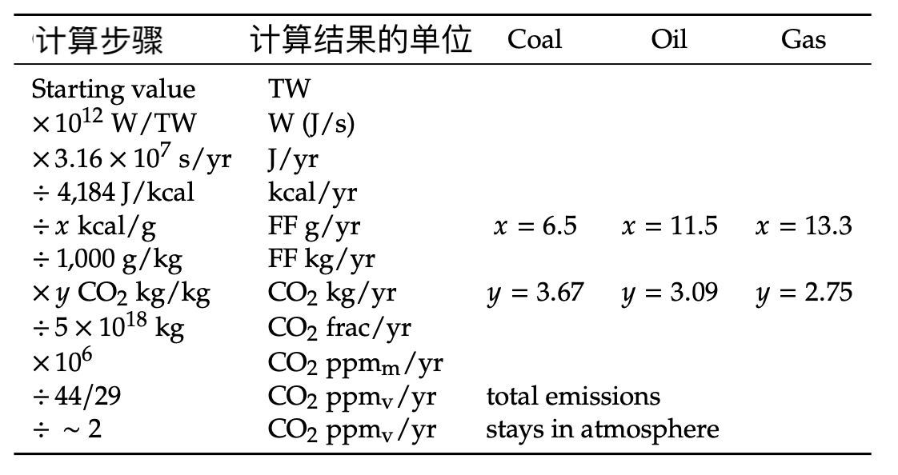

  **表 9.2:** 将 TW 换算成 CO\ :sub:`2` ppm\ :sub:`v` 的步骤。FF 指化石燃料，
  可以是煤、石油或天然气，每种燃料使用右侧对应的数值分别计算。

大气的总质量约为 5 × 10\ :sup:`18` kg，是用每平方米面积上的 10,000 kg 空气\ [#]_
乘以地球表面积 4𝜋𝑅\ :sub:`⊕`\ :sup:`2` 所得。将石油产生的 1.2 × 10\ :sup:`13` kg 二氧化碳除以大气的质量\ [#]_ ，
得出 2.4 × 10\ :sup:`-6`，即百万分之 2.4\ [#]_ 。坚持住，我们就要完成计算了。
我们计算的数量是按质量计算的百万分之一（ppm\ :sub:`m`），而不是传统的按体积计算的百万分之一（ppm\ :sub:`v`）。
由于空气的摩尔质量\ [#]_\ 平均为 29 g/mol，而 CO\ :sub:`2` 为 44 g/mol，
因此 CO\ :sub:`2` 的质量浓度比空气中的体积浓度高出 44/29 倍，即 1.52 倍。因此，
我们将 2.4 ppm\ :sub:`m` 的结果除以 1.52，得到 1.6 ppm\ :sub:`v`。最后的修正是，
只有约一半的 CO\ :sub:`2` 会留在大气中，因此现在我们每年从石油中向大气中排放 0.8 ppm\ :sub:`v`。

.. [#] 将 101,325 Pa 的标准大气压除以 𝑔 ≈ 9.8 m/s，得出的结果与实际值非常接近。
.. [#] 这是 Box 9.1 的计算结果。
.. [#] 乘以一百万，10\ :sup:`6`，就得到 :term:`ppm`。
.. [#] 空气中约有 75% 的 N\ :sub:`2`\ （28 g/mol），25% 的 O\ :sub:`2`\ （32 g/mol）。

图 9.3 分别以年排放增长量和累计排放量的形式显示了最终的计算结果。我们发现，
尽管目前石油和煤炭每年提供的能量大致相同，但煤炭的碳排放要高得多\ [#]_\ 。
事实上，从图 9.3 左侧面板中的黑色曲线一直高于其他两条曲线就可以看出，煤炭一直是最主要的 CO\ :sub:`2` 来源。
总之，估算的结果让我们看到，CO\ :sub:`2` 水平每年上升 2.6 ppm\ :sub:`v`，
其中一半多一点是煤炭造成的（1.4 ppm\ :sub:`v`/yr）。

.. [#] 既然煤炭是最糟糕的燃料，为什么我们还要继续使用呢？因为更换基础设施非常昂贵，
   而且化石燃料的开采不像银行账户那样可以任意提取。即使每个人都想──但他们并不想──
   我们也不可能突然改用其它燃料，且可以继续满足所有需求。

将随着时间而不断上升的排放量相加，按照这种估算方法，我们已经使大气中的 CO\ :sub:`2` 增加了 123 ppm\ :sub:`v`\ [#]_\ ，
其中 75 ppm\ :sub:`v`\ （61%）归因于煤炭（图 9.3 右侧面板）。

.. [#] 非常接近 130 ppm\ :sub:`v` 的观测值了！

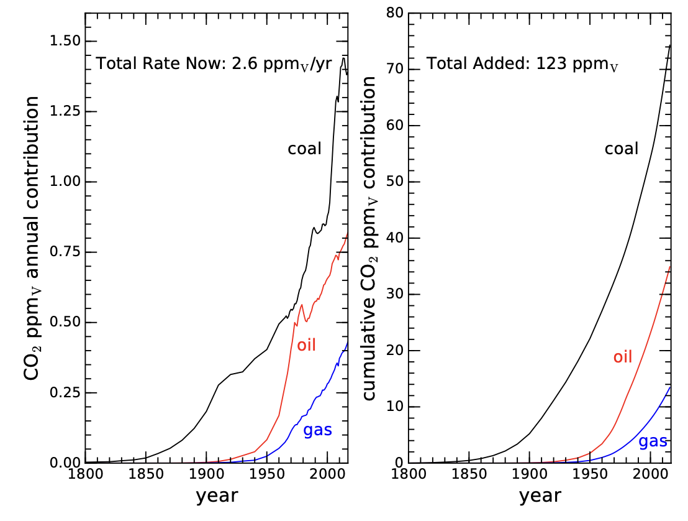

  **图 9.3:** 消耗化石燃料产生的 CO\ :sub:`2` 历史排放。根据化学性质估算，
  并假定 CO\ :sub:`2` 有一半留在大气中，另一半被海洋和陆地吸收。单位为百万分之一体积。
  左侧面板显示的是年增加量，目前是每年增加 2.6 ppm\ :sub:`v`，与图 9.1 中的斜率一致。
  右侧面板是迄今为止的累积排放量，基本上是将左侧面板中的所有年排放量相加。
  这些曲线不像图 9.2 中那样堆叠在一起，因此每条曲线都可以直接从纵轴上读数。请注意，
  在左侧面板中，石油和天然气的排放量仍在上升，即我们每年的 CO\ :sub:`2` 排放量都比前一年多。

如图 9.4 所示，将图 9.3 右侧面板中的三项相加，并将结果绘制在基林曲线\ [#]_\ 之上，
我们会发现它们几乎完美重叠。

.. [#] 即实际的 CO\ :sub:`2` 测量结果。

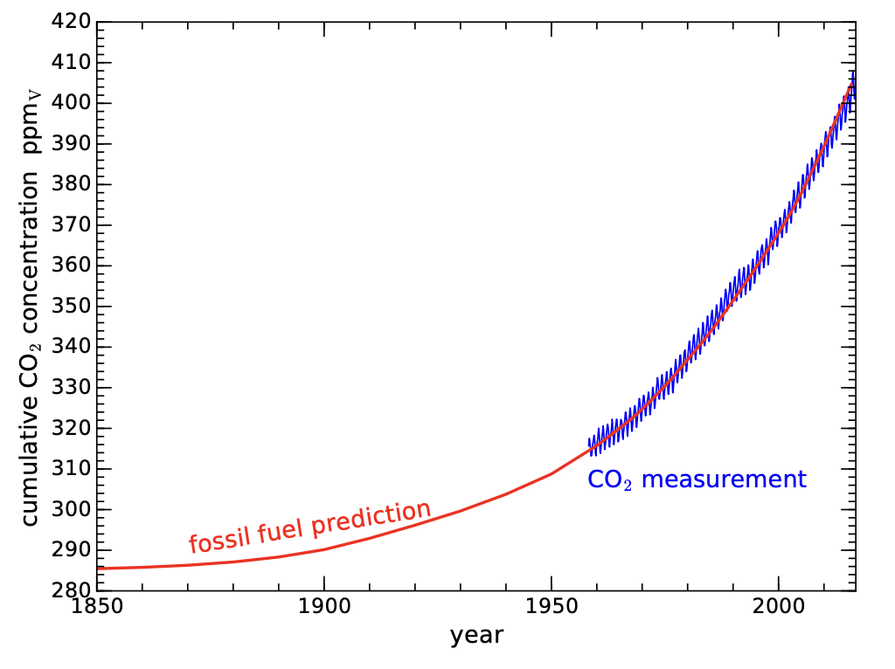

  **图 9.4:** 化石燃料对 CO\ :sub:`2` 的贡献（红色）与二氧化碳测量值（蓝色）的对比。
  红色曲线的起点为 285 ppm\ :sub:`v`，49% 的二氧化碳排放停留在大气中。重合度非常好，令人信服。

根据化石燃料的使用量计算出的曲线与基林曲线如出一辙，因此，大气中过量的 CO\ :sub:`2` 从何而来并不神秘。
化石燃料的化学性质和历史使用情况并无争议。化石燃料燃烧产生的 CO\ :sub:`2` 有多少留在大气中，
有多少被海洋和其他「碳汇」吸收，这才是唯一的「猫腻」。根据经验，大约有一半留在大气中，
其余的则消失在海洋中\ [#]_\ ，以及埋入地下的植物质中。如果不了解海洋和陆地的吸收机制，
我们就会将化石燃料产生的 CO\ :sub:`2` 高估两倍（见方框 9.2）。

.. [#] 因而使海洋酸化。

.. _box9.2:

.. admonition:: Box 9.2: 如果我们忽略海洋

  如果不对海洋和陆地的吸收进行校正，我们会得出什么结论？
  基于化石燃料定量计算的 CO\ :sub:`2` 含量上升没有任何问题，
  但我们会问为什么在实际测量数据上没有看到更大的上升。
  换句话说，要解释 CO\ :sub:`2` 过量的原因并不困难，更谈不上神秘。
  如果 CO\ :sub:`2` 的增加不是人类造成的\ [#]_\ ，那么我们将面临一个真正的谜团：
  燃烧化石燃料所排放的 CO\ :sub:`2` 究竟去哪了？

.. [#] 通过燃烧化石燃料。

.. margin::

  .. csv-table:: **表 9.3:** 主要的 CO\ :sub:`2`\ 排放国，2018
    :name: tab9.3
    :class: booktabs
    :header: 国家,十亿吨/年,百分比

    中国,9.43,27.8
    美国,5.15,15.2
    印度,2.48,7.3
    俄罗斯,1.55,4.6
    日本,1.15,3.4
    德国,0.73,2.1
    前6国总计,20.49,60.4
    全球总计,34,100

9.1.3 CO\ :sub:`2` 的主要来源
++++++++++++++++++++++++++++++++

气候变化是一种全球现象。即使所有排放都来自一个国家或地区，大气环流也会将结果扩散到全球各地
──尽管穿越赤道的速度较慢。因此，这是一个全球性问题。但尽管如此，对主要排放者进行研究还是很有意义的。

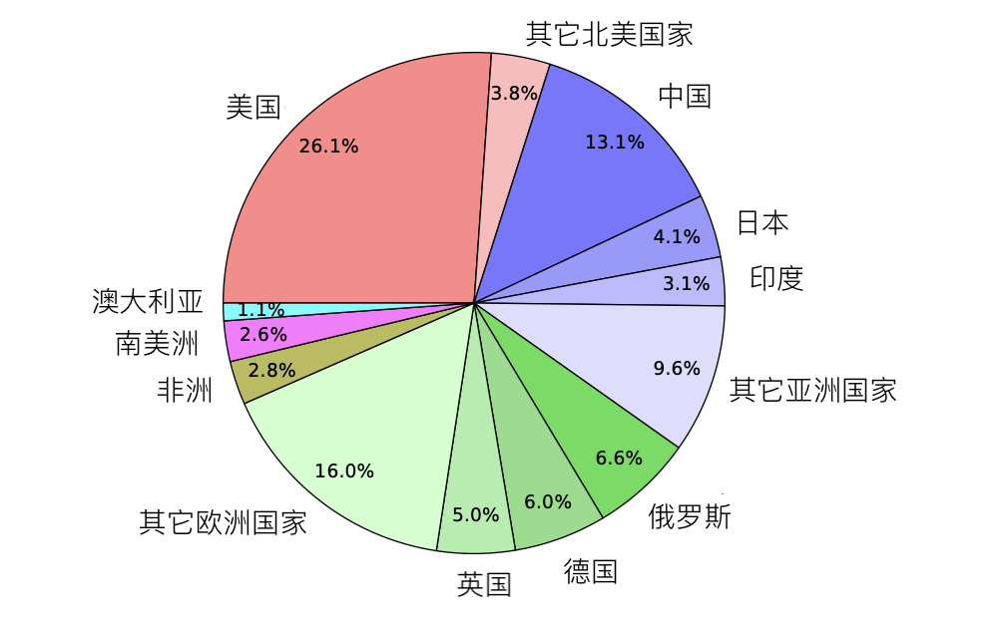

  **图 9.5:** 迄今为止对 CO\ :sub:`2` 排放的累计贡献，按主要国家分组。主要来源国被明确列出，
  各大洲的其余国家被归入「其他」类别\ :cite:`c52`。

图 9.5 显示，美国是对累计 CO\ :sub:`2` 排放量承担最大责任的单一国家，
大约是第二大国家（中国）的两倍\ :cite:`c52`。目前，中国是最大的 CO\ :sub:`2` 排放国，
每年排放 9.4 Gt，而美国位居第二，每年排放 5.15 Gt。表 9.3 列出了排在最前的六大排放国，
它们合计约占每年 34 Gt 排放量的 60% :cite:`c53`。

9.2 升温机制
-------------------------

不可否认，我们大气中存在的过量 CO\ :sub:`2` 来自化石燃料的使用。但这又如何改变我们的气候呢？
大气中如此微小的成分（现在为 0.04%）怎么会造成如此大的麻烦？\ [*]_ 
答案就在\ :term:`红外辐射<infrared radiation>` 中\ :cite:`c54`。
回顾一下\ :ref:`第 1.3 节<1.3 热动力学后果>`\ 的内容，这是能量离开地球的机制，
其功率受\ :term:`斯蒂芬-玻尔兹曼定律<Stefan-Boltzmann law>`
𝑃 = 𝐴\ :sub:`surf`\ 𝜎𝑇\ :sup:`4` 支配，
其中斯蒂芬-玻尔兹曼常数\ [#]_\  𝜎 = 5.67 × 10\ :sup:`-8` W/m\ :sup:`2`/K\ :sup:`4` ，
而 𝑇 是辐射表面的温度（单位是 K）。

.. [*] {-} :cite:`c54` Pierrehumbert (2011), “Infrared radiation and planetary temperature”
.. [#] 速记法：5-6-7-8

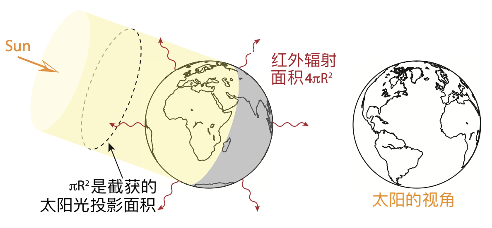

  **图 9.6:** 地球截获的阳光在地球的投影面积（𝜋𝑅\ :sup:`2`）上，而整个表面辐射的面积是其四倍（4𝜋𝑅\ :sup:`2`）。

太阳以 1360 W/m\ :sup:`2` 的功率\ [#]_\ 向地球大气层顶部输送能量。其中约 30% 的光──
准确地说是 29.3%──立即被云、雪反射，其次是被水和地形反射。剩下 70.7% 的光会在一个面积为
𝐴\ :sub:`proj` = 𝜋𝑅\ :sub:`⊕`\ :sup:`2` 的投影圆中被地球拦截（图 9.6）。但是，地球的总表面积是这个数字的四倍，
所有的地球表面都在向太空进行红外辐射。在完全平衡\ [#]_\ 的情况下，吸收的能量等于辐射的能量：

.. _eq9.1:

.. math:: 0.707 \times 1360 W/m^2 \times 𝜋𝑅^2 = 4𝜋𝑅_⊕^2 \sigma 𝑇^4. \tag{9.1}

.. [#] 这被称为\ :term:`太阳常数<solar constant>`\ :cite:`c4`，将在第 10 章和第 13 章中再次出现。
.. [#] 不平衡意味着能量在累积或流失，导致变暖或变冷。即使在目前的条件下，距离平衡态也在 1 W/m\ :sup:`2` 以内。

𝜋𝑅\ :sub:`⊕`\ :sup:`2` 相抵消，整理得到温度：

.. _eq9.2:

.. math:: T^4=\frac{0.707 \times 1360 W/m^2}{4\sigma}, \tag{9.2}

.. margin::

  验证一下。连续两次开平方就实现了四次方根。

计算得到 𝑇 ≈ 255 K 或 -18°C（约 0°F）。这比我们实际观测到的地球平均温度，即 288 K（15°C；59°F）
低约 33°C，这 33°C 的差异\ [#]_\ 是由于温室气体──主要是 H\ :sub:`2`\ O──影响了热平衡，
阻止了大部分辐射从地球直接逃逸到太空。

.. [#] 地球上的生命适应并依赖于这 33°C 的温室效应。突然改变它会造成问题。

科学界已经非常了解这一机制了。在 288 K 的温度下，表面辐射发射的峰值波长\ [#]_\ 约为 10 𝜇m。
大气并非在所有波长上都是透明的，其各种吸收特征如图 9.7 所示。
图中右上方的蓝色曲线是红外辐射的发射光谱。

.. [#] 我们将在\ :ref:`第 13.2 节<13.2 普朗克谱>`\ 中看到这是如何得到的（式 13.5）。

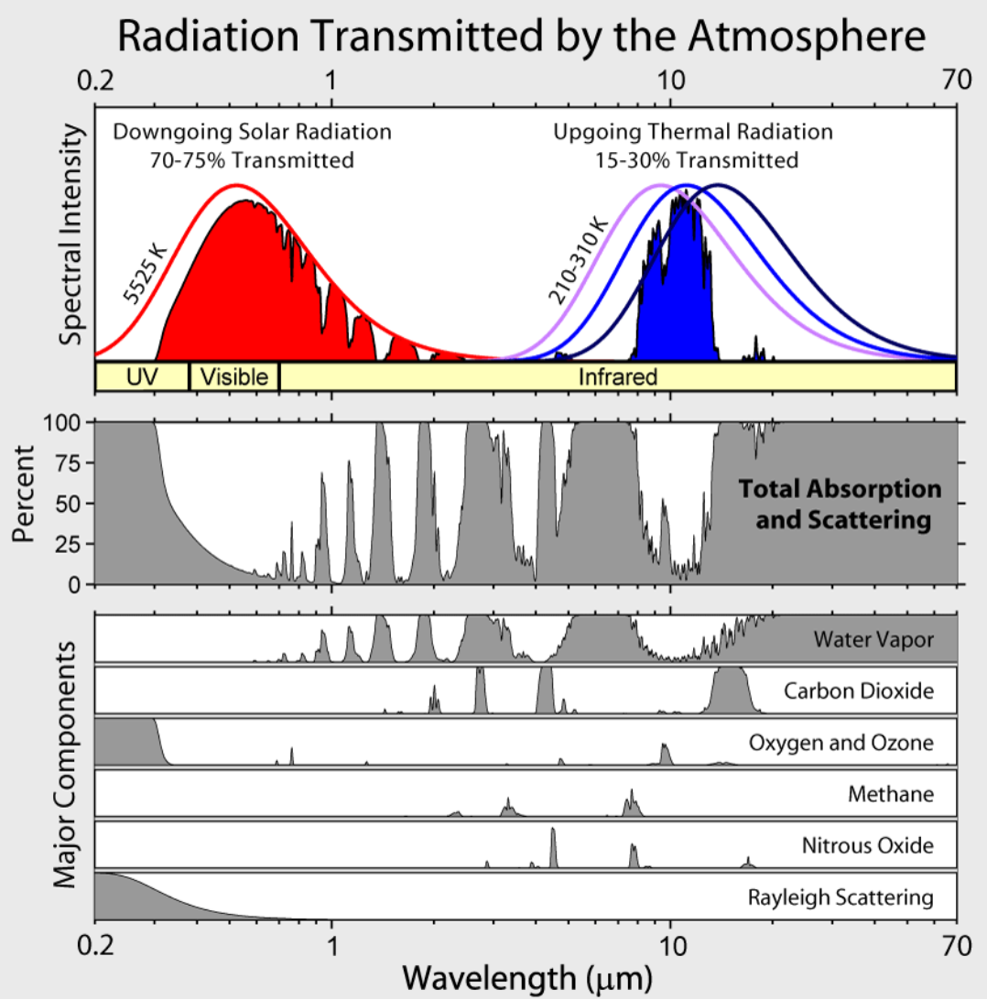

  **图 9.7:** 大气的透射/吸收光谱\ :cite:`c55`。顶部面板中红色是太阳的输入，
  蓝色是红外（热）辐射的输出。平滑曲线是对应太阳和地球温度的理论\ :term:`黑体<blackbody>`\ :term:`普朗克光谱<Planck spectrum>`。
  其中，红色曲线代表到达地球大气层顶部的阳光的谱分布，而红色填充部分则是到达地面后的谱分布。
  蓝色曲线（三个曲线中间的那个）是来自地面的辐射，但只有一小部分（蓝色填充区域）直接穿过大气层，
  其余部分被温室气体吸收了。下面的几个面板详细说明了光线被吸收或散射的谱分布位置。
  灰色区域表示吸收和散射，白色部分可视为透射部分──通常称为「窗口」。
  在总吸收下面的面板中列出了主要的贡献者（温室气体）。请注意，臭氧可以阻挡紫外线（UV），
  而瑞利散射则可以有效地散射来自太阳的蓝光，从而使天空呈现蓝色（蓝色位于「可见光」波段的左侧，
  而红色则位于右侧）。本图由 Robert Rohde 制作。

如图 9.7 所示，在有助于吸收热量的温室气体中，水蒸气占主导地位，其次是二氧化碳。请注意，
图中的蓝色填充部分\ [#]_\ 与下面总吸收率图中的白色部分相对应\ [#]_\ ，该「窗口」主要是水蒸气的作用。但是，
水汽窗口右侧──波长较长的一侧，被二氧化碳吸收谱的一部分盖住了，这在图 9.8 中看得更清楚。
图 9.7 中蓝色填充部分右侧的尖锐截止点，就是二氧化碳吸收造成的。随着大气中二氧化碳浓度的增加，
这一吸收特征会变得更宽，从而更深地切入逃逸辐射（蓝色填充部分）的右侧边缘，使逃逸辐射减少。

.. [#] 表示逃逸进太空的红外辐射
.. [#] 于是这个白色部分就是一个打开的「窗口」。

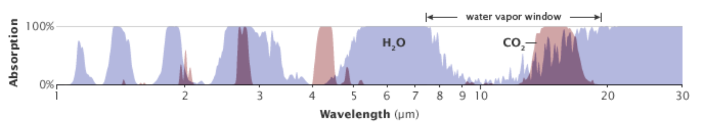

  **图 9.8:** 水和二氧化碳吸收光谱的另一个视图，更好地显示了两者在 10 𝜇m 窗口中的重叠部分。
  来自 Robert Rohde (NASA)。

.. margin::

  .. csv-table:: **表 9.4:** 温室气体的升温贡献\ :cite:`c56`
    :name: tab9.4
    :class: booktabs
    :header: 分子,Δ𝑇(°C)

    H\ :sub:`2`\ O,20
    CO\ :sub:`2`, 8.6
    O\ :sub:`3`\ （臭氧）,2.6
    CH\ :sub:`4`\ （甲烷）,1.5
    N\ :sub:`2`\ O（一氧化二氮）,0.5
    总计,33

如果有一部分红外辐射没有逃逸到太空中，而是被大气层吸收，那么整个星球就不能有效降温，
从而在式 9.2 中增加了一些偏移量──地球的情况是 33°C。这就好像地球裹着一条毯子，将温度提高了 33°C（图 9.9 说明了这一机制）。在这 33 °C 中，水蒸气的作用占 20°C，
二氧化碳占 8°C，剩下的 5°C 由臭氧、甲烷和其他次要因素造成（表 9.4）。另外，作为温室气体，
甲烷（CH\ :sub:`4`）的强度是等量  CO\ :sub:`2` 的 80 倍，其在大气中的浓度低于  CO\ :sub:`2`，
在大气中的停留时间也比较短（会被化学反应破坏）\ [#]_\ 。我们之所以关注二氧化碳，
是因为人类活动──通过燃烧化石燃料──正在迅速改变二氧化碳的浓度。
广阔的海洋-空气界面意味着水的浓度是无法控制的，由于温暖的空气中含有更多的水分，
大气中水的浓度会简单地对温度做出反应，成为一个重要的反馈因子。水不是气候变化的驱动力，
但却是一个不能忽视的重要因素。

.. [#] 但由于钻井泄漏和永久冻土融化释放，甲烷排放的影响变得非常重要。

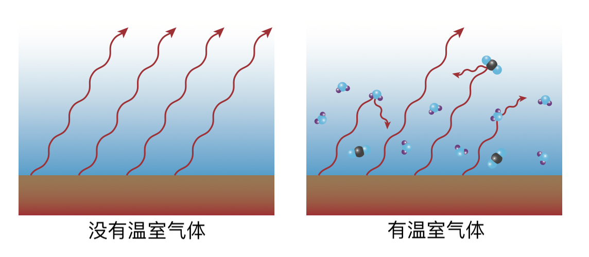

  **图 9.9:** 在没有温室气体的情况下，红外辐射不难逃逸到太空中（左图）。
  当存在温室气体时（右图），大部分红外辐射被温室气体分子吸收。
  这些分子随后会将吸收的能量作为新的红外辐射释放出来，但释放的方向是随机的，
  这样就会有一些能量返回到地面，从而使地表保持比没有温室气体时更高的温度。

天真地计算一下，从 280 ppm\ :sub:`v` 升至 420 ppm\ :sub:`v`\ （增加 1.5 倍），
可能会将二氧化碳产生的 8.6°C 温室效应转化为 12.9°C（乘以1.5），增加的 4.3°C 就是人为的变暖效应\ [#]_\ 。
但是，二氧化碳在 15 𝜇m 处的吸收已经饱和，因此随着二氧化碳的增加，吸收谱会变宽，
但它是二氧化碳浓度的对数函数，而不是线性函数。气候科学家通常用\ :term:`辐射强迫<radiative forcing>`\ 来表示各种因素的影响，
单位为 W/m\ :sup:`2`。

.. [#] 实际肯定不是这么计算的。

.. _def9.2.1:

  **定义 9.2.1:** 辐射强迫（:term:`radiative forcing`）用于描述太阳和红外辐射在单位面积上的功率（单位：W/m\ :sup:`2`）。
  各种影响因素或成分产生各自的辐射强迫。在平衡状态下，净\ [#]_\ 辐射强迫为零。

.. [#] 加总所有正项和负项。

平均太阳强迫为：

.. _eq9.3:

.. math:: RF_\odot=1360 W/m^2 \times 0.707/4 \approx 240 W/m^2, \tag{9.3}

各项的含义在介绍式 9.2 时已经解释过了。考虑工业化前温室气体水平，我们可以求解温度\ [#]_\ 为

.. _eq9.4:

.. math:: T=(\frac{RF_\odot}{\sigma})^{0.25}+33, \tag{9.4}

.. [#] 需要加上基准温室气体带来的 33°C

是 288 K，或约 15°C。如果我们增加（或减少）其他来源的辐射强迫，那就会增加（或减少）式 9.4 中的分子项。
在原始数量（CO\ :sub:`2,orig` = 280 ppm\ :sub:`v`）的基础上增加二氧化碳含量，产生的辐射强迫为：

.. _eq9.5:

.. math:: RF_{CO_2}=5.35ln(\frac{CO_2}{CO_{2,orig}}) W/m^2, \tag{9.5}

其中 ln() 是自然对数函数\ [#]_\ 。我们目前的二氧化碳约 420 ppm\ :sub:`v` 计算其辐射强迫约 2.2 W/m\ :sup:`2`，
那么新的平衡温度是：

.. _eq9.6:

.. math:: T=(\frac{RF_\odot+RF_{CO_2}}{\sigma})^{0.25}+33 \approx 288.6, \tag{9.6}

.. [#] 反映了图 9.7 中二氧化碳吸收谱 15 𝜇m 处呈对数加宽的情况

比二氧化碳含量增加之前大约高了 0.6°C。我们可以把这个理解为温度变化敏感性：在给定的不平衡的辐射强迫条件下，
温度变化 Δ𝑇 是多少？在这里，2.2 W/m\ :sup:`2` 增加了 0.6°C，相当于每 W/m\ :sup:`2` 增加了 0.27°C。
但是，如果将已知的反馈机制包括在内──其中大部分是正反馈机制──每增加 1 W/m\ :sup:`2` 的辐射强迫，
温度会增加 0.8°C，这个就是\ :term:`气候敏感性参数<climate sensitivity parameter>`\ [#]_\ 。

.. [#] 参见\ :cite:`c57`，其中有很好的概述和参考资料。

.. _def9.2.2:

  **定义 9.2.2:** 气候敏感性参数把辐射强迫与预期变暖程度定量地联系起来。根据目前的研究，
  每 W/m\ :sup:`2` 辐射强迫可导致 0.8°C 的升温。

因此，目前 2.2 W/m\ :sup:`2` 的额外（化石燃料增加的）辐射强迫\ [#]_\ 带来 1.7°C 的温度升高（图 9.10），
这大约是前面不考虑反馈机制情况的三倍。

.. [#] 就是把 2.2 W/m\ :sup:`2` 乘以 0.8°C/(W/m\ :sup:`2` )

.. margin::

  .. figure:: ../images/fig9-10.png
    :name: fig9.10

    **图 9.10:** 随着二氧化碳浓度的增加，辐射强迫（左轴）增加，推动温度（右轴）上升。
    我们现在的二氧化碳浓度为 420 ppm\ :sub:`v`，对应的辐射强迫为 2.2 W/m\ :sub:`2`，
    最终温度上升 1.7°C（图中红色星标）。目前，温度只上升了 1.0°C（红点），等到海洋变暖，冰雪融化，
    温度将达到新的平衡。

.. _exp9.2.1:

  **示例 9.2.1:** 如果将二氧化碳浓度从工业化前的水平增加一倍，预计气温会上升多少？

  工业化前的二氧化碳浓度为 280 ppm\ :sub:`v`，因此翻一番会增加 280 ppm\ :sub:`v`，
  总计为 560 ppm\ :sub:`v`。辐射强迫为 5.35ln(2) ≈ 3.7 W/m\ :sup:`2`。
  再乘以每 W/m\ :sup:`2` 0.8 °C 的气候敏感性参数，就可以得出温度上升约 3.0°C
  （不考虑反馈机制，则为 1°C）。

正反馈机制非常重要，有以下因素：

1. 地球变暖意味着冰（冰川、北极冰盖）减少，导致反射的太阳光减少，从而增加式 9.3 中的吸收因子（0.707），
   增加太阳强迫。

2. 变暖的空气可以容纳更多的水蒸气──主要的温室气体，从而增加基准情况下的 33°C 温室气体贡献。

3. 环境变暖会导致森林干枯、荒漠化，加速植物质和泥炭的分解，造成更多的二氧化碳流失到大气中。

此外，还存在一些负反馈机制\ [#]_\ ，但与正反馈相比，这些机制的作用要小得多。

.. [#] 目前而言，最重要的负反馈机制是红外辐射本身，它随着温度的升高而急剧增加（因为 T\ :sup:`4`），
   通过更多的向外辐射热量来对抗温度的升高。但是这里说的负反馈，指的是除这一主要因素之外的影响机制。

全球气温已上升约 1.0°C :cite:`c58`。\ [*]_ 请注意，即使我们不再向大气中多增加哪怕一个二氧化碳分子，
随着海洋\ [#]_\ 慢慢达到新的平衡，温度也会继续上升。根据上述计算，我们预计在今天二氧化碳过量的情况下，
温度将在升高 1.7°C 左右稳定。因此，温度爬升已经完成了大约 55%。当然，还会增加更多的二氧化碳，
因此最终的气温升幅注定会更高。

.. [*] {-} :cite:`c58`\ ：National Oceanic and Atmospheric Administration (NOAA) (2019), Global Climate Report
.. [#] 海洋具有很大的热容量

9.3 可能的轨迹
-------------------------

从图 9.3 所用的数据出发，我们现在可以做一些假设，以了解在各种假想情况下，
到 2100 年二氧化碳总量的上升和相应的 Δ𝑇 的增加，会给我们的未来带来什么\ [#]_ 。

.. [#] 我们虚构的所有情景，严格来说都不现实，但能帮助我们界定可能结果的边界。数学模型并不需要捕捉所有细微差别，仍然可以成为辅助理解的有效指南。

首先，假设我们突然遏制了化石燃料使用量的上升趋势\ [#]_\ ，并从现在到 2100 年将化石燃料使用量维持在当前水平。图 9.11 展示了结果。二氧化碳的累计增量将达到目前过量的 2.75 倍，即比工业化前水平高出 339 ppm\ :sub:`v`\ [#]_。相应的辐射强迫将达到 4.25 W/m\ :sup:`2` ，导致 3.4°C 的温度上升。表 9.5 总结了这一情景以及随后的三种情景。

.. [#] ……即图 9.3 左侧面板中显示的趋势
.. [#] ……因此总量约为 620 ppm\ :sub:`v`；从工业化前的 280 ppm\ :sub:`v` 增加了 339 ppm\ :sub:`v`

.. margin::

  按照示例 9.2.1 的步骤自行验证一下，作为练习。

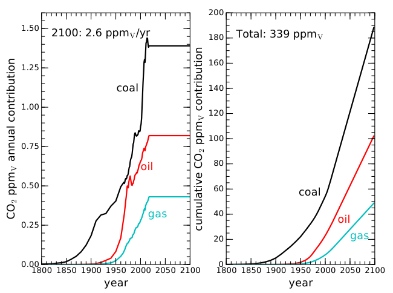

  **图 9.11:** 如果本世纪剩余时间将化石燃料使用量固定在当前水平，CO\ :sub:`2` 的上升情况，遵循图 9.3 的约定。从现在起到 2100 年，我们将每年增加 2.6 ppm\ :sub:`v`，累计上升 339 ppm\ :sub:`v`，即迄今为止累计量的 2.75 倍。相应的温度上升将达到 3.4°C。

.. margin::

  .. csv-table:: **表 9.5:** 情景结果总结
    :name: tab9.5
    :class: booktabs
    :header: 情景,ΔCO\ :sub:`2` (ppm\ :sub:`v`),与今日之比,CO\ :sub:`2` (ppm\ :sub:`v`),RF\ :sub:`CO\ :sub:`2` (W/m\ :sup:`2`),Δ𝑇 (°C)

    冻结FF增长,339,2.75 ×,620,4.25,3.4
    冻结；无煤,268,2.18 ×,548,3.6,2.9
    2100年归零,235,1.91 ×,515,3.3,2.6
    2050年归零,169,1.37 ×,450,2.5,2.0

.. margin::

  按照示例 9.2.1 的步骤自行验证一下，作为练习。

我们在约 1°C 上升的情况下就已经开始看到严重的问题出现，因此 3.4°C 的情景是不可取的\ [#]_。并且请反思一下，我们甚至能否如此突然地遏制化石燃料使用量的增长——这看起来相当不切实际。CO\ :sub:`2` 排放速率注定会继续攀升至高于今天的水平：我们还没有找到峰值！

.. [#] 另一方面，我们可能没有足够的化石燃料资源来实现这一情景，在这种情况下它可以被视为上限。

第二个情景聚焦于淘汰煤炭，因为它是碳强度最高的排放者\ [#]_，图 9.3 清楚地表明了这一点。如果天然气——碳强度最低的化石燃料——能够替代煤炭的所有用途会怎样？这在发电领域已经在逐步发生。无数倡导者鼓励尽快完成这一转型。模拟允许我们评估即时、完全替代的最佳情况（不现实的）情景，为这种举措带来多少好处设定一个上限。图 9.12 展示了结果。CO\ :sub:`2` 排放速率将立即下降到每年 1.8 ppm\ :sub:`v`\ [#]_。这确实有帮助，但到 2100 年——如果以今天的能源需求继续使用化石燃料——总排放量将攀升至 268 ppm\ :sub:`v`。这一影响将使我们已经排放到大气的 123 ppm\ :sub:`v` 增加两倍多，并使大气中的 CO\ :sub:`2` 浓度大约翻倍，导致 3.6 W/m\ :sup:`2` 的辐射强迫和 Δ𝑇 ≈ 2.9°C（总结在表 9.5 中）。因此，尽管停止使用煤炭会带来好处，但任何涉及以今天水平继续使用化石燃料的路径——即使是用最佳燃料替代最差燃料——前景都不容乐观。

.. [#] ……基于其较低的能量密度（5–8 kcal/g 对比天然气的 13 kcal/g）和较高的 CO\ :sub:`2` 与燃料质量比（3.67 对比天然气的 2.75）
.. [#] 约为当前每年 2.6 ppm\ :sub:`v` 速率的 70%。

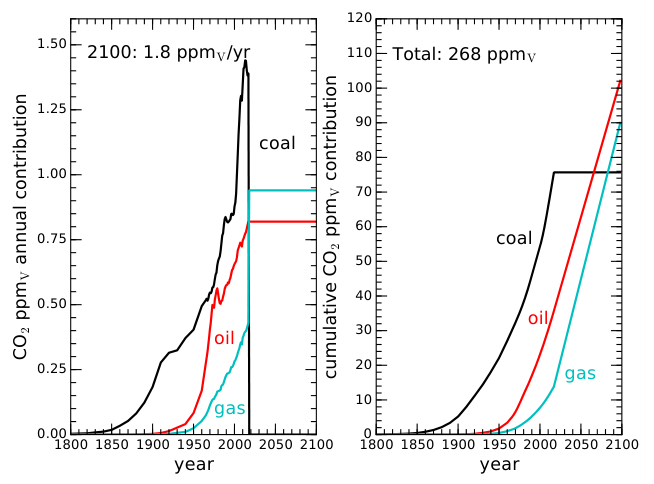

  **图 9.12:** 如果立即用天然气（碳强度最低）替代煤炭（碳强度最高），并在本世纪剩余时间保持当前水平，CO\ :sub:`2` 的上升情况。根据这一替代，我们的年度贡献将从 2.6 ppm\ :sub:`v`/yr 下降到 1.8 ppm\ :sub:`v`/yr，到本世纪末累计上升 268 ppm\ :sub:`v`（是目前累计量的 2.2 倍）。相应的温度上升将达到 2.9°C。

因此，重点应该是逐步减少化石燃料的使用，使我们摆脱对它的依赖。过渡可以是快速的或缓慢的。一个较慢的版本可能以 2100 年完全终止化石燃料为目标。图 9.13 展示了这种情况的理想化示意图。请注意，最终的曲线大致是对称的，即下降斜率与上升斜率相差不大。让我们停下来反思一下化石燃料的崛起是多么令人难以置信且快速的。与上升同样陡峭的下降代表着惊人的变化速度——即使是在最好的情况下，这也是相当具有破坏性的。在没有合适替代品的情况下，这将是一段极其艰难的旅程，但我们可能会被各种路径\ [#]_迫使走上这条路。无论如何，最终增加的 CO\ :sub:`2` 将达到 235 ppm\ :sub:`v`——几乎是我们已经排放量的两倍，使大气中的 CO\ :sub:`2` 浓度接近翻倍。这种情景下的辐射强迫为 3.3 W/m\ :sup:`2` ，Δ𝑇 ≈ 2.6°C。

.. [#] ……由政策、市场或更确定地说资源限制所驱动

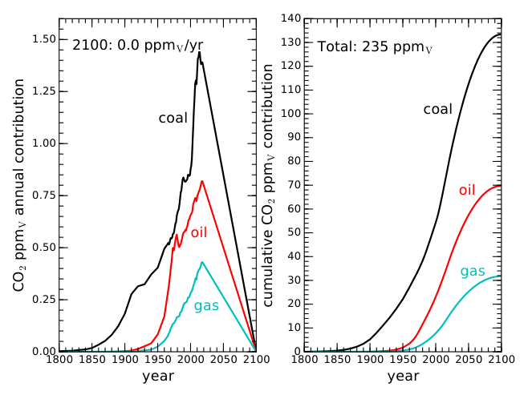

  **图 9.13:** 如果立即逆转化石燃料使用趋势，实现到 2100 年归零的雄心勃勃的减排方案，CO\ :sub:`2` 的上升情况。累计上升最终将达到 235 ppm\ :sub:`v`，几乎是当前水平（1.9 倍）的两倍。相应的温度上升将为 2.6°C。

.. margin::

  请再跟练一次。

更快地减少化石燃料使用，到 2050 年逐步降至零，结果如图 9.14 所示。下降坡度惊人地陡峭，很难想象在实践中会发生这种情况，除非重大破坏\ [#]_\ 迫使我们这样做。无论如何，如果我们能够实现这一壮举，我们对大气的 CO\ :sub:`2` 总贡献量将增加 169 ppm\ :sub:`v`，比我们已经排放的量多 37%。再增加约 40%，似乎是我们所能期望的最好结果了，但可能伴随着严重的适应困难。与这一情景相关的辐射强迫为 2.5 W/m\ :sup:`2` ，对应 Δ𝑇 ≈ 2°C。

.. [#] ……资源战争、毁灭性的气候变化后果

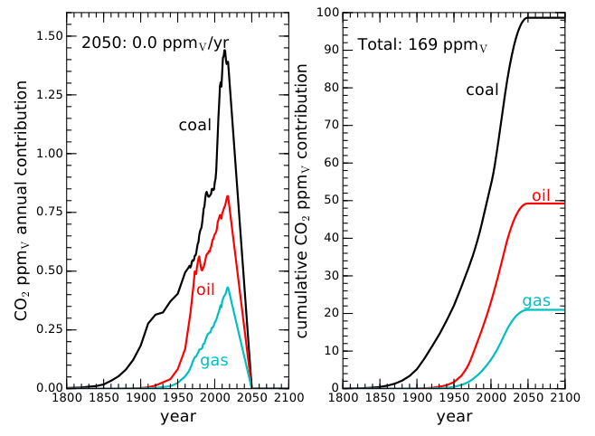

  **图 9.14:** 如果我们以超激进的方式在 2050 年前完成化石燃料淘汰，CO\ :sub:`2` 的上升情况。在这种极端情况下，CO\ :sub:`2` 的总排放量为 169 ppm\ :sub:`v`，比迄今为止产生的量多 37%。相应的温度上升将为 2°C。

9.4 气候变化的后果
-------------------------

调高地球上的恒温器会产生太多影响，在此无法一一列举。显然，气候受到了影响——风暴频率和强度、降雨量、降雪量和供水量、季节持续时间，以及动植物物种适应变化的能力。我们改变气候的时间尺度远远超过了进化所能追踪的速度，除了微生物生命和昆虫，它们较短的世代更替允许作出更动态的反应。人类是漫长进化序列中的姗姗来迟者，进化序列以复杂的相互关联的方式为我们的生活奠定了基础，而我们还没有完全理解这些复杂的相互关联的方式。气候变化扰乱了这个系统，使我们无法准确预测一个或另一个物种从生命之网中消失的长期后果。

气候变化的后果在许多资料中都有详细阐述，不难找到。本着本书的精神，本节不是试图增加人们的普遍认识，而是旨在为学生提供一些工具，使他们能够定量地理解物理世界是如何对辐射强迫的变化做出反应的。具体来说，我们将集中讨论地球元素的升温过程和海平面的上升。

9.4.1 升温
++++++++++++++++

回顾一下，由工业化前 CO\ :sub:`2` 浓度增加 50% 所产生的 2.2 W/m\ :sup:`2` 辐射强迫\ [#]_\ 预计最终将导致 1.7°C 的变暖。但测量数据表明，迄今为止只有 1.0°C 的变暖。我们的理解有误吗？

.. [#] ……从 280 ppm\ :sub:`v` 增加到 420 ppm\ :sub:`v`

正如我们在\ :ref:`第 6.2 节<6.2 能量、功率和加热>` （第 85 页）中看到的，改变物体的温度需要能量。当能量输入\ [#]_的速率有限时，温度上升需要时间\ [#]_。

.. [#] ……即我们所说的功率
.. [#] 例如，微波炉中的墨西哥卷饼不会瞬间变热。

地球在很大程度上处于热力学平衡状态。太阳以平均 240 W/m\ :sup:`2` 的速率向地球输送能量（按表面积计算，式 9.3）。在现代 CO\ :sub:`2` 浓度增加之前，我们没有来自 CO\ :sub:`2` 的额外辐射强迫，平均地表温度为 288 K（15°C），如式 9.4 所示。由于处于平衡状态，我们知道地球的红外辐射也必然总计为 240 W/m\ :sup:`2` ，以匹配太阳的输入。

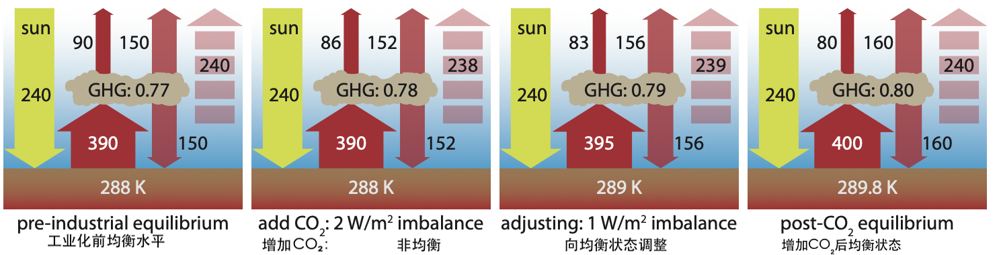

  **图 9.15:** 四个步骤用于说明（以极度简化的方式）地球适应温室气体（GHG）增加的过程。在每个面板中从左开始，太阳输入恒定保持在 240 W/m\ :sup:`2` 。从地面离开的大部分辐射——定量上遵循 σ𝑇\ :sup:`4` ——被 GHG 吸收（GHG「云」中标注吸收比例），其余部分直接逃逸到太空。被吸收的能量一半向上辐射（逃逸），一半向下辐射。右侧的虚线箭头表示净向外辐射。整数为 W/m\ :sup:`2` ，箭头宽度按比例缩放。地面温度标注在底部。

图 9.15 总结了整个过程\ [#]_。第一个面板显示了工业化前的平衡条件，77% 的来自地面的红外辐射被温室气体拦截，而 23%（90 W/m\ :sup:`2` ）直接逃逸。77% 被吸收的部分（300 W/m\ :sup:`2` ）向上和向下各重新辐射一半（各 150 W/m\ :sup:`2` ）。净向外辐射与 240 W/m\ :sup:`2` 的太阳输入\ [#]_完全匹配，标志着平衡状态。

.. [#] 请注意，在每个面板中，将顶部两个箭头相加或将中间底部两个箭头相减，都能得到相同的数字——与右侧的虚线箭头匹配。
.. [#] 实际上，太阳吸收也会随着表面反射率的变化而变化——比如当北极冰盖融化并暴露出深色水面时。

假设我们瞬间将 CO\ :sub:`2` 浓度增加到 420 ppm\ :sub:`v`\ [#]_，这对应图 9.15 的第二个面板。地面还没有时间改变温度，但增加的 GHG 吸收了更多的向外辐射（78%）。现在数字不再平衡。只有 238 W/m\ :sup:`2` 向外辐射，留下了 2 W/m\ :sup:`2` 的净能量流入。这就是我们一直所说的辐射强迫。

.. [#] 显然这需要时间，但这种方法有助于说明问题。

经过一段时间（第三个面板；大致代表我们当前的状态），额外的输入能量开始使地球环境升温至 289 K（16°C）\ [#]_，根据 σ𝑇\ :sup:`4` 辐射定律推高了地面离开的辐射量。与此同时，较高的温度驱动了一些正反馈效应，将更多的 GHG 推入大气\ [#]_并提高了吸收比例。同时，随着系统趋于新的平衡，不平衡缓和到 1 W/m\ :sup:`2` 。

.. [#] ……由于不再处于温度平衡
.. [#] 例如 H\ :sub:`2`\ O、CH\ :sub:`4`

最后，在图 9.15 的最后一个面板中重新建立了平衡，此时向外能量和向入能量再次在 240 W/m\ :sup:`2` 处匹配。反馈机制实质上将 GHG 吸收的变化放大了三倍：最初 1% 的增加最终变成了 3%。如果没有这种效应，系统将在 288.6 K（15.6°C）\ [#]_处达到平衡，在这种情况下，393 W/m\ :sup:`2` 离开地面，153 W/m\ :sup:`2` 从大气重新辐射。

.. [#] ……正如式 9.6 所示

.. margin::

  尝试使用 σ𝑇\ :sup:`4` 重新计算向上的辐射数值。

9.4.2 加热地球表面
+++++++++++++++++++++++++

现在让我们更深入地了解在向外能量不匹配向入能量的期间，加热地球的空气、水、陆地和冰的过程\ [#]_。我们从\ :ref:`第 6.2 节<6.2 能量、功率和加热>` （第 85 页）中了解到，改变物体的温度需要能量。例如，将一千克（一升）水的温度升高 1°C 需要 4,184 J，而许多其他物质（如空气和岩石）大约需要 1,000 J。还有一个相关的、之前未介绍的概念：融化冰需要大量的能量。
.. [#] ……即图 9.15 中间的两个面板

.. _def9.4.1:

  **定义 9.4.1:** 冰的融化潜热为每克 334 J，这意味着每克从刚低于冰点变为刚高于冰点\ [#]_的冰需要 334 J 的能量输入。

.. [#] ……例如从 −0.001°C 到 +0.001°C

为了说明这一点，同样的 334 J 可以将一克液态水加热 80°C，但全部消耗在相变过程中，温度几乎没有变化\ [#]_。

.. [#] 这就是为什么杯子里的冰不会突然全部融化——冰缓慢融化时使其周围的水基本保持在 0°C 左右，受限于传热速率。

利用表 9.6 中各种成分的特性，我们可以构建表 9.7 来描述将不同地球成分「充能」到不同温度需要多少能量\ [#]_。请注意，海洋升温所需的能量大约是大气的 1,000 倍。

.. [#] 表中有两个条目为空，因为讨论只加热大气某一层或加热「整个」地面没有太大意义：多深才算合理？

.. margin::

  .. csv-table:: **表 9.6:** 地球表面质量成分的特性。约 90% 的冰体积在南极冰盖，10% 在格陵兰冰盖，不到 0.5% 在冰川 :cite:`c59`\ :cite:`c60`。空气的体积对应于压缩到均匀（海平面）密度时的体积。最后一列列出了比热容，或冰的融化潜热。
    :name: tab9.6
    :class: booktabs
    :header: 成分,全球面积(10\ :sup:`6` km\ :sup:`2`),面积占比,体积/质量,比热容/融化潜热

    大气,510,100%,—,1000 J/(kg·°C)
    岩石/土地,148,29%,—,1000 J/(kg·°C)
    海洋,361,71%,1.35 × 10\ :sup:`9` km\ :sup:`3`,4184 J/(kg·°C)
    冰,16,3%,38 × 10\ :sup:`6` km\ :sup:`3`,334 J/kg

.. margin::

  .. csv-table:: **表 9.7:** 加热地球成分所需的能量（热「充能」），由表 9.6 推导。前三个成分的能量投入取决于所寻求的温度变化，而融化冰与温度变化无关。
    :name: tab9.7
    :class: booktabs
    :header: 成分,每米充能(10\ :sup:`21` J/m),总充能(10\ :sup:`24` J)

    大气,—,0.0053/°C
    岩石/土地,0.3/°C,—
    海洋,1.5/°C,5.9/°C
    冰,4.9,8.8

.. _exp9.4.1:

  **示例 9.4.1:** 我们将以海洋为例，说明如何解释和使用表 9.7。两个数字分别告诉我们将海洋每米深度加热和加热整个体积所需能量。

  如果我们问需要多少能量才能将海洋上层 10 m 的温度升高 2.5°C，我们将 1.5 × 10\ :sup:`21` J/m/°C 乘以 10 m 和 2.5°C，得到 3.75 × 10\ :sup:`22` J。将整个海洋体积的温度升高 0.5°C 将需要 5.9 × 10\ :sup:`24` J/°C 乘以 0.5°C，即 3 × 10\ :sup:`24` J 的能量。

  类似地——但不涉及温度因素——融化地球 10 m 的冰将需要约 49 × 10\ :sup:`21` J，而融化所有冰将需要 8.8 × 10\ :sup:`24` J。

我们现在可以理解在辐射强迫失衡的情况下，在行星尺度上改变温度可能需要多长时间。例如，如果失衡为 1 W/m\ :sup:`2`\ [#]_，那么地球每秒接收额外的 5.1 × 10\ :sup:`14` J，或每年 1.6 × 10\ :sup:`22` J\ [#]_。我们可以将这一年度盈余能量与表 9.7 中的数值进行比较，以了解在 1 W/m\ :sup:`2` 辐射强迫失衡下，各成分每年会被加热到什么深度或融化多少冰。

.. [#] ……大约是现在的情况；图 9.15 中的第三个面板
.. [#] 1 W/m\ :sup:`2` 乘以地球 5.1 × 10\ :sup:`14` m\ :sup:`2` 的面积，再乘以一年 3.16 × 10\ :sup:`7` 秒。

.. _exp9.4.2:

  **示例 9.4.2:** 如果我们能够将来自 1 W/m\ :sup:`2` 失衡的年度盈余 1.6 × 10\ :sup:`22` J 全部定向到一个成分\ [#]_，我们可以问：每个成分将被加热到 1°C 的深度是多少，或者冰会融化多少？

.. [#] 注意：这不是实际的工作方式

  * 岩石/土地：1.6 × 10\ :sup:`22` J / (0.3 × 10\ :sup:`21` J/m/°C · 1°C) = 54 m
  * 海洋：1.6 × 10\ :sup:`22` J / (1.5 × 10\ :sup:`21` J/m/°C · 1°C) = 11 m
  * 冰：1.6 × 10\ :sup:`22` J / (4.9 × 10\ :sup:`21` J/m) = 3.3 m

  由此我们可以看到，陆地更容易被加热，而冰最抗拒——即使整个辐射失衡的冲击都集中在其上，每年也只能削去约 3 m。

同样，我们可以探讨在 1 W/m\ :sup:`2` 失衡下，将整个成分的温度升高或融化所有冰需要多长时间。

.. _exp9.4.3:

  **示例 9.4.3:** 如果我们能够将来自 1 W/m\ :sup:`2` 失衡的年度盈余 1.6 × 10\ :sup:`22` J 全部定向到一个成分\ [#]_，我们可以问：整个主体的温度每年会上升多少，或者每年会融化多少冰？

.. [#] 注意：这不是实际的工作方式

  * 大气：1.6 × 10\ :sup:`22` J / (5.3 × 10\ :sup:`21` J/°C) = 3.0°C/yr → 达到 1°C 需 0.33 年
  * 海洋：1.6 × 10\ :sup:`22` J / (5.9 × 10\ :sup:`24` J/°C) = 0.0027°C/yr → 达到 1°C 需 367 年
  * 冰：1.6 × 10\ :sup:`22` J / (8.8 × 10\ :sup:`24` J) = 0.185%/yr → 完全融化需 545 年

  大气很容易改变温度。海洋则对温度变化非常迟缓。对于冰，我们看的是每年的分数损失而不是温度增加。

我们从这些示例中学到的是，海洋和冰都是快速加热的重要热制动器。尽管冰每千克的能量成本要大得多\ [#]_，但其总质量远小于整个海洋——这两种效应大致平衡。在现实中，我们可能会预期海洋环流模式将加热集中在表层而不是均匀分布到整个深度。因此，海洋上层——从而控制空气温度——可以在 367 年之前就达到 1°C 的增加。事实上，我们已经看到在不到一个世纪内就达到了这一规模的变暖。

.. [#] ……334 kJ 对比加热水 1°C 约 4 kJ

实际情况是，与 1 W/m\ :sup:`2` 辐射过量相关的年度盈余 1.6 × 10\ :sup:`22` J 被分配到许多渠道中。如果冰只获得按面积比例 3% 的份额，那么每年只有 5 × 10\ :sup:`20` J 进入冰。除以 4.9 × 10\ :sup:`21` J/m（来自表 9.7），我们发现每年可能预期有 0.1 m 的冰消失。由于海洋面积大约是冰面积的 25 倍\ [#]_，将冰的融化重新分布在整个海洋表面所导致的海平面上升约为 25 倍少，即约 4 mm/yr\ [#]_。

.. [#] 冰覆盖地球的 3%，而海洋覆盖 71%。
.. [#] 这与现实相差不远，如\ :ref:`第 9.4.3 节<9.4.3 海平面上升>`所示。

同时，水与空气之间以及空气与陆地之间持续的涡旋接触，使三者保持相互同步：一个不会在另两个不跟上的情况下急剧升温。在这种情况下，海洋——以其巨大的热质量和广泛的气水界面——是加热速度的限制因素。如果我们将海洋加热限制在顶层 300 m\ [#]_的水，每年 1.6 × 10\ :sup:`22` J 的盈余导致每年约 0.035°C 的温度上升，或约 30 年升温 1°C（在 1 W/m\ :sup:`2` 失衡下）。

.. [#] Lambeck et al. (2014), “Sea level and global ice volumes from the Last Glacial Maximum to the Holocene”

虽然本节可能看起来很长、曲折，甚至可能很无聊，但它为我们完成了许多事情：

1. 它展示了温室气体吸收比例的变化如何导致辐射强迫失衡；

2. 它说明了辐射失衡如何改变地表温度，直到地球在更高的温度下重新建立新的平衡，包括反馈效应；

3. 它通过直接的物理学评估了加热相关质量和融化冰所需的能量；

4. 它表明行星上两个最重要的热质量是海洋（第一）和冰盖（第二）；

5. 它建立了我们可能预期温度上升的大致时间尺度，以及为什么海洋在减缓后果方面特别重要。

另一个见解是，即使我们今天停止 CO\ :sub:`2` 排放，地球的温度也将继续上升，因为海洋需要慢慢适应大气中 420 ppm\ :sub:`v` CO\ :sub:`2` 所施加的新辐射现实。

9.4.3 海平面上升
+++++++++++++++++++++++++

上一节讨论了融化冰盖的热力学。产生的融水流向海洋\ [#]_\ 并导致海平面上升。除了融化冰之外，水变暖时的热膨胀也是海平面上升的原因之一。图 9.16 显示了近期的历史。

.. [#] ……并贡献于海平面上升

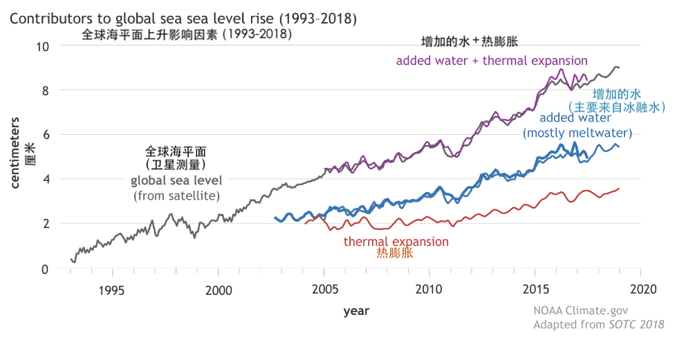

  **图 9.16:** 自 1993 年以来卫星测量的海平面，显示每年上升 3.6 mm。融化冰是最大的贡献者，虽然热膨胀也起到一定作用 :cite:`c61`。来自 NOAA。

.. margin::

  看看你能否复现这一结果。

融化冰贡献约 2.4 mm/yr 的上升，热膨胀贡献约 1.2 mm/yr，总速率为 3.6 mm/yr :cite:`c61`。自 1880 年以来，海平面已经上升了约 230 mm。按当前速率，到 2100 年预计会有类似幅度的增加，总计 0.5 m。

但当前速率不太可能是正确的衡量标准，因为变暖的气温导致冰融化速度加快。正反馈也加速了冰的融化。例如，冰面上的融水池比冰更暗，增加了太阳能量吸收的速率。

我们可以快速了解海平面上升可能达到多少，基于地球上绝大多数「永久」冰位于南极洲和格陵兰的事实。这两个冰盖分别占全球表面积的 2.7% 和 0.3%。从那里可以很容易地估算海平面上升，因为海洋（占全球的 71%）的面积比南极冰盖大 26 倍，比格陵兰冰大 210 倍。这意味着南极融化 26 米的冰会使海平面上升 1 米，格陵兰则需要融化 210 米才能达到同样的效果\ [#]_。参见图 9.17 来理解其中的逻辑。

.. [#] 为了便于估算，我们忽略了冰和水之间约 10% 的密度差异，假设一立方米的冰取代一立方米的水。前一段和表 9.6 有足够的信息（绝对和相对面积和体积）来推算。

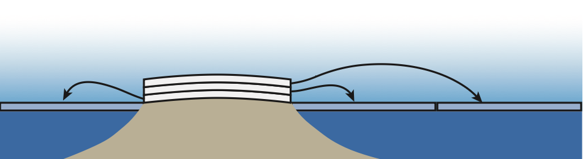

  **图 9.17:** 如果海洋面积是冰覆盖岛屿面积的 x 倍，当所有冰融化后，水位将上升 1/x 倍的冰厚度。该图展示了一种思考方式，以 x = 3 为例：通过将冰切片为 x = 3 层来重新分配体积到水面上。在这种情况下，30 m 的冰盖如果融化将使海平面上升 10 m。

现在如果我们知道每个冰盖的平均厚度，就可以计算出如果所有冰融化海平面会上升多少。格陵兰冰盖估计为 285 万立方公里，换算为平均深度 1.7 km\ [#]_。210 m 可以放入其中 8 次，因此如果格陵兰的所有冰融化，我们可能预期约 8 m 的海平面上升。对于南极洲，2650 万立方公里对应平均冰厚 1.9 km，约为我们 26 米单位的 70 个，因此在南极洲失去所有冰的极端情况下，我们可能预期约 70 米的海平面上升。

.. [#] 体积除以面积。

.. _box9.3:

.. admonition:: Box 9.3: 更严格的估算

  找到参考文献估计完全融化格陵兰和南极的海平面上升潜力并不难。其中一项 :cite:`c60` 得出格陵兰融化导致 7.4 m 的上升，南极 58 m，冰川 0.3 m。

  那么我们为什么要进行这种粗略估算呢？目的是消除神秘感\ [#]_。一旦我们有了深度的估计和面积比，我们自己就能估算上升量。

.. [#] 本书的目标之一是使学生能够独立验证更权威的来源——就像 2+2=4 可以亲自验证，而不是信仰问题。

沿海城市已经在努力应对目前约 0.25 m 的上升。这听起来可能不多，在正常日子也不会造成问题。但是风暴相关的低压导致局部水位上涨\ [#]_，因此风暴加上高潮加上巨浪与气候变化上升叠加，会摧毁原本可能幸免的人类建筑。即使 CO\ :sub:`2` 排放今天停止，已经发生的变暖将继续融化冰。随着已经存在的 CO\ :sub:`2` 增加的强迫继续加热海洋，温度也将继续上升，因为我们缓慢地趋向平衡——这是一个缓慢的过程。因此，海平面上升可能在未来数百年内持续成为一个不断赠予的「礼物」。

.. [#] 其他地方的高压将水挤压到低压区域

遥远的过去——数千万年前——海平面曾比现在高出 200 m。而 20,000 年前，在上一个冰期最盛期，海平面比今天低 120 m :cite:`c62`。因此，地球对大幅度的海平面波动并不陌生。相比之下，许多沿海城市不知道如何应对即使一米的海平面上升——而这在许多模型中都在 2100 年的预测范围内。

9.5 我们能做些什么？
-------------------------

到目前为止，我们简要介绍了为什么气候变化现象是人类使用化石燃料所造成的，还没有谈及我们可以做些什么来应对气候变化。
在本节中，作者不会试图掩盖他对这一问题的个人看法，只是将尽量简短。

首先，巧妙的地球工程想法充满了狂妄自大的气息，似乎就像在坠落前挖一个足够快的洞来解决急速坠落的问题。
我们的整个问题在于，我们让自己相信，我们可以胜过大自然\ [#]_\ 。你不会继续看一个只治疗皮肤表面症状、不解决根本病因的医生。这些不过是治标不治本罢了。

其实，根本原因非常简单：人类不受约束的野心\ [#]_\ 。化石燃料、不断增长的追求、对森林和栖息地的破坏\ [#]_\ 、
人口压力以及工业化的农业生产方式都是原因之一。这就是为什么它难以消除，根本原因是我们自己。
它充斥着我们所做的一切。我们是自己的对手。我们如何与自己作斗争？要做到这一点，需要诚实，
甚至需要集体的自愿牺牲并优先考虑地球的健康，而不是狭隘的短期人类利益。什么更重要？
是个人现在就试图实现他们所有的梦想，还是文明的长期延续？我们是否愿意收回自己的欲望，
让未来数十亿我们永远不会见面的人类和地球上无数其他物种也能享受生活？作为一个全球性的整体，
我们从未有过如此艰难的抉择，因此很难说智人能否做到这一点。

本书的最后几章，从第 18 章开始，讨论了造成我们的前景的人为因素，最后在第 20 章讨论了个人层面的应对策略。
这不是地球工程，但如果被广泛采用，个人行为改变导致的减排会产生巨大影响。

.. [#] 附录 D.6 对此有进一步讨论。
.. [#] 大自然刚刚打来电话，留下了这个神秘的信息「将军」。这是作者的文字梗，不受约束（unchecked），将军（check）。
.. [#] 消除碳汇，降低大自然的适应能力。

9.6 总结：气候变化问题十分严重
------------------------------------

尽管我们可以轻而易举地证明测量到的二氧化碳来自化石燃料，而且面对温室气体，温度均衡的物理学原理也很简单，
但令人震惊的是，我们并没有完全接受现实。也许这并不奇怪。气候变化是对某些经济和政治意识形态的明显冒犯，
这些意识形态希望我们让市场决定我们的道路，而不承担任何后果。但是，否认并坚持按照过去的方式行事，
并不是我们最明智的选择。气候变化清楚地表明，我们不能只做最赚钱的事。化石燃料的替代品既昂贵又不方便。
气候变化不利于商业发展，也对资本主义构成威胁，因为它限制了我们的雄心壮志。
难怪美国一直是最不愿意接受气候变化现实的国家之一，因为美国是最引以为豪的资本主义国家，
拥有巨大的人均能源需求，在过去的历史中对全球二氧化碳排放的贡献最大（:ref:`图 9.5<fig9.5>`）。

尽管气候变化是真实存在的，但它是否对人类文明的生存构成威胁却不那么明确\ [#]_\ 。
适应气候变化的代价可能会很高\ [#]_\ ，就人类的时间尺度而言，这些变化是渐进的，
可能是可控的──尽管绝对不是多么有趣的。

.. [#] 是世界末日，亦或只是非常痛苦？
.. [#] 放弃一些沿海地区，远离无法生存的气候区，减少人口以应对农业资源的减少，
   适应被剥夺了一些物种的新生态系统。

然而，资源\ [#]_\ 中断会使市场陷入自由落体，刺激全球军事行动，可能在更短的时间内造成更大的破坏。
我们正在进行一场竞赛，看看哪种方案能在最快的时间内造成最大的问题。
如果幸运的话，第三种选择会出现，而不会带来如此大的困难。但请记住，
人类社会是一个高度非线性的结构，它可能会以比物理学控制的气候变化发展更快的速度变得面目全非。

.. [#] 比如能源、水、食品和矿产资源。

9.7 思考题
--------------------

1. 如果要求你用化石燃料的典型碳成本来表征——即每克输入燃料排放的 CO\ :sub:`2` 克数——参考表 9.1，什么单一的简单数字可以很好地近似所有三种燃料？

2. 消耗一箱 40 升汽油会产生多少千克 CO\ :sub:`2` ？将结果与典型人体质量进行比较。汽油密度约为 0.75 kg/L。

3. 美国典型家庭用电量约为每天 30 千瓦时（kWh）。如果电力由运行效率为 40% 的天然气电厂生产，每个家庭每天需要从天然气获得 75 kWh 的能量。将其转换为焦耳，并使用表 9.1 中 49 g/MJ 的碳强度，天然气为家庭供电每天产生多少 CO\ :sub:`2` ？

4. 美国人平均以 10,000 W 的速率使用能源。将此换算为一天中的焦耳数，然后换算为 MJ，再使用表 9.1 右栏中的代表性数字\ [#]_来估算每个美国人每天大约的 CO\ :sub:`2` 排放量（单位：kg）。将此与一个人的质量进行比较。

.. [#] ……考虑到我们使用混合燃料

5. 更具体地说，美国人平均每天从石油获得约 320 MJ/人，从天然气获得 265 MJ，从煤炭获得 110 MJ。根据表 9.1 中每能量对应的 CO\ :sub:`2` 质量列，一个美国人每天从每种来源以及总共产生多少千克 CO\ :sub:`2` ？将此日排放量与一个人的质量进行比较。

6. 如果二氧化碳排放是一个主要关注点，从燃煤电厂切换到天然气输入仍然是使用化石燃料，但天然气每能量单位产生的 CO\ :sub:`2` 比煤炭少（表 9.1）。如果用天然气替代所有我们目前从煤炭获得的能量，CO\ :sub:`2` 排放会减少多少倍？

7. 用图 9.3 中 CO\ :sub:`2` 的总增量除以年增量，得到一个以年为单位的时标。将此时标与我们燃烧化石燃料的时期（例如图 9.2）进行比较。它们是否一致？如果不一致，你会提出什么原因？

8. 图 9.3 的右侧面板是左侧数值的累积——例如代表左侧曲线下的面积。由于左侧的天然气趋势看起来像一个三角形，很容易近似其面积\ [#]_。结果是否匹配右侧图中天然气最右边的值？

.. [#] 将 ppm\ :sub:`v`/yr（高度）乘以年（底边）得到 ppm\ :sub:`v` 的单位，与右侧图匹配。

9. 根据图 9.2 所示的化石燃料历史，世界目前以 5 TW 的速率从煤炭获得能源。由此，按照表 9.2 和方框 9.1 的步骤，计算出我们从煤炭增加了多少 ppm\ :sub:`v` /年的 CO\ :sub:`2` 。使用典型的煤炭能量密度 6.5 kcal/g 和质量比 3.67 CO\ :sub:`2` g/g\ [#]_。结果应与图 9.3 中获取的信息匹配。

.. [#] ……或等效地，135 g/MJ

10. 对于一位「气候怀疑论者」列举了许多 CO\ :sub:`2` 的天然来源并说我们不应太快将 CO\ :sub:`2` 上升标记为人为造成的\ [#]_，最直接、最有说服力的回应是什么？

.. [#] ……即人类起源

11. 你会给图 9.4 中红色曲线忠实追踪蓝色测量曲线的表现打什么字母等级？描述你可能扣分的理由。

12. 图 9.5 中各国 CO\ :sub:`2` 排放的分配与表 9.3 中的分布明显不同。这告诉我们各国过去和现在的活动有什么不同？

13. 使用修改后的式 9.2 来计算，如果地球没有温室气体且吸收 100% 的入射太阳能量\ [#]_，地球温度会是多少\ [#]_？这比实际平均地表温度（考虑温室气体和约 30% 的反射率）更暖还是更冷？

.. [#] ……即暗色、无明亮的云/雪
.. [#] 提示：四次方根可以通过连续取两次平方根，或使用 y\ :sup:`x` 按钮升至 0.25 次方来得到。

14. 根据图 9.7 和图 9.8，大气在 1.0 𝜇m 波长处是透明的还是不透明的？在 6 𝜇m 处呢？你会如何描述 2 𝜇m 处的情况？

15. 如果地球上足够的冰融化导致反射率从 29.3% 变为 25%，仍然应用标称的 33 K 温室气体贡献，平衡温度会变成多少？与 29.3% 反射率下的平衡温度相比，温度上升了多少？

16. 表 9.4 中 H\ :sub:`2`\ O 是主要的温室气体，所有温室气体合计贡献 33°C 的变暖效应。我们的目标应该是将所有这些效应降低到尽可能低的水平吗\ [#]_？为什么或为什么不？你会如何描述温室效应以及为什么它让我们担忧？

.. [#] 例如，如果我们能将它们全部减半，那会是好事吗？

17. 粗略地将图 9.9 按字面理解，即每四个红外光子中有一个在不被温室气体分子吸收的情况下逃逸，如果 400 W/m\ :sup:`2` 离开地面，被吸收的部分被重新辐射且均等地分为向上辐射和返回地面的辐射，那么有效的向上辐射是多少？

18. 如果「坏消息」——我们只走完了化石燃料的一半——是错误的，实际上只走了四分之一，并且最终用完了所有化石燃料，根据目前的增加量外推，最终的 CO\ :sub:`2` 浓度会是多少 ppm\ :sub:`v` ？根据我们对辐射强迫和气候敏感性参数的理解，这会转化为多少度的温度上升？

19. 使用式 9.5 和 CO\ :sub:`2,orig` = 280 ppm\ :sub:`v` ，以及 0.8°C per W/m\ :sup:`2` 的气候敏感性参数，你预测 CO\ :sub:`2` 水平为 330、380、430、480、530 和 580 ppm\ :sub:`v`\ [#]_时地球温度会上升多少？相应的温度趋势是线性的吗\ [#]_？

.. [#] 输入以 50 步长线性增加。一个表格可能有意义，包括辐射强迫作为一列。
.. [#] ……同尺寸的步长？一个图可能有助于说明。

20. 以下是正反馈还是负反馈效应？为什么？

   a) 变暖的冻土释放被困在永久冻土中的甲烷

   b) 大气中更多的水形成更多的云并增加从地球反射的阳光量

   c) 森林火灾活动增加烧毁大量含碳物质并留下焦黑的地面

   d) 随着温度上升，每年冬季雪覆盖的土地面积减少

21. 煤炭一直是最严重的 CO\ :sub:`2` 排放化石燃料。根据表 9.5 总结的情景，如果我们在保持今天化石燃料水平到 2100 年的情况下用天然气替代煤炭的所有用途，与保持不变相比，最终温度上升（Δ𝑇）的减少百分比是多少？

22. 你认为第 9.3 节中哪个情景最现实，为什么？基于此，与迄今的 1°C 相比，最终可能还有多少额外的变暖？

23. 验证图 9.15 中每个面板中间顶部两个箭头的和以及中间底部两个箭头的差是否匹配右侧的有效（虚线）箭头（共 8 次比较）。

24. 以图 9.15 的方式构建你自己的面板，对应第 9.3 节中的第三个情景，即我们在 2100 年前削减化石燃料使用，最终平衡 Δ𝑇 为 2.6°C（因此地面温度为 290.6 K）。描述最终平衡状态，当净向上辐射等于太阳输入时。平衡后，计算 GHG 分数吸收必须是多少（图 9.15 中「云」中的数字）。

25. 在大雪后一个晴朗的冬日，低纬度的太阳可能向地面输送 500 W/m\ :sup:`2` 的能量。雪反射了大部分能量，但假设它吸收了 5% 的入射能量。如果一立方米的雪质量为 100 kg，一小时内从吸收的能量中会融化多少雪（冰）？

26. 如果海洋吸收了额外的 3 W/m\ :sup:`2` 的强迫\ [#]_，将某一平方米正下方约 4 km 深的水柱（因此是 4 × 10\ :sup:`6` kg）加热 1°C 需要多长时间\ [#]_？

.. [#] ……每秒每平方米沉积 3 J
.. [#] 提示：使用 kcal（4,184 J）计算一年内的温度增加，然后算出累计到 1°C 需要多少年。

27. 根据表 9.7，如果我们奇迹般地关闭向太空的红外辐射，太阳 240 W/m\ :sup:`2` 的平均值加热整个海洋 1°C 需要多长时间？在这个极限计算中，可以假设海洋覆盖整个地球。

28. 假设来自辐射强迫失衡的年度超额能量输入为 3 × 10\ :sup:`22` J 每年。在这一水平下，海洋上层 10 m 的温度在一年内会上升多少？

29. 如果我们以某种方式无限期地保持稳定的 2 × 10\ :sup:`22` J/yr 不平衡输入，需要多长时间来：

   a) 将整个海洋温度升高 1°C？
   b) 融化所有冰？
   c) 将整个大气温度升高 1°C？
   d) 加热地球陆地面积的顶层 100 m？

   所有这些的总和就是完成所有这些任务所需的时间，尽管它们会并行发生。

30. 在一个 60% 被海洋覆盖、5% 被陆地上的 3 km 厚冰盖覆盖的行星上，如果所有冰都融化，海平面会上升多少？

31. 在一个三分之二被海洋覆盖、1% 被以每年 1 米速度融化的冰盖覆盖的行星上，海平面上升速度有多快？

32. 你会如何表达可用化石燃料资源与气候变化之间的权衡？换句话说，如果我们拥有的化石燃料远没有我们想象的那么多，这对气候变化与我们的经济/地缘政治稳定性和可行性意味着什么？另一方面，如果我们还有几个世纪的化石燃料，那意味着什么？哪种情景的破坏性最小？

33. 如果确定让后代享有舒适生活的唯一途径是在今天大幅削减生活方式、减少能源和物质享受，你认为人类会自愿这样做吗？我们能将触手可及的享受留在货架上吗？如果能，是仅仅不确定性阻止了我们吗？如果不能，你认为障碍是什么？
