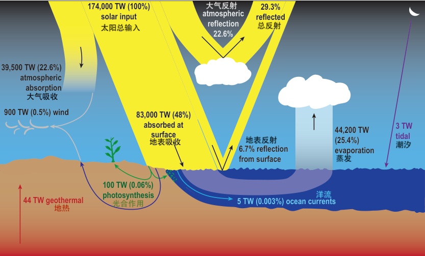

10 可再生能源概述
==================

（大模型翻译，未校对）

我们现在明白，人类文明走到今天所走过的道路——一条由化石燃料铺就的道路——在不得不被新道路取代之前，已经无法走得太远。一种可能的方向是退回低技术含量的生存状态，但大多数人会认为这种发展是一种失败。那么，成功会是什么样子？附录第D.5节（第404页）对人类的长期成功进行了宏观审视，但就当前目的而言，我们将聚焦于关键的能量问题：我们从哪里能够获得足够的能量来替代化石燃料这一巨大的"一次性馈赠"？

本章非常简短，只是为后续更详细探讨替代能源的各章做铺垫。在这项工作的最后，第17章将总结所有能源资源的潜力。现在，我们描述地球能量输入的来源和规模，并提醒读者目前我们从这些来源获得了多少能量。

10.1 参与者
---------------------

在深入探讨化石燃料之外的能源来源的详细特性之前，列出这些"角色"会有所帮助。

- 水力发电（第11章）：将河流的水截留在水坝后，迫使水流通过水轮机\ [#]_ ，水轮机带动发电机发电。
- 风能（第12章）：使风力涡轮机\ [#]_ 旋转，通过发电机发电。
- 太阳能（第13章）：可以提供直接热量，或通过光伏（PV）面板或公用事业规模的太阳能热装置发电。
- 生物能源（第14章）：范围从食物到木柴，或生物燃料。它们通常通过燃烧提供热能，能够驱动热机。
- 核裂变（第15章）：依赖开采地壳中有限的放射性元素，其裂变（分裂）产生热量，可制造蒸汽以驱动热机和发电机发电。
- 核聚变（第15章）：如果成功，将利用水中丰富的氢资源构建氦核——这一过程会释放热量，制造蒸汽用于驱动热机和发电机发电。
- 地热能（第16章）：源于地球炽热的内部，可用于供暖或制造蒸汽以驱动热机和发电机发电。
- 潮汐能（第16章）：与水能非常相似，但基于封闭的潮汐盆地而非筑坝的河流。
- 洋流能（第16章）：行为与风非常相似，可以用类似的方式在水下发电。
- 波浪能（第16章）：将能量带到海岸线，可以驱动专用发电机发电。

一个普遍的主题连接了这些条目中的大多数：大量的电力，通常通过热机和/或发电机实现。事实上，化石燃料的替代品往往擅长于电力生产。但正如我们在\ :ref:`图 7.2<fig7.2>` 中所见，电力仅占美国能源需求的38%，并且仅占交付给四个终端使用部门的能量的17%\ [#]_ 。一个教训是，当前非电力的能源使用——如交通运输和工业加工\ [#]_\ ——将更难被上述替代品所取代。

.. [#] 涡轮机基本上是一组风扇叶片。
.. [#] 风力涡轮机有时被称为转子或风车。
.. [#] 在美国101.3 qBtu的总能源输入中，有38.3 qBtu用于发电，但只有13.0 qBtu从该过程中产生，这占流入这些终端使用部门的76 qBtu总量的17%。
.. [#] ……这需要大量的热量。

10.2 替代能源与可再生能源
-----------------------------

在进一步讨论之前，我们应该澄清"替代能源"和"可再生能源"之间的区别。

.. _def10.2.1:

**定义 10.2.1:** 替代能源（Alternative Energy）是一种非化石能源。例如太阳能、风能和核能。

.. _def10.2.2:

**定义 10.2.2:** 可再生能源（Renewable Energy）是一种由自然补充的能源，因此其使用可以"无限期"持续，而不会耗尽。例如，太阳能不会因为我们放置一块面板在阳光下就被"用尽"。

太阳将继续照耀，无论我们放置多少太阳能电池板。风能每天由太阳加热陆地并驱动空气流动而得到补充。太阳能驱动水文循环，重新填满水坝后面的水库。植物会重新生长来替代被收获的那些——再次感谢太阳。洋流和波浪也由太阳通过风驱动。

当然，没有什么能永远持续，但太阳将继续以其当前模式运行数十亿年，这足以被视为无限期。:ref:`表 10.1<tab10.1>` 对各种能源进行了分类，说明它们是否是替代能源和/或可再生能源，并附有理由。带星号的项目在技术上不是可再生的，但持续时间足够长，在实际意义上我们可以将其视为可再生（参见:ref:`Box 10.1<box10.1>`）。

.. csv-table:: **表 10.1:** 能源分类。星号表示不可补充但持久的资源。
    :name: tab10.1
    :class: booktabs
    :delim: ，
    :header: 资源, 章节, 替代能源？,可再生能源？, 理由

    石油，8，否，否，地下储量有限
    天然气，8，否，否，地下储量有限
    煤炭，8，否，否，地下储量有限
    水力发电，11，是，是，太阳产生降雨并重新填满水库
    风能，12，是，是，太阳每天通过加热地球表面产生
    太阳能，13，是，是，太阳将持续数十亿年
    生物质（木材），14，是，是，太阳促进生长
    核裂变，15，是，否，地下可裂变材料储量有限
    核聚变，15，是，是\*，氘可用数十亿年；但氚/锂有限
    地热能，16，是，是\*，储量有限但巨大；受速率限制
    潮汐能，16，是，是\*，最终可能将月球推远
    洋流能，16，是，是，太阳/风驱动
    波浪能，16，是，是，太阳/风驱动

仅仅因为一种资源是可再生的，并不意味着它是无限的\ [#]_ 。例如，我们只有有限的土地、养分和淡水来种植生物质。砍伐树木的速度超过其生长速度会导致资源枯竭——如果土地被严重改变以至于树木无法再生，则可能是永久性的。在海洋中安装涡轮机以捕获洋流\ [#]_ ，最终会产生足够的流动阻力，甚至可能使洋流完全停止。

.. [#] 最终，只有有限的阳光照射到地球。
.. [#] 这将是一项极其昂贵且不切实际的工作，但有助于说明可再生并不意味着无限。

.. _box10.1:

.. admonition:: Box 10.1: 关于那些星号……

    :ref:`表 10.1<tab10.1>` 中带有星号的项目值得额外解释，为什么它们在技术上不是可再生的，即使耗竭时间尺度极长。

    捕获所有可用的潮汐能最终会加速月球远离地球\ [#]_ ，最终导致资源丧失\ [#]_ 。

    大约一半的地热能量储存是地球塌缩/形成过程中遗留下来的一次性热量沉积\ [#]_ ，另一半来自放射性元素的衰变，这些元素最终追溯到古老的天体大灾变\ [#]_ 。对于形成和放射性贡献，使用后供应都不会得到补充，尽管放射性衰变消失的时间尺度是数十亿年。

    核聚变需要氘和氚\ [#]_ 。实际上，每10,000个氢原子中就有一个是氘，所以海水（H\ :sub:`2`\ O）中的氘足以使用数十亿年。然而，氚在自然界中不存在，必须从锂中合成，而锂的供应是有限的。详细信息将在第15章中介绍。

    .. [#] ……目前为每年3.8厘米
    .. [#] 完成这一"壮举"需要数亿年（参见第D.4节；第402页）。
    .. [#] ……引力势能的转化
    .. [#] ……主要是超新星爆发和中子星合并
    .. [#] 最终希望可以只使用氘。

10.3 可再生能源预算
-----------------------

注意，:ref:`表 10.1<tab10.1>` 中所有无条件\ [#]_ 的"是"条目都源自太阳。就此而言，化石燃料代表了捕获的古代太阳能，储存了这么多年。太阳以 :math:`1360\ \mathrm{W/m^2}` 的速率向地球发送能量。乘以地球的投影面积\ [#]_ （:math:`\pi R_{\oplus}^{2}\approx 1.28\times 10^{14}\ \mathrm{m}^{2}`），得到174,000 TW的太阳能功率拦截地球。这个数字绝对超过了地球上所有人类18 TW的社会能源预算。:ref:`图 10.1<fig10.1>` 以图形方式显示了这一能量输入的归宿。

.. [#] 即没有星号
.. [#] 参见示例10.3.1。

    **图 10.1:** 地球的能量输入，忽略辐射部分（因为那是输出通道）。大约70%的入射太阳能被大气和陆地吸收，而大约30%立即被反射回太空（主要是云层）。大约一半在地表吸收的能量用于蒸发水，而较小部分驱动风、光合作用（陆地和海洋）和洋流。额外的非太阳能输入是地热和潮汐:cite:`c63`–:cite:`c65`。

.. _exp10.3.1:

**示例 10.3.1:** 太阳输入

由于我们在本教科书中会多次遇到太阳功率通量，这是一个很好的机会来阐明一些关键数字和概念。

首先，到达地球大气层顶部的阳光以每秒每平方米1,360焦耳的速率传递能量（:math:`1360\ \mathrm{W/m^2}`），这被称为太阳常数:cite:`c4`。

将地球视为半径为 :math:`R` 的球体，其表面积为 :math:`4\pi R^2`，但太阳并不能"看到"整个表面。实际上，从太阳光线拦截地球的角度来看，重要的是地球的投影\ [#]_ ，它看起来就像一个面积为 :math:`\pi R^2` 的圆盘。因此，将太阳输入平均到整个行星上，会将 :math:`1360\ \mathrm{W/m^2}` 除以4，得到 :math:`340\ \mathrm{W/m^2}`。

并非所有到达大气层顶部的阳光都能到达地表，所以在实践中，一个典型位置的平均\ [#]_ 接收量约为 :math:`200\ \mathrm{W/m^2}`。这是一个经常出现的典型日照值，值得记住。

.. [#] 想象一下在房间对面给一个球体拍照。球体在照片上占据的面积是 :math:`\pi R^2`，而不是总的曲面面积 :math:`4\pi R^2`。另见\ :ref:`图 9.6<fig9.6>`。
.. [#] ……平均了昼夜、太阳角度和天气条件。

云层和冰层（主要是）反射了将近30%的入射阳光，剩下123,000 TW被陆地、水和大气以各种形式吸收（见:ref:`表 10.2<tab10.2>`）。几乎所有到达地表的能量都用于直接热吸收\ [#]_ ，其中很大一部分随后流入水的蒸发——这是水文循环的起点。一小部分被吸收的能量产生了风，其中一些风会驱动波浪。更小的一部分贡献给光合作用，支持着地球上几乎所有的生命（生物）。最后，一小部分被吸收的能量驱动洋流。:ref:`表 10.2<tab10.2>` 追踪了入射太阳能的去向（分几个阶段），并列出了非太阳的地热和潮汐贡献。作为比较，当前人类活动的能源规模约为18 TW，而人类的新陈代谢\ [#]_ 约为0.8 TW。

.. [#] 即加热（见示例10.3.2）；请注意，太阳能电池板可以拦截这部分能量流的一部分。
.. [#] 回忆示例5.5.2（第74页）。每人100瓦乘以80亿人口是800 GW，即0.8 TW。

.. csv-table:: **表 10.2:** 地球能量输入预算。符号⊙、⊕和☽分别代表太阳、地球和月球。第二组将太阳输入分解为三个部分，它们加起来等于上面一行的总数。第三组全部来自吸收的能量——主要在地球表面。最后一组不是来自太阳辐射能，因此百分比用括号表示，因为它们不属于太阳能预算:cite:`c63`–:cite:`c65`。
    :name: tab10.2
    :class: booktabs
    :header: 类别, 功率 (TW), % 太阳能, 来源, 备注

    总太阳输入, 174000, 100, ⊙, 接下来的三个输入来自这里
    地表吸收, 83000, 47.9, ⊙, 加热地表；蒸发水；驱动生命、风等
    反射到太空, 51000, 29.3, ⊙, 来自云、冰；未被捕获的能量
    大气吸收, 40000, 22.6, ⊙, 加热大气，部分转化为风
    蒸发, 44000, 25.4, ⊙→⊕ 地表, 来自地表吸收；水文循环
    风, 900, 0.5, ⊙吸收, 来自上述吸收，也产生波浪
    光合作用, 100, 0.06, ⊙→⊕ 地表, 为生物（生命）提供燃料
    洋流, 5, 0.003, ⊙→⊕ 地表, 使水流动
    地热, 44, (0.025), ⊕, 一半原始热量，一半放射性衰变
    潮汐, 3, (0.0018), ☽⊙, 引力；主要来自月球，部分来自太阳

.. _exp10.3.2:

**示例 10.3.2:** 太阳加热

一块黑色桌子\ [#]_\ 在阳光下直射十分钟会升温多少？

一个很好的近似是，正午阳光直射时，到达地面的功率约为 :math:`1000\ \mathrm{W/m^2}`。假设一张桌子，其顶部表面积为 :math:`1\ \mathrm{m}^2`，质量为20公斤，比热容为1000 J/kg/°C，放在阳光下，我们可以如下计算。

桌子每秒吸收1000焦耳\ [#]_ ，因此在十分钟内接收600,000焦耳。将比热容乘以桌子质量，意味着桌子每升温1°C需要吸收20,000焦耳，因此在这种情况下，十分钟内温度将升高30°C。这有点不切实际地高，因为真正的桌子还会有空气和红外辐射的冷却作用。但主要目的是说明吸收的阳光如何加热物体——比如地球。

.. [#] ……参数定义如下
.. [#] 因为瓦特是焦耳每秒，且桌子面积为1平方米；黑色特性基本上意味着它吸收所有照射到它上面的光。

.. _box10.2:

.. admonition:: Box 10.2: 制造新的化石燃料

    我们从第8章知道，化石燃料的能量来自被埋藏植物物质中捕获的古代光合作用\ [#]_ 。我们现在也知道有多少太阳能用于光合作用：100 TW。

    我们可以将此与目前形成新化石燃料的功率进行比较，注意到整个化石燃料资源包含大约 :math:`10^{23}\ \mathrm{J}`（第127页），并且是在大约1亿年（约 :math:`3\times 10^{15}` 秒）内形成的\ [#]_ 。将两者相除得到大约 :math:`3\times 10^{7}\ \mathrm{W}` 或30 MW\ [#]_ 。

    由此得出三个简洁的见解。首先，我们目前燃烧化石燃料的速率约为15 TW，这比它们被替代的速率快500,000倍！这就像以戏剧性的爆炸方式短路电池。想象一下给手机充电2小时，然后以500,000倍的速度放电：在0.014秒内放完！现在看看拉斯维加斯奢华的灯光：我们该为这荣耀的火焰感到骄傲还是震惊？\ [#]_

    其次，在地球上100 TW的总光合作用预算中，只有30 MW被捕获为化石燃料，这是三百万分之一。因此，今天地球上任何特定生物物质最终转化为化石燃料的可能性极其渺茫。

    最后，如果我们仅以30 MW\ [#]_ 的速率使用化石燃料，那么我们可以认为化石燃料是一种可再生资源，因为太阳/地质会缓慢地制造更多！因此，某物是否可再生也取决于使用速率不超过其补充速率。

    .. [#] 在某些情况下，动物先吃了植物，但能量始于植物。
    .. [#] 对于这个练习，精确的数字并不重要。
    .. [#] 作为参考，一所大型大学的能源消耗大约就是这个速率。
    .. [#] 还让人想起2012年7月4日圣地亚哥的"大湾爆炸"，原本应该持续15-20分钟的整个烟火表演在几秒钟内全部燃放。笑死我了。有史以来最棒的！
    .. [#] 这个功率只能供应地球上单个校园规模的消费者。

10.4 可再生能源快照
-----------------------

:ref:`表 7.1<tab7.1>` 已经给出了美国能源使用构成的描述，包括许多可再生能源。本节将更详细地回顾这些数字。

.. csv-table:: **表 10.3:** 2018年美国可再生能源消费。最后一列是 2018 年美国总消费量 101.3 qBtu 的占比 :cite:`c34`。星号表示热当量换算。第二列的数字用 GW 表示更自然，选择 TW 是为了强调可再生能源使用量与可用资源相比是多么微小。
    :name: tab10.3
    :class: booktabs
    :header: 来源, qBtu, TW 热当量, % 可再生能源, % 总量

    水力发电, 2.77, 0.093\*, 24, 2.7
    风能, 2.49, 0.083\*, 22, 2.5
    木材, 2.36, 0.079, 21, 2.3
    生物燃料, 2.28, 0.076, 20, 2.3
    太阳能, 0.92, 0.031\*, 8, 0.9
    废弃物（焚烧）, 0.49, 0.016, 4, 0.5
    地热能, 0.21, 0.007, 2, 0.2
    总计, 11.52, 0.382, 100, 11.4

2018年，美国大约 11% 的能源来自可再生资源。\ :ref:`表 10.3<tab10.3>` 列出了每种资源的贡献，
数据来自 :term:`EIA` 发布的 2018 年\ :term:`年度能源回顾<AER>`\ 。正如\ :ref:`Box 7.2<box7.2>`\ 中介绍的那样，
EIA 采用的做法是为每种资源分配一个热当量（以 qBtu 为单位），即使该资源与热过程无关。
其理由是将所有资源放在与化石燃料相同的基准上，以便进行更直接的定量比较。为此，
他们使用了化石燃料的平均热效率 37.5%\ [#]_ ，就是说，需要 100 单位的化石能源才能产生 37.5 单位的有用功。
如果一个太阳能电池板在一段时间内提供了 37.5 单位的能量，它将被视作 100 单位的“输入”（热当量），尽管它只提供了 37.5 单位\ [#]_ 。

.. [#] 37.5% 是 2018 年年度能源回顾报告附录 A6 中的数字。
.. [#] 或者，需要 100 单位的化石燃料能量才能匹配太阳能电池板提供的 37.5 单位能量。

:ref:`表 10.3<tab10.3>`\ （以及\ :ref:`图 10.2<fig10.2>`\ ）中四种形式占主导地位，
每种贡献大致相等。将木材和生物燃料合并为一个通用的“生物质”类别，这个总类别明显领先，
占我们可再生能源的近一半\ [#]_ 。如前所述，\ :ref:`表 10.3<tab10.3>` 中的条目是以 qBtu 为单位的热当量，
并且已转换为 TW，以便与\ :ref:`表 10.2<tab10.2>` 进行比较\ [#]_ 。一个关键的启示是，
可再生能源的数字与地球能量预算中的自然流量相比是多么微小。

.. [#] 另一半来自水力发电和风能
.. [#] 对于非热资源，表 10.3 中带星号的项目，匹配不上后续章节中不以热当量表示的数字。

.. margin::

  .. figure:: ../images/fig10-2.png
    :name: fig10.2

    **图 10.2:** 与:ref:`表 10.3<tab10.3>` 相同的信息，以饼图形式呈现。

10.5 要旨：我们的前进之路
---------------------------

我们现在准备深入学习可再生能源资源。这些主题按照理解相关物理学的难易程度排列，这对许多学生来说可能是新的。因此，虽然太阳能是最强大的资源，但其章节安排在水力和风能之后，因为其发电方案可能是三者中最不直观的\ [#]_ 。生物衍生的能源紧随其后——与太阳能共享直接的阳光起源。在探讨核能之后，一些不太可能重要的次要贡献者被归入一个单独的"杂类"章节以求完整。

在此之后，我们将能够评估替代能源选项的整体情况（第17章）。本书随后将转向远离物理学，讨论所有这些新信息如何融入社会和个人层面的未来计划。

.. [#] 水力发电和风能与常规发电方案有许多共同之处，因为它们都使用涡轮机和发电机。

10.6 思考题
-----------

1. 根据您已经了解或推测的关于第10.1节中列出的替代能源，您认为哪些\ [#]_ 是零污染的（无排放、无废弃物）？

2. 根据您已经了解或推测的关于第10.1节中列出的替代能源，您认为哪些\ [#]_ 没有负面的环境影响？请解释您的理由。

3. 在:ref:`表 10.1<tab10.1>` 中，哪些真正可再生的（不带星号的"是"）条目在规模\ [#]_ 上是有限的（即我们在地球上能达到的规模有限）？请解释限制的本质。哪些是不受限制的？为什么？

4. :ref:`表 10.1<tab10.1>` 中哪四个条目最终不能完全追溯到太阳对地球的能量输入？

5. 如果由于某种可怕的原因，太阳停止发光，而人类设法又存活了1,000年\ [#]_ ，那么还剩下哪些获取能源的选择？

6. 到达地球的1,360 W/m\ :sup:`2` 太阳能中，大约有30%立即被反射回去而毫无痕迹。对于剩余的部分，当将其在整个球体上分配/平均后，输入地球系统的每平方米平均能量沉积率是多少？\ [#]_

7. 根据:ref:`表 10.2<tab10.2>`、:ref:`图 10.1<fig10.1>` 以及正文中的数字，从新陈代谢能量的角度来看，（所有）人类代表了地球上所有生物活动的百分之多少？

8. 根据:ref:`表 10.2<tab10.2>`、:ref:`图 10.1<fig10.1>` 以及正文中的数字，人类社会能源生产（所有活动；化石燃料等）与地球上所有生物活动相比占百分之多少？

9. 被地球表面吸收的太阳能中，有百分之多少进入了蒸发（水文循环；参见:ref:`表 10.2<tab10.2>` 和:ref:`图 10.1<fig10.1>`）？

10. 如果将:ref:`表 10.2<tab10.2>` 中最小的五个部分相加，这组能量流与地球系统吸收的总太阳能相比占百分之多少？

11. :ref:`图 10.1<fig10.1>` 中吸收和反射的百分比是各种天气条件下的平均值。在晴朗的日子里，太阳当头，太阳能电池板可以接收到比图中所示的48%更多的光线。如果我们还能捕获通常被地面和云层反射的那部分能量\ [#]_ ，那么如果大气层顶部的输入为1,360 W/m\ :sup:`2`，我们预期的到达地面的能量速率（以W/m\ :sup:`2` 为单位）会是多少？

12. 类似于示例10.3.2，如果水吸收了所有能量且不向环境散失，您预期一个10厘米深的水洼在阳光直射下一小时后会升温多少？\ [#]_

13. 比较:ref:`表 10.2<tab10.2>` 和:ref:`表 10.3<tab10.3>`，在巨大潜力与美国能源消费中的微小贡献方面，最引人注目的不匹配是什么？\ [#]_

14. 在一天中，一个典型的住宅太阳能装置可能产生大约10千瓦时的能量。与此同时，一加仑汽油包含大约33千瓦时的热能。但两者不应直接比较，因为燃烧汽油不可避免地会以热的形式损失大量能量。将太阳能输出校正为热当量\ [#]_ ，每天可以替代多少加仑的汽油？

15. 美国约占地球表面积的2%，因此只收集了在地表吸收的83,000 TW中的一部分。将美国接收的太阳能功率与:ref:`表 10.3<tab10.3>` 中的总可再生能源功率进行比较\ [#]_ 。在我们可以利用所有太阳能的简化假设下，我们"未充分利用"太阳能输入的倍数是多少？

.. [#] 不用担心正确性，这是一个思考和评估自己理解程度的机会。
.. [#] 不用担心正确性，这是一个思考和评估自己理解程度的机会。
.. [#] ……不是它能持续多久，而是有多少功率可用。
.. [#] 在如此严峻的情况下，很难想象生存还有什么现实的可能。
.. [#] 考虑投影面积与总面积的区别。
.. [#] 回想一下，这是晴天；没有云层。
.. [#] 水的密度为1,000 kg/m\ :sup:`3` ，比热容为4,184 J/kg/°C。随意选择任意面积；无论选什么，答案应该都是相同的。
.. [#] 换句话说，对于可以在表格中匹配的来源，哪一个相对于其输入数字最为未充分利用？
.. [#] 使用正文中讨论的37.5%系数。
.. [#] ……因为几乎所有能源最终都来自太阳能。
