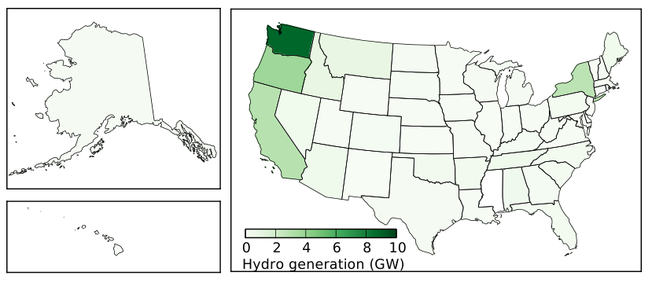
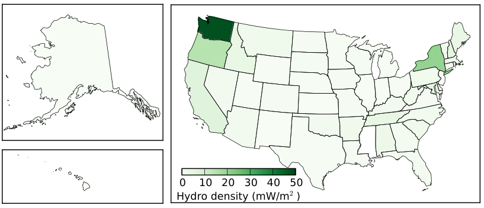
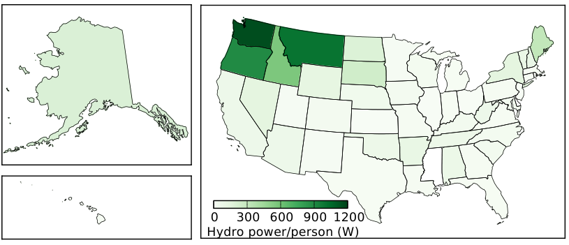
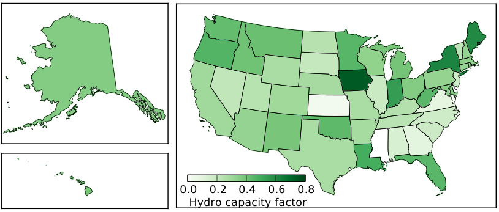
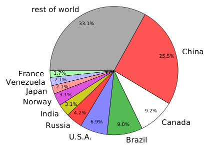

11 水力发电
====================

（大模型翻译，未校对）

自古以来，人们就开始利用流水产生的能量。磨坊作业通常位于溪流附近，这样水流就可以转动连接到研磨机械的轮子。今天，捕获的水流以水力发电的形式成为全球电力的重要贡献者。美国目前约有2.8%的能源（以及7%的电力）来自水能。在全球范围内，水能约占能源的9%，或电力产量的16%（见:ref:`表 7.2<tab7.2>`，第107页）。

水力发电利用了太阳驱动的蒸发循环，依靠降落在高处的降水相对于低处水体所具有的重力能。换句话说，太阳能提升了水，赋予其重力势能，这种能量被捕获并转化为电能。

.. [#] 潮汐能的工作方式与水力发电完全相同，但它是一个小众领域，将推迟到第16.3节讨论。

虽然水力发电是一种简单且低技术的可再生能源形式，并且已被大规模开发利用了一百多年，但它并不是一种容易在其当前使用水平上进一步扩展的能源。本章将帮助大家更好地理解这一可再生能源组合中的支柱及其在未来的可能角色。

11.1 重力势能
-------------

重力是非常微弱的。从日常经验来看，事实似乎并非如此，但请考虑这样一个事实：你手中拿的一块磁铁可以吸起一枚回形针——这克服了整个地球对它的重力吸引！相比之下，电磁力比重力强40个数量级。我们之所以不太注意到这一点，是因为电荷通常趋于平衡，所以重力是我们日常生活中最明显的力\ [#]_ 。

.. [#] 具有讽刺意味的是，我们之所以能感觉到重力，恰恰是因为一种更强的电磁力阻止我们穿过地板。地板和我们脚中的原子里的电子相互排斥，防止了自由落体——在自由落体这种失重状态下，重力是无法被感觉到的！

正如直觉告诉我们，提升一个重物需要做功，因此也需要能量。事实上，由于功定义为力乘以距离\ [#]_ ，而物体上的重力遵循牛顿第二定律，:math:`F = mg`\ [#]_ ，我们需要对物体施加的克服重力的力被称为它的重量，即 :math:`W = mg`，其中 :math:`g = 9.8\ \text{m/s}^2 \approx 10\ \text{m/s}^2` 是地球表面的重力加速度。因此，将一个物体提升高度 :math:`h` 需要输入的能量为这个力 :math:`W` 乘以高度 :math:`h`。我们称之为重力势能，因为提升某物所投入的能量可以在质量被允许下落或降低时释放。重力势能的早期应用形式是老式钟表中链条上的重锤。

.. _def11.1.1:

**定义 11.1.1:** 重力势能（:term:`gravitational potential energy`）计算如下：

.. _eq11.1:

.. math:: U = mgh \tag{11.1}

其中 :math:`m` 是质量（kg），:math:`g \approx 10\ \text{m/s}^2` 是重力加速度\ [#]_ ，:math:`h` 是质量被提升的高度（m）。结果单位为焦耳（J）。

最常见的情况是，重力势能在物体下落时转化为动能：开始时缓慢，但随着越来越多的势能转化为动能而加速（见:ref:`图 11.1<fig11.1>`，第174页）。在计算重力势能时，只有垂直距离起作用：水平运动并不对抗重力。在平坦的水平地板上滑动箱子确实需要做功来克服摩擦力，但该能量被转化为热，不能在以后以有用的形式回收\ [#]_ 。在这种情况下，箱子没有获得任何重力势能，因为它的高度从未改变。

.. _exp11.1.1:

    **示例 11.1.1:** 将一箱重20公斤的书\ [#]_ 从地板提升到一个高架子上，垂直距离为2米，需要的能量消耗为 :math:`mgh \approx 400\ \text{J}`（:ref:`图 11.1<fig11.1>`）。我们可以说箱子获得了400 J的势能。

    如果做功的人以200 W（200 J/s）的速率输出能量，完成这个动作需要两秒钟。

    如果箱子后来从架子上掉下来，砸到一个1.5米高的人的头上，到砸到那个人头部时，箱子已经失去了100 J（:math:`20\ \text{kg} \times 10\ \text{m/s}^2 \times 0.5\ \text{m}`）的势能（现在是动能）。

.. [#] 回忆定义5.1.1（第68页）。
.. [#] 力等于质量乘以加速度。
.. [#] 有些人可能更迂腐地记得它是9.8 m/s\ :sup:`2` ，但对于本书的目的，10 m/s\ :sup:`2` 就完全足够了。注意，选择这个数字意味着我们只关心地球表面上的重力能。
.. [#] 在这种情况下，我们常说能量"损失了"。但能量是严格守恒的——不会被创造或消灭——所以它永远不会真正消失，只是逃逸到了一种无用的形式中。

11.1.1 与其他形式的比较
++++++++++++++++++++++

为了感受重力势能与其他我们熟悉的储能形式相比有多弱，我们将考虑标准AA碱性电池和同等体积汽油中的能量含量。我们讨论的对象大约是一根手指的大小。我们想知道需要将多少质量提升到一定高度，才能产生与一节电池或同等体积汽油中所含相同数量的重力势能。在比较中，我们设想有一个起吊机，可以将一个大质量物体\ [#]_ 提升4米高——大约是一层楼的高度。

一节标准AA电池的额定容量为2.5 Ah\ [#]_ ，工作电压约为1.5 V。按照第5.8节（第76页）的推导，我们将这两个数字相乘得到3.75 Wh，换算为13.5 kJ。将其等同于 :math:`mgh`，其中我们知道 :math:`g \approx 10\ \text{m/s}^2` 且 :math:`h = 4\ \text{m}`，我们发现 :math:`m \approx 340\ \text{kg}`。这真的很重——大约是4到5个人的质量\ [#]_ 。与此同时，AA电池本身只有微不足道的0.023公斤。请花片刻时间思考这个比较，想象一下将340公斤提升到地面上方4米处所提供的能量与手中拿着的一节AA电池相同。

汽油更为极端。以约34 kJ/mL体积的能量密度计算，将一个AA电池大小的杯子\ [#]_ 装满汽油可产生约250 kJ的能量\ [#]_ 。进行相同的计算，我们需要将超过6,000公斤（6公吨）的质量提升到4米的高度才能获得相同的能量含量。典型汽车的质量在1,000到2,000公斤范围内，所以我们谈论的是大约4辆汽车！需要注意的是，我们通常无法以远高于25%的效率将汽油中的热能\ [#]_ 转化为有用功，而重力势能可以以接近100%的效率转化。尽管如此，能够用7毫升汽油中的能量将1,500公斤\ [#]_ 提升到4米的高度还是相当令人印象深刻的，再次强调重力势能是相当弱的。只有当水的质量（体积）相当大时，它才具有意义。

.. [#] ……比如一块石头。
.. [#] 这个数字通常以例如2,500 mAh（毫安时）的形式给出。
.. [#] 想象一下把4到5个人杂乱地塞进网里吊到屋顶高度——这真是一个非常奇怪（而且可能不太高兴的？）AA电池替代方案。
.. [#] ……刚超过7毫升。
.. [#] 因此，按体积计算，汽油的能量密度几乎是AA电池的20倍。通常，我们会按质量讨论能量密度，在这种情况下，密度约高5倍的电池每克提供的能量比汽油少近100倍。
.. [#] ……通过燃烧；参见第6.4节（第88页）。
.. [#] ……现在只是一辆车而不是四辆；这意味着这么小体积的汽油可以将一辆车推上4米高的山丘。

11.2 水力发电
-------------

水力发电的基本原理是，大坝后面的水库中的水（:ref:`图 11.2<fig11.2>`）在大坝底部产生压力，迫使水流通过涡轮机，涡轮机驱动发电机发电——与:ref:`图 6.2<fig6.2>`（第90页）有相似之处，但这里是水流旋转涡轮机。可用的能量等于湖面相对于另一侧水位的高度所对应的重力势能。就好像把水从湖面扔到涡轮机并问在这个过程中放弃了多少势能。实际上，水并不是从湖面掉下来的，但涡轮机处水受到的力由其上方的水柱高度决定——这就是所谓的"水头"。这个过程效率非常高，接近90%的势能捕获，以电力形式从发电机输出。

.. _box11.1:

.. admonition:: Box 11.1: 为什么效率这么高？

    达到90%的效率是非常出色的！电动机和发电机\ [#]_ 在机械能（旋转）和电能之间的转换效率可以超过90%。当与低摩擦涡轮机结合使用时，大坝的损失非常小——这与热源不同，热源中大部分能量不可避免地会损失（原因见第6.4节；第88页）。

.. [#] 从根本上说，电动机和发电机在概念和结构上几乎相同。

.. _exp11.2.1:

    **示例 11.2.1:** 要计算水力发电厂的可用功率，我们需要知道水库的高度和水的流量——通常以立方米每秒为单位测量。水的密度恰好是1,000 kg/m\ :sup:`3` （:ref:`图 11.3<fig11.3>`），所以如果我们考虑一个流量为2,000 m\ :sup:`3` /s、水库高度为50米的大坝，我们可以看到每秒将通过 :math:`2 \times 10^6` 公斤的水\ [#]_ ，相关的势能为 :math:`mgh \approx 10^9\ \text{J}`。如果每秒传递10\ :sup:`9` J的能量，可用功率为1 GJ/s，即1 GW。以90%的效率计算，我们可以获得900 MW的电力。

世界上最大的水力发电设施是中国的三峡大坝，额定功率高达22.5 GW。美国最大的是哥伦比亚河上的大古力水坝，最大发电量为6.8 GW。标志性的博尔德大坝（又称胡佛大坝）刚超过2 GW。

请注意，流量随降雨量季节性变化，因此大坝不能始终以满负荷运行。事实上，美国约有80 GW的装机容量，但年平均运行功率约为33 GW。这意味着典型的"容量因子"约为42%。

.. [#] 流量乘以密度得到每秒质量：2,000 m\ :sup:`3` /s 乘以 1,000 kg/m\ :sup:`3` = :math:`2 \times 10^6` kg/s。

.. _def11.2.1:

    **定义 11.2.1:** 容量因子（:term:`capacity factor`）是一段时间内的实际性能与峰值可能性能之比——即平均输出除以最大输出，以百分比表示。

.. _exp11.2.2:

    **示例 11.2.2:** 科罗拉多河上的博尔德（胡佛）大坝在:cite:`c66` 中列出的容量为2,080 MW，年发电量为4.2 TWh。它的容量因子是多少？

我们只需要将一年中的4.2 TWh换算为平均输出功率。根据瓦时（watt-hour）的定义，我们注意到实际上只需要将4.2 × 10\ :sup:`12` Wh\ [#]_ 除以一年中的小时数：24 × 365，即8,760。

:math:`4.2 \times 10^{12}\ \text{Wh}/8760\ \text{h} \approx 480\ \text{MW}` 平均功率。将其除以2,080 MW（最大容量）得到23%的容量因子。

.. [#] 1 TWh 等于 10\ :sup:`12` Wh。

正如我们在:ref:`图 7.2<fig7.2>`（第105页）和:ref:`表 10.3<tab10.3>`（第170页）中所看到的，美国水力发电占全国总能源消费的2.8%，对应约33 GW的发电量。全球水力发电在2018年平均为477 GW。相比之下，:ref:`表 10.2<tab10.2>`（第168页）表明有44,000 TW的太阳能输入用于蒸发和水文循环。那么，为什么我们只能利用这一丰富资源的0.477 TW（0.001%）呢？这是一个巨大的、尚未开发的可再生资源吗？

11.2.1 理论潜力
++++++++++++++++

要理解太阳能输入与水力发电开发之间巨大的差距，我们首先需要研究蒸发。

.. _def11.2.2:

    **定义 11.2.2:** 水的汽化热约为2,250 J每克，意味着每克水从液态变为气态（蒸汽）需要约2,250 J的能量输入。

.. _box11.2:

.. admonition:: Box 11.2: 汽化是巨大的能量

    为了更好地理解这一点，将一克水从冰点加热到沸腾温度需要100卡路里（418 J）。然后，还需要额外的2,250 J来蒸发水，这个量要大得多。这就是为什么锅中的水不会在达到100°C时全部闪变为蒸汽，如果蒸发能量很小的话就会这样。相反，一锅沸水会在持续施加能量的情况下保持相当长的时间才会全部蒸发。

让我们跟随一克水\ [#]_ 在前往水力发电大坝的旅程中的能量变化——大部分内容表示在:ref:`图 11.4<fig11.4>` 中。首先，太阳注入2,250 J来蒸发那一克水。然后假设它被抬升到5公里\ [#]_ 的高度。重力势能 :math:`mgh` 为 :math:`0.001 \times 10 \times 5000 = 50\ \text{J}`。这仅占蒸发能量的2%\ [#]_ 。

当水在云中凝结时，它向云/空气中释放2,250 J的热能，然后作为雨水落回地面，提供50 J仍可用的能量。如果它落在海洋上（它可能的起始位置），它将所有50 J的重力势能释放到无用的形式中\ [#]_ 。但如果它落在陆地上——高于海平面——它保留了一些重力势能，取决于该陆地高于海平面多少。

.. [#] ……一立方厘米。
.. [#] ……典型的云层高度。
.. [#] 太阳总共必须提供2,300 J来蒸发并提升这一克水，而2,300 J中只有50 J被保留为势能。
.. [#] ……通过空气阻力和与海洋表面的碰撞转化为热量。

.. _tab11.1:

.. csv-table:: **表 11.1:** 水力发电排名靠前的州。
    :name: tab11.1
    :class: booktabs
    :header: 州, 发电量 (GW)

    华盛顿州, 8.9
    俄勒冈州, 3.8
    加利福尼亚州, 3.0
    纽约州, 2.9
    美国总计, 33

平均而言，地形大约比海平面高800米，因此落在陆地上的每一克水平均有8 J的可用能量。但地球表面只有29%是陆地，所以我们追踪的那一克水平均只保留了约2 J的能量\ [#]_ 。

我们现在只剩下输入太阳能的0.1%——从2,300 J输入中保留2 J——因此理论水力发电潜力可能约为44 TW：从44,000 TW的输入中缩减而来。但只有一小部分雨水流入适合筑坝的河流。而一旦筑坝，典型的大坝高度在50米左右，使我们的数字进一步降低。从地形到水库的大部分路程中，高度损失发生在太小而无法实际筑坝的溪流中，或者仅仅是渗入地下。最终，也许不足为奇，我们在全球范围内最终处于亚TW量级。

.. [#] ……从8 J减少，因为大部分雨水落回了海洋。

详细的全球水力发电潜力评估:cite:`c67` 估计，技术上可行的潜力\ [#]_ 约为2 TW，但其中只有一半被认为是经济上可行的。回想一下，全球交付了477 GW，或约0.5 TW，因此大约是我们所认为的实际极限约1 TW的一半。因此，我们可能不会期望当前水力发电有超过两倍的扩张空间。低垂的果实已经被摘取，捕获了总实际资源的大约一半。

与全球约18 TW的能源使用规模相比，水力发电不可能在当前水平上占据很大份额，除非能源使用的总体规模大幅减少。让我们更直观地说：水力发电根本不可能接近满足当前的全球电力需求。

11.3 美国的水力发电
-------------------

水力发电并非在每个地方都同等可用。地理条件和降雨量是关键因素。本节简要介绍美国水力发电的分布和特征。我们从:ref:`图 11.5<fig11.5>` 开始，显示了每个州的平均水力发电量，排名前四的州列在:ref:`表 11.1<tab11.1>` 中。这四个州占美国水力发电量的56%，排名列表上下一个州下降到1 GW或更低。加利福尼亚州的大部分发电量位于该州北部，实际上属于太平洋西北地区的一部分。

为了了解不同能源的集中程度，我们将养成检查可再生能源实施的功率密度的习惯。:ref:`图 11.6<fig11.6>` 显示了各州的水力发电密度\ [#]_ ，即将发电量除以州面积。没有任何一个州超过0.05 W/m\ :sup:`2` ，这可以与日照值（见示例10.3.1；第167页）约200 W/m\ :sup:`2` 形成对比。全球陆地总面积约为 :math:`1.25 \times 10^{14}\ \text{m}^2` ，因此2.5 TW\ [#]_ 的总水力发电潜力将产生0.02 W/m\ :sup:`2` 。因此，华盛顿州显得格外突出，其已开发的发电容量是高端全球平均期望值的2.5倍。换句话说，世界上大多数地方都无法模仿自然赋予华盛顿州的条件\ [#]_ 。

.. [#] ……基于实际发电量，而非装机容量。
.. [#] 这高于估计的已开发资源潜力，但在此处便于数学计算。
.. [#] 华盛顿州在水力发电方面的主导地位很大程度上归功于强大的哥伦比亚河的存在，而非人为因素。

接下来，我们来看人均水力发电量。:ref:`图 11.7<fig11.7>` 显示了结果。从这个角度来看，太平洋西北各州真正突出，而纽约州相对于其按面积的表现则有所减弱。:ref:`图 11.6<fig11.6>` 和:ref:`图 11.7<fig11.7>` 之间的对比实际上反映了人口密度：面积大、人口稀少的州\ [#]_ 在人均地图上比按面积计算的地图上更突出。

最后，为了完整性，我们按州查看水力发电设施的容量因子。用于这些图表的数据库中的总装机容量为77.6 GW，分布在1,317座大坝中，而年平均发电量为28.1 GW——对应整体容量因子为0.36。:ref:`图 11.8<fig11.8>` 显示了这种情况在全国的分布。由于太平洋西北地区在水力发电装机容量方面占主导地位，它在很大程度上决定了整体容量因子。爱荷华州的容量因子很突出，但装机容量只有0.153 GW\ [#]_ 。与此相比，华盛顿州的装机容量为20.7 GW\ [#]_ 。

.. [#] 蒙大拿州、爱达荷州，甚至阿拉斯加州。
.. [#] ……在8座大坝中平均输送0.114 GW，主要由0.125 GW的基奥库克大坝主导。
.. [#] ……在65座大坝中平均输送8.9 GW。

.. _fig11.5:

    **图 11.5:** 美国各州平均水力发电量，主要沿西海岸分布，加上纽约州。是的，阿拉斯加州确实那么大。

.. _fig11.6:

    **图 11.6:** 美国各州按面积计算的水力发电量，展示资源的集中程度。单位为毫瓦每平方米，华盛顿州峰值为48 mW/m\ :sup:`2` 。

.. _fig11.7:

    **图 11.7:** 美国各州按人口计算的水力发电量，指示哪些居民获得了最多的水力发电。太平洋西北地区胜出。

.. _fig11.8:

    **图 11.8:** 美国各州水力发电容量因子。全国平均值（按发电量加权）约为0.42，意味着在一年中，大坝输送其额定容量的约42%——受季节性水流影响。

11.4 全球水力发电
-----------------

本节简要介绍全球水力发电概况，我们在第11.2.1节末尾看到全球水力发电量为477 GW。:ref:`图 11.9<fig11.9>` 显示了哪些国家拥有最多的水力发电，相应数字出现在:ref:`表 11.2<tab11.2>` 中——包括该国从水力发电来源获得的电量占总电量的百分比。请注意，挪威、委内瑞拉、巴西和加拿大从水力发电中获得了超过一半的电力需求。请记住，电力并不是一个国家能源的全部情况，正如:ref:`图 7.2<fig7.2>`（第105页）所清楚表明的那样。

.. _tab11.2:

.. csv-table:: **表 11.2:** 全球水力发电排名前十的国家，占全球水力发电量的三分之二。
    :name: tab11.2
    :class: booktabs
    :header: 排名, 国家, GW, % 电量

    1, 中国, 122, 19
    2, 加拿大, 44, 58
    3, 巴西, 43, 63
    4, 美国, 33, 6.5
    5, 俄罗斯, 20, 17
    6, 印度, 15, 10
    7, 挪威, 15, 96
    8, 日本, 10, 8
    9, 委内瑞拉, 10, 68
    10, 法国, 8, 12

.. _fig11.9:

    **图 11.9:** 全球水力发电分布。世界其他地区占33.1%。

11.5 要旨：水力发电的利与弊
---------------------------

下面两个列表提供了水力发电的一些利与弊，这些与我们评估其在我们可再生能源选项组合中的价值相关。首先是正面属性：

- 天然来源，由太阳驱动，没有废物或污染\ [#]_ ；
- 技术上简单，因此实施和维护直接明了；
- 高效率，将90%的可用能量转化为有用的电力；
- 在日尺度上具有良好的稳定电力基线\ [#]_ ；
- 全生命周期CO\ :sub:`2` 排放仅为传统化石燃料发电的4%:cite:`c68` ；
- 设施\ [#]_ 可以使用一个世纪或更长时间；
- 虽然与能源没有直接关系，但大坝可以提供洪水控制和可靠的水供应。

以下是一些可能阻碍进一步发展的不利因素：

- 泥沙会在大坝后方堆积，排挤水库，最终使其变得无用和危险；
- 需要半永久性地淹没生态栖息地，其质量和价值各不相同；
- 可用功率的季节性变化，通常达十倍之多；
- 废弃或维护不善的设施对下游居民构成大坝决堤危险；
- 阻断鲑鱼的洄游路线，影响海洋和森林生态系统的健康；
- 如分布图所示，水力发电并非在任何地方都是可行的选择：需要地形\ [#]_ 和降雨量的结合。

总的来说，我们的社会已经将水力发电视为一种清洁和可靠的资源。可以将其视为自然界低垂的果实，部分证据是它很早就被大规模采用。随着我们面临越来越大的脱离碳基燃料的压力\ [#]_ ，它可能会继续成为一种有吸引力的能源形式。然而，鉴于其有限的规模和仅限于电力的性质，它将无法为化石燃料的全面替代提供途径。只有当我们的总体能源需求大幅减少时，它才会在我们的能源组合中占据很大比例。

.. [#] ……除了建设和退役方面的影响。
.. [#] ……没有像太阳能或风能那样强加的短期功率波动。
.. [#] ……至少大坝本身如此；涡轮机和发电机将需要定期更换。
.. [#] ……用于容纳水库的山脉或峡谷。
.. [#] ……无论是由于资源限制还是气候变化行动。

11.6 思考题
-----------

1. 如果一个70公斤的人爬10层楼梯，每层3米高，他们获得了多少势能？

2. 如果一个80公斤的人能够以200 W的速率持续几分钟输出外部机械能\ [#]_ ，两分钟内他们能爬多高？

3. 一个10公斤的箱子被提升到离地板2米处，放在一个无摩擦的水平传送带上，将它运过30米的仓库。在传送带末端，它被降低1米放到架子上\ [#]_ 。从过程开始到结束，箱子获得了多少净重力势能？

4. 一节标准AA电池储存约13.5 kJ的能量。每个质量为23克，你需要将电池提升多高才能获得相同数量的重力势能？

   i 这个结果强调了重力势能是多么微弱。

5. 一加仑汽油含有约130 MJ的化学能，质量约为3公斤。你需要将这加仑汽油提升多高才能获得相同数量的重力势能？将结果与地球半径进行比较。

   i 这个结果强调了重力势能是多么微弱。

6. 第5题使用了一加仑汽油来计算重力势能的等效高度。这个结果是否取决于我们选择的汽油体积？给出一个严密的论证，说明为什么是或不是。用符号求解\ [#]_ 可能是有帮助的途径——但不是唯一的方法。

7. 一个典型的美国家庭每天大约使用30 kWh的电力。将此转换为焦耳，然后想象在房屋上方10.8米处建造一个水箱\ [#]_ 来供应一天的电力\ [#]_ 。这需要多少质量的水，以公斤计？在1,000 kg/m\ :sup:`3` 的密度下，以立方米计的体积是多少，以及具有此体积的立方体\ [#]_ 的边长是多少？花一点时间想象（或画出）这种布置。

8. 美国最大的水力发电设施是哥伦比亚河上的大古力水坝。巨大的流量在最大时达到9,400 m\ :sup:`3` /s，大坝（水库）高度为168米。在90%的效率下，这座大坝能够以多大速率生产水力发电（以GW为单位\ [#]_ ）？不要忘记水的密度和 :math:`g \approx 10\ \text{m/s}^2` 。

9. 科罗拉多河上的胡佛大坝（又称博尔德大坝）在流量达到最大速率1,280 m\ :sup:`3` /s 时额定为2.08 GW。如果设施的效率为90%，水库有多高？

10. 在一条河流上建造了一座50米高的大坝，在某一时刻正在输送180 MW的功率。如果设施以90%的效率将重力势能转化为电能，水的流量是多少，以立方米每秒为单位？

11. 一座水力发电设施被设计为提供1 GW的峰值功率，在春季融雪期间的三个月内可以做到这一点。但在夏季的三个月中降至700 MW，然后在秋季的三个月中降至500 MW。在冬季，急剧下降到200 MW持续三个月。使用容量因子的概念（定义11.2.1），该设施的年平均容量因子是多少？

12. 虽然哥伦比亚河上的约瑟夫酋长大坝在全流量时可以产生高达2.62 GW（:math:`2.62 \times 10^9` W）的功率，但河流并不总是以全流量运行。年平均发电量为10.7 TWh/年（:math:`10.7 \times 10^{12}` Wh/年）。大坝的容量因子是多少：实际输送量与全年以100%容量运行时的输送量之比？

13. 纽约的罗伯特·摩西·尼亚加拉大坝的额定功率为2,429 MW\ [#]_ ，容量因子高达0.633。它平均每天生产多少kWh，在全国平均30 kWh/天的情况下可以为多少家庭供电？

14. 第13题中的罗伯特·摩西·尼亚加拉大坝高30米。如果它能够在以90%的效率将重力势能转化为电能的情况下以满容量发电（2.43 GW电力输出），峰值流量是多少，以m\ :sup:`3` /s为单位？

15. 蒸发每克水需要2,250 J，而将水的温度从室温升高到沸点只需要约330 J。如果将一锅水从室温加热到沸腾需要10分钟，如果以相同的速率持续注入能量，还需要多少额外时间才能将水全部蒸发？

16. 从44,000 TW的水文循环太阳能输入开始，仿照第11.2.1节的推导，计算在每个阶段\ [#]_ 剩余的功率（以TW为单位），如果对于每克水：

    a) 水被蒸发并提升到5公里高度\ [#]_ ；
    b) 30%的水落在可以进行收集的陆地上；
    c) 典型的陆地高度为800米；
    d) 只有20%的水到达可以筑坝的位置；
    e) 在原始800米平均高度中，只有50米的高度留给了大坝。

    通过这种分析，全球理论上可能的水力发电量是多少？

17. :ref:`图 10.1<fig10.1>`（第167页）表明全球约有44,000 TW用于蒸发水。我们可以将其转化为对年平均降雨量的估计。最简单的方法是想象一平方米的海洋表面，接收到平均120 W的蒸发输入功率\ [#]_ 。我们正方形上的每一毫米水深具有1升的体积，或1公斤的质量。在120 W的稳定输入下\ [#]_ ，一年中会蒸发掉多少毫米的水？相同数量的水将以降水的形式在某处落回地面。

.. [#] 很难长时间保持200 W。
.. [#] 因此，架子距离同一个（原始）地板1米高。
.. [#] ……使用变量/符号。
.. [#] 假设所有水都在这个高度。
.. [#] 为数学方便假设90%的转换效率。
.. [#] ……立方根的体积。
.. [#] 作为比较，大型核反应堆通常产生约1 GW的电力。
.. [#] ……峰值功率容量。
.. [#] 每个阶段都会进一步降低这个数字；以TW为单位报告。
.. [#] 这是最大的跃升，在每2,300 J中只保留了50 J。
.. [#] 44,000 × 10\ :sup:`12` W 除以 3.7 × 10\ :sup:`14` m\ :sup:`2` 的海洋表面积等于120 W/m\ :sup:`2` 。
.. [#] i 稳定的120 W已经考虑了昼夜：这是一个时间平均值。
