12 风能
==============

（大模型翻译，未校对）

风能在美国乃至全球的电力生产中都取得了显著进展。如今，美国约 2.5% 的能源（以及 6.5% 的电力）来自风能。在全球范围内，风能约占能源消耗的 2.6%，或电力生产的 4.8%（详见 :ref:`表 7.2<tab7.2>`；第 107 页）。

利用风力的基本技术由来已久，几个世纪以来一直用于驱动船只、磨坊作业和水泵。如今，风能的主要用途是驱动发电机产生电能。

正如水电与最基本的重力势能形式相关一样，风能则与另一种简单易懂的形式相连：动能。本章首先带大家熟悉动能，然后探讨我们如何从风中获取能量、能获取多少，以及未来的前景。

12.1 动能
--------------------

运动中的物体携带的动能等于其质量的一半乘以速度的平方。

.. _def12.1.1:

  **定义 12.1.1:** 质量为 :math:`m`、速度为 :math:`v` 的物体的动能（:term:`kinetic energy`）为：

.. _eq12.1:

.. math:: K.E. = \frac{1}{2}mv^{2} \tag{12.1}

.. _exp12.1.1:

  **示例 12.1.1:** 一个 70 kg 的人以 :math:`2\text{ m/s}` 的轻快速度行走，其动能为 140 J。

  以 75 W 的功率将一名 50 kg 的冰上运动员从静止状态推行 3 秒，将赋予其 225 J 的动能，使其速度达到 :math:`3\text{ m/s}`。

对于像这些以陈述而非提问形式给出的示例，你可以通过遮住一个数字并利用现有信息求解来练习解决多种类型的问题\ [*]_。因此，一个示例就能提供多种练习！

.. [*] {-} 请尝试自己计算以便跟进。

通常，我们使用能量源来提供动能，例如移动的飞机、火车和汽车。

.. _exp12.1.2:

  **示例 12.1.2:** 一辆 1,500 kg 的汽车以高速公路速度（:math:`30\text{ m/s}`）行驶，其动能约为 675 kJ。

  要在 5 秒内从静止加速到这个速度，需要 135 kW 的功率\ [#]_，相当于 180 马力\ [#]_。

.. [#] 请亲自计算以验证。
.. [#] 记住 1 hp 等于 746 W。的确，需要一台动力强劲的发动机才能提供这种水平的加速度。

但我们也可以反向操作，将动能转换为不同形式的能量\ [#]_ 以供多种用途。最常见的是，我们将动能转化为电势能（电压）来驱动电路。此时，这些能量可以用来烤百吉饼、给手机充电或洗衣服。

将动能转化为电能的方法通常是通过透平（涡轮机）——本质上是风扇叶片——将流动流体\ [#]_ 中的动能传递给轴的旋转。旋转的轴随后驱动发电机，发电机利用磁铁和线圈之间的相对运动产生电能，其构造和原理本质上与反向运行的电动机相同。

水电设施也是如此——通过涡轮机叶片转动轴——尽管我们将能源界定为重力势能。在水坝的涡轮机内，水流从水库流向出口时获得了动能。风能的作用方式大体相同，即通过将运动空气中的动能转化为风扇/透平的旋转运动，其轴连接到位于叶片后方的发电机。

.. [#] 参见 :ref:`表 5.2<tab5.2>`（第 70 页）的示例。
.. [#] 在这种意义上，"流体"（fluid）是一个通称，可以指液体甚至空气。

12.2 风能
--------------------

人们很容易将空气视为"真空"空间，但在海平面，空气的密度为每立方米 1.25 kg（:math:`\rho_{air} \approx 1.25\text{ kg/m}^3`）。让我们直观地感受一下：想象你身边放着一个立方米大小的盒子（如 :ref:`图 12.1<fig12.1>` 所示）。其中的空气质量为 1.25 kg（约 2.75 磅）。现在在地面上画一个平方米——现实中画或在脑海中勾勒。在这一个平方米上方延伸数公里的空气质量约为 10,000 kg！作为参考，你可以计算一下这相当于多少辆车（通常每辆 1,500 kg），或者什么样的动物会有这么重。

这意味着运动中的空气可以携带大量的动能，因为其质量和速度都不为零。如果整个地球的大气层都以 :math:`5\text{ m/s}`（一阵明显的微风）运动，总质量为 :math:`5 \times 10^{18}\text{ kg}`，那么气流中将拥有 :math:`6 \times 10^{19}\text{ J}` 的动能\ [#]_。如果我们设法从空气中提取所有这些能量——让其运动完全停止——我们预计大气层在 24 小时内（即全球驱动太阳输入的一个完整周期）就会恢复正常的风模式。相关的功率计算出来约为 700 TW。请注意，:ref:`表 10.2<tab10.2>`（第 168 页）中风能的数值为 900 TW\ [#]_，与之非常接近。正如边栏注释所指出的，对于如此少的工作量和非常随意的全球平均风速假设，我们应该为能达到两倍以内的误差感到满意（相关想法见 :ref:`Box 12.1<box12.1>`）。

.. [#] 每平方米 :math:`10^4\text{ kg}` 乘以地球表面积（:math:`4\pi R_{\oplus}^2`）。
.. [#] 在本书的第一稿中，表 10.2 使用了不同的数据源，显示风能为 370 TW。即便是那样，700 TW 的估算也证实了数量级的准确性，被认为是一个令人满意的校验。

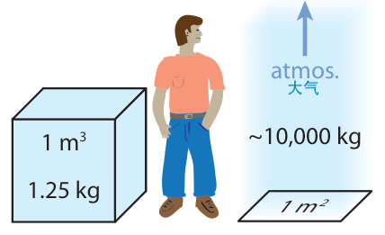

    **图 12.1:** 一立方米空气的质量是 1.25 kg，而一平方米上方的整个大气层质量达到了惊人的 10 公吨。

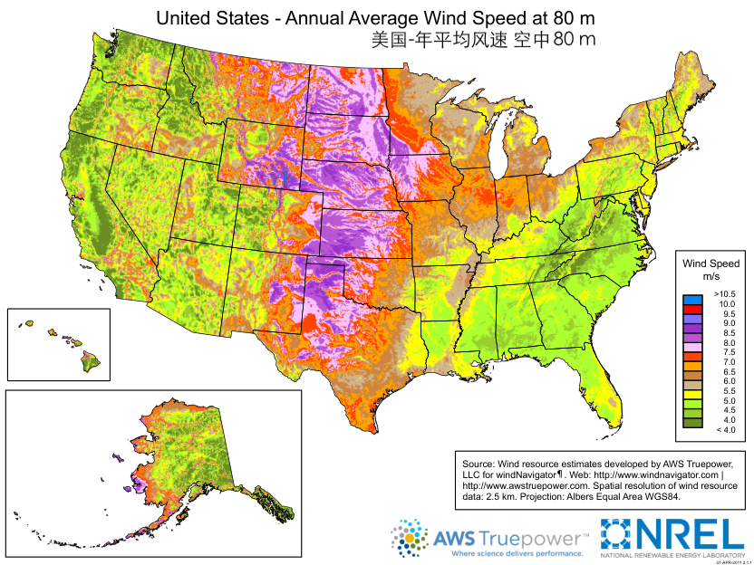

    **图 12.2:** 美国 80 米高度处的年平均风速\ :cite:`c69`。彩色方块之间的界限从 :math:`4.0\text{ m/s}` 到 :math:`10.0\text{ m/s}`，每隔 :math:`0.5\text{ m/s}` 划分一次。这张地图上没有超过 :math:`9\text{ m/s}` 的区域，深绿色代表低于 :math:`4\text{ m/s}`。大平原各州是理想选择。注意阿拉斯加未按比例绘制。来自 NREL。

:ref:`图 12.2<fig12.2>` 显示了美国 80 米高度（典型风力涡轮机高度）的年平均风速。请注意，我们上面使用的 :math:`5\text{ m/s}` 恰好落在地图所示的 :math:`4\text{--}8\text{ m/s}` 范围内。

.. _box12.1:

.. admonition:: Box 12.1: 估算与校验的价值

    像上面这样的计算提供了一种查看某事物是否至少说得通且看似合理的方法。如果我们发现整个大气层必须以 :math:`50\text{ m/s}` 的速度运动才能得到 :ref:`表 10.2<tab10.2>`（第 168 页）中 900 TW 的数字，我们就会怀疑有问题，要么不信任 900 TW 这个数字（寻找另一个来源确认），要么重新评估我们自己的理解。如果我们只需 :math:`0.1\text{ m/s}` 的风速\ [#]_ 就能达到 900 TW，我们同样有理由表示怀疑。当这种粗略估算落在表格数值的邻近区域时\ [#]_，我们至少可以确信该数值并非异想天开，且我们对该现象的基本理解是正确的。将理解与呈现的数据进行对比校验是极好的练习！

.. [#] ……或者需要数周而非一天才能在能量耗尽后重新建立风场。
.. [#] 例如，在十倍以内。

但我们无法捕获大气层中的所有风，因为这样做需要在整个空间体积内布置风力涡轮机，直到 10 公里高！事实上，一些关于实际全球风能设施的估算\ :cite:`c70` 低至 1 TW——远低于我们 18 TW 的总需求。风能本身不太可能完全替代目前来自化石燃料的能源。

12.2.1 风力涡轮机
++++++++++++++++++++

为了理解实际可用的能量，我们退一步考虑有多少空气击中转子直径为 :math:`R` 的风力涡轮机。:ref:`图 12.3<fig12.3>` 说明了这一概念。

如果风速为 :math:`v`，则空气在时间间隔 :math:`\Delta t` 内行进的距离为 :math:`v\Delta t`\ [#]_。

.. [#] 我们可以选择 :math:`\Delta t` 的任何值：较长的时间间隔会形成一个很长的圆柱体，而较小的 :math:`\Delta t` 则会产生一个短粗的圆柱体。最终，我们选择的 :math:`\Delta t` 值会相互抵消，所以并不重要。

风力涡轮机（转子）的横截面积定义为叶片扫过的面积，即 :math:`\pi R^2`。因此，在时间间隔 :math:`\Delta t` 内与涡轮机相互作用的空气圆柱体体积为圆柱体的"底"（圆面积）乘以其"高"（直线长度 :math:`v\Delta t`），即 :math:`V = \pi R^2 v \Delta t`。

我们知道空气密度\ [#]_，所以圆柱体的质量为 :math:`m = \rho_{air} V = \rho_{air} \pi R^2 v \Delta t`。因此，这个空气圆柱体中包含的动能为 :math:`K.E. = \frac{1}{2}mv^2 = \frac{1}{2} \rho_{air} \pi R^2 v^3 \Delta t`。

.. [#] :math:`\rho_{air} \approx 1.25\text{ kg/m}^3`

现在让我们去掉那个烦人的 :math:`\Delta t`。想一想如果我们两边都除以 :math:`\Delta t` 会发生什么：右边的 :math:`\Delta t` 肯定会被消掉，但左边意味着什么：单位时间内的能量？希望到现在你已经熟悉了：这就是功率的概念。

.. _def12.2.1:

  **定义 12.2.1:** 半径为 :math:`R` 的风力涡轮机在风速为 :math:`v` 且运行效率为 :math:`\epsilon` 时提供的功率（:term:`wind power`）为：

.. _eq12.2:

.. math:: P_{wind} = \frac{1}{2} \epsilon \rho_{air} \pi R^2 v^3 \tag{12.2}

其中 :math:`\rho_{air} \approx 1.25\text{ kg/m}^3`（海平面）。效率已插入为 :math:`\epsilon`，现代涡轮机的效率往往在 40–50% 之间。

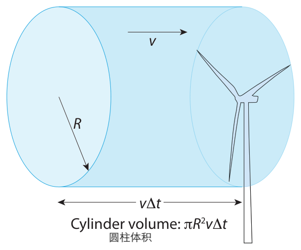

    **图 12.3:** 风能概念。在时间间隔 :math:`\Delta t` 内，以风速 :math:`v` 运动，体积为半径 :math:`R`、长度 :math:`v\Delta t` 的圆柱体空气与转子相遇。请注意，大多数风力涡轮机设计为绕垂直轴旋转，以便无论风向如何都能正对来风。

.. margin::

    .. csv-table:: **表 12.1:** 风能功率随风速的三次方比例变化
        :name: tab12.1
        :class: booktabs
        :header: 速度, 功率

        0, 0
        1, 1
        2, 8
        3, 27
        4, 64
        5, 125
        10, 1000

请注意，输出功率与风力涡轮机叶片路径的面积成正比，这很合理；但更重要且也许令人惊讶的是，它与速度的三次方成正比（见 :ref:`表 12.1<tab12.1>`）。三次方这部分应该让你打起精神：这是速度的一个非常强的函数！这意味着如果风速从轻柔的 :math:`5\text{ m/s}` 变为轻快的 :math:`10\text{ m/s}`，可用功率将增加 8 倍。:math:`20\text{ m/s}` 的强风拥有的功率是 :math:`5\text{ m/s}` 微风的 64 倍\ [#]_。

.. [#] 现在也许更容易理解为什么飓风具有如此大的破坏力了，如果它们的功率随风速的三次方变化，且风速超过 :math:`50\text{ m/s}`。

我们可以这样理解速度的三次方：两个次方来自动能（:math:`v^2`），一个次方来自圆柱体的长度（:math:`v`）。随着风速增加，不仅迎面而来的空气在固定体积内拥有更多的动能，而且在给定时间内与涡轮机相遇的空气体积也更大。

在 :ref:`式 12.2<eq12.2>` 中令 :math:`\epsilon = 1` 对应于风中存在的总功率。但我们不能贪心并抓取所有的能量。事实上，如果我们这样做，就意味着让风力涡轮机处的空气停止：提取所有动能意味着没有剩余速度。如果发生这种情况，新到达的空气将绕过停止的空气质量块，涡轮机将不再能获取迎面而来的能量。理论已经证明\ [#]_：涡轮机能获取的能量上限为可用能量的 :math:`16/27`（59%），这被称为贝兹极限（:term:`Betz limit`）\ :cite:`c72`。这并非技术限制，而是源于流体流动的物理学。对于低速转子运动，还需要考虑第二个因素，即格劳厄极限（:term:`Glauert limit`）\ :cite:`c73`，这会导致随着风速下降，效率也随之降低。

.. [#] 最近的推导见 :cite:`c71`。

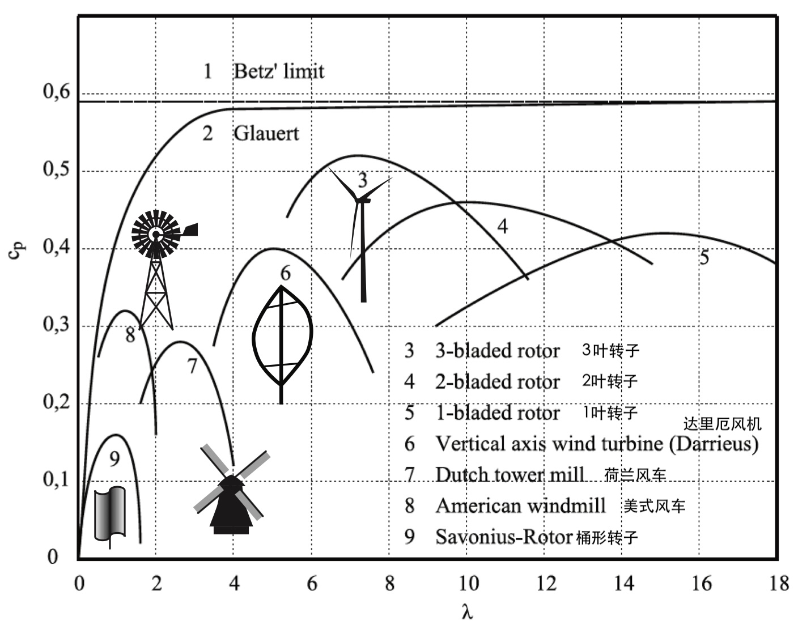

    **图 12.4:** 各种设计的风力涡轮机理论和实际效率（图中为 :math:`\epsilon` 或 :math:`c_P`）。参数 :math:`\lambda` 是叶尖速度与风速的比值：:math:`\lambda` 越高意味着叶尖速度越快。所有设计都必须低于贝兹极限（顶部的水平线）。在较低速度下，格劳厄极限限制了性能，使其位于标记为 2 的曲线右侧。所示的 7 种设计均呈拱形曲线，在特定叶尖速度下达到最大效率。太慢，涡轮机传输的能量不多；太快，阻力/摩擦开始占据主导地位。

:ref:`图 12.4<fig12.4>` 显示了这些理论极限，以及各种转子配置的设计极限。曲线反映了每种设计的最佳转子转速：加快转速会产生更多的发电机输出，直到速度快到叶片上的空气阻力开始占据主导地位。

最常见的现代涡轮机是三叶片设计\ [#]_，能够从风中获取大约 50% 的能量。请注意，叶尖速度可能非常高：是风速的 6–8 倍。这可能会惊扰到该地区的鸟类，它们的飞行速度更接近风速，它们从未见过如此快速移动的物体。关于贝兹极限的现代推导以及效率如何依赖于叶尖速度，请参阅 :cite:`c71`。最大的涡轮机——转子直径达 200 m——额定发电功率可达 15 MW。

.. [#] 三叶片设计不仅效率最高，而且根据 :ref:`图 12.4<fig12.4>`，其较低的叶尖速度比单叶片或双叶片设计更安全。

.. _exp12.2.1:

  **示例 12.2.1:** 一台安装在你家房顶上的小型（直径 4 m）三叶片风力涡轮机，在 :math:`5\text{ m/s}` 的微风中能产生多少功率？

  半径为 2 m，我们选取一个中等的 45% 的效率：:math:`P = \frac{1}{2} \cdot 0.45 \cdot (1.25\text{ kg/m}^3) \cdot \pi \cdot (2\text{ m})^2 \cdot (5\text{ m/s})^3` 结果约为 450 W\ [#]_。

.. [#] 并不太令人印象深刻：在家庭规模上很难获得很多风能，尽管 :math:`10\text{ m/s}` 的风速能提供 3.6 kW。

除了单台涡轮机从空气中提取功率的限制外，我们还发现给区域内安装密度的限制：涡轮机之间需要多大的空间才不会相互干扰。显然，将一台涡轮机直接放在另一台后面是行不通的，因为它们充其量平分到达的风能。即使并排排列，最好也在风车之间留出空间，以免后续排的风力受到削弱。

经验法则（rule of thumb）是横向间距至少为 5–8 个直径，纵向（主导风向）间距为 7–15 个直径\ [#]_。为了说明起见，:ref:`图 12.5<fig12.5>` 显示了间距处于较密集范围的情况，但在其他方面，我们采用较新的建议，即横向 8 个直径，深度 15 个直径\ :cite:`c75`。这算出来的"填充因子"为 0.65%，意味着 0.65% 的土地面积包含了相关的转子横截面\ [#]_。

.. [#] 旧的经验法则是横向 5 个，纵向 7–8 个，但新的研究建议横向达 8 个直径，纵向达 15 个直径。
.. [#] ……每 :math:`8D \times 15D = 120D^2 = 120 \times (2R)^2 = 480R^2` 的土地面积对应一个 :math:`\pi R^2` 的转子面积。

为了与其他形式的可再生能源进行比较，我们可以通过以下方法评估单位土地面积的功率（单位为 :math:`\text{W/m}^2`）：

.. _eq12.3:

.. math:: \frac{power}{area} = \frac{\frac{1}{2} \epsilon \rho_{air} \pi R^2 v^3}{480R^2} = \frac{\pi}{960} \epsilon \rho_{air} v^3 \tag{12.3}

采用 :math:`8 \times 15` 的涡轮机布置方案。使用 40% 的效率和 :math:`v = 5\text{ m/s}`\ [#]_，我们得到 :math:`0.2\text{ W/m}^2` —— 这比太阳能约 :math:`200\text{ W/m}^2` 的日照强度小了 1,000 倍（详见 :ref:`示例 10.3.1<exp10.3.1>`；第 167 页）。

.. [#] 记住这个选择给出了合理的全球风能估算，与 :ref:`表 10.2<tab10.2>`（第 168 页）相符。

关于风力发电的最后一个常识点显而易见：风并不总是吹，且风速变化范围很大。从这个意义上说，风能是一种间歇性能源。与水电设施一样，风能资源的特征在于区域相关的容量因子（:term:`capacity factor`），即实际交付的能量与如果发电设备始终全容量运行所能交付的能量之比。

美国风能的典型容量因子\ [#]_ 约为 33%，:ref:`图 12.6<fig12.6>` 提供了这种特性在现实世界中的直观感受：非常不稳定。

.. [#] 风能的容量因子小于水电，因为风速比河流流量变化更大。

对于极低的风速\ [#]_，风力涡轮机没有足够的风来转动，停滞在零输出状态。此外，涡轮机有额定最大输出功率，这发生在某种中等偏高的风速下\ [#]_，超过该速度发电机就有损坏的风险——就像汽车发动机的"红线"。当风速攀升至此额定最大速度以上时，涡轮机被固定在最大功率上——不再遵循 :math:`v^3` 关系，并故意扭转其叶片\ [#]_ 以降低效率，从而随着风速增加维持恒定的（最大）功率输出。当风速大到足以危及涡轮机时，它会将叶片扭转到与风向平行的位置，让空气通过而不转动转子，使其在"熬过"强风时不再旋转\ [#]_。

.. [#] 低于约 :math:`3\text{ m/s}`；称为"切入"速度（cut-in velocity）。
.. [#] 通常在 :math:`12\text{--}15\text{ m/s}` 左右。
.. [#] 叶片就像长长的飞机机翼，安装在可以沿叶片长度方向旋转的轴上，使其能以任何角度与风接触，从而改变效率。
.. [#] 典型的涡轮机切断风速为 :math:`20\text{--}30\text{ m/s}`。

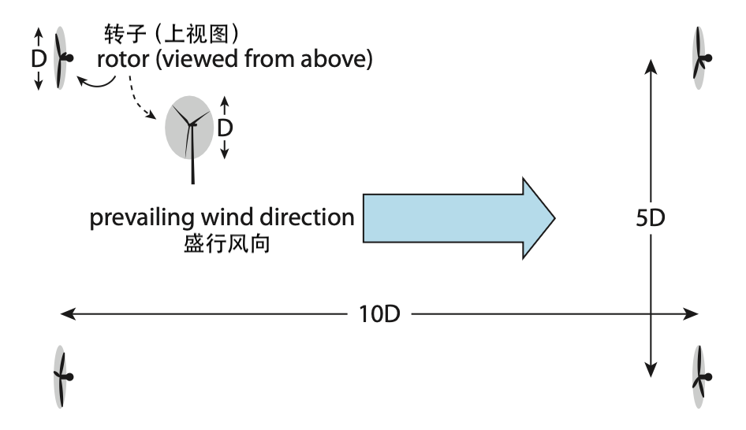

    **图 12.5:** 风电场涡轮机位置俯视图。若纵向间距为 10 个直径，横向间距为 5 个直径，该几何结构的面积"填充因子"为 1.6%。目前的建议是 15 和 8 个直径，比此图所示的要稀疏得多，导致 0.65% 的面积填充。注意大多数涡轮机可以转向正对风向。

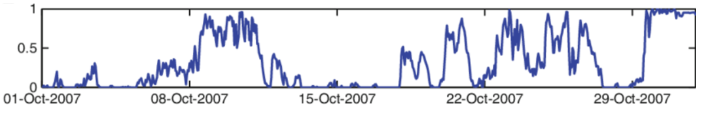

    **图 12.6:** 某 20 MW 风电场一个月的发电情况，说明了间歇性以及容量因子低的原因\ :cite:`c76`。该设施在月底达到最大功率饱和，自动限功率以避免损坏。

:ref:`图 12.7<fig12.7>` 显示了一台 2 MW 涡轮机的典型功率曲线，其上方画出了理论贝兹极限下的速度三次方函数（红色曲线）、44% 效率下的三次方曲线（蓝色，:math:`\epsilon = 0.44`）以及制造商提供的绿色曲线\ :cite:`c77`。

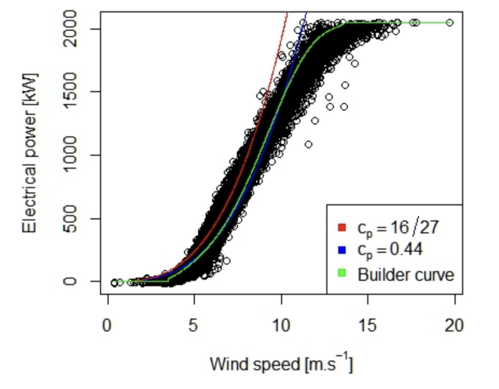

    **图 12.7:** 某额定功率为 2 MW 涡轮机交付功率的实际数据（密集簇状黑圆点），作为风速的函数。红色曲线代表 59% 的理论贝兹极限，表现为速度的三次方函数——正如 :ref:`式 12.2<eq12.2>` 所示。更匹配的蓝色曲线对应总效率 :math:`\epsilon = c_P = 0.44` (44%)，绿色曲线（从三次方函数偏转并在较高速度下饱和）是制造商对该设备的预期\ :cite:`c77`。该涡轮机的"切入"速度约为 :math:`3.5\text{ m/s}`：注意绿色曲线从零输出的小幅跃升。该涡轮机在约 :math:`12\text{ m/s}` 左右达到饱和：绿色曲线趋于平坦，且在此截止值以上没有黑圆点出现。

请注意，涡轮机性能展示了前一段提到的各个方面：在略高于 :math:`3\text{ m/s}` 时"切入"，并在约 :math:`12\text{ m/s}` 以上达到最大值（饱和）。在此之间，它紧密遵循总效率为 44% 的三次方函数（蓝色曲线）。

12.3 风电设施
--------------------

全球风能装机容量正迅速增长，目前（截至 2020 年）已超过 600 GW 的装机容量\ [#]_。:ref:`表 12.2<tab12.2>` 列出了主要参与者，包括装机容量、平均发电量、占总能源的比例\ [#]_、容量因子以及占全球风力发电的份额。前六名国家占全球总量的 77%。

每个国家的风能总量取决于该国可用风能、电力需求增长速度、电力基础设施以及对可再生能源的政治兴趣等因素的结合。

.. [#] 由于容量因子，实际实现的比例很小。
.. [#] 为了将风能与总能源进行比较，我们遵循 :ref:`表 10.3<tab10.3>`（第 170 页）讨论的热当量惯例。

.. _tab12.2:

.. csv-table:: **表 12.2:** 2018 年全球风能设施\ :cite:`c78,c79,c80,c81,c82,c83,c84`
    :name: tab12.2
    :class: booktabs
    :header: 国家, 装机量 (GW), 平均量 (GW), 容量因子 (%), 能源占比 (%), 全球份额 (%)

    中国, 184, 41.8, 22.7, 3.0, 33
    美国, 97, 31.4, 32.4, 2.7, 25
    德国, 59, 12.7, 21.4, 8.3, 10
    印度, 35, 6.5, 18.5, 2.3, 5.2
    西班牙, 23, 5.4, 23.5, 8.3, 4.3
    英国, 21.7, 6.5, 30.0, 6.9, 5.2
    **世界总量**, **592**, **~125**, **21.1**, **2.0**, **100**

2018 年，美国拥有约 94 GW 的已安装风能能力\ [#]_。这一数字近期已超过水电装机容量（约 80 GW）。两者都受到容量因子的影响，美国风能平均为 33%，而水电略高于 40%。净结果是两者的发电量相当\ [#]_。

.. [#] 来自 :cite:`c85` 中的表 1.14.B 和 6.2.B。
.. [#] 正如我们在 :ref:`表 10.3<tab10.3>`（第 170 页）中看到的那样。

美国的风力发电安装在哪里？:ref:`图 12.8<fig12.8>` 显示德克萨斯州以 8.7 GW 夺冠。俄克拉荷马州以 3.2 GW 位居第二，爱荷华州为 2.5 GW。加利福尼亚州以 1.6 GW 位居第五。

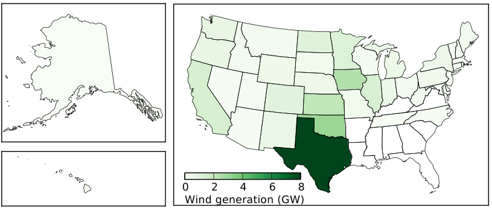

    **图 12.8:** 2018 年各州风力发电量（平均发电量，单位 GW）。德克萨斯州占据主导地位。颜色尺度可能看起来不太有用，但不可否认的事实是，许多州的风力发电并不活跃，而德克萨斯州的主导地位如此显著，以至于其他州几乎微不足道。对数颜色尺度可能会有所帮助，但那样的话，关于总体差距的重要教训可能会被忽视。

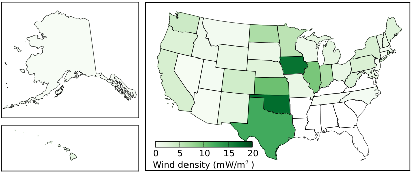

    **图 12.9:** 各州平均风力发电量除以州面积，以表示开发资源的密度，单位为毫瓦每平方米（基于 2018 年数据）。我们可以预期它与 :ref:`图 12.2<fig12.2>` 有一定相似之处，具体取决于哪些地方的风能资源最为有利。

继 :ref:`第 11.3 节<sec11.3>`（第 178 页）采用的流程，我们展示了作为面积函数的风力发电（:ref:`图 12.9<fig12.9>`），以了解设施的集中程度。按此衡量，俄克拉荷马州和爱荷华州跃居德克萨斯州之前。德克萨斯州的总发电量超过其他所有州，但在面积上是一个非常大的州。例如，爱荷华州产生的风能约为德克萨斯州的 30%，但其面积仅为德克萨斯州的 20%。这些数值达到了约 :math:`0.017\text{ W/m}^2`，比水电数值略小，在水电方面有两个州超过了这个数值\ [#]_。我们可以将这些数字与我们在 :ref:`式 12.3<eq12.3>` 之后段落估算的 :math:`0.2\text{ W/m}^2` 充分开发潜力进行比较，得出结论：原则上我们可以大幅扩展风能\ [#]_。

.. [#] 华盛顿州为 :math:`0.05\text{ W/m}^2`；其次是纽约州为 :math:`0.02\text{ W/m}^2`
.. [#] 爱荷华州的情况大约是 10 倍，但请记住 :math:`0.2\text{ W/m}^2` 的估算是基于 :math:`5\text{ m/s}` 的，而爱荷华州的风速评分稍高，如 :ref:`图 12.2<fig12.2>` 所示。

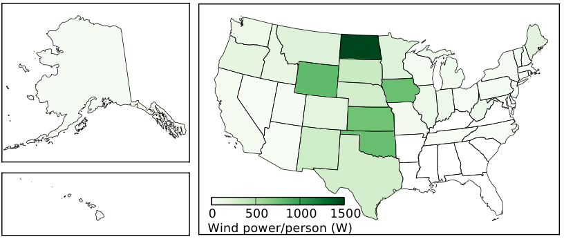

    **图 12.10:** 各州平均风力发电量除以州人口，得出人均平均功率（基于 2018 年数据）。

接下来，我们在 :ref:`图 12.10<fig12.10>` 中查看各州的人均风力发电量。现在北达科他州遥遥领先，人均为 1.6 kW，随后是四个约为该值一半的州。作为参考，美国人均平均功耗约为 10 kW。

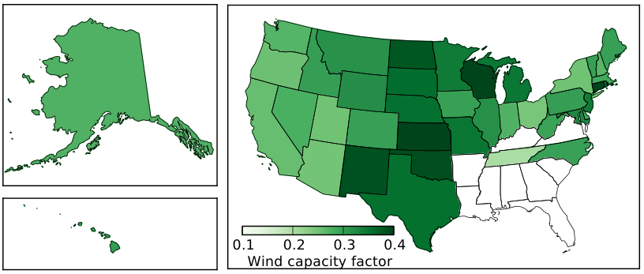

    **图 12.11:** 各州风力发电设施的容量因子（基于 2018 年数据）。

最后，:ref:`图 12.11<fig12.11>` 显示了风能容量因子，表明风力最可靠的地方。堪萨斯州达到了约 41%，但大平原各州总体表现良好。美国东南部几乎没有风能开发\ [#]_，这在上述任何图表中都很明显。

.. [#] 缺乏风力资源使其不太匹配：另见 :ref:`图 12.2<fig12.2>`。

12.4 总结：风吹得不大
----------------------

风能在过去十年中突飞猛进（详见 :ref:`图 7.5<fig7.5>`；第 108 页），证明是一种经济可行且具有竞争力的资源。

但我们能期待从风能中获得多少？综合之前的几项结果：如果整个美国本土（面积约 :math:`10^{13}\text{ m}^2`）都按照估算的功率密度 :math:`0.2\text{ W/m}^2`（基于平均风速 :math:`5\text{ m/s}`）开发风能，并考虑 33% 的容量因子，美国理论上可以从风能中产生 0.7 TW\ [#]_ —— 大约是今天的 20 倍。

.. [#] 为了简单起见，我们在这里略作了变通。如果涡轮机是按 :math:`12\text{ m/s}` 设计的，容量因子已经内置了一些平均值，所以同时使用 :math:`5\text{ m/s}` 和 33% 的容量因子并不完全合理。但另一方面，该国大部分地区有大量时间处于涡轮机切入速度以下，而残酷的速度三次方函数大大抑制了许多地区的土地面积，使其不适合风能开发。因此，这种方法是一种折中方案，可能大致平衡。

我们应该将这个粗略估算视为极端上限，因为难以想象我们会如此充分地开发风能，以至于无论走到哪里，距离风力涡轮机永远只有几百米（几个转子直径）。此外，许多地区处于阈值以下，不支持风能开发投资。即便如此，膨胀的 0.7 TW 估算仍低于美国目前 3.3 TW 的能源需求，存在严重的间歇性问题，且并非所有行业（如运输和工业加工）都能很好利用的形式。虽然单靠风能无法在当前需求水平下替代化石燃料，但它无疑可以成为重要的贡献者。

在全球范围内，风能潜力的估算往往在几个太瓦（TW）范围内，尽管由于多种实际原因可能低至 1 TW\ :cite:`c70`。与水电的情况一样，风能是可再生能源组合中一个可行的参与者，但无法承担全部负荷。

风能并非没有环境方面的顾虑，它会干扰景观和栖息地。其对鸟类\ [#]_ 和蝙蝠的影响最令人担忧，因为转子的移动速度远快于野生动物习惯的任何事物。尽管如此，与化石燃料造成的环境代价相比，它相当清洁——与水电的影响类似。

.. [#] 实际上，家猫目前杀死的鸟类数量远多于风力涡轮机。

优缺点列表将有助于总结。首先是积极属性：

- 风能通过太阳照射每天在地球上补充；
- 利用风力技术相对简单且直接；
- 风能在从迎面而来的风中提取能量方面具有良好的效率——通常为 40–50%；
- 风电的全生命周期 CO\ :sub:`2` 排放仅为传统化石燃料发电的 2%\ :cite:`c68`；
- 风能行业的增长表明了其经济可行性；
- 风能能够扩大规模，覆盖有意义的能源需求份额。

缺点方面：

- 风能是间歇性的：在自然允许时发电，而非在人们需要时；
- 风能具有区域变异性：许多地方的风力不足以支持开发；
- 风能可能对栖息地造成环境干扰——对鸟类和蝙蝠尤其危险；
- 对噪音和景观退化的美学反对意见阻碍了其扩张。

12.5 思考题
------------------

1. 一个适度的巴掌\ [#]_ 可能由大约 1 kg 的质量以 :math:`2\text{ m/s}` 的速度运动组成。这有多少动能？

2. 一个用力的巴掌可能由大约 1 kg 的质量以 :math:`10\text{ m/s}` 的速度运动组成。这有多少动能？如果皮肤具有水的热容特性（如卡路里的定义），:math:`10\text{ g}` 的皮肤\ [#]_ 会升温多少（参见第 5.5 节，第 73 页和第 6.2 节，第 85 页）？

3. 一个 10 kg 的保龄球从 5 m 的高度落下。使用方便的 :math:`g \approx 10\text{ m/s}^2`，它有多少重力势能？就在它接触地面之前，所有这些势能都已转化为动能\ [#]_。根据动能计算，保龄球到达地面时的速度是多少？

4. 保龄球落下结束时速度的最终答案是否取决于质量\ [#]_？请用符号形式写出数学推导\ [#]_ 并求解速度 :math:`v`。结果是否取决于质量？

5. 热能本质上是微观尺度上的随机化动能。为了对此有所了解，考虑一升（1 kg）水，假设卡路里的定义（第 5.5 节，第 73 页）在整个范围内都适用，计算将其从绝对零度温度\ [#]_ 加热到 300 K 需要多少能量。如果同等数量的能量转化为动能——将水抛过房间——对应的速度是多少？

.. [#] ……几焦耳的能量有多痛？
.. [#] ……对应 :math:`10\text{ mL}` 的体积，适合 :math:`10\text{ cm}` 乘 :math:`10\text{ cm}` 的巴掌面积和 :math:`1\text{ mm}` 的深度
.. [#] ……忽略流向空气阻力的任何能量
.. [#] 试试用不同的质量。
.. [#] ……使用变量/符号
.. [#] ……0 K，此时动能实际上被冻结或停止

6. 一栋典型的房屋地板面积约为 :math:`150\text{ m}^2`（1,600 平方英尺）。如果层高通常为 2.5 m，房屋内空气的质量是多少？如果把这堆质量以碎石袋的形式交给你，你能举起它吗？

7. 大气压力约为 :math:`10^5\text{ N/m}^2`，这意味着约 100,000 N 的空气重量——对应 10,000 kg 的质量——压在（海平面或接近海平面的）每平方米地面上。如果空气密度恒定为 :math:`1.25\text{ kg/m}^3`——而不是像实际那样随高度递减——大气层需要延伸到多高才能产生这个重量（质量）？

   这是大气层的标高（scale height）:math:`h_0`，你可以将其与地球上最高的山峰或飞机的飞行高度进行比较。大气层的实际密度随高度呈指数下降，:math:`h_0` 是特征尺度。

8. 比较 :ref:`图 12.2<fig12.2>` 中美国东南部的浅绿色区域与大平原各州的紫色区域，同一个转子放置在大平原地区比在东南部能产生多少倍的功率（大平原地区的功率是东南部的多少倍）？

9. :math:`50\text{ m/s}` 的飓风级强风吹过你的房子，比 :math:`5\text{ m/s}` 的微风强大多少倍？

10. 一台中等大小、效率为 50% 的风力涡轮机，半径为 10 m，在风速分别为 :math:`5\text{ m/s}`、:math:`10\text{ m/s}`、:math:`15\text{ m/s}` 和 :math:`20\text{ m/s}` 时能产生多少功率？根据最自然的方式，以 kW 或 MW 为单位表达答案。

11. 贝兹极限告诉我们最多只能保留可用风能的 59%。如果从一团以速度 :math:`v` 运动的空气中移除了 59% 的动能，之后它的速度是多少\ [#]_，以原始速度的分数表示？

.. [#] 自行选择速度或用符号/变量求解：结果相同。

12. 最大的风力涡轮机转子直径\ [#]_ 约为 150 m。使用合理的 50% 效率，这样一台巨型涡轮机在 :math:`13\text{ m/s}` 的最大设计风速下能输出多少功率？

.. [#] 注意是直径，不是半径。

13. 一篇最近的新闻报道宣布了迄今为止最大的风力涡轮机，直径 220 m，最大输出功率为 13 MW。使用合理的效率，计算达到最大功率时的风速。

14. 将一台三叶片涡轮机在 :math:`7\text{ m/s}` 的中等风速下以最佳效率运行（如 :ref:`图 12.4<fig12.4>` 所示）时的叶尖速度与典型的高速公路行驶速度进行比较（使用相同单位）。

15. 在公路上行驶时，你仔细观察一台三叶片风力涡轮机，确定它需要两秒钟完成一整圈旋转。假设它按照 :ref:`图 12.4<fig12.4>` 在其效率曲线峰值附近运行\ [#]_，如果叶片长度\ [#]_ 看起来约为 15 m，你推断风速是多少？

.. [#] 提示：关注叶尖速度。
.. [#] ……对应于转子的半径

   回想一下，仅仅估算转子叶片长度并计时其旋转就足够让你产生发电量的估计值！

16. 基于思考题 15 的结果，如果这台风车的效率约为 50%，它正在输出多少功率？

17. 以类似于 :ref:`图 12.5<fig12.5>` 的方式，复现文中关于如果涡轮机在一个方向上相隔 15 个转子直径，在交叉方向上相隔 8 个转子直径，每个转子面积占土地面积的比例为 0.65% 的说法。

18. 验证 :ref:`式 12.3<eq12.3>` 的单位确实等价于瓦特每平方米（:math:`\text{W/m}^2`）。

.. [#] ……本质上是 :math:`\rho v^3`

19. 提供清晰的解释，为什么 :ref:`图 12.6<fig12.6>` 中蓝色曲线下方的面积与整个矩形框面积的比值是评估所示风电场容量因子的合适方法？

20. 你估计 :ref:`图 12.6<fig12.6>` 所示风电场性能的容量因子是多少？换句话说，如思考题 19 所探讨的，曲线下方的近似面积相对于整个框面积的比值是多少？近似答案即可。

21. 参照 :ref:`图 12.7<fig12.7>`，检查 :math:`5\text{ m/s}` 和 :math:`10\text{ m/s}` 时的性能，在黑点簇中间选取一个代表性功率值，并从左侧坐标轴分配一个功率值。你从图中读取的功率值之比是多少？与速度三次方比例的理论预期相比如何？

22. :ref:`图 12.7<fig12.7>` 出乎意料地包含了推导转子直径所需的全部信息！该涡轮机在风速为 :math:`10\text{ m/s}` 时似乎产生 1,400 kW 的功率，我们也知道它似乎以 :math:`\epsilon = 0.44` 运行。转子直径是多少？

23. 考虑到风力涡轮机的额定最大耐受风速约为 :math:`12\text{ m/s}`，且容量因子约为 30%，一台直径 100 m 的涡轮机在 45% 效率下运行，预期平均功率\ [#]_ 是多少？

.. [#] 提示：先计算 :math:`12\text{ m/s}` 时的功率，然后应用容量因子。

24. :ref:`表 12.2<tab12.2>` 显示德国的风电装机容量是西班牙的两倍多，但各自的风电占比都是 8.3%。你推断这两个国家之间的差异是什么？

   提示：无需外部研究：这些数字意味着什么？
