13 太阳能
==============

（大模型翻译，未校对）

现在我们迎来了重头戏。正如我们在第 10 章所见，所有严格意义上的可再生能源选项最终都源自太阳。前两章讨论的两种资源——水力发电和风能——仅仅是到达地球的整体太阳能输入中的微小碎屑。实际上，很难设计出从基于水力或风力的资源中获取超过几太瓦（TW）功率的方法。类似的限制也适用于生物衍生能源、地热能、潮汐能、洋流能、波浪能等。考虑到人类社会目前需要 18 TW 的功率，这可能是令人担忧的。同时，太阳向地球表面输送了 83,000 TW 的能量（详见 :ref:`图 10.1<fig10.1>`，第 167 页；:ref:`表 10.2<tab10.2>`，第 168 页）。这几乎是需求的 5,000 倍。因此，从数字上看，太阳似乎提供了我们可能需要的一切。事实上，这种数量上的不平衡如此极端，以至于让人不禁想知道为什么我们还要费心去做其他任何事情。

然而，目前美国只有大约 0.9% 的能源来自太阳能，或者说其电力的 2.3% 来自太阳能。世界范围内的情况也类似，全球能源的 1.2% 是太阳能（电力的 2.1%）。它似乎被极大地未充分利用了。

本章解释了太阳能的性质、其利用潜力、实际考虑因素，并考察了安装现状。虽然大部分重点放在直接从光发电的光伏（PV）面板上，但太阳热能发电也将涵盖。

13.1 光的能量
------------------

第 5.10 节（第 79 页）介绍了光能量的基础知识。本节作为复习，并为本章其余部分奠定基础。

光——一种电磁辐射形式——由光子组成，光子是各自具有特征波长（我们可能称之为颜色）的独立能量粒子。光子是如此微小的能量量子，以至于熟悉的现实环境都充斥着难以估量的大量光子。例如，一个典型的灯泡每秒发射出百亿亿（quintillions）\ [#]_ 个光子。

.. [#] 1: 一百亿亿（quintillion）是 10\ :sup:`18`。

.. _def13.1.1:

  **定义 13.1.1:** 单个光子的能量（以各种形式表示）为：

.. _eq13.1:

.. math:: E_\text{photon} = h\nu = \frac{hc}{\lambda} \approx \frac{2 \times 10^{-19} \text{ J}}{\lambda \text{ (in } \mu\text{m)}} = \frac{1.24 \text{ eV}}{\lambda \text{ (in } \mu\text{m)}} \tag{13.1}

其中 :math:`h = 6.626 \times 10^{-34} \text{ J}\cdot\text{s}`（普朗克常数），而 :math:`\nu` 是光的频率，单位为赫兹（Hz，或反秒）。

第二种形式 :math:`(hc/\lambda)` 很有用，因为我们更常通过波长 :math:`\lambda` 来表征光的"颜色"。光速 :math:`c \approx 3 \times 10^8 \text{ m/s}` 通过下式将频率与波长联系起来：

.. _eq13.2:

.. math:: \lambda\nu = c \tag{13.2}

定义 13.1.1 中的第三种形式使得在已知波长（以微米为单位）\ [#]_ 的情况下，很容易计算出以焦耳为单位的光子能量。可见光的波长约为 :math:`0.4\text{--}0.7 \mu\text{m}`（紫到红），因此在 :math:`0.5 \mu\text{m}` 处，典型的光子能量约为 :math:`4 \times 10^{-19} \text{ J}`。这是一个极小的数字！

.. [#] 2: 1 微米（micron，或 micro-meter），缩写为 :math:`\mu\text{m}`，等于 10\ :sup:`-6` m。

.. _exp13.1.1:

  **示例 13.1.1:** 如果头顶的太阳正在提供 1,000 W/m\ :sup:`2` 的能量，那么每秒大约有多少个光子照射在一块 0.4 m\ :sup:`2` 的人行道上？

  对于阳光特征的可见光，我们可以使用一个方便的波长 0.5 \mu m，这相当于每个光子具有 :math:`4 \times 10^{-19}` J 的能量。我们描述的人行道以 400 W 或 400 J/s\ [#]_ 的速率接收光能。需要多少个 :math:`4 \times 10^{-19}` J 的光子才能达到 400 J？

  除法计算\ [#]_ 得到 :math:`10^{21}`。

.. [#] 3: 0.4 m\ :sup:`2` 乘以 1,000 W/m\ :sup:`2`
.. [#] 4: 或者试着推理一下：10\ :sup:`19` 个光子将构成 4 J，所以我们需要 100 倍。

定义 13.1.1 中的最后一种形式涉及到光子经常与电子相互作用的事实（正如我们将在 :ref:`第 13.3 节<sec13.3>` 中看到的那样），这使得转换为另一种称为电子伏特或 eV（在第 5.9 节介绍）的能量单位变得很方便。一个电子伏特是将一个电子移动经过一伏特的电势差所需要的能量。换算关系是 1 eV = :math:`1.602 \times 10^{-19}` J。例如，我们在上一个示例中使用的 :math:`0.5 \mu\text{m}`（蓝绿色）光子的能量约为 2.5 eV。

我们为什么要关心数量少得难以想象的光呢？可以想到三个原因：

1. 式 13.1 阐明了更蓝的光子（较短波长\ [#]_）比红色的光子具有更高的能量，这一点很重要；
2. 单个光子在微观尺度上与物质相互作用，这与理解太阳能光伏和光合作用相关；
3. 这就是大自然真正的运作方式。

.. [#] 5: 更短的波长。

13.2 普朗克谱
------------------

我们首先应该了解光子来自哪里，这将有助于我们理解太阳能电池板的工作原理及其局限性。直到最近的技术进步之前，光子往往来自热源。对于白热的太阳是如此\ [#]_，对于火焰和白炽灯泡灯丝也是如此\ [#]_。同样，热煤、电加热元件和熔岩都会发光。物理学告诉我们这些热源是如何辐射的，由接下来的三个方程涵盖。第一个（带单位）是：

.. [#] 6: 因此恒星甚至月亮也是如此，月亮只是反射的阳光。此外，像荧光灯和 LED 这样的现代照明光源依赖于控制原子和晶体中电子的能级。

.. [#] 7: ……以及任何在足够高的温度下发光的物体。

.. _eq13.3:

.. math:: P = A\sigma T^4 \text{ (W)} \tag{13.3}

我们已经在第 8.3 节和第 8.4 节的地球能量平衡的背景下见过这个方程。它被称为斯蒂芬-玻尔兹曼定律（Stefan-Boltzmann law），描述了从面积为 :math:`A`（平方米），温度为 :math:`T`（开尔文）\ [#]_ 的表面发射的总功率（以 W 或 J/s 为单位）。常数 :math:`\sigma \approx 5.67 \times 10^{-8} \text{ W/m}^2\text{/K}^4` 被称为斯蒂芬-玻尔兹曼常数，容易被记作 5-6-7-8。\ [#]_

.. [#] 8: 回顾一下，开尔文温度是摄氏温度加上 273（技术上是 273.15）。
.. [#] 9: 斯蒂芬-玻尔兹曼常数实际上是由更基本的常数 :math:`h`（普朗克常数）、:math:`c`（光速）和 :math:`k_B`（玻尔兹曼常数）混合而成的。

.. _eq13.4:

.. math:: B_\lambda = \frac{2\pi hc^2}{\lambda^5} \frac{1}{e^{hc/\lambda k_B T} - 1} \left(\frac{\text{W/m}^2}{\text{m}}\right) \tag{13.4}

方程 13.4 看起来可能很吓人，但只有 :math:`\lambda` 和 :math:`T` 是变量。它描述了普朗克光谱，也称为黑体\ [#]_ 光谱。对于某个温度 :math:`T`，这个函数规定了在每个波长 :math:`\lambda` 发射多少功率。出现了三个物理学关键领域的基本物理常数：:math:`c \approx 3 \times 10^8 \text{ m/s}` 是相对论中熟悉的光速；:math:`h \approx 6.626 \times 10^{-34} \text{ J}\cdot\text{s}` 是量子力学中的普朗克常数，而 :math:`k_B \approx 1.38 \times 10^{-23} \text{ J/K}` 是热力学中的玻尔兹曼常数。\ [#]_

.. [#] 10: 黑体（blackbody）一词实际上是指热辐射的完美发射体和吸收体。
.. [#] 11: 最后一个常数对于学生来说可能以化学形式的理想气体常数 :math:`R = k_B N_A \approx 8.31 \text{ J/K/mol}` 更为熟悉，其中 :math:`N_A \approx 6.022 \times 10^{23}` 是阿伏伽德罗常数。

.. _eq13.5:

.. math:: \lambda_\text{max} = \frac{2.898 \times 10^{-3}}{T \text{ (in K)}} \text{ (m)} \tag{13.5}

方程 13.5 被称为维恩定律（Wien law），它是一个数值解，用于确定黑体光谱的峰值随温度变化的位置。较高的温度意味着微观尺度上具有较高的动能，因此可以产生更高能量（更短波长）的光子。这就是为什么当物体变热时，它们会从红色变为白色，最终变为蓝色色调。

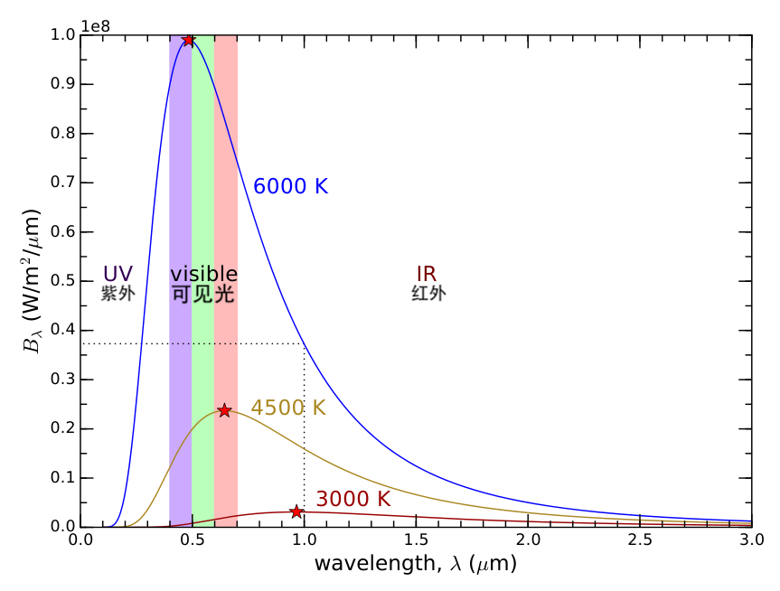

    **图 13.1:** 三个温度的普朗克光谱（或黑体光谱），指示了紫外线、可见光和红外线区域的位置。三个曲线（光谱）的形状由方程 13.4 描述，星形位置由方程 13.5 找到，每平方米表面辐射的总功率是各曲线下的面积，如方程 13.3 所示。虚线与 :ref:`示例 13.2.2<exp13.2.2>` 相关。注意纵轴上的 10\ :sup:`8` 因子，意味着轴的范围从 0 到 :math:`1.0 \times 10^8 \text{ W/m}^2/\mu\text{m}`。

这一切可能看起来令人不知所措，但深吸一口气，然后看看 :ref:`图 13.1<fig13.1>`。到目前为止，本节中的所有内容都在 :ref:`图 13.1<fig13.1>` 中得到了体现。每条光谱的形状都是三种不同温度下方程式 13.4 的函数图。如果将方程 13.4 的输出与 :ref:`图 13.1<fig13.1>` 进行比较，请注意单位已经过调整，以方便使用微米而非米。\ [#]_

.. [#] 方程 13.4 使用米作为 :math:`\lambda` 的单位，但 :ref:`图 13.1<fig13.1>` 使用微米（:math:`\mu\text{m}`，或 :math:`10^{-6}` m）以方便使用。此外，方程 13.4 的答案单位为 W/m\ :sup:`2` 每米波长，但对于图表我们除以 :math:`10^6`，使其变为 W/m\ :sup:`2` 每微米波长。通过处理这个细节，:ref:`图 13.1<fig13.1>` 中每条曲线下的面积应该与方程 13.3 中的 :math:`\sigma T^4` 匹配。

让我们再次使用数字来进行验证，以帮助我们理解。看 6,000 K 的曲线（光谱），我们将验证每个方程式是否有意义。

.. _exp13.2.1:

  **示例 13.2.1:** 首先，方程 13.5 表明发射峰值的波长应该约为 :math:`2.898 \times 10^{-3} / 6000 \approx 0.483 \times 10^{-6} \text{ m}`，或 0.483 \mu m。

  现在查看图表以确认蓝色曲线的峰值确实略低于 0.5 \mu m，由顶部的红星表示。

.. _exp13.2.2:

  **示例 13.2.2:** 现在让我们验证普朗克光谱上的一个点，选择 6,000 K 和 1 \mu m，看看方程 13.4 是否落在 :ref:`图 13.1<fig13.1>` 所示的相同位置。经过计算\ [#]_，我们发现总体结果是每米波长 :math:`3.73 \times 10^{13} \text{ W/m}^2`。一旦我们针对图表上的单位（微米）调整 :math:`10^{-6}`，我们预期为每微米 :math:`0.373 \times 10^8 \text{ W/m}^2`。

  实际上，蓝色曲线在 1 \mu m 的波长处穿过该值，如 :ref:`图 13.1<fig13.1>` 中的虚线所示。

.. [#] 数值上，分子为 :math:`3.74 \times 10^{16}`，分母为 :math:`10^{30}`，指数部分的自变量为 4.8，因此第二个分数为 0.008。

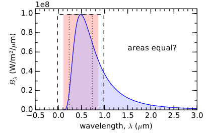

    **图 13.2:** 尝试用三种不同宽度的矩形粗略匹配 6,000 K 普朗克光谱下的面积。最宽的（2 \mu m；虚线）面积过大；最窄的（0.5 \mu m；点线）面积太小。中间的（0.735 \mu m；粉色区域）看起来最接近。

.. _exp13.2.3:

  **示例 13.2.3:** 最后，为了评估方程 13.3，我们可以通过画一个面积相近的矩形来粗略估计蓝色曲线下方的面积。我们将矩形顶部放在蓝色曲线的峰值处，并询问需要多宽才能近似匹配蓝色曲线下的面积（参照 :ref:`图 13.2<fig13.2>`）。

  如果我们取 0.5 \mu m 宽，似乎太窄：面积小于蓝色曲线下的面积。2 \mu m 宽似乎面积太大。所以我们选择中间值如 0.735 \mu m（:ref:`图 13.2<fig13.2>`）。这使得面积约为 :math:`1.0 \times 10^8 \text{ W/m}^2/\mu\text{m}`（矩形顶部的值）乘以 0.735 \mu m，计算得出 :math:`7.5 \times 10^7 \text{ W/m}^2`。由于这是单位面积的功率，我们对方程 13.3 做一个小变换，得 :math:`P/A = \sigma T^4`，代入 :math:`T = 6000` K，求得 :math:`7.35 \times 10^7 \text{ W/m}^2`。相当不错！一切都对得上。

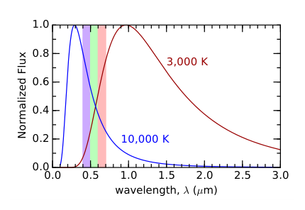

    **图 13.3:** 6,000 K 的恒星（或任何黑体）在可见光谱中呈蓝色倾斜，而较冷的恒星（物体）在 5,000 K 则呈红色倾斜。光谱已归一化为相同的峰值以便比较。

现在我们已经对这些方程进行了一些探讨，让我们吸收一些关键要点。首先，随着辐射源变得更热，曲线下的面积\ [#]_ 急剧增加（随着 :math:`T` 的四次方增加，如方程 13.3 所示）。这在 :ref:`图 13.1<fig13.1>` 中很明显，即从 3,000 K 到 6,000 K\ [#]_ ，曲线下方的面积急剧增加了 16 倍。其次，随着物体变热，它在更短的波长处发射辐射，从红热变为黄热，最终变为白热。温度为 5,800 K 的太阳在 :math:`0.5 \mu\text{m}` 处达到峰值，在蓝绿色区域。我们之所以看不到它是蓝绿色的，是因为它也发出大量的红光，形成混合。注意 :ref:`图 13.1<fig13.1>` 中 5,800 K 的光谱如何很好地覆盖可见光颜色。一颗较冷的恒星在 4,000 K 会带有红色调，因为 :ref:`图 13.3<fig13.3>` 中的 4,000 K 光谱显示出明显的红色偏重。相反，一颗高温恒星在 10,000 K 会带有蓝色调，因为它在约 :math:`0.3 \mu\text{m}` 处达到峰值，在光谱的蓝色端比红色端有更多的辐射通量。

.. [#] ……总辐射功率
.. [#] ……温度翻倍

最后，值得吸收的总体教训是，来自发光光源的光子以分布的形式出现，跨越了很宽的波长（颜色）范围。这对于理解太阳能电池板的效率限制至关重要。

13.3 光伏发电
-------------

我们现在准备深入了解光伏（PV）面板是如何实际工作的，以及是什么决定了面板的效率。\ [#]_ 光伏这个词可以被宽泛地理解为：来自光子的伏特，或由光产生的电。各种材料被用作光伏面板中的主要组件，但绝大多数是由高纯度硅制成的，因此我们仅以此为例。对于其他材料，基本的物理原理是相同的。深入描述半导体物理已经超出了本课程的范围，但值得描绘一个总体图景——足以让我们理解能从光伏面板中获得多少能量。

.. [#] 太阳热能发电将在 :ref:`第 13.8 节<sec13.8>` 中介绍。

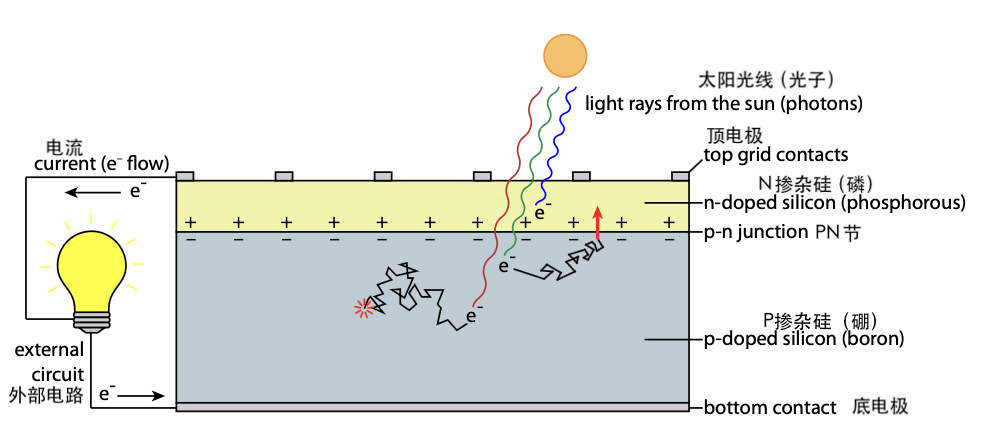

    **图 13.4:** 光伏电池的结构和功能。n 掺杂和 p 掺杂半导体之间的结在结两侧建立了电场。如果入射光子将电子提升到导带并游荡进入结，它将被扫过（红色箭头）并成功贡献电流。如果电子在结上方产生（如蓝色光子更可能的情况，因为它们不太可能穿透太深），则不会贡献。如果电子在找到结之前与空位"复合"（填充空穴），则不会对外部（有用的）电流做出贡献（红色"poof"）。

:ref:`图 13.4<fig13.4>` 说明了基本方案。基本理念是将掺入少量两种杂质\ [#]_ 的两块硅板连接起来，这两种杂质要么提供多余的电子（n 型，用于负电荷施主），要么为电子创造空位（p 型，用于有效正电荷施主）。将 p 掺杂和 n 掺杂材料放在一起会创建一个\ [#]_ 显示接触电势的结。结果是 n 掺杂材料中结处"捐赠"的电子决定穿过结迁移到 p 掺杂材料中的空位，在结的 p 侧创造负电荷墙，并在 n 侧留下"空穴"（缺失的电子）\ [#]_ ，有效产生正电荷。在结附近的区域\ [#]_ ，在分离的电荷之间建立起电场。任何游荡进入该耗尽区的电子都将被扫过结，穿过接触电势，并为随后在外部电路中驱动的电流做出贡献。\ [#]_ :ref:`图 13.4<fig13.4>` 还显示了其他显著特征，将在下文中指出。

.. [#] ……在半导体晶体生长期间或之后掺入杂质；这个过程称为"掺杂"
.. [#]_ 因此，所谓的 p-n 结构成了二极管和晶体管的基础。
.. [#] 当（带负电的）电子离开原本中性的介质时，该介质变得更带正电。
.. [#] ……称为"耗尽区"，因为电子已经从结相邻的 n 侧被消耗
.. [#] 一旦"回家"，电子将填充由太阳释放的电子产生的空位，结束旅程。

13.3.1 光伏的理论效率
+++++++++++++++++++++++++++++

我们现在将追踪一个光子遇到光伏材料时的命运。这样做将揭示光伏的物理过程，并同时追踪损失以阐明效率预期。

基本方案是光子将电子从光伏电池中的原子上撞飞，该电子有机会被扫过结，从而为有用电流做出贡献。\ [#]_ 目标是让电子越过那条线。这就像一些运动中以越过线为目标，但许多因素排列在一起阻止成功实现这一目标。效率与光子产生"成功"的机会有关。

.. [#] 电流只是电荷的流动，在这种情况下只是电子通过外部电路的运动。

一个光子离开炽热的太阳表面，径直射向地球上的光伏面板。光子可以是分布的任何"颜色"，根据 :ref:`图 13.1<fig13.1>` 中的普朗克光谱\ [#]_ 分布。对于 5,800 K 的黑体，根据方程 13.5，最可能的波长约为 :math:`0.5 \mu\text{m}`，但合理范围可以是 :math:`0.4\text{--}2 \mu\text{m}`。大气层在光线到达面板之前会消除（吸收或散射）大部分紫外线，一些红外光也会被大气层吸收。但几乎 80%\ [#]_ 的能量到达了面板。接下来发生什么取决于波长。

.. [#] 光谱可以被看作光子波长的概率分布。
.. [#] 大约 1,000 W/m\ :sup:`2`，即大气层顶部 1,360 W/m\ :sup:`2` 入射量（太阳常数，将在 :ref:`第 13.4 节<sec13.4>` 中推导）。

首先，我们必须了解硅材料的一些特性。典型硅光伏电池中的原子以有序晶格排列，作为单晶生长。昂贵的面板具有单晶硅，这意味着构成面板的每个 15 cm 方形电池都是一个巨大晶体的薄切片。较便宜的多晶（或多晶）面板的电池是毫米到厘米尺度的随机取向晶体的镶嵌。\ [#]_ 但在微观上，两种类型都是有序晶体。硅在其价壳层（最外层）有四个电子，因此一个"快乐"的硅原子拥有四个外壳电子的家庭。这些电子被称为存在于价带。\ [#]_ 但只要获得足够的能量激发，电子就可以离开价带进入导带，\ [#]_ 在导带中它可以自由地在晶体中移动，如果找到结的话，有可能贡献电流。将电子从价带提升到导带的阈值能级称为带隙（band gap），\ [#]_ 对于硅来说，该值为 1.1 eV（:math:`1.8 \times 10^{-19} \text{ J}`）。

.. [#] 参见本章的横幅图片。
.. [#] "带"一词用于描述能级。价带是较低的能级。
.. [#] ……较高能级
.. [#] ……导带和价带能级之间的差异
.. [#] :math:`\lambda = 1.1 \mu\text{m}` 恰好对应 1.1 eV 是一个数值巧合，但也许很方便，因为记住硅的 1.1 就可以从两个方向涵盖它。

波长 :math:`\lambda > 1.1 \mu\text{m}` 的红外光子具有的能量 :math:`E < 1.1 \text{ eV}`，\ [#]_ 根据方程 13.1，能量低于硅的带隙。这些较长波长的光子像穿过透明玻璃一样直接穿过硅晶体。由于这些光子没有被吸收，红外线中超过 1.1 \mu m 的部分入射能量丢失了。对于太阳光谱，这部分占了 23%，如 :ref:`图 13.5<fig13.5>` 所示。

.. [#] ……记为 :ref:`图 13.5<fig13.5>` 中的 ①

对于剩余的阳光，光子能量足够高。\ [#]_ 但这也有问题——如果光子能量高于 1.1 eV，多余的能量会导致电子过快冲出，它通过碰撞晶格损失这部分动能，转化为热量。\ [#]_ 这部分又占了 33%。

.. [#] ……记为 :ref:`图 13.5<fig13.5>` 中的 ②
.. [#] 太阳能电池板在阳光下会变得很热。

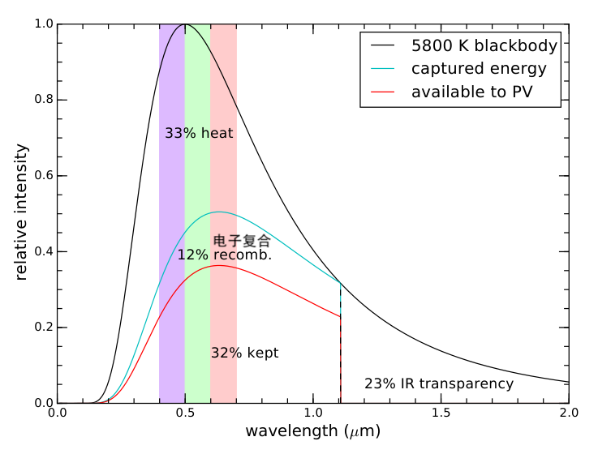

    **图 13.5:** 硅光伏电池中的能量收支。四个区域的面积代表分配到各个域的总入射能量分数。所有波长长于 1.1 \mu m（红外线；23%）的光穿过硅而不被吸收。被吸收的光子给电子提供多余的动能，以热的形式损失 33% 的入射能量。这种效应随着波长变短而越来越显著。在剩余的 44% 中，大约四分之一的电子在穿过结之前"复合"（与硅中的空位重组），留下 32% 作为最大理论效率。

但随着波长变短，能量变高，更大比例的能量以热的形式损失。总体而言，入射光子能量的 33% 以热的形式损失，因为被提升的电子在被驯服之前在晶体中碰撞。

现在我们只剩下原始入射能量的 44%，以已经抖落多余动能的导带电子形式存在。但接下来问题是：电子是"笨"的。它们不知道该往哪个方向走才能找到结，因此毫无目的地在晶格中弹跳，这种运动被称为随机游走。\ [#]_ 有些电子幸运地游荡进入结，在那里被扫过\ [#]_ 并对外部电流做出贡献。其他电子落入电子空位（空穴），这个过程被称为复合：游戏结束。\ [#]_ 粗略地说，大约四分之三\ [#]_ 的电子幸运地在被空穴吞噬之前游荡进入结。因此，在 44% 的可用部分中，我们最终保留了 32%（称为 Shockley-Queisser 极限 :cite:`c69`）。

.. [#] ……有时被称为醉汉游走，在 :ref:`图 13.4<fig13.4>` 中描绘为蜿蜒路径
.. [#] …… :ref:`图 13.4<fig13.4>` 中的红色箭头
.. [#] …… :ref:`图 13.4<fig13.4>` 中的红色"poof"
.. [#] 天真地看，50% 幸运地向上游荡到结，50% 做出错误选择向下游走。但即使那些最初向下游走的电子仍然有机会在时间耗尽并复合之前游荡回结，因此有效率为 75%。

另一个重要损失来自一些光子在结正上方的非常顶层被吸收，因此产生的电子没有机会被扫过结以贡献有用能量。波长越短，光子可能穿透到电池中的深度越浅。\ [#]_ 同时，约 1 \mu m 附近的光子很可能深深穿透——远超结——使得被释放的电子在通过复合进入新家（晶格位置）之前找到结的可能性降低。:ref:`图 13.5<fig13.5>` 反映了这种颜色依赖性，还描绘了一个蓝色光子产生的电子在结上方生成，将没有机会通过穿过结来做有用功。

.. [#] 任何给定光子都有一个作为深度函数的被吸收概率分布。蓝色光子可以深入穿透，但更有可能在前表面附近被吸收。

总体而言，光伏电池的基本物理特性使得 15–20% 的效率是实际实施的合理预期。\ [#]_ 事实上，商业硅基光伏面板的效率往往是 15–20%，与理论最大值相差不远。这似乎是一个很低的数字，但不要失望！生物光合作用最好也只能达到 6%（藻类），光伏技术在这个基础上提高了三倍！正如我们将在 :ref:`第 13.4 节<sec13.4>` 中看到的，更高效率真正做的——除了推高价格——只是使相同功率输出的占地面积更小。但它已经小到足以舒适地适合大多数屋顶，因此效率目前并不是主要限制。

.. [#] 昂贵、非常昂贵的多结光伏电池可用于特殊应用，如在太空中，尺寸和重量极为重要而成本限制较小。这些器件可以通过在不同带隙处堆叠多个结来接近 50% 的效率，更好地利用整个光谱的光。

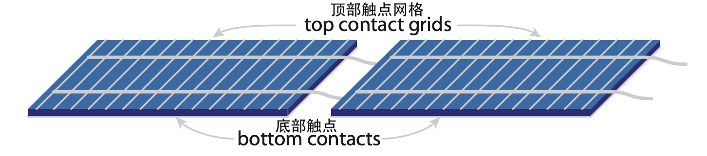

    **图 13.6:** 光伏面板（组件）通常由串联的 60、72、96 或 128 个电池组成，这里描绘了其中的两个。电池通常是约 15 cm 方形，层叠方式如 :ref:`图 13.4<fig13.4>` 所示。底部覆盖连续金属接触，顶部则有细金属栅格接触以最小化对入射阳光的阻挡。每个电池呈现约 0.5 V，串联排列以累加到每面板数十伏特。为此，一个电池的顶部栅格连接到下一个的底部接触，依次沿线路排列。

面板的一个严重缺点是，由于电池串联连接，单个电池的部分遮挡会将整个面板的电流限制为链条中最薄弱环节的电流。换句话说，60 个电池链中可能有 59 个处于全日照，但如果屋顶通风口、烟囱或树木的阴影遮住了一个电池并将其电流限制为其满值的 1%，整条链\ [#]_ 就会被打到 1%。旁路二极管可以隔离问题部分，但通常以 20–24 个电池为一块，因此面板仍然可能因部分遮挡而严重受损。面板串联也会产生对部分遮挡的脆弱性。

.. [#] ……因为在串联中，每个电池共享相同的电流。这个问题有时可以通过微型逆变器来缓解：每个面板都有一个逆变器，以便将较高电压的输出并联组合。

.. _box13.1:

.. admonition:: Box 13.1: 为什么不并联？

    鉴于串联电池的缺点（遮挡阴影问题），为什么不将电池并联——这是将许多电池连接在一起的唯一其他选择？

    串联组合增加电压，保持相同的共同电流。并联组合共享共同的（低）电压，但增加电流。两种方式都可以获得相同的功率 :math:`(P = IV)`。但并联会产生两个问题。首先，约 0.5 V 的电压对于大多数设备来说太小而无法使用。\ [#]_ 其次，连接线中损失的功率与电流的平方成正比，因此设计具有大电流的系统是在自找麻烦。

    话虽如此，光伏安装通常会结合串联和并联——比如 10 个串联面板与另外 10 个串联面板并联。到这个时候，电压已经足够高以抵消损失。

.. [#] 更糟糕的是，线路中的电压降与电流成正比，使已经很小的电压在到达应用时更小。

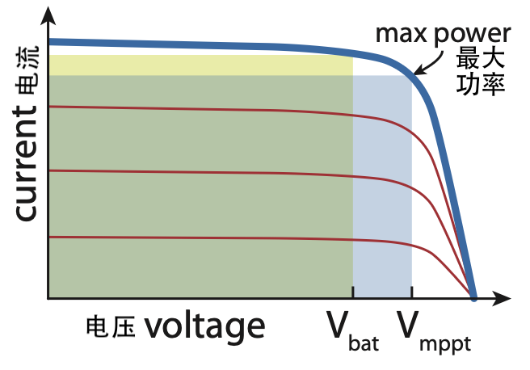

    **图 13.7:** 光伏电池的电流-电压（I-V）曲线。电池在充足的阳光下将在粗蓝色曲线上运行，在较弱的照明下则在较低的红色曲线上运行。硅的最大功率点（mppt）约为 0.55 V，而标称设计可能为 0.6 V，以便 60 电池面板的尺寸适合为 36 V 电池充电。矩形面积与交付的功率成正比，因为 :math:`P = IV`。

光伏面板通常由许多单独的光伏电池串联构成，如 :ref:`图 13.6<fig13.6>` 所示。每个电池在电压约为 0.55 V 时输送最大功率，电池通常以 60 个为一串排列，加到约 30 V。面板通常有 1、2 或 3 个这样的 60 电池串——因此总共有 60、120 或 180 个电池——在峰值功率下成为 30 V、60 V 或 90 V 的设备。:ref:`图 13.7<fig13.7>` 显示了光伏电池（或整个面板）在不同光照水平下的典型性能曲线。回顾方程 6.4（第 88 页），电功率等于电流乘电压，光伏面板输出的功率可以表示为从原点到曲线上某处工作点的矩形面积。使面积（功率）最大化的点在 :ref:`图 13.7<fig13.7>` 中显示为"最大功率点"。正在充电的电池可能会使面板保持在较低的电压，其对应的矩形面积较小，因此以低于面板的最大功率运行。

13.4 日照
-----------------

让我们从第 13.2 节涵盖的物理原理开始。太阳表面的温度为灼热的 5,770 K，意味着其表面辐射功率约为 :math:`6.3 \times 10^7 \text{ W/m}^2`。太阳的半径约为地球半径的 109 倍，\ [#]_ 而地球赤道半径本身约为 6,378 km。将辐射强度乘以面积得到总功率输出：:math:`4\pi R_{\odot}^2 \sigma T^4 \approx 3.82 \times 10^{26} \text{ W}`。这是一盏非常明亮的"灯泡"！

.. [#] ……约 1.5 亿公里，或 1 AU

阳光从太阳向外均匀扩散到膨胀的球面中。当它到达地球时，球的半径等于日地距离，即 :math:`A = 1.496 \times 10^{11} \text{ m}`。将 :math:`3.82 \times 10^{26} \text{ W}` 分布在面积为 :math:`4\pi A^2` 的球面上，计算得出 1,360 W/m\ :sup:`2`。这就是我们所说的太阳常数 :cite:`c86`，这是一个值得记住的数字。

地球以面向太阳的投影面积拦截阳光：面积为 :math:`\pi R_{\oplus}^2` 的圆盘。云和雪等明亮特征将光线反射回太空而不被吸收，即使较暗的表面也会反射一些光。总体而言，29.3% 的入射光被反射，留下 960 W/m\ :sup:`2` 被地球的 :math:`\pi R_{\oplus}^2` 投影面积吸收。但现在将 960 W/m\ :sup:`2` 的输入平均到地球 :math:`4\pi R_{\oplus}^2` 的表面积上，数字被削减了四倍，\ [#]_ 至 240 W/m\ :sup:`2`。

.. [#] 我们可以将这个四倍理解为两个单独的二倍效应：一个是白天与黑夜——一半的时间太阳不在。另一半与太阳不总是头顶直射有关，因此当阳光以倾斜角度照射时，击中每平方米土地的光量会减少。

高纬度地区因太阳角度低而受影响更大，多云地区显然会在地面接收更少的阳光。考虑到天气因素，到达地面的平均太阳功率约为 200 W/m\ :sup:`2` 的合理数字。这被称为日照（insolation）\ [#]_ ——"sol"一词源自solar。

.. [#] ……也称为全球水平辐照度

.. csv-table:: **表 13.1:** 太阳功率密度总结
    :name: tab13.1
    :class: booktabs
    :header: 太阳通量背景, W/m\ :sup:`2`

    到达地球, 1360
    强烈的正午阳光（无云）, ~1000
    地球截面吸收, 960
    地球全表面平均吸收, 240
    典型日照（包含天气影响）, ~200
    15%效率的光伏板提供的典型功率, 30

:ref:`表 13.1<tab13.1>` 总结了这些各种功率密度，最后一行是典型日照乘以 0.15 以代表位于接收 200 W/m\ :sup:`2` 日照位置的 15% 效率光伏面板的输出。:ref:`图 13.8<fig13.8>` 显示了全球日照，变化由纬度和天气组合引起。

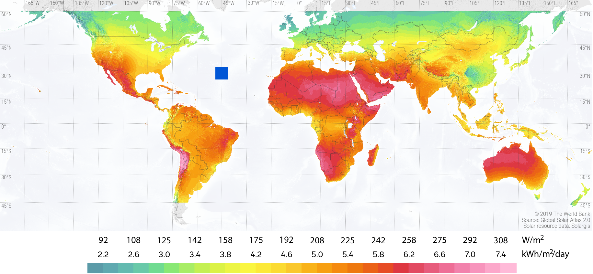

    **图 13.8:** 全球水平面的日照量（面向正上方的平板），单位为 W/m\ :sup:`2` 和 kWh/m\ :sup:`2`/day。大西洋中部蓝色方块区域使用 15% 太阳能收集足以满足当前全球能源需求（当然需要分布式部署）。来源：世界银行。

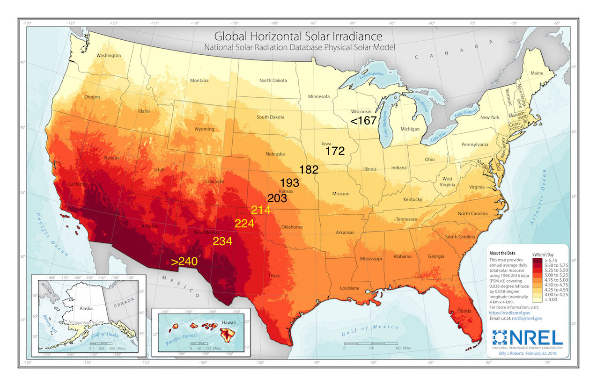

    **图 13.9:** 美国水平日照量（面向正上方的平板）。图形的原生单位为 kWh/m\ :sup:`2`/day，颜色之间的分界从 4.0 到 5.75 kWh/m\ :sup:`2`/day，步长为 0.25。这些值可以通过乘以 1,000 W/kW 并除以 24 h/day 转换为 W/m\ :sup:`2`。\ :cite:`c87` 阿拉斯加未按比例绘制。来自 NREL。

:ref:`图 13.9<fig13.9>` 显示了美国日照的变化。纬度效应很明显，但天气/云层也留下了印记，使西南沙漠具有最高的太阳能潜力。即便如此，从最好到最差位置\ [#]_ 的变化甚至不超过两倍。

.. [#] ……例如，200 对 100 W/m\ :sup:`2`

:ref:`图 13.8<fig13.8>` 和 :ref:`图 13.9<fig13.9>` 都是在水平面的背景下。\ [#]_ 对于太阳能电池板，将它们倾斜到等于站点纬度的角度并朝向南面是有意义的。\ [#]_ 赤道附近的正午太阳总是高悬天空中，因此那里的面板应该平放。\ [#]_ 但在高纬度北部，太阳较低地朝向南方的地平线，因此面板应该倾斜以最好地面向太阳。倾斜到等于纬度的角度是最佳折中方案，如 :ref:`图 13.10<fig13.10>` 所示。

.. [#] ……日照的定义也是如此
.. [#] ……对于北半球位置朝南；更一般的正确说法是"朝向赤道"
.. [#] ……主要朝上

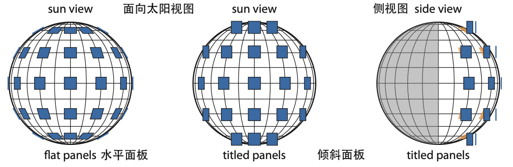

    **图 13.10:** 倾斜到纬度、朝南的光伏板的太阳能潜力。图形以 kWh/m\ :sup:`2`/day 为单位呈现，颜色之间的分界从 4.0 到 7.0 kWh/m\ :sup:`2`/day，步长为 0.5。\ :cite:`c88` 来自 NREL。

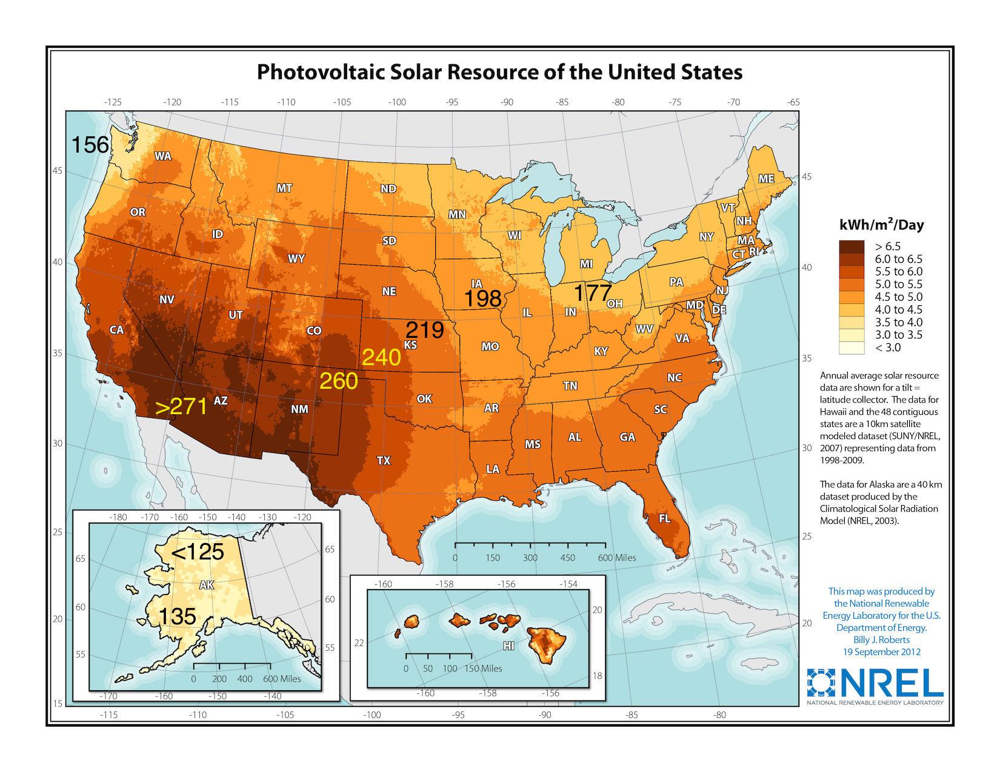

    **图 13.11:** 在一块固定的土地上，接收固定数量的倾斜阳光，无论面板是平放还是倾斜，接收的能量是独立的。仅仅将平板倾斜（中间）会导致自遮挡。最合理的做法是倾斜并分隔面板（右侧），一个好处是需要更少的面板来收集相同的入射能量。

将面板朝赤道方向倾斜等于站点纬度的角度可以优化年产量，结果显示在 :ref:`图 13.10<fig13.10>` 中。请注意，:ref:`图 13.10<fig13.10>` 中的数字不严格是日照，因为日照定义为到达平坦地面的量。在这种情况下，面积（平方米）是面板的，而不是土地的。

:ref:`图 13.10<fig13.10>` 中的数字高于 :ref:`图 13.9<fig13.9>` 并不是说如果面板倾斜土地提供了更多太阳能：只是单个面板可以获得更多的光。但在这种情况下，面板需要间隔开以避免遮挡，\ [#]_ 如 :ref:`图 13.11<fig13.11>` 所示。

.. [#] ……可能比仅仅部分面积被遮挡更具破坏性，由于面板模块中电池的串联排列

向后退一步，让我们从这些地图中欣赏几个大局要点。首先，数字倾向于在 200–300 W/m\ :sup:`2` 的一般范围内。记住这个范围——它是一个有用的背景。其次，从美国太阳能最强的地方到最弱地区的变化\ [#]_ 在年度基础上不超过两倍。这是令人惊讶的。加利福尼亚州的莫哈韦沙漠和华盛顿州的雨林奥林匹克半岛在太阳能照射方面似乎是白天和黑夜的对比。但并非如此：只有两倍。这意味着如果能够实现年度时间尺度的储能，太阳能几乎在任何地方都可以变得实用。

.. [#] ……忽略偏向北极的阿拉斯加

.. _box13.2:

.. admonition:: Box 13.2: 全日照等效小时数

    一个有用的指标是从原生地图中使用的单位得出：kWh/m\ :sup:`2`/day，而不是我们更喜欢的 W/m\ :sup:`2`。虽然乍一看它们不同，但 kWh 是能量单位，所以 kWh/day 是功率，就像 W 一样。由于 1 kW = 1,000 W 且一天有 24 小时，1 kWh/day 等于 1,000 Wh/24 h = 41.67 W。\ [#]_ 所以我们可以将 1 kWh/m\ :sup:`2`/day 乘以 41.67 得到 41.67 W/m\ :sup:`2`。

    但这个方框的主要目的是指出以下内容。头顶直射阳光以约 1,000 W/m\ :sup:`2` 的功率沐浴地面。\ [#]_ 所以如果你能设法让太阳直接头顶照射 5 个小时，你将每平方米地面获得 5 kWh 的太阳能。因此，如果你的站点日照为 5 kWh/m\ :sup:`2`/day，它相当于全天有 5 个小时的"全日照等效小时数"。这导致了一个全日照等效小时数的概念。一个年均日照为 5.4 kWh/m\ :sup:`2`/day 的站点可以说每天获得 5.4 小时的全日照等效。这是一个非常有用的指标。

    Box 13.2 引出了一个关于表征光伏系统的关键理解。面板的额定值基于在 1,000 W/m\ :sup:`2` 光照下、温度为 25°C 时将交付的功率。\ [#]_ 因此，以 kWh/m\ :sup:`2`/day 或全日照等效小时为单位的度量有效地告诉你面板在一天中将有多少时间以额定容量运行。

.. [#] 分子中的小时和分母中的小时约去，因为千瓦时是 kW 乘以小时。
.. [#] 这个等价依赖于一个方便的事实：全头顶太阳约为 1,000 W/m\ :sup:`2`。否则它不起作用。
.. [#] 1,000 W/m\ :sup:`2` 在大气层顶部是合理的，但大气层会阻挡/散射可见光谱之外的一些波长。

.. _exp13.4.1:

  **示例 13.4.1:** 一块 250 W\ :sub:`p` 的面板在日照为 4.8 kWh/m\ :sup:`2`/day 的位置（即 4.8 个全日照等效小时），基本上在每 24 小时中的 4.8 小时以 250 W 运行，即 20% 的时间。因此面板输送的平均功率为 50 W，而不是 250 W。\ [#]_

  250 W 的额定值被称为"峰值"瓦特，有时记为 250 W\ :sub:`p`。面板就是这样销售的，现在的价格约为 0.50 美元/W\ :sub:`p`。

.. [#] 我们需要应用 0.85 到 0.90 的降额系数来考虑光伏板在阳光下的典型温度，使面板的平均功率约为 50 W。

美国国家可再生能源实验室（NREL）\ :cite:`c87` 于 1991 年启动的一项 30 年研究对美国各地的太阳能潜力进行了表征，并为不同方向的面板每月可能收集的能量产生了详细统计数据。:ref:`表 13.2<tab13.2>` 是密苏里州圣路易斯完整数据的一个子集。\ :cite:`c87` :ref:`表 13.2<tab13.2>` 中的所有情况对应于朝南的面板，在各种倾斜角度（包括平放的 0° 和垂直的 90°；其他倾斜角度相对于站点纬度 :math:`\phi \approx 39°`）。由此，我们看到将面板倾斜到站点纬度时年均值为 4.8 kWh/m\ :sup:`2`/day，与 :ref:`图 13.10<fig13.10>` 的图形预期一致。还显示了月度细分以及不同倾斜角度如何转化为性能。

.. _tab13.2:

.. csv-table:: **表 13.2:** 密苏里州圣路易斯朝南面板的日照量（kWh/m\ :sup:`2`/天）\ :cite:`c87`
    :name: tab13.2
    :class: booktabs
    :header: 角度, 一月, 二月, 三月, 四月, 五月, 六月, 七月, 八月, 九月, 十月, 十一月, 十二月, 年均

    0°, 2.2, 2.9, 3.9, 5.0, 5.9, 6.4, 6.4, 5.7, 4.6, 3.5, 2.3, 1.8, 4.2
    θ−15°, 3.2, 3.8, 4.6, 5.4, 5.9, 6.3, 6.3, 6.0, 5.3, 4.5, 3.2, 2.7, 4.8
    θ, 3.6, 4.2, 4.7, 5.3, 5.6, 5.8, 5.9, 5.7, 5.3, 4.8, 3.5, 3.1, 4.8
    θ+15°, 3.8, 4.3, 4.6, 4.9, 4.9, 5.0, 5.1, 5.2, 5.1, 4.8, 3.7, 3.3, 4.6
    90°, 3.5, 3.7, 3.4, 3.1, 2.6, 2.4, 2.6, 3.0, 3.5, 3.8, 3.2, 3.0, 3.2

13.5 令人难以置信的太阳能潜力
---------------------------------

太阳能的潜力可以通过我们已经看到的各个部分来评估。将太阳常数 1,360 W/m\ :sup:`2` 乘以地球的投影面积（:math:`\pi R_{\oplus}^2`）并乘以 0.707 以考虑 29.3% 的反射损失，我们计算出地球以 1.23 × 10\ :sup:`17` W 或 123,000 TW 的速率吸收太阳能。与社会 18 TW 的规模相比，这太大了！注意 :ref:`表 10.2<tab10.2>`（第 168 页）中非反射条目加起来等于同一个值。

只要在 10% 的陆地（本身是地球表面积的 29%）上部署效率为 15% 的光伏面板，捕获入射能量\ [#]_ 就能产生约 500 TW 的电力——大约是当今社会 18 TW 使用率的 25 倍。这反过来意味着，我们目前的能源需求可以通过仅覆盖 0.4% 的土地\ [#]_ 来满足：参见 :ref:`图 13.8<fig13.8>` 了解这是多少的直观表示。太阳能是目前唯一能够接近满足我们当前能源需求的可用资源。而且它以巨大的幅度超越了我们的需求！因此我们有理由对太阳能感到兴奋：原始数字确实是好消息。

.. [#] ……总 123,000 TW 中的部分
.. [#] ……10% 起始点的 1/29

然而，太阳能也存在明显的缺点。首先是成本。面板成本已降至每峰值瓦特 0.50 美元左右。要在典型位置获得 10 TW 的（平均）输送功率——假设 20% 的容量因子\ [#]_ ——将需要约 50 TW\ :sub:`p`（:ref:`示例 13.4.1<exp13.4.1>` 定义了 W\ :sub:`p`），花费 25 万亿美元。其他必要组件和安装的成本会使公用事业规模项目的成本翻倍 :cite:`c89`，使总成本达到 50 万亿美元。\ [#] 全球年经济总量还不到这个数字的两倍。为全世界配备所需数量的面板将消耗约 60% 的经济总量一年，或 6% 持续 10 年，或 1.5% 持续进行。\ [#]_ 作为比较，世界每年消耗约 300 亿桶石油，每桶 50 美元，即每年 1.5 万亿美元。安装足够的面板以完全满足需求将花费整整三十年的全球石油预算。因此这不会很快发生。从个人角度来看，美国人以 10,000 W 的速率使用功率。为了覆盖这一需求，每个人需要约 50 kW\ :sub:`p` 的面板，每人花费 50,000 美元。你打算什么时候付款？

.. [#] 20% 的 24 小时对应每天 4.8 个全日照等效小时。
.. [#] ……基于 30 年的努力，此时第一批面板需要更换。
.. [#] 这里的一个微妙之处是，美国人目前使用的大部分 10 kW 是热能形式（化石燃料），效率约为 30%。对于可以利用电力的非供暖应用，太阳能具有优势。另一方面，通过储能来缓解间歇性可能需要将光伏装置扩大多达两倍。作为粗略估算，我们姑且说每人 10 kW 的光伏可以 90% 的时间覆盖全部需求。

另一个令人清醒的认识是，即使只需要 0.4% 的土地来匹配当前需求，这个面积也相当于目前道路和建筑物覆盖的面积。穿越全国公路旅行会让人感受到所有这些路面有多么广阔（和无聊）。路面是一种高级形式的泥土。光伏面板也是一种超纯、高级形式的泥土。但它是不同级别的高科技。很难想象世界上到处都是如此多的光伏面板。

太阳能的一个主要障碍是其间歇性。\ [#]_ :ref:`图 13.14<fig13.14>` 显示了 31 天的太阳能捕获，以及典型的全州电力需求。两者的形态看起来不太相似：不太匹配。需求远比太阳能输入稳定得多，而太阳能输入在夜间显然为零。即使峰值也不太吻合，因为需求在傍晚最高，远在太阳能输入消退之后。

.. [#] 回忆一下风也有类似的问题（:ref:`图 12.6<fig12.6>`；第 190 页）。

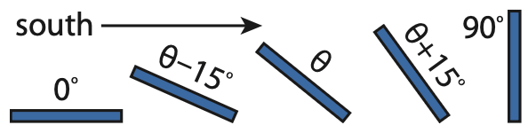

    **图 13.14:** 太阳能输入（红色）和电力需求（蓝色）看起来完全不同。来自作者的太阳能数据始于 2019 年 3 月 1 日，而需求是加利福尼亚州的。刻度线标记每个日期的开始（午夜）。4 月 6–11 日基本上是无云的完美晴天，而该月早些时候有雨天。注意，即使是非常多雨的一天（4 月 1 日）也能提供一些太阳能（约满日照日的 15%）。间歇性云层导致某些天出现"毛发"状波动。该月的容量因子为 19%，而接近月底的完美六天以 27% 的容量运行。由此我们推断，天气使产量降到了每天无云条件下的 70%。

储能是缓解间歇性所必需的，使断断续续的太阳能输入能够满足 :ref:`图 13.14<fig13.14>` 的需求曲线。我们没有季节性储能的良好解决方案，\ [#]_ 因此完全依赖太阳能将需要过度建设系统以处理冬季数月的低日照条件（参见 :ref:`表 13.2<tab13.2>` 中的年度变化），使成本更加高昂。

最后，并非所有能量都是等效和可替代的。太阳能光伏无法为客运飞机提供动力，也无法实时为汽车行驶提供动力（只能通过储能）。\ [#]_ 尽管潜力巨大，但障碍是如此严重，以至于在光伏电池首次演示 60 多年后，我们不到 1% 的能源来自这一超丰富资源。

.. [#] 问题不在于储存多长时间，而在于是否有足够的容量将夏天多余的能量储存起来在冬季使用。
.. [#] 可以建造太阳能飞机或汽车，但不能像我们已知的那样（参见 Box 13.3）。我们可以将这些东西视为"可爱"的演示，而不是可行的替代路径。

.. _box13.3:

.. admonition:: Box 13.3: 为什么没有太阳能飞机？

    考虑一下头顶直射阳光提供 1,000 W/m\ :sup:`2`。典型商用飞机（波音 737）的顶部面积约为 450 m\ :sup:`2`。即使配备最昂贵的航天级多结光伏电池（50% 效率），飞机也将捕获约 500 W/m\ :sup:`2` 和总计 225 kW。听起来很多！但问题是波音 737 在巡航时花费约 7 MW（爬升期间更多）。即使在最优\ [#]_ 条件下我们也差了约 25 倍！任何太阳能飞机都将非常轻且非常慢——按照航空旅行的标准来看。

    汽车也有类似的问题：车顶面积约 10 m\ :sup:`2`，配备最昂贵的光伏板可产生 5 kW，或不到 7 马力。这比典型汽车弱约 20 倍，所以同样：轻和慢。

.. [#] 飞机不会总是有头顶直射阳光！

13.6 住宅太阳能注意事项
-------------------------

尽管存在这些缺点，但在家庭中投资太阳能光伏仍然非常有意义。\ [#]_ 我们将在本节中探讨尺寸和成本。

.. [#] 作者大部分家庭运行在他自己建造的离网光伏系统上：说到底是一个太阳能爱好者。

13.6.1 配置
+++++++++++++++

典型家庭在没有阳光照射时（照明、烹饪、夜间娱乐、为电动汽车充电等）使用大部分能源，因此需要本地储能，\ [#]_ 或者与区域电网绑定，以便在白天出口过剩的生产，在夜间或家庭需求超过太阳能生产时使用公用事业产生的电力。美国绝大多数太阳能装置都是并网的，很少有人使用电池，电池可以使系统成本翻倍，并且在系统通过节省电费收回成本之前就需要更换。

.. [#] ……电池：昂贵，需要维护，并需要定期更换

.. _box13.4:

.. admonition:: Box 13.4: 令人失望的依赖

    许多"使用太阳能"的人会感到一个令人失望的惊喜：当房屋的电力服务中断时——即使在白天——他们的房子也没有电。并网系统需要电网才能运行。安全方面的考虑禁止光伏系统继续向已停用的电网供电。

    只有"离网"电池系统在这些情况下才能继续工作，但令人失望之处就转移到了价格标签、维护以及经过数千次循环后磨损电池的更换上。

    虽然组件和实际运作方式的描述超出了本书的范围，但学生可能会对作者在首次开始研究光伏系统后撰写的文章感兴趣 :cite:`c90`。

13.6.2 尺寸与成本
++++++++++++++++++++++

我们需要多大的太阳能装置？如果目标是覆盖并网系统中的年度或月度电力使用，唯一需要的信息是相关时期内典型的电力消耗和该位置在该时期的平均太阳能输入。

前者可以从电费单中推测，通常给出以 kWh 为单位的月度总用量。我们可以从 :ref:`图 6.5<fig6.5>`（第 95 页）中获得一个大致的平均规模，该图表明 38% 的住宅能源（20.4 qBtu/年）来自电力。即 7.7 qBtu，或一年 5.3 × 10\ :sup:`18` J（3.156 × 10\ :sup:`7` s），或 168 GW。\ [#]_ 分配给美国约 1.2 亿个家庭，平均家庭电力消耗约为 1,400 W。在 24 小时内应用，每个普通家庭每天约产生略多于 30 千瓦时（kWh）。

.. [#] ……对于 3.3 亿人口是合理的：平均每个家庭约 2.7 人

下一部分是感兴趣位置的太阳能潜力。我们将使用 :cite:`c87` 中密苏里州圣路易斯的摘录数据，见 :ref:`表 13.2<tab13.2>`。

.. _exp13.6.1:

  **示例 13.6.1:** 让我们为美国平均家庭在一个美国平均\ [#]_ 城市（圣路易斯）设计一个并网 PV 系统。我们将面板朝南倾斜到站点纬度（39°），并购买 18% 效率的光伏面板（相当典型）。

  :ref:`表 13.2<tab13.2>` 表明，对于这种配置，我们可以预期年均输入为 4.8 kWh/m\ :sup:`2`/天。如果我们目标为每天 30 kWh，我们将需要 6.25 m\ :sup:`2` 运行在 100% 效率的面板。\ [#]_

  但 18% 的面板将需要约 35 m\ :sup:`2` 的面板，\ [#]_ 这将是一个约 6 米见方的正方形阵列（约 20 英尺）或 5 乘 7 米的矩形等。总面积（400 平方英尺）远小于典型的房屋占地面积，所以这是个好消息。

.. [#] ……就太阳能而言
.. [#] ……将 30 kWh/day 除以 4.8 kWh/m\ :sup:`2`/day
.. [#] ……将 6.25 m\ :sup:`2` 除以 0.18

.. _exp13.6.2:

  **示例 13.6.2:** 在一种方法中，我们将 :ref:`示例 13.6.1<exp13.6.1>` 中的 35 平方米面积乘以 1,000 W/m\ :sup:`2`，然后乘以光伏效率（本例中为 18%），得到将输送多少功率：6.3 kW。

  或者，我们可以采用 4.8 kWh/m\ :sup:`2`/天作为在峰值输出下运行的等效全日照小时的解释（Box 13.2）。为了在 4.8 个全日照等效小时内获得我们的目标 30 kWh，我们需要在这 4.8 小时内产生 6.25 kW。

  无论哪种方式我们得到相同的答案，这是一个很好的验证。

我们应该假设面板由于以下原因无法达到其额定潜力：

- 25°C 的规格几乎永远不会在阳光下的光伏面板上实现：光伏面板在阳光下会变热，因此效率会降低；
- 面板会变脏；
- 将面板输出转换为交流电的设备不是 100% 高效的。

因此，将数字上调 20% 或许是个好主意，并为所研究的情况订购 7.5 kW 的光伏系统。最近典型的全成本（面板、电气转换器、安装）略低于每峰值瓦特 3 美元（:ref:`图 13.16<fig13.16>`），在这种情况下，价格标签约为 20,000 美元。如果电费为每 kWh 0.15 美元——大约是全国平均水平——每天 30 kWh 花费 4.5 美元，12 年后累积到 20,000 美元。联邦和州的激励措施可以使回报时间更短。

如果试图满足月度而非年度需求，这些数字会变成什么？在北半球，12 月通常是光伏最糟糕的月份，此时太阳在南方的位置最低，白天也最短。:ref:`表 13.2<tab13.2>` 证实了这一点，所选面板朝向在 12 月为 3.1 kWh/m\ :sup:`2`/天。这大约是年均值的三分之二，因此我们需要将系统规模（以及成本和回报时间）增加 1.5 倍才能在 12 月产生足够的电力。

如果为离网系统确定尺寸，我们需要考虑电池充电/放电的一些低效率，并为较差的月份进行设计，因此应再增加至少 1.5 倍。电池的成本也可能相当大。一个好的经验法则是在暴风雨期间没有太阳能输入的情况下至少有三天的储能。对于我们每天 30 kWh 的目标，我们希望有大约 100 kWh 的存储。作为获取存储成本的简单方法，特斯拉 Powerwall 2 是 13.5 kWh\ [#]_ ，每台约 7,000 美元。如果按照这个来计算，每天 30 kWh 的离网光伏系统的安装成本为 3 美元/W 将是：7,500 W × 1.5 × 1.5 × 3 美元 ≈ 50,000 美元用于面板/安装，加上 56,000 美元用于电池。\ [#]_ 然后电池可能需要每 10–15 年更换一次。\ [#]_

.. [#] ……所以我们需要大约 8 个
.. [#] 通常情况下，电池成本与系统其余部分相当，大致使总成本翻倍。
.. [#] 好电池通常能承受几千次完整充放电循环。

如果这看起来相当令人担忧，不要担心——有一个让它更经济/实用的窍门：不要每天要求 30 kWh！即使我们选择 30 kWh/天是因为它是美国平均电力需求，寻求方法使用远低于平均值的能源是一个值得的挑战。\ [#] 试图让太阳能适应我们目前的期望可能是错误的方法。另外，期望摆脱化石燃料并且更便宜可能是不现实的。

.. [#] 参见 :ref:`第 20 章<ch20>` 中的例子。

13.7 光伏安装
------------------

能源信息署的《电力月报》（EPM）\ :cite:`c85` 提供了美国电力生产的详细统计数据。光伏数据可在 EPM 的表 1.17.B 和 6.2.B 中找到。按照惯例，我们首先查看基于实际平均输送功率的已安装容量。:ref:`图 13.17<fig13.17>` 显示了美国的情况。加利福尼亚独占鳌头！加利福尼亚州 2018 年的平均太阳能发电量为 4.3 GW，远超下一个最大的：北卡罗来纳州的 0.82 GW。对于加利福尼亚州，这占其电力的 13%。但电力生产仅占美国所有能源的 38%，因此我们可以说加利福尼亚州约 5% 的所有能源来自太阳能。这远远领先于其他州。\ [#] 美国整体约 0.9% 的能源来自太阳能。

.. [#] 北卡罗来纳州 2018 年约 5% 的电力来自太阳能，或不到所有能源的 2%。

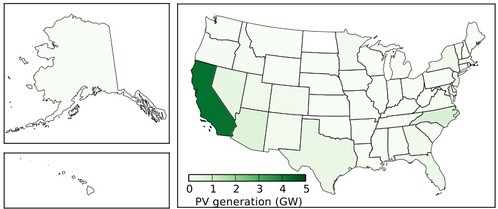

    **图 13.17:** 2018 年各州光伏发电量，单位 GW。

接下来，我们除以面积以获得光伏安装的功率密度。日照为 200 W/m\ :sup:`2` 且效率为 15% 的面板可使用 30 W/m\ :sup:`2` 的生产能力（:ref:`表 13.1<tab13.1>`）。:ref:`图 13.18<fig13.18>` 显示了我们实际获得了多少。新泽西州在这里迎来了它的阳光时刻。少数站点（NJ、MA）达到了约 15 mW/m\ :sup:`2`，\ [#]_ 比满功率潜力低 2,000 倍。这意味着只有 1/2,000 的土地（0.05%）被太阳能面板覆盖。这从某种意义上说是合理的，对吧？

.. [#] 与华盛顿州水电的 50 mW/m\ :sup:`2`（:ref:`图 11.6<fig11.6>`；第 179 页）和爱荷华州风电的 17 mW/m\ :sup:`2`（:ref:`图 12.9<fig12.9>`；第 192 页）进行比较。

按人口计算（:ref:`图 13.19<fig13.19>`），内华达州最为亮眼，人均 180 W。\ [#]_ 美国西南部总体表现良好，北卡罗来纳州在这一指标上也表现不俗。

.. [#] ……与美国人均 10,000 W 的指标相比仍然很小

最后，我们查看容量因子：实际发电量与已安装容量的比较（:ref:`图 13.20<fig13.20>`）。我们预期约为 20%，对应每天 4.8 个全日照等效小时。表现最好的州最高约 0.27，相当于每天约 6.5 个全日照等效小时。高纬度和/或多云较多的州在这一指标上表现较差。阿拉斯加州刚过 0.1，平均每天约 2.5 小时。

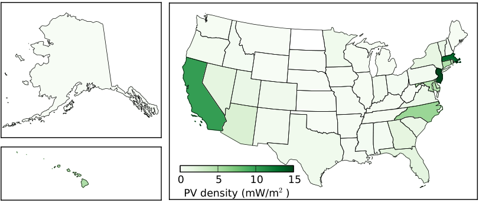

    **图 13.18:** 各州光伏发电量的面积密度，单位为毫瓦每平方米。

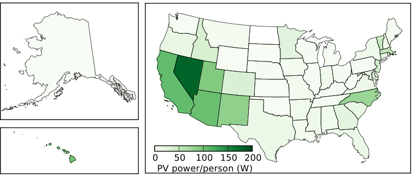

    **图 13.19:** 各州人均光伏发电量，单位为瓦特每人。

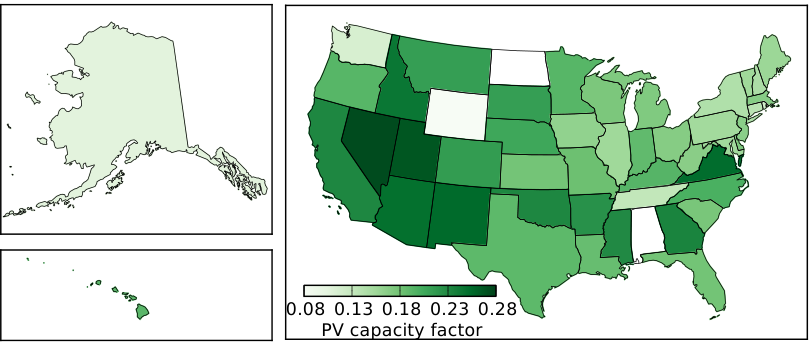

    **图 13.20:** 各州光伏容量因子。虽然我们看到了大量深绿色，但这是因为每个人的数字都同样低，由于不可避免的夜间和低太阳角度。有人告诉怀俄明州、北达科他州和阿拉巴马州赶紧跟上进度！

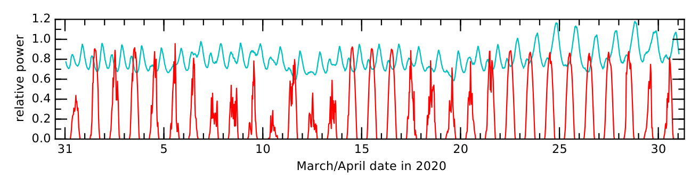

    **图 13.15:** 每峰值瓦特光伏安装价格的演变。黄色代表面板；两个蓝色代表电子设备；桃色代表人工；阴影代表公用事业接入、检查、税收、利润\ :cite:`c89,c91`。来自 NREL。

在全球范围内，三分之二的光伏产能由五个国家代表，如 :ref:`表 13.3<tab13.3>` 所示。请注意，由于太阳能的低容量因子，输送功率显著低于已安装容量。

.. _tab13.3:

.. csv-table:: **表 13.3:** 2018 年全球光伏发电量前五名，占世界总产量的三分之二\ :cite:`c92,c93`
    :name: tab13.3
    :class: booktabs
    :header: 国家, 已安装 (GW\ :sub:`p`), 平均 (GW), 占所有能源 (%), 全球份额 (%)

    中国, 175, ~18, 1.2, 27
    美国, 62, 10.6, 0.9, 16
    日本, 56, 6.5, 3.5, 10
    德国, 46, 5.0, 3.3, 7.5
    印度, 27, 4.1, 1.5, 6
    **世界总量**, **510**, **67**, **1.5**, **100**

13.7.1 光伏的优缺点
++++++++++++++++++++++++

在进入太阳热能发电之前，让我们总结一下太阳能光伏的主要优缺点。首先是积极的方面：

- 光伏利用的是超丰富的资源——唯一具有如此大优势的可再生能源；
- 光伏技术没有活动部件或蒸汽；面板坚固且寿命长；
- 光伏是少数能够安装在屋顶并提供自包含发电的资源之一；
- 光伏效率相当不错：接近理论预期，远好于生物从阳光中获取能量的能力；
- 光伏技术运作良好，尽管有成本，已经在全球各地的屋顶上部署；
- 全生命周期 CO\ :sub:`2` 排放仅为传统化石燃料发电的 15 倍 :cite:`c68`；
- 当公用电力距离较远时，光伏往往是一个好的解决方案。

负面方面：

- 光伏是间歇性的，与能源需求不匹配；如果过多输入来自这种间歇性源，将很难"平衡"电网，储能也很困难；
- 相对于现有能源资源，光伏仍然昂贵\ [#]_ ——尤其是前期成本方面；
- 仅靠电力本身并不适合我们当前的许多能源需求，如交通运输和工业热/加工；
- 独立运行需要电池，至少会使成本翻倍并增加维护/更换需求；
- 即使部分遮挡也可能造成不成比例的破坏；
- 光伏制造涉及对环境不友好的化学物质；
- 如果安装在未开发的地区，光伏部署可能损害栖息地。

.. [#] 成本一直是主要障碍，但随着价格进一步下降，这种情况可能会改变。

13.8 太阳热能
-------------------

光伏（:ref:`第 13.3 节<sec13.3>`）将阳光直接转化为电能，但这并非利用太阳能的唯一方式。太阳能也可以用于发热。我们将先简要了解一下家庭供暖，然后转向太阳热能发电。

13.8.1 被动式太阳能供暖
++++++++++++++++++++++++++++++++

全日照以地面约 1,000 W/m\ :sup:`2` 的功率传递能量。现在想象房屋中一扇拦截 1.5 m\ :sup:`2` 阳光的窗户，实际上向家中引入了 1,500 W——就像一个取暖器，而且是免费的！取决于窗户的构造，一些红外能量可能被阻挡，因此可能并非所有 1,000 W/m\ :sup:`2` 都能进入室内，但很大一部分会。巧妙的设计有朝南的窗户接收低角度的冬季阳光，但有遮阳板阻挡高角度的夏季阳光（:ref:`图 13.21<fig13.21>`）。一个深色且有质量的吸收器\ [#]_ 在屋内捕获热量可以在夜间继续提供温暖。在 Box 6.1（第 87 页）的上下文中提到的被动房设计试图最大化太阳能捕获，使所需的主动供暖最少。

.. [#] ……深色岩石或砖效果很好

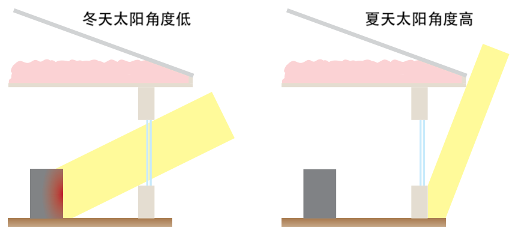

    **图 13.21:** 一个设计良好的房屋有厚墙、厚隔热层和双层玻璃窗。更好的是，它可以有朝南的窗户，在冬季透入阳光但在夏季不透入（遮阳板挡住窗户）。一个大的、深色的热质量——石头或砖效果很好——可以吸收能量并在夜间继续释放热量。

13.8.2 太阳热能发电
+++++++++++++++++++++++++++++++

虽然 1,000 W/m\ :sup:`2` 很好，但功率过于分散，无法使任何东西变得足够热并产生足够大的温差以运行高效热机（第 6.4 节，第 88 页）。更复杂的安排可以集中太阳能——想想放大镜——加热管道中的液体。:ref:`图 13.22<fig13.22>` 显示了一个抛物面反射器的例子，它可以跟踪太阳并将光线集中在中心吸能管道上。这种形状可以沿长圆柱体挤出——一个"槽"——沿着管道延伸。

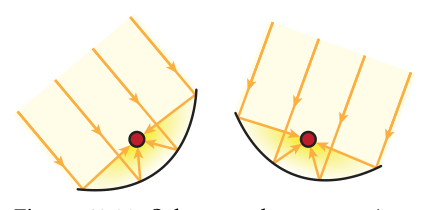

    **图 13.22:** 太阳槽横截面显示将阳光聚焦到中心管道上。槽可以定向跟踪太阳。

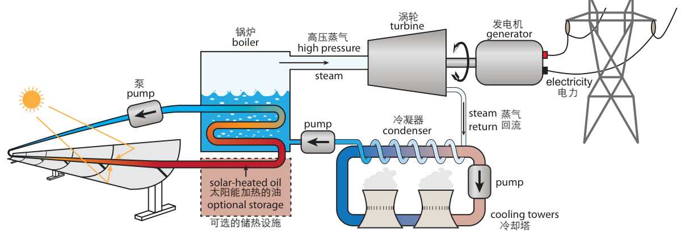

    **图 13.23:** 一种常见的太阳热能发电方案使用抛物面"槽"反射器将阳光聚焦到中心管道上，管道携带的油可以被加热到非常高的温度以产生蒸汽来运行传统的发电厂，非常像 :ref:`图 6.2<fig6.2>`（第 90 页）。可选的热存储可以将热量保存以备后用。

:ref:`图 13.23<fig13.23>` 显示了典型太阳热能（ST）集热器的示意图，:ref:`图 13.24<fig13.24>` 中显示了实际的图片。弯曲的反射器倾斜跟踪太阳，将光线集中在反射器前方的长管道中，管道中携带一种流体（通常是油），可以通过吸收的阳光加热到高温。然后将热油管道通过水以使其沸腾并制造蒸汽，此后驱动传统的蒸汽发电厂。这种 ST 装置有时被称为聚光太阳能发电（CSP）。另一种常见变体——称为"电力塔"——如 :ref:`图 13.25<fig13.25>` 所示，其中地面上的一系列可控制平板反射镜将阳光引导到中央塔的顶部来制造蒸汽。

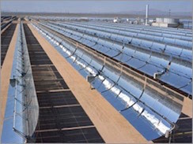

    **图 13.24:** 基于抛物面槽的 ST 发电厂，其中部分发电设施在背景中可见。反射器必须间隔开以防止自遮挡。来自美国能源部。

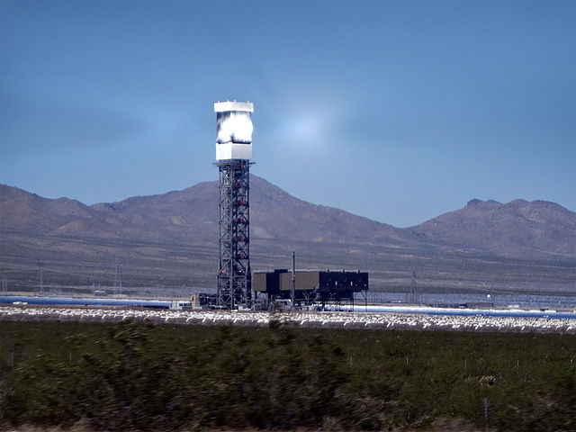

    **图 13.25:** 加利福尼亚州 Ivanpah 设施的三座"电力塔"之一。作者：Craig Dietrich。

至于效率，太阳热能表面上与光伏相似：15–20% 是相当典型的。细分来看，大约 50–75% 的可用能量成功转移到流体中，然后热机提供约 25–30% 的效率。但这些数字只有在计算反射集热器的面积时才适用。因为它们必须跟踪太阳并避免自遮挡，只有一小部分土地面积被反射器占据。对实际设施的表征表明，到达发电厂对应土地块的太阳能中只有 3% 以电能形式输出。

但效率并非一切。太阳能输入这种巨大资源的 3% 仍然可以非常大。对于 200 W/m\ :sup:`2` 的标准日照，这转化为超过 6 W/m\ :sup:`2`，按土地面积计算比风电好约 30 倍。虽然光伏面板阵列的性能超过 ST 装置 5–6 倍，但技术上更简单的太阳热能设计可能比光伏更具成本效益。反射器和油管道是低科技廉价设备，与光伏材料相比。太阳热能的生产成本估计约为 0.06 美元/kWh，低于典型的电力零售成本，但仍比化石燃料发电生产成本高约两倍。

太阳热能的一个缺点是聚光仅在太阳在天空中可见时才能工作：没有遮挡的云。可以这样理解：如果你看不到你的影子，太阳聚光将不起作用。与此同时，即使太阳本身没有"出来"，光伏面板仍然可以从明亮的天空和云层中产生有意义的日间电力。

平衡这一缺点的事实是，太阳热能具有一些内置的储能能力，因为加热的油可以被"储存"几个小时\ [#]_ 并在云层经过时或傍晚的几个小时内继续发电。从这个意义上说，它可以更好地匹配电力需求的峰值（傍晚：:ref:`图 13.14<fig13.14>`），而光伏在太阳落山后就归零了。

.. [#] ……因此 :ref:`图 13.23<fig13.23>` 中的"可选存储"模块

如 :ref:`图 13.13<fig13.13>` 所示，美国西南沙漠是太阳热能发电的最佳地点。沙漠是合适的地点是合理的，因为有效聚光需要云层不产生干扰。顺便说一下，跨区域输电（跨区域）是相当高效的：对于短于约 1,000 km 的距离，通常优于 90%。

在实施方面，太阳热能是一个小参与者。2018 年，只有四个州产生了太阳热能，80% 来自加利福尼亚州，15% 来自亚利桑那州。:ref:`表 13.4<tab13.4>` 提供了一些背景，比较了四个有太阳热能的州中 ST 与 PV 的情况。就全美国而言，不到 0.7% 的电力来自太阳热能，而光伏在整体上大约是太阳热能的 20 倍。在全球范围内，ST 平均约 7.1 GW（2020 年），其中约一半在西班牙，三分之一在美国。

.. _tab13.4:

.. csv-table:: **表 13.4:** 2018 年美国太阳热能（ST）发电量，与光伏（PV）的比较\ :cite:`c85`
    :name: tab13.4
    :class: booktabs
    :header: 州, ST 平均 (MW), ST 占电力 (%), PV 平均 (MW), PV 占电力 (%), ST/PV (%)

    加利福尼亚, 540, 0.70, 5700, 13.0, 9.5
    亚利桑那, 170, 1.70, 1700, 4.0, 10.0
    内华达, 65, 0.50, 1050, 3.70, 6.2
    佛罗里达, 25, 0.10, 2800, 3.80, 0.9
    **美国总量**, **800**, **0.70**, **6400**, **4.50**, **12.5**

13.8.3 太阳热能的优缺点
+++++++++++++++++++++++++++++

总结太阳热能（ST）的优缺点，先从积极方面开始：

- ST 利用的是超丰富的资源——唯一具有如此大优势的可再生能源；
- ST 技术是低技术含量的，利用成熟的热电厂技术，成本可控；
- ST 具有内置的短期储热能力，可满足傍晚高峰用电需求；
- 全生命周期 CO\ :sub:`2` 排放比传统化石燃料发电低 10 倍。

负面方面：

- ST 需要直接日照，不耐受云层；
- ST 只适用于大规模电厂建设；
- ST 的土地面积利用效率低于光伏面板；
- 对当地环境/栖息地会造成一些干扰。

13.9 总结
-----------------

毫无疑问，太阳能是唯一有能力匹配目前全社会能源需求的可再生资源。它不仅能够达到 18 TW，还可以超出几个数量级。为面板寻找空间并不是限制。基于物理预期，光伏面板的效率完全可以接受，并且比生物学的最佳表现高 3–5 倍。效率已经足够高，屋顶面积往往足以满足单个房屋的需求。

阻碍太阳能发展的是其间歇性和高昂的前期成本。间歇性可以通过电池储能来解决，但这会使成本翻倍，并需要维护和定期电池更换。此外——正如我们许多可再生选项一样——我们社会的所有需求并不能很好地由发电来满足。

确定光伏装置的尺寸相当简单。首先确定平均每天要生产多少 kWh，然后除以该站点的 kWh/m\ :sup:`2`/天值，\ [#]_ 本质上是全日照\ [#]_ 等效小时数，通常在 4–6 小时的范围内。这说明阵列在全日照下应该产生多少千瓦（峰值瓦特）。例如，如果只需要 10 kWh/天\ [#]_ 并且该地区有 5 kWh/m\ :sup:`2`/天，系统需要在峰值功率下运行 2 kW\ :sub:`p`，安装成本约为 6,000 美元（并网）。上调 20%\ [#]_ 可以抵消未计算的损失以更好地匹配实际条件。

.. [#] ……年度或月度
.. [#] 1,000 W/m\ :sup:`2`
.. [#] ……因为你对能源支出很谨慎
.. [#] ……发热、肮的面板和转换效率

太阳热能是另一种运行传统蒸汽发电厂的方式，使用相对低技术的镜子和管道将太阳能集中到传热流体中，之后可以制造蒸汽。有效效率相对较低，\ [#] 但从积极的一面来看，低技术特性使其相当便宜，并且该技术可以适应一定程度的短期热存储，在傍晚使用数小时。任何\ [#]_ 从太阳能输入开始的事物都有可能成为主要参与者，考虑到入射地球的约 83,000 TW 规模的太阳能。

.. [#] 太阳能发电厂面积的 3% 作为电能输出
.. [#] ……即使效率一般或较低

13.10 思考题
-----------------

1. 如果我们有两个单色（单一波长）光源——一个绿色的在 :math:`\lambda = 0.5 \mu\text{m}`，一个近红外的在 :math:`\lambda = 1.0 \mu\text{m}` ——每个光源以 1 W 的速率发射光子，\ [#]_ 那么从每个光源每秒发出的光子数量如何比较？两个光源都是 1 W，所以数量相同，还是不同——如果是的话，相差多少倍？

.. [#] 提示：回忆一下 1 W 是 1 J/s。

2. 头顶阳光以约 1,000 W/m\ :sup:`2` 的强度到达地球表面。如果典型波长为 :math:`\lambda = 0.5 \mu\text{m}`，每秒有多少个光子照射在面积为 0.4 平方米的光伏电池板上？

3. 使用 :ref:`思考题 2<prob13.2>` 的设定，如果你直视太阳，每秒有多少光子进入你的瞳孔？这样做时，你的瞳孔收缩到直径约 3 mm。

4. 我们肉眼能看到的最暗恒星比太阳的强度暗十三个数量级。\ [#] 基于 :ref:`思考题 3<prob13.3>`，在可检测性边缘每秒有多少光子进入你的眼睛？

.. [#] 10\ :sup:`13` 倍

5. 温暖的人类（约 310 K）和发光的白炽灯泡灯丝（约 2,800 K）都按方程 13.3 辐射。白炽灯丝每单位面积（W/m\ :sup:`2`）比人类皮肤多发出多少功率，大致？

6. :ref:`思考题 5<prob13.5>` 的结果表明，热的灯泡灯丝每单位面积发出的功率比人类皮肤多数千倍。然而，人类和灯泡可能发出相似数量的光\ [#]_ ——都约为 100 W。解释这两件事怎么可能同时为真？

.. [#] 人类在红外线中发射，所以我们的眼睛看不到。

7. 维恩定律说普朗克光谱在 5,800 K 温度下的峰值位于什么波长？以微米为单位表达你的答案，并与 :ref:`图 13.1<fig13.1>` 确认。

8. 人体也像太阳或灯泡灯丝一样通过相同的物理学发光，只是它远在红外线区域，人眼看不到。对于常见物体（和人类皮肤）都在 310 K 左右，峰值黑体辐射的近似波长是多少微米？

9. 我们可以将灯泡的效率描述为其总光输出中落在可见光范围内的比例。如果使用热源\ [#]_ 为什么基于 :ref:`图 13.1<fig13.1>` 所示，你会认为在任何光源温度下都不可能达到 100% 的效率？

.. [#] ……如太阳或白炽灯泡；服从方程 13.3 的光源

10. 使用与文本中类似的技术，近似 :ref:`图 13.1<fig13.1>` 中 :math:`T = 4500 \text{ K}` 光谱的矩形的高度和宽度。计算你的矩形面积并与 :math:`\sigma T^4` 的预期进行比较。

11. 有哪两个原因导致蓝色光子在硅光伏中有助于电流方面处于劣势？

12. 哪些光子最负责加热硅光伏面板：蓝色光子还是红外光子（超过 1.1 \mu m）？

13. 如果一个具有 2.5 电子伏特能量的蓝色光子在硅（带隙为 1.1 eV）中释放一个电子，那么一旦电子从多余动能中安定下来，光子能量的多大比例被电子"保留"？\ [#]_

.. [#] 剩余部分转化为多余的动能，只会加热光伏电池。

14. 如果一个 2.5 电子伏特的光子在硅中释放一个电子（带隙为 1.1 eV），出来的电子有多少动能？以 eV 和焦耳表示，然后如果电子质量为 :math:`9 \times 10^{-31}` kg，确定电子的速度。

15. 简要描述从绿色光子离开太阳到电子穿过结成功贡献光伏电流的一系列事件。\ [#]_

.. [#] ……当然要符合相关的物理学原理

16. 许多人对光伏面板低于 20% 的效率有本能的反应，认为这令人失望——也许认为他们应该等待更高的效率。提出一个多点的论点，说明为什么效率实际上相当好，为什么在实践中它已经完全足够实用。

17. 如果目标是光伏阵列的特定功率输出，\ [#]_ 明确/定量地描述光伏面板效率如何与阵列的物理尺寸（面积）相互作用。例如，如果效率翻倍或减半，同时保持相同的目标输出，会发生什么？

.. [#] 如果有帮助可以自行选择数字。

18. 通过绘制 :ref:`图 13.6<fig13.6>` 中一个电池的左下角的放大图，建立 :ref:`图 13.4<fig13.4>` 和 :ref:`图 13.7<fig13.7>` 之间的联系。

19. :ref:`图 13.7<fig13.7>` 显示了光伏电池在不同光照水平下的工作曲线。如果光照较弱，面板继续以最大功率运行，\ [#]_ 与全日照运行相比，哪个变化最大：电压还是电流？为什么较弱的光线（更少的光子）可能直接联系到较低的电流，基于光伏运作的物理学原理是什么？

.. [#] ……曲线内最大的矩形

20. 复现第 208 页上从太阳表面为 5,770 K 开始并发现我们在地球接收 1,360 W/m\ :sup:`2` 的计算（展示计算过程）。

21. 根据 :ref:`图 13.8<fig13.8>`，哪个大洲似乎具有最多的太阳能潜力？你如何评价中国？世界上最大的人口和/或最大的能源消费者是否倾向于与最好的太阳能资源对齐？

22. 检查 :ref:`图 13.9<fig13.9>` 以确定亚利桑那州、新墨西哥州、犹他州和科罗拉多州交汇处的"四角"位置的日照。以 kWh/m\ :sup:`2`/天和 W/m\ :sup:`2` 两种单位表示，展示如何从一种转换为另一种。

23. 根据地图和 :ref:`图 13.9<fig13.9>` 中的原生单位，\ [#]_ 美国典型的全日照\ [#]_ 等效小时数的太阳能暴露值是多少？解释你是如何得出这个结果的。

.. [#] ……全日照意味着 1,000 W/m\ :sup:`2`

24. 美国国家可再生能源实验室\ [#]_ 的一项 30 年研究表明，在圣地亚哥，水平朝上放置的面板每年的日照量平均为 5.5 kWh/m\ :sup:`2`/天。将其转换为 W/m\ :sup:`2`。

.. [#] ……称为 Redbook 研究：\ :cite:`c87`

25. :ref:`思考题 24<prob13.24>` 中提到的同一研究发现，圣地亚哥最差的一年平均日照量为 4.6 kWh/m\ :sup:`2`/天，最好的一年为 6.2 kWh/m\ :sup:`2`/天，用于水平朝上的面板。那么，圣地亚哥的年均日照值范围是多少（以 W/m\ :sup:`2` 为单位），大约是多少百分比的变异（整数）？

26. :ref:`思考题 24<prob13.24>` 中提到的研究发现，朝南倾斜不同角度\ [#]_ 的水平面板产生以下年均产量（单位为 kWh/m\ :sup:`2`/天）：

.. csv-table:: 圣地亚哥南向面板在不同倾斜角度下的年均日照量（kWh/m\ :sup:`2`/天）
    :header: 角度, 一月, 二月, 三月, 四月, 五月, 六月, 七月, 八月, 九月, 十月, 十一月, 十二月, 年均

    0°, 4.2, 4.7, 5.5, 6.5, 7.3, 7.8, 7.6, 6.8, 5.9, 4.8, 3.8, 3.3, 5.8
    θ−15°, 5.0, 5.6, 6.1, 6.5, 7.0, 7.2, 7.0, 6.5, 5.9, 5.0, 4.3, 3.9, 6.0
    θ, 5.2, 5.9, 6.2, 6.5, 6.8, 6.8, 6.7, 6.5, 6.3, 5.3, 4.5, 4.1, 6.0
    θ+15°, 5.3, 5.9, 6.0, 6.0, 6.0, 5.8, 5.8, 5.8, 5.9, 5.7, 4.9, 4.6, 5.7
    90°, 5.5, 5.7, 5.3, 5.0, 4.5, 4.2, 4.4, 5.0, 5.4, 5.4, 4.9, 4.7, 5.2

    哪种倾斜角度产生最佳的年产量，比面向正上方的平板好多少（百分比）？哪种倾斜角度似乎使季节性变化最小？

27. 如果在整个季节中调整面板的倾斜以最大化产量？复制上表，但只写出每个月的最高数字。\ [#]_ 这会产生什么年均值，与最佳固定倾斜性能相比改善了百分之多少？

.. [#] 这个模式将随时间"图表化"倾斜调整。

28. 如果典型日照为 200 W/m\ :sup:`2`，为输送平均 5 kW 功率\ [#]_ 的 15% 效率平板光伏阵列需要多少土地面积？如果排列成正方形，这个阵列的边长有多长？将其大小或面积与某个熟悉的事物进行比较。

.. [#] 这个练习提供了关于覆盖美国人所有部门总能源需求的个人规模光伏的见解。

29. 如果典型日照为 200 W/m\ :sup:`2`，为美国所有人（人口 3.3 亿）每人输送 10,000 W 的 15% 效率平板光伏阵列需要多少土地面积？如果排列成正方形，这个阵列的边长有多长？按比例在你选择的州上绘制。

.. [#] 这个练习提供了关于覆盖美国所有部门总能源需求所需的总光伏面积的见解。

30. 基于文中呈现的内容，\ [#]_ 如果太阳能如此丰富且技术已经存在很长时间，为什么它仍然是一个次要参与者？有哪些挑战？

.. [#] ……也可以引入先前/外部知识

31. 你看一个光伏面板并目测估计它约为 1.5 m × 1.0 m。知道光伏面板的效率通常为 15–20%，你估计它为 15% 的效率。在全日照（1,000 W/m\ :sup:`2` 入射）下你预计它能输出多少功率？

32. 根据 :ref:`思考题 26<prob13.26>` 中的表格，圣地亚哥在面板倾斜到站点纬度并朝南时可以预期年均太阳能产量为 6.0 kWh/m\ :sup:`2`/天。\ [#]_ 如果一个家庭寻求使用 18% 效率的面板生产适度的 8 kWh/天，阵列需要多大？以平方米的面积表示，以及相同面积的平方边长表示。

.. [#] ……当然要排除任何阴影

33. 使用 :ref:`思考题 32<prob13.32>` 的参数，将太阳能产量解释为全天候峰值日照等效小时数（太阳能暴露为 1,000 W/m\ :sup:`2`），阵列应该以峰值瓦特为单位指定多大才能每天输送 8 kWh？以每 W\ :sub:`p` 3 美元的安装成本计算，系统需要多少钱？

34. 看待太阳能回报时间的一种方法是注意已安装系统的成本约为每 kW\ :sub:`p` 15,000 美元，如果你的地区平均获得 G 小时的全日照等效，你将从这个 kW\ :sub:`p` 阵列产生 G kWh。由于每 kWh 的电力成本约为 0.15 美元，可以简单地计算每天的价值为 0.15 × G 美元，并确定需要多长时间才能匹配 15,000 美元的投资。结果与实际阵列大小无关，仅取决于每 W\ :sub:`p` 的成本、你所在位置的太阳能产量以及电力成本。如果成本为 3 美元/W\ :sub:`p`，\ [#]_ 产量为每天 5 个全日照等效小时，且你所在地区的电力成本为 0.15 美元/kWh，回报时间（以年为单位）是多少？

.. [#] ……由于 kW/kW\ :sub:`p` 的太阳能产量，$0.15 × 5 = $0.75/天

35. 根据 :ref:`表 13.3<tab13.3>`，基于平均与已安装功率计算各列国家及整个世界的容量因子。特征数值范围是多少，为什么\ [#]_ 它这么低？哪个国家表现最好，哪个最差？:ref:`图 13.18<fig13.18>` 提供了什么线索？

.. [#] 提示：很大一部分是日照与头顶太阳的对比。

36. 一扇 2 m 宽、1.5 m 高的大窗户，如果太阳从无云的天空中直接\ [#]_ 照射进来，会接入多少功率？这在四小时期间转化为多少千瓦时，以及与 0.15 美元/kWh 的电力相比价值多少？

.. [#] ……与第一句话一致

37. 太阳能光伏可以用于个人家庭，但太阳热能只能在大规模公用事业级装置中找到。为什么我们不应该预期在人们的屋顶上有太阳热能发电装置？

38. 太阳热能的土地面积效率约为 3%，相比之下光伏为 15–20%。许多人会摇头说这太低而毫无用处。反论是什么，它可能完全没问题？
