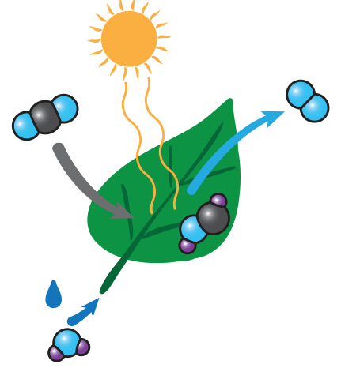
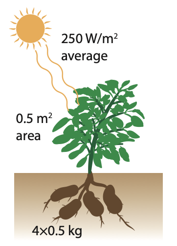
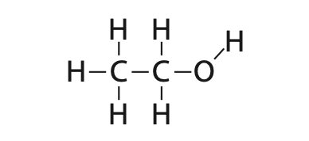
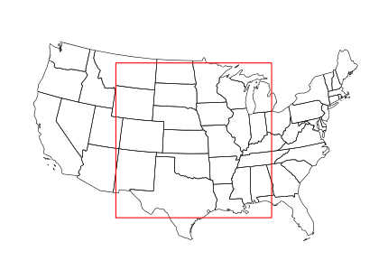

14 生物能
==================

（大模型翻译，未校对）

迄今为止讨论的 :term:`可再生能源<renewable energy>` 方案与化石燃料提供的化学存储热能大不相同。:cite:`c335` 这些能源——水电、风能和太阳能——擅长发电，但都具有不同程度的 :term:`间歇性<intermittency>`，且除了通过笨重的电池外，并不直接适用于交通运输。:cite:`c336`

生物质能源与化石燃料更为相似，它是一种通过燃烧产生热能的化学能形式。:cite:`c337` 我们将重点关注两种主要形式：固体生物质（biomass）和液体生物燃料（biofuels）。:cite:`c338` 后者非常适合交通运输：它是少数能做到这一点的可再生能源之一。:cite:`c339` 在某些情况下，同一种植物既可以作为食物也可以作为生物能源——这取决于它是被另一种生物摄入还是被机器"吃掉"。:cite:`c340`

从根本上说，生物能源是太阳能的一种形式，它通过 :term:`光合作用<photosynthesis>` 建立化学存储。:cite:`c341` 化石燃料实际上也是一种古老的生物燃料，源自数百万年前捕获的光合作用能量。:cite:`c342` 因此，阳光是实际的能源，而光合作用是能量以化学形式储存的机制。:cite:`c343`

14.1 光合作用
---------------------

本书不侧重于光合作用的复杂机制，而是描述其净结果和效率。:cite:`c346` 光合作用涉及对单个太阳光子的吸收，最终促进电子移动以改变键结构，形成糖、纤维素和用于构建植物的其他材料。:cite:`c347` 基本的化学反应如图 :ref:`图 14.1<fig14.1>` 所示。:cite:`c348`

    **图 14.1:** 光合作用的卡通版，提供了 :ref:`式 14.1<eq14.1>` 的图形化表示。:cite:`c351` 水、CO\ :sub:`2` 和阳光是输入。叶子"呼出"氧气并保留糖分（图中仅显示了最终糖分子的一部分）。:cite:`c352`

光合作用可以用 :ref:`式 14.1<eq14.1>` 表示，其产物是较大糖分子（如葡萄糖 :math:`C_6H_{12}O_6`）的基本单元。:cite:`c354`

.. _eq14.1:

.. math:: CO_2 + H_2O + \text{light} \rightarrow CH_2O + O_2 \tag{14.1}

用文字描述：来自光的光能将二氧化碳和水转化为糖的构建单元，并将氧气释放回空气中。:cite:`c357`

.. _box14.1:

.. admonition:: Box 14.1: 植物的质量从何而来？

    一个值得思考的问题：植物的质量从何而来？是从土壤中吗？是从水中吗？还是从空气中？:cite:`c358, c359, c360`

    我们可以根据观察排除土壤，因为参天大树并没有坐在被挖掘出的深坑里。:cite:`c361` 尽管根部会挤占一些土壤，但倒下的树木显示的根部体积与树干和树枝相比微乎其微。:cite:`c362` 虽然活着的植物材料含有大量水分，但完全干燥的植物材料\ [#]_ 在脱水后仍有很大质量。:cite:`c363`

    植物材料含有大量的碳成分，\ [*]_ 我们现在知道植物的叶子如 :ref:`式 14.1<eq14.1>` 所示"吸入" CO\ :sub:`2` 并释放 O\ :sub:`2`。:cite:`c364` 每当这种情况发生时，植物就从空气中夺取一个碳原子，并将氧气吐回。:cite:`c365` 碳被固定在糖或其他结构分子中并留在植物体内。:cite:`c366` 因此，植物是从"稀薄的空气"中获得了它们的干质量。:cite:`c367`

.. [#] 例如干木材。:cite:`c380`
.. [*] {-} ……我们燃烧木材时也是如此。:cite:`c381`

就效率而言，植物将阳光转化为储存化学能的速率通常为 0.1%–6%。:cite:`c368` 范围较大是因为受到水分和养分的限制。:cite:`c369` 水分充足且施肥良好的玉米地效率可能达到 1.5%，而藻类通常以 5%–6% 居于榜首。:cite:`c370` 干旱气候虽有充足阳光，但水分太少，无法有效利用光照。:cite:`c371` :ref:`Box 14.2<box14.2>` 提供了一个如何估算马铃薯植物将入射太阳能转化为化学存储比例的示例。:cite:`c372`

.. _box14.2:

.. admonition:: Box 14.2: 光合作用效率示例

    让我们以马铃薯植株（见 :ref:`图 14.2<fig14.2>`）为例来估算光合作用效率。:cite:`c374` 一株马铃薯植株的叶片覆盖面积可能为 0.5\ :math:`\,m^2`——大约是边长 0.7\ :math:`\,m` 的正方形或直径 0.8\ :math:`\,m` 的圆——并产出 4 个 0.5\ :math:`\,kg` 的马铃薯，即 2\ :math:`\,kg` 的淀粉物质。:cite:`c375`

    碳水化合物的能量密度为 4\ :math:`\,kcal/g`，因此马铃薯植株储存了 8,000\ :math:`\,kcal`，约合 32\ :math:`\,MJ`。\ [#]_

    如果典型的五个月生长季节（:math:`\sim 1.25 \times 10^7\,s`）的平均日照强度\ [*]_ 为 250\ :math:`\,W/m^2`，则该植物在制造 32\ :math:`\,MJ` 土豆的同时，收集了 125\ :math:`\,W`\ [†]_ 乘以 :math:`1.25 \times 10^7\,s`，即 :math:`1.6 \times 10^9\,J`。:cite:`c377` 光合作用效率的计算方法是将输出与输入的比值：在本例中约为 2%。:cite:`c391`

.. [#] 回忆一下，每 kcal 约合 4,184 J。:cite:`c387`
.. [*] {-} ……夏季平均，考虑了昼夜和天气变化。:cite:`c388`
.. [†] 250\ :math:`\,W/m^2` 乘以植物面积 0.5\ :math:`\,m^2`。:cite:`c389`

    **图 14.2:** :ref:`Box 14.2<box14.2>` 中的马铃薯植株。:cite:`c386`

14.2 生物质
---------------------

生物质（Biomass）长期以来一直被用于补充我们的能源需求，通过火的受控使用可以追溯到数十万年前。:cite:`c394` 燃烧木材或其他植物材料，以及在某些地方使用干燥的动物粪便\ [#]_ 都属于生物质的利用。:cite:`c395` 木材燃烧时每克提供约 4\ :math:`\,kcal` 的能量，或约 16\ :math:`\,MJ/kg`——这与我们饮食中的蛋白质或碳水化合物非常相似。:cite:`c396` 生物质的燃烧最常用于个人家庭的取暖和烹饪。:cite:`c397`

.. [#] 例如牛粪。:cite:`c415`

.. _exp14.2.1:

  **示例 14.2.1:** 一捆 10\ :math:`\,kg` 的干柴用于为一个需要 4,000\ :math:`\,W` 维持温暖的房屋供暖。这些木材能支撑多久？\ [*]_

  每克木材含有 4\ :math:`\,kcal` 或约 16\ :math:`\,kJ` 的能量。:cite:`c400` 要获得 4,000\ :math:`\,W` 的功率，我们需要每 4 秒燃烧一克木材：16\ :math:`\,kJ/4\,s = 4\,kW`。:cite:`c401` 因此，每千克木材大约耗时 4,000 秒（略多于一小时），整捆木材将在 11 小时后耗尽。:cite:`c402`

.. [*] {-} ……假设使用木炉或其他高效装置，以防止大部分热量从烟囱流失。:cite:`c417`

2018 年，在美国总计 101.25\ :math:`\,qBtu` 的能源中，有 2.36\ :math:`\,qBtu` 来自木材燃烧，另有 0.5\ :math:`\,qBtu` 来自垃圾焚烧。:cite:`c403` 因此，美国约 2.8%（0.1\ :math:`\,TW`）的能源来自生物质。:cite:`c404` 在 2018 年所有可再生能源的 11.41\ :math:`\,qBtu` 中，生物质占美国可再生能源预算的 25%。:cite:`c405`

全球范围内，生物质的使用占比估计更高，达到 6%，占据全球可再生资源的超过三分之一。:cite:`c406` 全球范围内生物质的高使用率反映了美国等发达国家与更依赖木柴和动物粪便等原始能源形式的开发中国家之间的差异。:cite:`c407` 由于世界上大多数生物质是为个人使用而燃烧的，因此排放控制几乎不存在，导致烟尘和有害化学物质等高水平污染——而这些烟尘和化学物质在发电厂的废气中是会被过滤掉的。:cite:`c408`

.. _box14.3:

.. admonition:: Box 14.3: 生命是薄弱且珍贵的

    地球上生物的总质量估计约为 2 万亿吨。:cite:`c410` 如果其密度与水相似，即 :math:`2 \times 10^{15}\,kg`，若均匀分布在地球表面，其高度仅为 4\ :math:`\,mm`！:cite:`c411` 换句话说，从地球表面随机向上发射的一条直线，平均只会穿过 4\ :math:`\,mm` 的生物物质。:cite:`c413` 这是一个非常薄的生命壳！

    如果我们试图用生物物质替代全球 18\ :math:`\,TW` 的能量需求，\ [#]_ 我们将在短短 15 年内耗尽目前所有的生物量——包括陆地和海洋！:cite:`c426` 你能想象在 15 年内烧光地球上所有的森林和动物吗？:cite:`c427` 这就是我们今天的能源消耗率——说明了地球生物资源与我们惊人的能源胃口之间的巨大差距。:cite:`c428` 我们不能指望在维持现有能源节奏的同时，还能拥有一个充满生机的自然星球。:cite:`c429`

.. [#] 大约四分之一的生物质是"干燥"的可燃物质，能量约为 4\ :math:`\,kcal/g`。:cite:`c431`

14.3 生物燃料
---------------------

生物燃料值得单独分类，因为其来源和最终用途与固体生物质有足够大的区别。:cite:`c433` 虽然 14.2 节中的生物质来源倾向于固体形式，但此处处理的生物燃料是液态的。:cite:`c434` 液体燃料极其重要，因为它们具有在交通运输应用中所需的能量密度和通用性。:cite:`c435` 飞机很难靠木柴、水电、太阳能、风能、洋流、地热或核能飞行。:cite:`c436` 因此，生物燃料在可再生资源中占据特殊地位，是石油——美国 92% 的交通运输所依赖的主导化石燃料——最明显的替代品。:cite:`c437`

2018 年在美国，2.28\ :math:`\,qBtu`（2.3%；0.08\ :math:`\,TW`）来自生物燃料，:cite:`c438` 这与来自生物质的量非常相似。在所有 11.41\ :math:`\,qBtu` 的可再生能源中，生物燃料占美国可再生能源预算的 20%。乙醇是最主要的生物燃料，约占总量的 80%。:cite:`c440` 它是一种酒精，可以通过发酵植物中光合作用产生的糖分并进行蒸馏制得。:cite:`c441` 在结构上，乙醇与乙烷非常相似，:cite:`c442` 只是链一端的氢被羟基（OH）取代（见 :ref:`图 14.3<fig14.3>`）。

    **图 14.3:** 乙醇与乙烷结构相似，但末端的氢被羟基（OH）取代。:cite:`c464`

虽然不必完全理解其中的化学原理，:cite:`c445` 但乙醇的燃烧反应——用于与 :ref:`式 14.2<eq14.2>` 中化石燃料反应进行比较——如下所示：:cite:`c443`

.. _eq14.2:

.. math:: C_2H_5OH + 3O_2 \rightarrow 2CO_2 + 3H_2O + 29.7\,kJ/g \tag{14.2}

换言之，乙醇通过燃烧与氧气结合，产生二氧化碳和水，同时释放能量。:cite:`c446` 这几乎是光合作用反应（:ref:`式 14.1<eq14.1>`）的逆过程。乙醇的能量密度为 7.1\ :math:`\,kcal/g`，显著低于作为汽油代表的辛烷（11.5\ :math:`\,kcal/g`）。:cite:`c447` 就每克燃料产生的 CO\ :sub:`2` 而言，该反应每 46\ :math:`\,g` 乙醇产生 94\ :math:`\,g` 的 CO\ :sub:`2`，即 2.0\ :math:`\,g/g`——低于辛烷的 3.1 倍系数。:cite:`c465` 就 CO\ :sub:`2` 能量强度而言，每产生 1\ :math:`\,MJ` 能量，乙醇产生 96\ :math:`\,g` CO\ :sub:`2`：与石油完全相同。:cite:`c466`

通常，生物燃料和生物质被认为是"碳中性"的，因为燃烧释放的碳是光合作用从大气中吸收的，从而形成了一个循环。:cite:`c466` 然而实际上，在生物燃料的种植中往往使用了化石燃料，因此在当前形式下它并不是一个完美清洁的封闭循环。:cite:`c472`

美国的乙醇大多混合在汽油中（如 E10、E15、E85，分别表示 10%、15%、85% 的乙醇含量）。:cite:`c467` 并非所有车辆都能处理更具腐蚀性的乙醇，而能够使用乙醇的车辆（"弹性燃料"车辆）由于乙醇的能量密度低于汽油，可能会出现能量性能下降的情况。:cite:`c468` 乙醇较低的能量密度和较低的碳质量占比，都可以归因于乙醇分子中含有的氧原子。:cite:`c469`

乙醇可以由多种植物制取。在美国，玉米是最常见的原料。巴西使用甘蔗，这需要热带气候。:cite:`c470`

14.3.1 EROEI
++++++++++++++++++++++++

在进一步讨论之前，我们引入评估能源优劣的关键指标：:term:`EROEI<EROEI>`。

.. _def14.3.1:

  **定义 14.3.1:** **EROEI**，即"能源投资回报率"（Energy Returned on Energy Invested），是衡量能源盈利能力的指标，以比例表示。:cite:`c476` 例如，9:1 的 EROEI 意味着投入 1 个单位的能量，可以产出 9 个单位，净收益为 8 个单位。:cite:`c477` 1:1 是盈亏平衡点，不再产生任何净能量收益。:cite:`c478`

能源并非凭空而来。石油需要钻探，大坝需要建造，太阳能电池板需要在消耗能量的工业过程中制造。:cite:`c479, c480` 那么问题来了：我们从中获得的能量与我们投入的能量相比如何？如果我们提取的能量少于投入的能量，我们就会损失净能量，也许根本不值得去做。:cite:`c482` 如果我们只多获得一点点，我们可能仍然会质疑这项投资是否值得。

.. _exp14.3.1:

  **示例 14.3.1:** 假设某石油钻探业务使用石油产品（如汽油）作为钻井和提取石油的唯一能源输入。一年内，该业务抽取了 12,000 桶原油，而消耗了 800 桶石油作为能量输入。EROEI 是多少？

  在这种情况下，我们只需将输出与输入之比排列为 12,000:800，化简后为 15:1。:cite:`c487`

早期的油井浅且有压力，产出"自喷井"，EROEI 超过 100:1。:cite:`c488` 要理解这意味着什么，想象一下使用石油作为最初勘探、建造设备、运行钻机以及收集/储存产品的能源来源。100:1 的 EROEI 意味着每投入一桶石油到生产过程中，就有 100 桶石油产出。这是一笔好买卖。高 EROEI 意味着几乎是"免费"的能量：低投入换来高回报。:cite:`c489, c490`

随着我们向更具挑战性的石油资源进发，:cite:`c501` EROEI 正在下降——传统石油目前约为 10–15:1，油砂低至 3:1。:cite:`c502` :ref:`表 14.1<tab14.1>` 提供了各种能源的一组 EROEI 估算值。需要注意的是，由于准确计算所有能量投入存在困难，估算值会有所不同，因此不要将这些数字视为精确值——它们只是近似参考。

.. csv-table:: **表 14.1:** 各种能源的 EROEI 估算值:cite:`c503`
    :name: tab14.1
    :class: booktabs
    :header: 能源, EROEI 估值, 能源, EROEI 估值

    水电, 40+, 太阳能光伏, 6
    风能, 20, 大豆生物柴油, 5.5
    煤炭, 18, 核裂变, 5
    石油, 16, 油砂, 3–5
    甘蔗乙醇, 9, 重油, 4
    天然气, 7, 玉米乙醇, 1.4

如果生活是一款电子游戏，我们会查看 :ref:`表 14.1<tab14.1>`，认定水电和风能"最好"，将光标移到它们上面并不断"升级"，直到我们从这些低能量投入的能源中获得所有能量。但当然，世界是受约束的，对可能的范围施加了实际的限制。我们在第 11 章和第 12 章中看到，水电和风能不能期望提供超过几个太瓦的电力，留下巨大的缺口。与此同时，太阳能拥有最大的原始潜力。换句话说，了解各种资源的 EROEI 是有用的，但 EROEI 并不是决定什么方案可行的唯一因素。低 EROEI 是可以容忍的，前提是丰度足以弥补这一点。:cite:`c514`

对于那些在生产开始前大部分能量投资需要预先投入的资源，由此产生的 EROEI 关键性地取决于该资源能够提供能量的时间长短。:cite:`c515` 毕竟，设施运行时间越长，能量回报越大，而投资部分可能已经基本完成且保持不变。很难预测一个资源能持续多久，这也是 EROEI 估算值只是近似参考的原因之一。

.. _exp14.3.2:

  **示例 14.3.2:** 假设一台风力涡轮机在 40 年寿命内的 EROEI 达到 20:1。它消耗了多少年的自身能量产出来抵充制造和安装成本？

  假设涡轮机每年产生一定量的能量，我们可以称之为 :math:`\rho`（以焦耳为单位）。在这种情况下，它在寿命期内将产生 :math:`40\rho` 焦耳。由于 EROEI 为 20:1，必须消耗了 :math:`40\rho/20 = 2\rho` 焦耳的输入能量来建造。:cite:`c526` 以每年 :math:`\rho` 的速率，它将在 2 年内产生 :math:`2\rho`，因此需要两年时间产生与其制造投入等量的能量——在能量上"偿还"自身。

从自给自足的角度来看，:cite:`c527` EROEI 为 G:1 时净能量为 G−1。换言之，如果投入的那一个单位来自封闭系统中提取的 G 个单位，那么 1.25:1 的 EROEI 只"真正"为每投入一个单位产生 0.25 个单位的可输出能量。:cite:`c528` 在这种情况下，每获得一个净单位，:cite:`c529` 5 个单位投入，5 个单位产出——其中只有 1 个是净赚的。

.. _exp14.3.3:

  **示例 14.3.3:** 一个生产乙醇的自给自足运营仅使用自己生产的乙醇来运行种植、收获和加工作物以生产乙醇的整个流程。一年内，该运营总共生产了 250,000 升乙醇，EROEI 为 1.25:1。他们能够从运营中对外出售多少乙醇？

  1.25 这个数字与总产量相关，在这种情况下是 250,000 升。将 1.25:1 的比例两边同时乘以 250,000，得到输出:输入比为 250,000:200,000，这意味着运营需要 200,000 升的输入。因此，该运营能够向市场交付 50,000 升。:cite:`c533`

低 EROEI 削减了有效可用资源，需要投入宝贵的能量。:cite:`c534` 随着传统资源被耗尽，迫使我们转向低 EROEI 的矿藏，即使我们在绝对数量上跟上能源需求，:cite:`c535` 可用净能量也将下降，因为更大比例的收获必须回到提取过程中。

.. _exp14.3.4:

  **示例 14.3.4:** 如果种植粮食的 EROEI 降到 1:1 以下，:cite:`c536` 而收获粮食所使用的全部能量都来自以同种粮食为食的工人和动物，早期的农业社会会怎样？

  在 1:1 时，每提取一个单位的能量就需要一个单位的投资。然后 100% 的能量都花在获取能量上，没有留下任何能量用于社会的其他功能（住所、防御等）。这种边缘化的生存方式无法维持，因此存在一个最低限度，低于这个限度社会就变得不可持续。:cite:`c537`

值得注意的是，:ref:`表 14.2<tab14.2>` 中的许多条目数值都很低，这意味着一种艰难的状况——总能源资源中有很大一部分必须用于持续的能量获取。生物形式的能源在这方面并不是出色的表现者。

.. _box14.4:

.. admonition:: Box 14.4: 吞食我们的化石燃料

    相关地，在一个我们熟悉的领域，如今美国的食品工业每提供 1\ :math:`\,kcal` 的食物能量，就要消耗约 10\ :math:`\,kcal` 的化石燃料能量。:cite:`c545` 从某种意义上说，我们是在"吃"化石燃料！:cite:`c553` 这也意味着 EROEI 仅为 0.1:1，远低于盈亏平衡点。显然在化石燃料出现之前的时代，当我们在农业活动中使用人力和畜力时，低于 1:1 的 EROEI 就意味着饥饿：投入的能量多于从土地上回收的能量。今天，化石燃料给了我们一个暂时的例外，使我们能够承受在交易中损失有用能量，将 10 个单位的化石燃料能量转化为我们食用的 1 个单位。我们也许可以将此视为绿色革命的一个负面方面。:cite:`c554`

14.3.2 生物燃料的 EROEI
++++++++++++++++++++++++

不同生物燃料的 EROEI 估值差异很大。不幸的是，美国的玉米乙醇工业估计其 EROEI 在 0.8:1 到 1.6:1 之间。:cite:`c559` 如果是前者，那意味着能量的净亏损——如果我们不把能量花在试图从玉米中获取乙醇上，我们反而会有更多的可用能量。生物柴油（一种由植物油或动物脂肪生产的非乙醇生物燃料）的 EROEI 估计约为 1.3:1。:cite:`c561` 甘蔗可能在 0.8:1 到 10:1 之间（见 :ref:`表 14.2<tab14.2>`）。:cite:`c562`

.. csv-table:: **表 14.2:** 生物燃料 EROEI 汇总:cite:`c563`
    :name: tab14.2
    :class: booktabs
    :header: 来源, EROEI

    甘蔗乙醇, 0.8–10
    大豆生物柴油, 5.5
    生物柴油, 1.3
    玉米乙醇, 0.8–1.6
    藻类衍生, 0.13–0.71

为了具体探讨这些因素是如何发挥作用的，假设玉米乙醇的 EROEI 为 1.2:1——在估计范围的中间值。这意味着为了获得 1.2 个单位的能量输出，必须投入 1 个单位。或者说，每产出 6 个单位，就有 5 个单位需要重新投入。如果我们使用同种资源作为能量输入——换句话说，我们使用玉米乙醇作为种植、收获、蒸馏和分销玉米乙醇的能量来源——那么我们每生产 6 个单位只能"保留" 1 个单位供外部使用。:cite:`c565` 如果美国要用玉米乙醇取代其每年的石油消耗（约 37\ :math:`\,qBtu/yr`），则需要六倍于此的量，即每年生产 220\ :math:`\,qBtu`（:math:`2.3 \times 10^{20}\,J`）的玉米乙醇。如果生长季节为 3 个月，太阳辐射平均为 250\ :math:`\,W/m^2`，且玉米田将阳光转化为化学能的效率为 1.5%，那么每平方米玉米田生产 :math:`4.9 \times 10^7\,J` 的能量，:cite:`c567` 因此我们将需要约 :math:`5 \times 10^{12}\,m^2` 的土地来种植玉米。这是一个边长 2,200\ :math:`\,km` 的正方形区域（见 :ref:`图 14.4<fig14.4>`）！美国并没有这么多可耕地（估计仅为这一面积的约 9%）。:cite:`c568` 目前美国约有 :math:`4 \times 10^{11}\,m^2` 的土地用于玉米生产，仅占所需面积的 8%。当然，我们还必须养活自己。2018 年，美国 40% 的玉米产量用于乙醇。我们需要以某种方式将玉米乙醇产量提高 12 倍，才能以自给自足的方式从玉米中获取我们目前的液体燃料。不要指望这种幻想会实现。

    **图 14.4:** 如果 EROEI 为 1.2:1，取代美国石油需求所需的玉米种植面积。这远大于美国的可耕地面积。:cite:`c581, c582`

.. _box14.5:

.. admonition:: Box 14.5: 为什么要发展玉米乙醇？

    如果玉米乙醇的 EROEI 如此之低，为什么美国还要推行它？:cite:`c586` 为什么要强制在燃料混合物中加入乙醇？不要假设世界总是科学理性的，也不要认为决策者都是"成年人"、其利益超越个人得失。:cite:`c587` 许多政治因素在起作用：来自中西部摇摆州的选票、:cite:`c588` 对就业的依赖、强大行业的影响力，以及给人一种"绿色"（碳中性）能源的印象——尽管由于使用化石燃料投入来运行生产，低 EROEI 已经损害了这一形象。:cite:`c589`

生物燃料 EROEI 偏低的一个根本原因是，将原料加工成乙醇需要以热的形式投入大量能量。相比之下，燃烧生物质没有这个要求。此外，燃烧的生物质通常采集自无人管理的（自然的）环境，人类几乎不需要刻意投入能量。因此，低 EROEI 对生物燃料来说比对生物质来说是一个更大的问题。:cite:`c590`

14.4 总结：生物质与生物燃料
---------------------------

木材一直以来都为人类提供了热能来源，并将继续如此。:cite:`c591` 数百年前在被化石燃料取代之前，木材在能源资源中占据的比重要高得多。即便如此，美国仍有百分之几的能源来自木材（全球超过 6%）。木材是一种可以经常在当地获取的可再生资源，可能会继续保持稳定使用，如果整体能源消耗下降，它甚至可能再次占据更大的比例。:cite:`c592`

生物燃料之所以特别，是因为它们的液态性质可以作为交通工具的石油替代品。:cite:`c600` 然而，由于光合作用效率不高，且生物燃料的 EROEI 偏低，取代石油所需的土地面积是令人望而生畏甚至令人望而却步的。:cite:`c601` 此外还需考虑对水资源、食品供应以及土壤养分耗尽可能导致的土地退化的压力。:cite:`c602`

藻类可能代表另一种途径，但到目前为止，其工艺在 EROEI 方面似乎远低于盈亏平衡点（0.13–0.71:1）。:cite:`c603` 很难看到利用生物资源大规模替代液体燃料的有意义前景。:cite:`c604`

最后一个视角是：地球上生物的总规模估计为 100\ :math:`\,TW`（:ref:`表 3.1<tab3.1>`），与目前人类活动 18\ :math:`\,TW` 的规模相比并没有超出太多。:cite:`c605` 我们真的能想象征用地球上 18% 的所有生命来服务于我们的能源需求吗？考虑到 EROEI 的限制，实际上需要的比例还要大得多。也许地球并没有足够的生物资源来替代我们对化石燃料的胃口——即使我们试图使用所有的生物资源。:cite:`c606`

总结生物能源的优缺点：

**优点：**

* 生物燃料提供了一种支持交通需求的潜在液体燃料替代品；
* 依靠可靠的太阳能输入，收获后可再生；
* 属于太阳能的一种存储形式，缓解了间歇性问题；
* 种植和收获作物的技术已经成熟；
* 燃烧生物质是低技术门槛的，可能会继续成为我们能源组合的一部分。

**缺点：**

* 难以扩展到多太瓦（TW）量级；
* 大量依赖生物能源会占用地球生物量并排挤自然栖息地；
* 生物燃料的种植与粮食生产争夺水和土地资源；
* 低 EROEI 减少了可用的净能源；
* 燃烧生物质产生的烟尘和污染物可能带来健康问题。

14.5 思考题
-------------------

1. 一棵大树可能有 0.5\ :math:`\,m` 的树干直径和 40\ :math:`\,m` 的高度。:cite:`c607` 尽管它分支了许多次，但假设所有的木材都恰好填充在一个保持该 0.5\ :math:`\,m` 直径的圆柱体中，贯穿整棵树的高度。木材能浮在水面上，:cite:`c608` 因此我们假设其密度约为 800\ :math:`\,kg/m^3`。如果我们把树的质量视为 50% 的碳，这棵树从大气中吸收了多少千克的 CO\ :sub:`2` 来获取其碳？

   **提示：** CO\ :sub:`2` 的质量是纯碳的 44/12 倍。

2. 利用问题 1 中树的几何形状和密度，如果所得木材的能量密度与碳水化合物相似（4\ :math:`\,kcal/g`），且该树花了 50 年积累这些体积，同时每年在 5 个月内接收平均 250\ :math:`\,W/m^2` 的太阳辐射，叶面接收阳光的区域平均为 200\ :math:`\,m^2`，该树的净光合作用效率是多少？

3. 美国每年从燃烧生物质（主要是木柴）中获得 2.4\ :math:`\,qBtu` 的能量。以 4\ :math:`\,kcal/g` 的能量密度和 3.3 亿人口计算，这相当于每人每年多少根 5\ :math:`\,kg` 的木柴？:cite:`c609`

4. 按照问题 3 中规定的参数，每天需要燃烧多少根木柴才能为房屋提供 5,000\ :math:`\,W` 的供暖？:cite:`c610`

5. 通过假设 2 万亿吨（:math:`5 \times 10^{14}\,kg`）质量中有四分之一是可燃的，能量为 4\ :math:`\,kcal/g`，来复现 :ref:`Box 14.3<box14.3>` 的结论。:cite:`c611` 如果以 18\ :math:`\,TW` 的速率燃烧，这些能量能持续多少年？

6. 给定乙醇与辛烷（汽油）的能量密度，如果乙醇密度为 789\ :math:`\,g/L`，辛烷密度为 703\ :math:`\,g/L`，需要多少升乙醇才能替代一升汽油？:cite:`c612`

7. 如果花费 50\ :math:`\,kJ` 的能量来提取 1\ :math:`\,MJ` 的煤炭能量含量，EROEI 是多少？:cite:`c613`

8. 将 1.5:1 的 EROEI 重新表述为：在一个自给自足的运营中，为了提取一个单位的净能量，必须生产多少个单位的总能量。:cite:`c614`

9. 假设一种低 EROEI 生物燃料的提取仅使用从该生物燃料本身获取的能量——换句话说，一个不使用任何其他（外部）形式能量的自给自足运营。:cite:`c615` 我们可以这样理解这种情况：每公顷用于生产外部使用燃料的土地之外，还需要额外的土地用于生产执行提取操作所需的能量——就像一笔管理费用。如果 EROEI 为 1.5:1，:cite:`c616` 那么每有一公顷（或你选择的任何面积单位）贡献于净生产，需要投入多少总土地面积用于这项事业？参见问题 8 的相关情景。

10. 制造太阳能电池板需要一定的能量投资。:cite:`c617` 参考 :ref:`表 14.1<tab14.1>`，如果 EROEI 估算值假设运行 30 年，计算需要多少年的电池板输出能量才能"偿还"这笔投资。:cite:`c618`

11. 我们现代食品工业的 EROEI 为 0.1:1。:cite:`c619` 在工业化前的环境中，当粮食生产的能量投入以肌肉力量（动物和人力）的形式进行时，为什么 0.1:1 的粮食 EROEI 是不可行的？接下来，描述粮食 EROEI 恰好为 1:1 时的条件。这在精力/能量去向方面意味着什么？这为建造住所、大教堂或美学追求留下了多少余地？:cite:`c620`

12. 参照正文中关于玉米乙醇自给自足:cite:`c621` 时所需土地的推导，在 EROEI 为 1.5:1——接近估算范围的乐观端——的情况下进行类似的计算。这比目前用于种植玉米的面积大多少？与美国总可耕地相比如何？:cite:`c622`

13. 利用问题 12 的设定，计算所需玉米面积换算为正方形边长的公里数。在一张美国本土的简略地图上按近似比例绘制这个正方形。而这还是在乐观端。:cite:`c623`

14. 你认为地球 100\ :math:`\,TW` 的生物预算（地球上所有生命）中有多少比例用于服务人类的能源需求是合理的？:cite:`c624` 解释你的理由。这换算成 TW 是多少？与我们目前 18\ :math:`\,TW` 的需求相比如何？:cite:`c625`

    **注意：** 如果 EROEI 小于 2:1（许多生物燃料就是如此），我们需要将你估算的 TW 值削减一半以上，以扣除用于提取而被转移的能量。:cite:`c626`
