15 核能
=============

（大模型翻译，未校对）

迄今讨论的大多数能源形式都源自阳光——要么是当下的输入，要么是化石化的储存。核能的燃料则真正古老，早于太阳系而存在。参与裂变的重元素由天体物理灾变（最有可能是中子星合并）产生，而聚变的氢构建块则源自大爆炸本身。简而言之，裂变涉及将重核分裂成更小的碎片，而聚变则由较小的核构建更大的核。

虽然只有裂变已被成功用作社会能源，但两种类型本质上归结为同一件事：一个热源，用于制造蒸汽并驱动热机。核材料如何以及为何产生热量将是本章的主要关注点。核能周围的许多实际问题涉及安全、武器、废料以及危险材料的扩散。仅仅因为我们掌握了足够理解自然的令人印象深刻的成就就有理由继续依赖核能，这并不足以证明其合理性——即使它不是直接的 CO\ :sub:`2` 排放者。

理解核能需要比了解水电、风能和太阳能光伏更长的路程。我们首先学习原子核及其多种构型、核素如何通过放射性衰变从一种转变为另一种、:math:`E = mc^2` 的作用，最后深入研究裂变和聚变的工作原理。

15.1 原子核
---------------------

首先，什么是原子核？每个（中性）原子由一个带正电的原子核和围绕它的带负电的电子云组成（:ref:`图 15.1<fig15.1>`）。:cite:`c634`

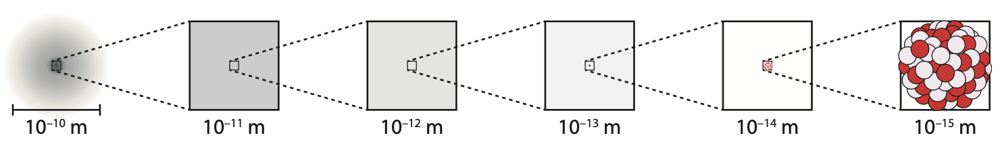

    **图 15.1:** 华盛顿州已退役的 Satsop 核电站的冷却塔。图片来源：Tom Murphy。

原子核比电子云小约 100,000 倍，\ [#]_ 但包含了原子 99.97% 的质量，以一个由质子（正电荷）和中子（无电荷）组成的超密集小块的形式存在。虽然电磁力强烈抵制带正电的质子紧密聚集，但强核力压倒了这种反对，将质子和中子粘合在一起形成稳定的存在。

按照惯例，质子数标记为 Z，中子数标记为 N。核子\ [*]_ 的总数称为质量数：:math:`A = Z + N`。这只是简单的计数。

以碳为例，所有碳原子都有 Z = 6：六个质子。\ [#]_ 大多数碳原子（98.93%）有 N = 6，因此 A = 12。但某些同位素携带不同数量的中子。在天然碳样品中，1.07% 有 N = 7，因此 A = 13。我们将这种同位素标记为 :math:`{}^{13}\text{C}`（A = 13），有时也标记为 :math:`{}^{13}_{6}\text{C}`（A = 13；Z = 6），甚至在某些情况下标记为完全描述的 :math:`{}^{13}_{6}\text{C}_{7}`（A = 13；Z = 6；N = 7）。后两种形式有些冗余——尽管有时是有用的/有帮助的——因为所有碳原子都有 Z = 6，且 N = A − Z 始终成立。因此，:math:`{}^{13}\text{C}` 就说明了一切，前提是你能轻松找到或记住碳的 Z 值。\ [#]_ 元素 X 的同位素的一般模式是 :math:`{}^{A}_{Z}\text{X}`。其他常见的表示方式还有，例如，C12、C13、U238，或 C-12、C-13、U-238 作为 :math:`{}^{12}\text{C}`、:math:`{}^{13}\text{C}` 和 :math:`{}^{238}\text{U}` 的替代写法。

.. [#] ……定义了原子的大小。:cite:`c635`
.. [*] {-} ……描述质子或中子中任何一种的名称：任何核组成粒子。:cite:`c636`
.. [#] ……可以说这就是定义碳原子的特征。:cite:`c637`
.. [#] ……只是标记周期表中方框的顺序编号：图 B.1（第 375 页）。:cite:`c638`

.. _exp15.1.1:

  **示例 15.1.1:** 写出钚（Pu；94 个质子）质量数为 A = 239 的同位素的所有不同表示方式。

  首先，数学计算。A = 239，Z = 94，所以 N = A − Z = 145。从简单的一端开始逐步升级，我们可以将其标记为 Pu239、Pu-239、:math:`{}^{239}\text{Pu}`、:math:`{}^{239}_{94}\text{Pu}`，最后是 :math:`{}^{239}_{94}\text{Pu}_{145}`。

物理学家的周期表版本称为核素图，包含了丰富的信息。基本布局理念在 :ref:`图 15.2<fig15.2>` 中介绍，针对核素极端低质量端的情况。

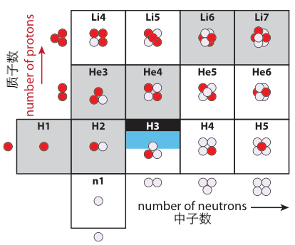

    **图 15.2:** 核素图左下角的起始部分，以每个核素中质子数（红色）和中子数（淡紫色）的图形方式展示。灰色方框为稳定核素，H3（氚）可稳定约十年左右。

.. _def15.1.1:

  **定义 15.1.1:** 核素（nuclide）是核子的任何独特组合，因此每个原子核都是可能的核素之一。例如，:math:`{}^{12}\text{C}` 原子核是一个核素，而 :math:`{}^{13}\text{C}` 是一个不同的、独立的核素。

:ref:`图 15.3<fig15.3>` 提供了核素图布局的全景视图：中子数 N 沿水平方向排列，质子数 Z 沿垂直方向排列。稳定核素以黑色方框标示在特定的 N 和 Z 整数值上。请注意它们如何偏离 N = Z 线，倾向于富中子。这可以追溯到质子因电荷而相互排斥的事实，因此如果质子少于中子——并与偏离 N = Z 的另一种代价相平衡——原子核可以更加紧密地结合。

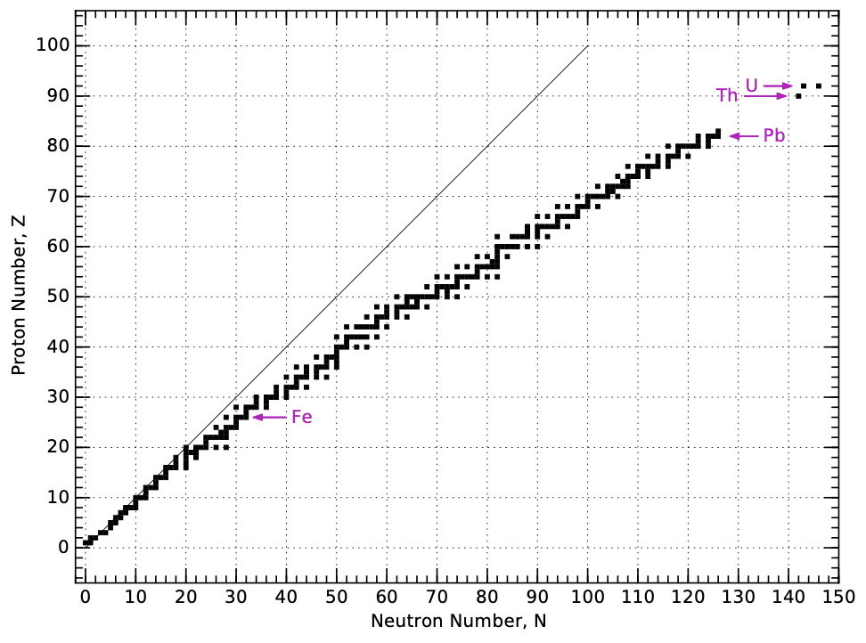

    **图 15.3:** 核素图的布局，显示了天然存在核素（稳定或足够长寿命以至于存在于地球上）的位置。稳定核素倾向于拥有比质子更多的中子——尤其是对于较重的核素。这就是为什么稳定核素的轨迹偏离 N = Z 对角线。箭头指向铁、铅、钍和铀等重要元素，其 Z 值分别为 26、82、90 和 92。

:ref:`图 15.4<fig15.4>` 以更详细的视图展示了核素图的左下角。\ [#]_ 对于每种元素（水平行），列出了所有已知同位素的属性——即使是那些放射性极强、在衰变前连一小部分秒都无法存在的同位素。稳定同位素以灰色方框表示。每个同位素的质量，以原子质量单位（a.m.u.）表示——定义为中性 :math:`{}^{12}\text{C}` 原子恰好为 12.0000 a.m.u.——都给出了，以及在地球上发现的天然丰度，以百分比表示。核素图让我们能够非常详细地窥视周期表内部，如示例 15.1.2 所示。

.. [#] 即使这种详细程度也远不及实际核素图中所能找到的信息，后者还提供了中子吸收、核自旋、激发态、额外衰变路径及相关能量的定量值。:cite:`c639`

.. _exp15.1.2:

  **示例 15.1.2:** 从 :ref:`图 15.4<fig15.4>` 中硼（B）行（Z = 5），我们可以看到 19.9% 的硼以 :math:`{}^{10}\text{B}` 的形式存在，而其余 80.1% 为 :math:`{}^{11}\text{B}`。

  加权复合质量因此为 :math:`0.199 \times 10.0129370 + 0.801 \times 11.0093055`，得出 10.81103 a.m.u.，这就是周期表上展示的摩尔质量数值。\ [*]_

.. [*] {-} ……以及每行左侧蓝色方框中的摘要信息。:cite:`c640`

由于核素图中中子数 N 从左到右增加，质子数 Z 从上到下增加，具有相同质量数 A = Z + N 的原子核排列在对角线上。请注意，在 :ref:`图 15.4<fig15.4>` 所示的区域内，每个质量数（恒定的 A）处从未找到超过一个稳定元素。

以 A = 12 为例，从 :math:`{}^{12}\text{O}` 跟踪到 :math:`{}^{12}\text{Be}`，穿过 :math:`{}^{12}\text{C}`，作为该质量数的唯一稳定元素。

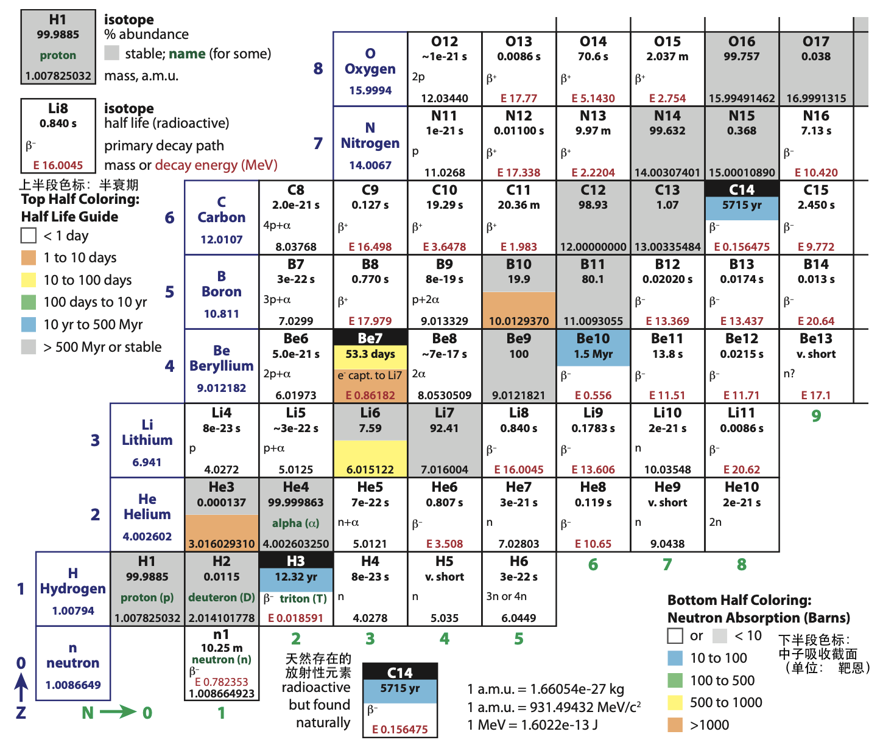

    **图 15.4:** 低质量端的核素图。中子数 N 向右增加（底部绿色编号），质子数 Z 向上增加（左侧蓝色编号）。科学记数法表示为如 8e-23，意即 :math:`8 \times 10^{-23}`。图中包含了丰富的信息：请花些时间研究周围的说明来了解每个方框中包含哪些数据。

15.2 放射性衰变
---------------------

当一个核素或同位素转变为另一个时，它通过放射性衰变的过程来实现。稳定核素没有动机经历此类衰变，但不稳定核素将通过衰变过程寻求更稳定的构型。

:ref:`图 15.3<fig15.3>` 中的黑色方框或 :ref:`图 15.4<fig15.4>` 中的灰色方框是稳定的，\ [#]_ 其余都是不稳定的，\ [*]_ 意味着它们将在某个时间间隔后经历放射性衰变变为不同的原子核，这个时间间隔由该核素的半衰期来表征。

.. _def15.2.1:

  **定义 15.2.1:** 核素的半衰期（half life）是衰变概率达到 50% 的时间。大量此类核素在一个半衰期后将减少到原始数量的一半。每个后续的半衰期间隔又会移除剩余数量的一半。

.. [#] ……或足够长寿以至于能在自然界中找到。:cite:`c641`
.. [*] {-} 如果更低能量（更稳定）的构型在容易达到的范围内，更好地平衡 N = Z 的倾向与质子排斥的代价，核素就是不稳定的。:cite:`c642`

:ref:`图 15.4<fig15.4>` 为每个不稳定核素列出了半衰期。\ [#]_ 例如，中子（图 15.4 中的 n1）的半衰期为 10.25 分钟，这意味着一个孤立的幸存这么久的概率为 50%。这个过程是统计性的，因此个别中子可能只持续 3 秒，或者可能仍在 15 甚至 60 分钟后存在。预测能力随着样本量的增大而变得 sharper：一半将在 10.25 分钟后仍然存在。

.. [#] ……以秒、分钟、小时、天或年为单位。:cite:`c643`

.. _exp15.2.1:

  **示例 15.2.1:** 如果从 1600 万个独立中子开始，我们预计 10.25 分钟后仍有 800 万个存在，20.5 分钟后 400 万个，30.75 分钟后 200 万个，41 分钟后降至 100 万个中子。

  相应地，一个单独的孤立中子在 10.25 分钟后仍有 50% 的概率存在，20.5 分钟后持续 25% 的概率，以及 41 分钟后幸存 6.25% 的概率。每个半衰期间隔将幸存概率再次减半。

.. csv-table:: **表 15.1:** 1600 万（M）个中子的衰变，半衰期为 10.25 分钟，对应示例 15.2.1。时间单位为分钟。给出了每一步的剩余数量以及任何特定中子幸存这么久的概率。约四小时后，预计只剩一个（且不会持续太久）。
    :name: tab15.1
    :class: booktabs
    :header: 时间 (分钟), 半衰期数, 剩余, 概率

    0, 0, 16 M, 100%
    10.25, 1, 8 M, 50%
    20.5, 2, 4 M, 25%
    30.75, 3, 2 M, 12.5%
    41.0, 4, 1 M, 6.25%
    "…", "…", "…", "…"
    102.5, 10, 15,625, 0.1%
    "…", "…", "…", "…"
    246, 24, "∼1", "1/16M"

幸运的是，放射性衰变并非随心所欲，而是遵循一个非常有限的可能路径菜单。当衰变发生时，原子核总是会"吐出"某种东西，可能是一个电子、一个正电子、一个氦原子核（称为 α 粒子）、一个光子，或者更罕见地，可能吐出一个或多个单独的质子或中子。由于这些粒子可能以高速（高能量）出现，它们就像随机时间和方向射向周围的小子弹。这些子弹可能对材料和生物组织造成损害——尤其是 DNA，能够引起突变和/或引发癌变。与绝大多数衰变相关的主要衰变机制如下，并附有 :ref:`图 15.5<fig15.5>`。

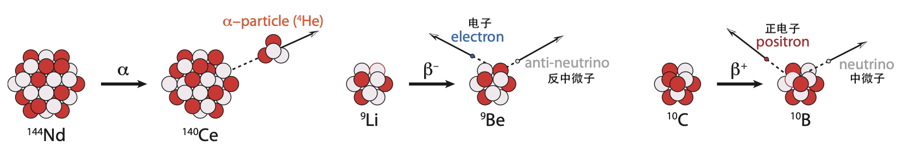

    **图 15.5:** α、:math:`\beta^-` 和 :math:`\beta^+` 的放射性衰变机制。质子为红色，中子为淡紫色。两次 β 衰变的核子总数是正确的，但用于说明 α 衰变的较大 :math:`{}^{144}\text{Nd}` 原子核仅为示意性的，α 衰变主要仅在重核（除 :math:`{}^{5}\text{Li}` 和 :math:`{}^{8}\text{Be}` 外）中见到。正电子是反电子：电子的带正电的反物质对应物。中微子有时被称为"幽灵"粒子，因为它们几乎完全不与普通物质发生相互作用。:cite:`c644`

1. **α 衰变（alpha decay）**，即两个质子和两个中子的四人组——本质上是 :math:`{}^{4}\text{He}` 原子核——跃出。\ [#]_ 当这种情况发生时，原子核的 N 减少两个，Z 减少两个，因此 A 减少 4。在核素图上，它向左移动两格、向下移动两格（见 :ref:`图 15.7<fig15.7>`）。例如，:math:`{}^{8}\text{Be}` 以这种方式衰变，本质上分裂成两个 :math:`{}^{4}\text{He}` 原子核。

.. [#] 氦以与天然气混合的形式被发现，源自地球内部元素的 α 粒子衰变。:cite:`c645`

2. **β⁻ 衰变（beta-minus decay）** 是弱核力的一种表现，原子核内的一个中子转化为质子，在此过程中发射一个电子（:math:`\beta^-` 粒子，实际上就是 :math:`e^-`）以保持总电荷守恒，以及一个中微子——我们将忽略它。\ [#]_ 质量数 A 不变，但 N 减少一个而 Z 增加一个（获得一个质子并失去一个中子）。因此在核素图上的移动是一格向左、一格向上。就像国际象棋的走法（:ref:`图 15.7<fig15.7>`）。

.. [#] 也许忽略中微子是公平的，因为中微子也忽略我们。中微子与物质的相互作用频率极低，一个中微子可以飞过数光年的岩石（类地）物质后才可能撞到什么东西（发生相互作用）。这种极端的非相互作用性使其获得了"幽灵"粒子的称号。:cite:`c646`

3. **β⁺ 衰变（beta-plus decay）** 与 β⁻ 一样，是弱核力的一种表现，原子核内的一个质子转化为中子，发射一个正电子（:math:`\beta^+` 或 :math:`e^+` 或反电子；一种反物质形式），同样保持电荷守恒，以及一个被忽略的中微子。与 β⁻ 衰变类似，A 不变，但 Z 减少一个而 N 增加一个。在核素图上，移动是对角线的：向下格、向右格（:ref:`图 15.7<fig15.7>`）。

4. **γ 衰变（gamma decay）** 发生在原子核处于激发能态时——由某种其他衰变或轰击引起——当它进入较低能态时，发射一个高能光子，称为 γ 射线（:ref:`图 15.6<fig15.6>`）。对于 γ 衰变，Z、N 和 A 都不变，因此原子核不会变成另一种"风味"，因此不会在核素图上移动。

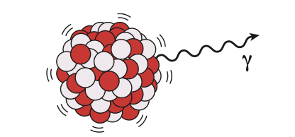

    **图 15.6:** 激发态原子核的 γ 衰变。

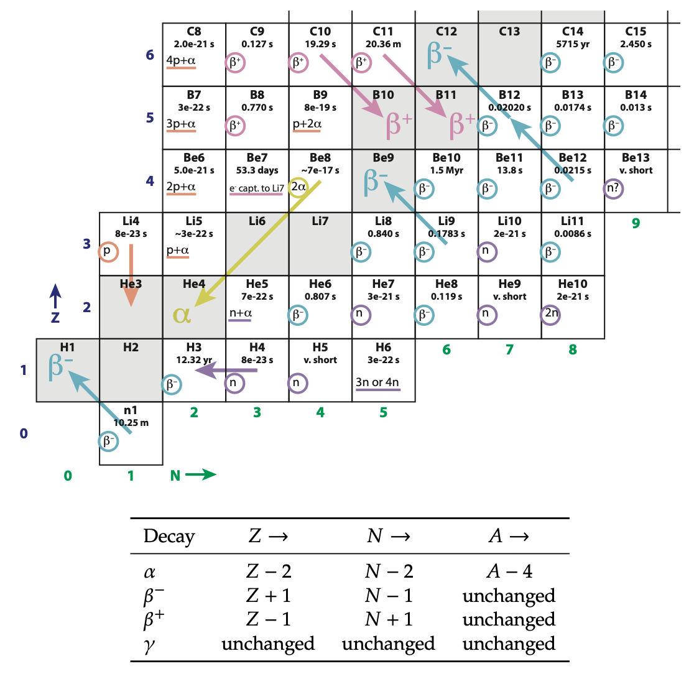

    **图 15.7:** 放射性衰变在核素图"棋盘"上显示为走步。不同的衰变类型以颜色编码以匹配 :ref:`图 15.8<fig15.8>`，仅在几个代表性方格中显示。衰变经常以系列形式发生，一个接一个（衰变链），正如从 :math:`{}^{12}\text{Be}` 开始到 :math:`{}^{12}\text{C}` 结束的双序列所暗示的那样。请注意，每个不稳定核素的方格都指示了一种衰变类型，即使没有箭头出现。

.. csv-table:: **表 15.2:** 衰变对核子数的数学总结。
    :name: tab15.2
    :class: booktabs
    :header: 衰变类型, Z →, N →, A →

    α, "Z − 2", "N − 2", "A − 4"
    "β⁻", "Z + 1", "N − 1", 不变
    "β⁺", "Z − 1", "N + 1", 不变
    γ, 不变, 不变, 不变

.. _exp15.2.2:

  **示例 15.2.2:** 根据 :ref:`图 15.4<fig15.4>`，:math:`{}^{8}\text{He}` 的命运将是什么？

  我们可以玩这个棋局！根据核素图，:math:`{}^{8}\text{He}` 的主要衰变机制是 β⁻，半衰期约为十分之一秒。它将变成 :math:`{}^{8}\text{Li}`，后者存在约一秒钟，然后经历另一次 β⁻ 衰变为 :math:`{}^{8}\text{Be}`。这个几乎不持续任何时间（:math:`\sim 10^{-16}\,s`），然后 α 衰变为两个 α 粒子（两个 :math:`{}^{4}\text{He}`）。这样的序列称为衰变链。

从 :ref:`图 15.8<fig15.8>` 中可以清楚地看到，在 :ref:`图 15.3<fig15.3>` 中稳定轨迹上方的不稳定同位素倾向于发生 β⁺ 衰变以趋近稳定核素，而轨迹下方的同位素倾向于经历 β⁻ 衰变以趋近稳定轨迹。α 衰变更常见于重核（铀附近），驱向 :ref:`图 15.3<fig15.3>` 中稳定元素列车的末端，最终落在铅（Pb）附近。我们可以将铅的丰富理解为重元素衰变链的副产品。

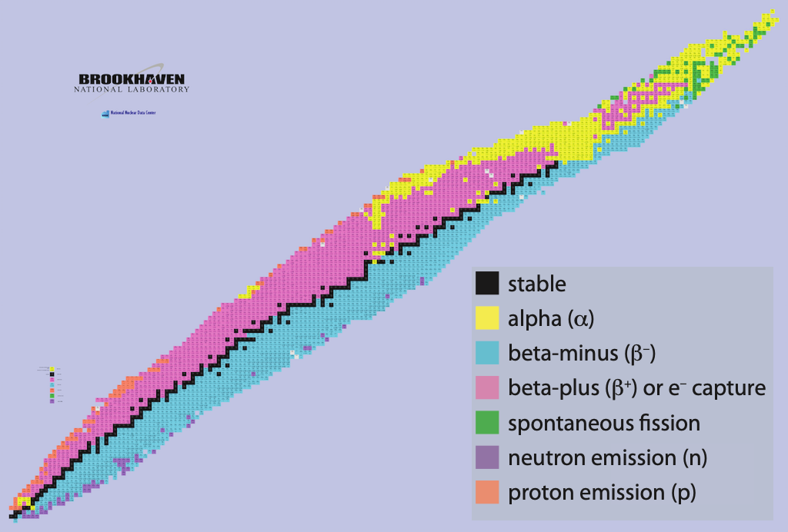

    **图 15.8:** 核素图的另一视角，以颜色编码指示核素图上不同位置的主要衰变模式。请注意 β⁺ 有时捕获一个电子而不是发射正电子，但本质上效果相同。来源：美国能源部。:cite:`c647`

.. _box15.1:

.. admonition:: Box 15.1: 弱核力

    值得顺便一提的是，我们已经讨论了由弱核力主导的 β 衰变，至此我们已经涵盖了自然界所有四种已知力：引力、电磁力、弱核力和强核力。就这些：一个很小的菜单。后三种被统一到标准物理模型中，但由广义相对论描述的引力一直抗拒所有"大统一"或试图将所有四种力纳入单一理论框架的"万物理论"的尝试。一个推论是，已知物理学没有为我们的能源需求提供其他"魔法"解决方案。半个多世纪以来，尽管探测物理学基本性质的工具取得了巨大进步，但没有新的力出现。

15.3 质能
---------------------

能量——无论什么形式——都有质量，并且实际上会改变某物的重量，尽管几乎不可察觉。一个热墨西哥卷饼比完全相同的——原子对原子——冷墨西哥卷饼有更多的质量。\ [#]_ 我们大多数人至少在泛泛的层面上熟悉著名的关系 :math:`E = mc^2`。更有用的是，我们可以将其表达为

.. _eq15.1:

.. math:: \Delta E = \Delta m\, c^2 \tag{15.1}

其中 Δ 符号表示能量或质量的变化，:math:`c \approx 3 \times 10^8\,\text{m/s}` 是光速。使用千克作为质量单位，得到焦耳作为能量单位。由于 :math:`c^2` 是如此大的数字（接近 :math:`10^{17}`），与日常/熟悉的能量量级相关的质量变化小得可以忽略不计。:ref:`Box 15.2<box15.2>` 解释了为什么 :math:`E = mc^2` 对所有能量交换都成立——不仅仅是核反应——但在非核情境中通常产生的质量差异太小而无法测量。前面我们讨论了能量守恒。更准确地说，我们观察到的是质能守恒。也就是说，如果质量相应改变，一个系统实际上可以净获得或净失去能量。在核能释放的情况下，"新"能量是以质量减少为代价的。

.. [#] 如果墨西哥卷饼具有动能、引力势能或任何形式的能量，它也会稍微更重一些。充电的电池质量更大，即使没有添加任何原子或电子。顺便说一句，给电池充电并不意味着字面上添加电荷（添加粒子），而是相当于在电池内的原子之间重新排列电子。:cite:`c648`

.. _box15.2:

.. admonition:: Box 15.2: :math:`E = mc^2` 无处不在

    物理学对何时应用 :math:`E = mc^2` 并不挑剔。它总是适用，适用于每种情况。只是在核反应之外，它不会导致显著的质量差异。

    例如，在我们吃了一个 1,000 kcal 的墨西哥卷饼来为我们的新陈代谢提供能量后，我们消耗了这些能量\ [*]_ 并根据 :math:`\Delta m = \Delta E/c^2` 失去质量。由于 :math:`\Delta E \sim 4\,\text{MJ}`（1,000 kcal），我们发现相关的质量变化为 :math:`4.6 \times 10^{-11}\,\text{kg}`，这比墨西哥卷饼本身的质量小十个数量级。\ [#]_ 所以我们永远不会注意到，即使它确实存在。

    当我们给机械玩具上发条、卷紧弹簧时，我们将能量放入弹簧中，玩具实际上变得更重了！但每输入一焦耳能量，质量只增加约 :math:`10^{-17}\,\text{kg}`。请原谅我们没有注意到。只有在核情境中，能量才大到足以产生可测量的质量差异。

.. [*] {-} ……最终以热能的形式释放到我们的环境中。:cite:`c649`
.. [#] 这个质量对应于一小段比其宽度还短的头发。:cite:`c650`

.. _exp15.3.1:

  **示例 15.3.1:** 由于质量和能量密切相关，通常以能量单位来表达质量。如何将 12.0 a.m.u. 表示为 MeV（一种能量单位；见第 5.9 节；第 78 页）？

  1 a.m.u. 等价于 :math:`1.66 \times 10^{-27}\,\text{kg}`（:ref:`表 15.4<tab15.4>` 最后一行），因此 12 a.m.u. 是 :math:`1.99 \times 10^{-26}\,\text{kg}`。要转换为能量，应用 :math:`E = mc^2`，计算得出 :math:`1.8 \times 10^{-9}\,\text{J}` 的能量。由于 1 MeV 是 :math:`1.6 \times 10^{-13}\,\text{J}`，我们最终得到

  对应于 12 a.m.u. 的 11,200 MeV（1 a.m.u. 是 931.5 MeV）。

在实践中，也许令人惊讶的是，原子（原子核）的重量实际上小于其各部分之和，这是由于结合能的作用。为了将一个原子核完全拆开并将所有核子彼此远离地移动，必须输入能量（:ref:`图 15.9<fig15.9>` 的左半部分）。而任何能量的变化都伴随着质量的变化，通过 :math:`\Delta E = \Delta m\,c^2`。完全拆解原子核所需注入的所有能量都是有质量的！因此，拆解后各部分的总质量实际上是原始原子核的质量加上所有用于撕裂它的能量的质量等价物（:ref:`图 15.9<fig15.9>` 的中间面板）。因此，结合能有效地减少了原子核的质量，我们现在将对其进行定量探讨。

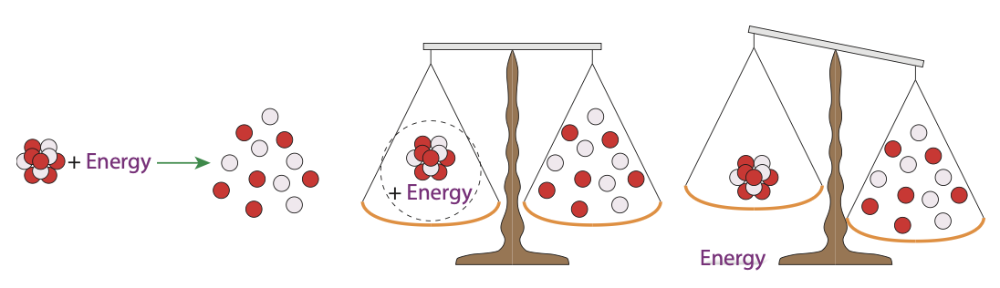

    **图 15.9:** 必须添加能量以克服核结合能，才能将原子核拆解为其组成核子（左）。因此，原子核的质量加上拆解它所需的能量的质量（通过 E = mc²）之和必须等于组成各部分质量的总和（中）。因此，如果我们仅比较原子核本身的质量（从天平上移除能量的质量），它必定小于松散核子集合的质量（右）。

仔细观察 :ref:`图 15.4<fig15.4>` 可以发现，图表左下角较轻的稳定核素（灰色方框）的质量略大于对应的质量数，但到了右上角——氧附近——质量已经略微低于 A。:ref:`表 15.3<tab15.3>` 展示了这一趋势，可以在 :ref:`图 15.4<fig15.4>` 中验证表中前四个核素。质量与 A 之间的差值在铁附近最为负，然后反转并在铀等重元素处再次变为正。

这是怎么回事？如果原子核的质量只是各部分之和，我们会预期总质量随着我们添加更多部分而线性跟踪。事实上，如果我们尝试用 6 个质子、6 个中子和 6 个电子构建一个中性碳原子，根据 :ref:`表 15.4<tab15.4>` 的总和应该是 12.099 a.m.u.，而不是 12.000。这种差异归因于核结合能，如 :ref:`图 15.9<fig15.9>` 中所介绍的。

.. csv-table:: **表 15.3:** 质量进展示例。
    :name: tab15.3
    :class: booktabs
    :header: 核素, A, 质量 (a.m.u.)

    :math:`{}^{2}\text{H}`, 2, 2.014
    :math:`{}^{4}\text{He}`, 4, 4.003
    :math:`{}^{12}\text{C}`, 12, 12.000
    :math:`{}^{16}\text{O}`, 16, 15.995
    :math:`{}^{56}\text{Fe}`, 56, 55.935
    :math:`{}^{235}\text{U}`, 235, 235.044

.. csv-table:: **表 15.4:** 原子构建组分的质量，以三种常用单位系统表达相同的基本内容。
    :name: tab15.4
    :class: booktabs
    :header: 粒子, a.m.u., 10⁻²⁷ kg, MeV/c²

    质子, 1.0072765, 1.6726219, 938.2720882
    中子, 1.0086649, 1.6749275, 939.5654205
    电子, 0.00054858, 0.000911, 0.510999
    (a.m.u.), 1.0000000, 1.660539, 931.494102

核结合能极其强大，\ [#]_ 能够压倒带正电的质子之间自然的电排斥力，将它们粘合在一个不情愿的团块中。强核力仅在大约 :math:`10^{-15}\,\text{m}` 的微小范围内起作用：\ [*]_ 在短距离尺度上非常强大，但在超出原子核范围后就基本停止运作。这样来理解结合能：如果我们试图将一个质子或中子（通称核子）从原子核中撬出来，我们会遇到一个非常强大的力阻止这个动作。但假设我们坚持下去，并通过力乘距离的常规方法做功来提取核子。这个功是如此之大，以至于 :math:`\Delta E = \Delta m\,c^2` 变得相关，可测量地改变质量。

.. [#] ……与我们所称的强核力相关。:cite:`c651`
.. [*] {-} 整个原子的尺度大约是 :math:`10^{-10}\,\text{m}`。:cite:`c652`

:ref:`表 15.5<tab15.5>` 逐步演算了一些示例计算，其中一个在示例 15.3.2 中被追踪。由于 :math:`{}^{1}\text{H}` 核素只是一个孤立的质子，它没有结合能。

请拿一个计算器，自己跟着示例 15.3.2 验算一下！

.. csv-table:: **表 15.5:** 核结合能计算示例。第二列是根据 :ref:`表 15.4<tab15.4>` 的质子、中子和电子质量的简单总和。接下来是实测质量，然后是差值。差值重新以 MeV 表示，代表原子核的总结合能，随着原子核大小的增大而不可阻挡地上升。最后一列除以质量数得到每个核子的结合能，在铁附近达到峰值。见示例 15.3.2 了解这些数字是如何计算的。
    :name: tab15.5
    :class: booktabs
    :header: 原子核, Σm(p,n,e), 实际 m, Δm, Δmc² (MeV), MeV/核子

    :math:`{}^{1}\text{H}`, 1.007825, 1.007825, 0, 0, 0
    :math:`{}^{2}\text{H}`, 2.016490, 2.014102, 0.002388, 2.22, 1.11
    :math:`{}^{4}\text{He}`, 4.032980, 4.002603, 0.030377, 28.29, 7.07
    :math:`{}^{12}\text{C}`, 12.09894, 12.000000, 0.098940, 92.16, 7.68
    :math:`{}^{56}\text{Fe}`, 56.46340, 55.934942, 0.528447, 492.25, 8.79
    :math:`{}^{235}\text{U}`, 236.9590, 235.043920, 1.915065, 1783.85, 7.59

.. _exp15.3.2:

  **示例 15.3.2:** 按照 :ref:`表 15.5<tab15.5>` 中 :math:`{}^{56}\text{Fe}` 的条目，我们首先将 :ref:`表 15.4<tab15.4>` 中单个质子、中子和电子的质量乘以组成 :math:`{}^{56}\text{Fe}` 的 26 个质子、30 个中子和 26 个电子，得到 56.46340 a.m.u. 的各部分之和。\ [#]_

  核素图中 :math:`{}^{56}\text{Fe}` 的实际质量为 55.934942 a.m.u.，比前者小 0.528447 a.m.u。\ [*]_

  由于 1 a.m.u. 是 :math:`1.660539 \times 10^{-27}\,\text{kg}`，我们可以将此质量差转换为千克，然后乘以 :math:`c^2`（:math:`c = 2.99792458 \times 10^8\,\text{m/s}`）得到以焦耳为单位的关联能量。传统上，核物理采用更方便的电子伏特标度，特别是 MeV。\ [#]_ 要将我们的质能差从焦耳转换到 MeV，除以 :math:`1.6022 \times 10^{-13}\,\text{J/MeV}`，这就是 :ref:`表 15.5<tab15.5>` 中 :math:`\Delta mc^2` 列中出现的 492 MeV 数字。

  最后，我们除以原子核中的核子数——本例中 A = 56——以确定每个核子存在多少结合能——其意义很快就会变得更加清晰。

  因此，:ref:`表 15.5<tab15.5>` 中各部分之和与实际原子核质量之间的差异提供了衡量将原子核结合在一起有多少结合能的方法。\ [#]_

.. [#] 在 :ref:`表 15.5<tab15.5>` 中找到这个值。:cite:`c653`
.. [*] {-} 这些数字也出现在 :ref:`表 15.5<tab15.5>` 中。:cite:`c654`
.. [*] {-} 1 MeV 是 :math:`10^6\,\text{eV}`，1 eV 是 :math:`1.6022 \times 10^{-19}\,\text{J}`（第 5.9 节；第 78 页）。:cite:`c655`
.. [#] ……因此有多少能量需要被提供以完全解绑整个原子核，如 :ref:`图 15.9<fig15.9>` 所示。:cite:`c656`

请注意 :ref:`表 15.5<tab15.5>` 中第一个条目——单质子氢原子——在原子核中没有结合能：孤独的质子没有其他核子可以与之结合。但氘（:math:`{}^{2}\text{H}`）有一个质子和一个中子，被 2.2 MeV 的结合能维系在一起。:ref:`表 15.5<tab15.5>` 最后一列中每个核子的结合能开始时很小，但很快就稳定在大多数条目的 7–9 范围内。将每个核子的结合能作为核子质量数 A 的函数进行绘制是极具洞察力的，我们在 :ref:`图 15.10<fig15.10>` 中做到了这一点。

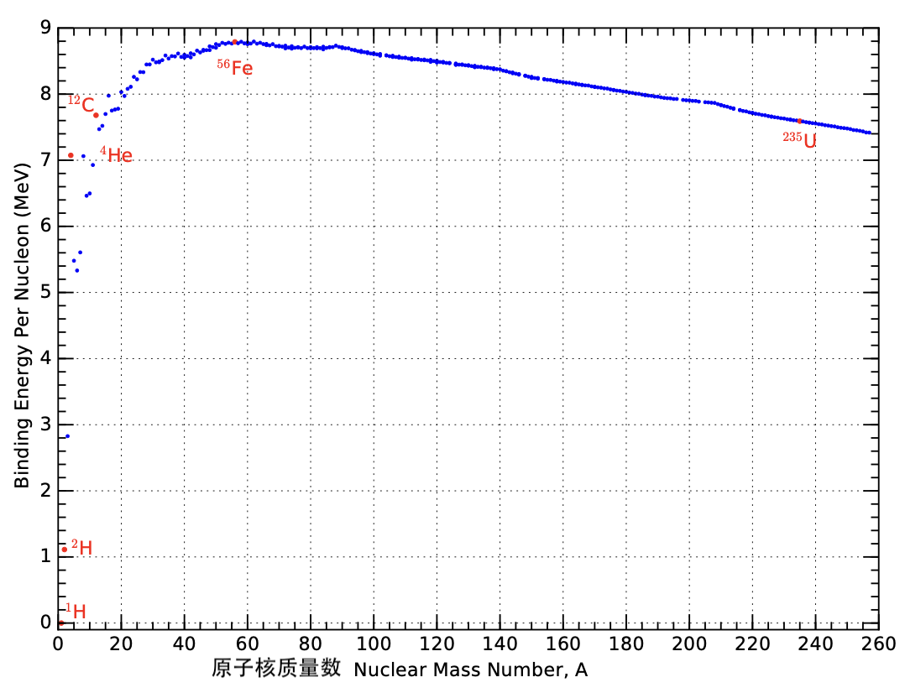

    **图 15.10:** 每个核子的结合能作为总质量数 A 的函数。:ref:`表 15.5<tab15.5>` 中涉及的原子核以红点标示。特别值得注意的是，:math:`{}^{56}\text{Fe}` 位于曲线的峰值处。聚变从左到右运作，构建更大的原子核；裂变从右到左运作，撕裂原子核。只有沿曲线上爬的行动在能量上是有利的，这意味着聚变在左侧有利可图，裂变在右侧有意义：每种方式都驱向每个核子的峰值结合能。:cite:`c657`

:ref:`图 15.10<fig15.10>` 的价值再怎么强调也不过分。关键要点是：

1. 大多数原子核每个核子约为 8 MeV，意味着将每个成员（质子或中子）从原子核中撕裂出来平均需要约 8 MeV 的能量；
2. 峰值在 :math:`{}^{56}\text{Fe}`，\ [#]_ 意味着这是结合最紧密的原子核；\ [*]_
3. 峰值左侧的斜率比峰值后右侧的斜率要陡得多，这说明了为什么聚变（从小到大构建）比裂变（撕裂巨大原子核）更强大；
4. 恒星中的聚变不会构建超过铁附近峰值的元素，因为超越峰值在能量上是不利的。

将 :ref:`图 15.10<fig15.10>` 倒过来看会有所帮助，如 :ref:`图 15.11<fig15.11>` 所示，将铁的"峰"变成一个谷。一个球会滚向并停歇在谷底附近，这就是聚变和裂变都做的事，但从相反的方向。

.. [#] 实际上，:math:`{}^{62}\text{Ni}` 以 8.795 MeV/核子险胜，但由于其丰度仅为 :math:`{}^{56}\text{Fe}` 的 0.006% 而有些被忽视，:math:`{}^{56}\text{Fe}` 的每个核子结合能为 8.790 MeV/核子，基本并列第一。:cite:`c658`
.. [*] {-} 峰值的存在是因为核子最初在结合在一起时找到了优势，但最终越来越多相互排斥的质子使环境对较大的核素变得不那么有吸引力。:cite:`c659`

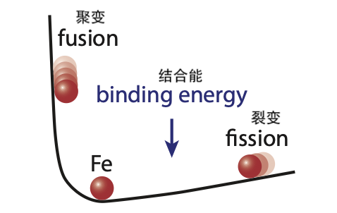

    **图 15.11:** 将结合能曲线倒过来使概念化聚变和裂变驱向结合最紧密的点（铁）更加容易，就像一个球可能会滚动一样。

15.4 裂变
---------------------

在涵盖了一些基础知识之后，我们准备好应对核能的各个方面。其实它非常简单。空间小到足够容纳的核材料会发热，原因将在下面详述。热量被用来将水煮沸成高压蒸汽，然后转动涡轮和发电机（:ref:`图 15.12<fig15.12>`）。请注意，核裂变电站与燃煤电厂有很多共同之处，:ref:`图 15.12<fig15.12>` 与图 6.2（第 90 页）的相似性就是证明。唯一的不同在于热源的起源。

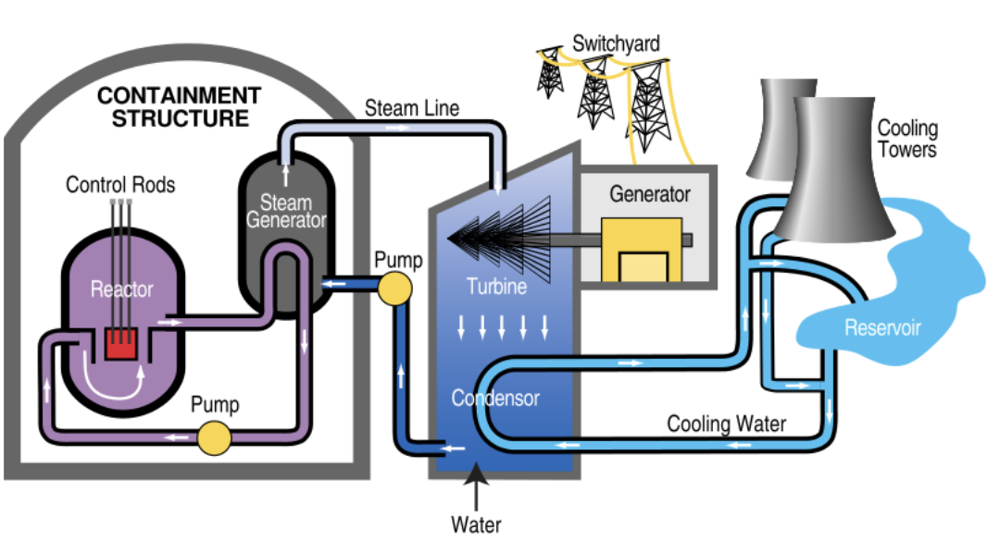

    **图 15.12:** 典型的核电站设计，与图 6.2 的通用方案非常相似。反应堆堆芯的细节将在 15.4.4 节中介绍。来源：TVA。

15.4.1 基本思路
++++++++++++++++++++++++

在所有核素中，有三种可用于裂变反应堆。其中两种是铀的同位素：:math:`{}^{233}\text{U}` 和 :math:`{}^{235}\text{U}`；一种是钚：:math:`{}^{239}\text{Pu}`。其中，只有 :math:`{}^{235}\text{U}` 在自然界中存在，因此我们将专注于这一个，稍后在讨论 15.4.4.2 节中的增殖反应堆时再回到另外两种。:cite:`c660`

使得 :math:`{}^{235}\text{U}`（以及另外两种）特别的是，一个慢\ [#]_ 中子——一个仅以由局部温度决定的速度四处游荡的中子，因此被称为热中子——可以走到并粘附\ [*]_ 到原子核上并使其分裂成两个大块——如 :ref:`图 15.13<fig15.13>` 所示。其他原子核不会碎裂，只是接受新中子，可能通过 β⁻ 衰变将一个中子转换为质子。

.. [#] 这与倾向于反弹而不是粘附到原子核上的快中子形成对比。:cite:`c661`
.. [*] {-} 没有力阻止中子接近原子核。碰巧击中微小的原子核是唯一的障碍。:cite:`c662`

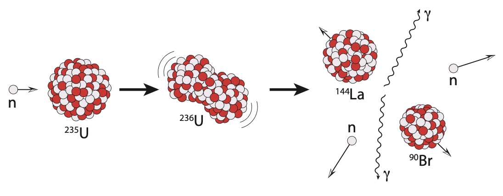

    **图 15.13:** :math:`{}^{235}\text{U}` 的裂变示意图，展示了众多可能结果之一——本例中为 :math:`{}^{90}\text{Br}` 和 :math:`{}^{144}\text{La}` 加两个中子（正文中详细处理的示例情况）。:math:`{}^{235}\text{U}` 吸收中子时产生的中间态 :math:`{}^{236}\text{U}` 极不稳定，将自发碎裂为（总是）两个不同大小的大碎片（"子"原子核），也许还有一些额外的中子。γ 射线和动能（高速碎片）也被释放。请注意，在每个阶段，核子的总数始终为 236。:cite:`c663`

当原子核碎裂时，碎片以高速飞出，携带的动能在它们碰撞停下来的过程中沉积在局部材料中。γ 射线\ [#]_ 也被释放。通过捕获所有这些高能输出，周围材料变得非常热，可以用来制造蒸汽。

.. [#] {-} ……非常高能量的光子。:cite:`c664`

15.4.2 链式反应
++++++++++++++++++++++++

正如我们所见，为了让裂变发生，我们需要 :math:`{}^{235}\text{U}` 和一些游荡的中子。一旦裂变开始，原子核的碎裂通常会"洒出"几个多余的中子，就像切面包后留下的碎屑一样。剩余的中子提供了补充的中子来源，准备发起更多的裂变事件。现在链式反应的大门打开了：裂变事件产生的中子正是刺激额外裂变事件所需要的东西。

当原子核分裂时，任何多余的中子以"热"（高速）状态出现，倾向于从铀原子核上反弹而不粘附。它们需要被减速，这通过减速剂来实现：基本上是轻原子\ [#]_ 可以作为阻尼介质接收中子的冲击。然后主要的技巧是防止过多中子出现时可能发生的失控；在这种情况下，一个可能失控的"派对"。因此核电站使用含有特别有效吸收（捕获）中子材料的控制棒。核素图中某些方框下半部分的颜色指示了中子吸收截面。硼（:math:`{}^{10}\text{B}`）是吸收中子以驯服（甚至停止）反应的首选材料。目标是维持一个链式反应，使每次裂变事件恰好产生一个净余额的未吸收慢中子，可用于附着到等待中的 :math:`{}^{235}\text{U}` 原子核上。

.. [#] ……通常是水或碳（石墨形式）。:cite:`c665`

15.4.3 裂变核算
++++++++++++++++++++++++

原子核（在当前讨论中是铀）总是碎裂成两个较大的碎片，可能伴随着几个释放的多余中子。由于稳定元素轨迹在核素图上的弯曲方式，产生的碎片可能富含中子，位于稳定核素的右侧。要理解这一点，请参考 :ref:`图 15.14<fig15.14>` 和相关说明。

数学总是要加得起来的：核子在裂变事件中不会被创造或销毁。它们只是重新排列，因此中子的总数保持不变，质子的总数也保持不变。分裂后，β⁻ 衰变将执行"风味"变化，但我们稍后再处理那部分。

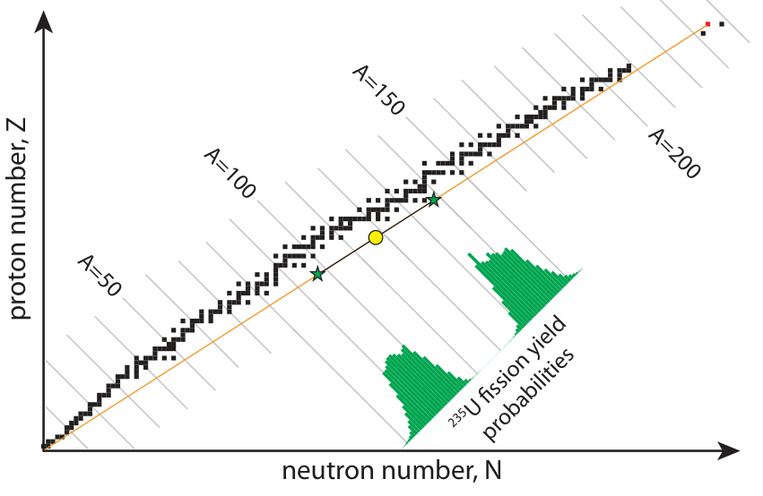

    **图 15.14:** :math:`{}^{235}\text{U}`（红色小方块，右上角）的裂变倾向于产生两个富含中子的碎片。如果恰好分裂成两半，结果将位于连接 :math:`{}^{235}\text{U}` 到原点的橙色线段的中点处，即黄色圆圈。实际上，等分裂极不可能，一个碎片倾向于 A 约 95 左右，另一个约 A 约 140 左右，如绿色概率直方图所示。沿橙色线分隔的两个绿色星星代表两个碎片更可能的结果。只要绿色星星的位置使得黄色圆圈恰好位于它们之间，质子数和中子数的核算就满足了。由于橙色线位于稳定核素的右侧，裂变产物倾向于富含中子，并在到达稳定态之前经历一系列放射性 β⁻ 衰变，在某些情况下这可能需要很长时间。:cite:`c666`

.. _exp15.4.1:

  **示例 15.4.1:** 如果 :math:`{}^{235}\text{U}` 原子核（Z = 92）吸收一个热中子后裂变产生的两个碎片之一是 :math:`{}^{90}\text{Br}`（Z = 35），另一个原子核将是什么？

  另一个碎片将保持总质子数不变，因此 Z = 92 − 35 = 57，因此注定是镧元素。产生哪种镧的同位素取决于分裂时有多少中子逃逸。:ref:`表 15.6<tab15.6>` 总结了各参与者的粒子计数。

  如果没有多余的中子剩余，镧必须有 N = 144 − 55 = 89 个中子，\ [#]_ 在这种情况下其质量数为 A = 146，即 :math:`{}^{146}\text{La}`。如果两个中子被释放，则镧只保留 87 个中子，为 :math:`{}^{144}\text{La}`，如 :ref:`图 15.13<fig15.13>` 所示。

  通常，大约 2–3 个中子会从最终碎片中剩余，可以继续在链式反应中促进额外的裂变事件。

.. [#] :math:`{}^{235}\text{U}` 有 A − Z = 235 − 92 = 143 个中子，加上热中子的添加。:cite:`c667`

.. csv-table:: **表 15.6:** 示例 15.4.1 的可能结果，如果我们将一个子粒子设为溴-90，迫使另一个子为镧。不同的镧同位素将根据碎裂后剩余的不同数量的多余中子而产生（最后一行）。
    :name: tab15.6
    :class: booktabs
    :header: , :math:`{}^{235}\text{U}`, :math:`{}^{90}\text{Br}`, :math:`{}^{146}\text{La}`, :math:`{}^{145}\text{La}`, :math:`{}^{144}\text{La}`, :math:`{}^{143}\text{La}`

    A, 235, 90, 146, 145, 144, 143
    Z, 92, 35, 57, 57, 57, 57
    N, 143, 55, 89, 88, 87, 86
    n, 1, 0, 1, 2, 3,

作为一个概率性（随机）过程，每次裂变可以产生大量可能的"子"原子核——示例 15.4.1 中只探讨了其中一组。只要质量全部加总，并且尊重 :ref:`图 15.14<fig15.14>` 中的双峰概率分布，任何组合都可以。换句话说，我们无法精确控制最终会出来哪些碎片。:ref:`图 15.15<fig15.15>` 提供了四对不同可能的子碎片对的图示。计数要求通过使产物位于与 :math:`{}^{235}\text{U}` 中点（黄色圆圈）直径相对的位置来满足。星星的位置将根据概率分布（多色直方图）沿 A 值分布。注意完全不同的峰值，传达了实际上每次裂变事件都只产生两个碎片：一个较大和一个较小。至少裂变的这一方面是可预测的，即使我们无法精确说出个别裂变事件后留下哪些原子核。

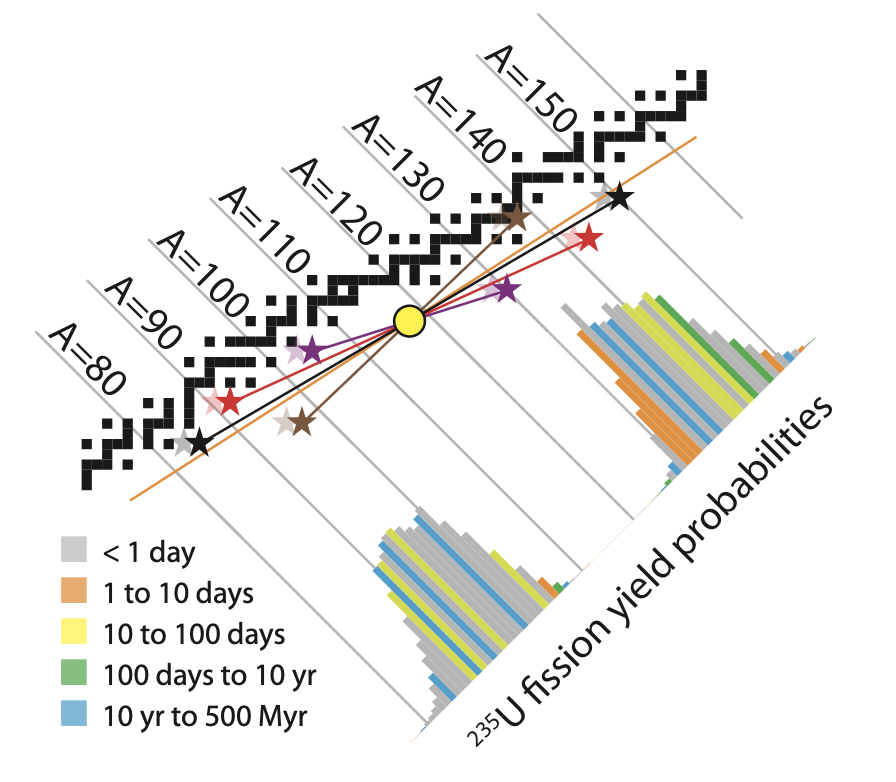

    **图 15.15:** 各种裂变产物结果是可能的，此处以四组彩色星对和连接线表示。每对的平均位置是黄色圆圈（星星与圆圈直径相对），这保证了从母核到子核的中子数和质子数总数不变。在某种程度上，额外的中子像碎屑一样留在后面，星星将向其标示位置的左侧偏移一点，如较浅色的"幽灵"星所暗示，它们与标称星位置的偏移也将根据从两个最终碎片中留下多少中子而变化。直方图的颜色表示每个质量数处富含中子碎片的衰变链的放射性寿命，与 :ref:`图 15.4<fig15.4>` 中使用的半衰期颜色方案匹配。:cite:`c668`

现在让我们检查能量学，使用示例 15.4.1 的结果，其中 :math:`{}^{235}\text{U}` 碎裂为 :math:`{}^{90}\text{Br}` 和 :math:`{}^{144}\text{La}`，加上两个多余的中子。\ [#]_ 具体来说，我们将追踪的反应是

.. _eq15.2:

.. math:: {}^{235}\text{U} + \text{n} \rightarrow {}^{90}\text{Br} + {}^{144}\text{La} + 2\text{n} \tag{15.2}

.. csv-table:: **表 15.7:** 式 15.2 的质量详情，以 a.m.u. 和 MeV 两种单位跟踪反应前后的质量。约 236 a.m.u. 的输入质量减少了约 0.185 a.m.u.，即 0.08%。
    :name: tab15.7
    :class: booktabs
    :header: 组分/阶段, 质量 (a.m.u.), 质量 (MeV/c²)

    :math:`{}^{235}\text{U}`, 235.04392, 218,942.0
    n, 1.00866, 939.6
    **输入质量**, **236.05259**, **219,881.6**
    :math:`{}^{90}\text{Br}`, 89.93069, 83,769.9
    :math:`{}^{144}\text{La}`, 143.91955, 134,060.2
    2n, 2.01733, 1,879.1
    **输出质量**, **235.86757**, **219,709.3**
    **质量变化**, **0.18502**, **172.3**

.. [#] ……也匹配 :ref:`图 15.13<fig15.13>` 和 :ref:`表 15.6<tab15.6>` 倒数第二列中的情景。:cite:`c669`

根据核素图，每块碎片的质量列在 :ref:`表 15.7<tab15.7>` 中。我们再次发现质量之和不等于：最终部分比输入轻。裂变设法失去了 0.185 a.m.u. 的质量，对应 172 MeV 的能量（通过 :math:`E = mc^2`；见示例 15.3.1）。这是 0.08% 的质量变化，换算成约 1700 万 kcal/g 的能量密度，使该过程比我们通常的约 10 kcal/g 化学能量密度高出超过一百万倍。见 :ref:`Box 15.3<box15.3>` 了解如何计算此值的示例。

.. _box15.3:

.. admonition:: Box 15.3: 核能密度

    :ref:`表 15.7<tab15.7>` 对应的示例据说对应 1700 万 kcal/g，但我们如何得出这个数字？0.185 a.m.u. 的质量变化对应 :math:`3.07 \times 10^{-28}\,\text{kg}` 的质量，根据 1 a.m.u. 等于 :math:`1.6605 \times 10^{-27}\,\text{kg}` 的换算（:ref:`表 15.4<tab15.4>`）。乘以 :math:`c^2` 得到以焦耳为单位的能量，即 :math:`2.76 \times 10^{-11}\,\text{J}`。\ [#]_ 以 kcal 为单位，我们除以 4,184 J/kcal，得出此裂变事件产生 :math:`6.6 \times 10^{-15}\,\text{kcal}`。

    现在我们只需要除以我们提供的"燃料"是多少克，即 236.05 a.m.u.（:ref:`表 15.7<tab15.7>`），等于 :math:`3.92 \times 10^{-25}\,\text{kg}`，或 :math:`3.92 \times 10^{-22}\,\text{g}`。现在我们将 :math:`6.6 \times 10^{-15}\,\text{kcal}` 除以 :math:`3.92 \times 10^{-22}\,\text{g}` 得到 :math:`16.8 \times 10^6\,\text{kcal/g}`。完全碾压了墨西哥卷饼。

.. [#] 顺便说一句，这个结果与 :ref:`表 15.7<tab15.7>` 中使用 1 MeV 等于 :math:`1.6022 \times 10^{-13}\,\text{J}` 的换算得到的 172.3 MeV 相同。:cite:`c670`

.. _exp15.4.2:

  **示例 15.4.2:** 考虑到美国人均以 10,000 W 的速率使用能量，每年需要多少 :math:`{}^{235}\text{U}` 才能满足一个人的需求？

  由于我们刚刚计算出 :math:`{}^{235}\text{U}` 的能量密度为 :math:`17 \times 10^6\,\text{kcal/g}`（:ref:`Box 15.3<box15.3>`），我们先将总能量以焦耳为单位表示，将 :math:`10^4\,\text{W}` 乘以一年中的 :math:`3.155 \times 10^7\,\text{s}`，然后除以 4,184 J/kcal 得到千卡。结果为 7500 万 kcal，因此一个美国人年度能源需求可以通过 4.5 g\ [#]_ 的 :math:`{}^{235}\text{U}` 来满足。按铀的密度计算，这相当于约四分之一立方厘米，或一颗小石子。相当惊人！

.. [#] 7500 万 kcal 除以 1700 万 kcal/g 等于 4.5 g。:cite:`c671`

.. _exp15.4.3:

  **示例 15.4.3:** 参考 :ref:`图 15.10<fig15.10>`（和/或 :ref:`表 15.5<tab15.5>`），可以看到 :math:`{}^{235}\text{U}` 的每个核子结合能约为 7.6 MeV。我们最终到达的位置，A 约 95 和 A 约 140 附近，每个核子的结合能分别约为 8.7 和 8.4 MeV/核子。

  将每个核子的结合能乘以核子数提供了一种总结合能的度量：在本例中 :math:`{}^{235}\text{U}` 为 1,790 MeV，A 约 95 附近的子原子核约为 825 MeV，A 约 140 约为 1,175 MeV。\ [#]_ 将后两者相加，我们发现裂变产物的总结合能约为 2,000 MeV，大于 :math:`{}^{235}\text{U}` 的结合能约 210 MeV——与 :ref:`表 15.7<tab15.7>` 中为特定示例计算的 172 MeV 相当接近。

  图形方法几乎不费力气就使我们得到了非常接近的结果，希望能导致更深入的理解。下面这段解释了差异，但应被视为非必要阅读。裂变过程通常会产生一些多余的中子。每个剩余的（未结合的）中子至少剥夺了我们 8 MeV 的未实现结合势能，\ [*]_ 而来自富含中子的子原子核到稳定原子核的后续 β⁻ 衰变也释放了 :ref:`表 15.7<tab15.7>` 中未计入的能量。这两者都促成了比较 172 MeV 与 210 MeV 时的不足，但即使没有这些，仅使用 :ref:`图 15.10<fig15.10>` 中的图表我们也得到了一个不错的估计。

.. [#] :math:`7.6 \times 235`；:math:`8.7 \times 95`；以及 :math:`8.4 \times 140`。:cite:`c672`
.. [*] {-} 每个缺失的中子剥夺了我们的不仅仅是标准的约 8 MeV/核子，因为中子没有带电排斥力的代价。8 MeV/核子是质子和中子的平均值。:cite:`c673`

15.4.4 实际实施方案
++++++++++++++++++++++++

如上所述，核裂变涉及使可裂变核素——通常是 :math:`{}^{235}\text{U}`——通过添加中子而分裂。必须满足以下标准：

1. 存在核燃料（:math:`{}^{235}\text{U}`）；
2. 存在中子，由之前裂变事件的剩余物提供；
3. 减速剂以减缓从裂变事件中以高速出现的中子；
4. 足够高浓度的核燃料，使减速后的多余中子有可能找到可裂变核素；
5. 以控制棒形式的中子吸收剂，可以降入反应堆中，作为设定反应速度（从而功率输出）的主要"节流阀"，并防止失控链式反应；
6. 安全壳容器，以减轻放射性粒子（γ 射线、高速电子和正电子）逃逸到环境中。:cite:`c674`

:ref:`图 15.16<fig15.16>` 展示了典型的配置。

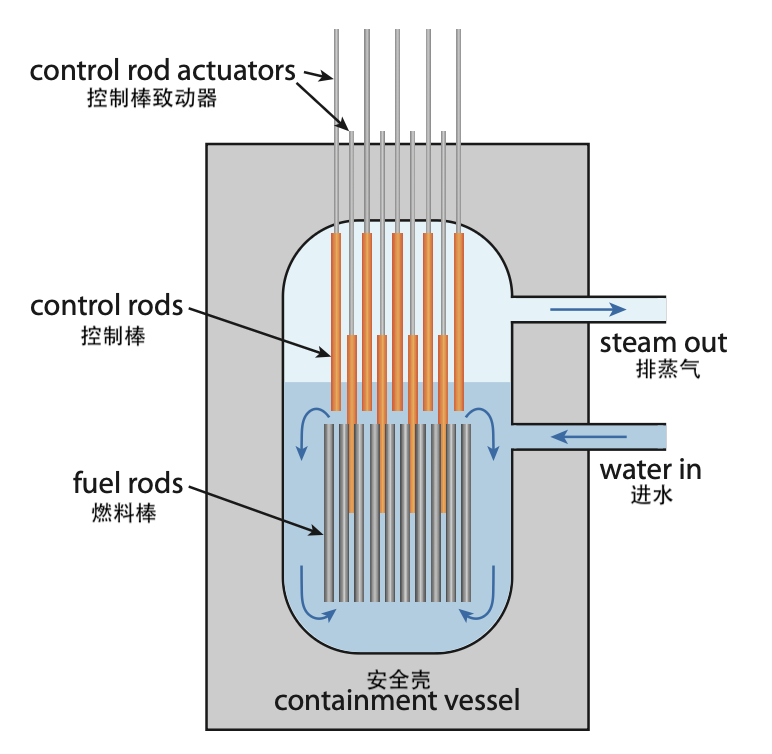

    **图 15.16:** 典型的沸水反应堆设计。厚壁安全壳容器盛放着包围 :math:`{}^{235}\text{U}` 燃料棒的水。水作为减速剂减缓中子，同时也在燃料棒周围循环以带走热量，沸腾形成蒸汽，可以运行标准的发电厂。控制棒根据其插入燃料棒之间空间的深度来设定反应速度。额外的控制棒悬停在反应堆堆芯上方，准备在紧急情况下快速落入堆芯——突然使链式反应停止。:cite:`c675`

在 :ref:`图 15.16<fig15.16>` 的设计中，称为沸水反应堆，水同时充当中子减速剂和热传导介质。核燃料（铀）排列在燃料棒中，提供充足的表面积并允许水在燃料棒之间循环以减缓中子和带走热量。吸收中子的控制棒——通常含有硼——从顶部降下来设定反应速度。\ [#]_ 一组紧急控制棒可以快速降入堆芯，如果出了问题立即关闭反应堆。当紧急控制棒就位时，中子在找到 :math:`{}^{235}\text{U}` 原子核之前被硼吞没的几率极小。

截至 2019 年，全球约有 455 座运营中的核反应堆，装机容量约 400 GW。\ [*]_ 平均产出功率——并非所有反应堆都在一直运行——略低于 300 GW。热等效值大约是此数的三倍，即全球 18 TW 中有 1 TW。因此核能是一个重要的参与者。见 :ref:`表 15.8<tab15.8>` 了解前几个国家的明细，图 7.7（第 109 页）了解全球核能趋势，图 7.4（第 107 页）了解美国趋势。:cite:`c676`

.. [#] ……总是从顶部下降，这样重力做拉力而不是依赖其他驱动力。:cite:`c677`
.. [*] {-} 由此我们推断反应堆平均各约 1 GW。:cite:`c678`

.. csv-table:: **表 15.8:** 2019 年全球核电:cite:`c679`
    :name: tab15.8
    :class: booktabs
    :header: 国家, 电站数, GW 装机, GW 平均, 占电力%, 全球份额%

    美国, 95, 97, 92, 20, 31
    法国, 56, 61, 44, 71, 15
    中国, 49, 47, 38, 5, 13
    俄罗斯, 38, 28, 22, 20, 8
    日本, 33, 32, 8, 8, 3
    韩国, 24, 23, 16, 26, 5
    印度, 22, 6, 5, 3, 2
    **全球合计**, **455**, **393**, **295**, **11**, **100**

核电站的寿命仅约 50–60 年，此后构成堆芯的材料因暴露于破坏性辐射而变脆，必须退役。美国反应堆的中位年龄为 40 年，除三座外都超过 30 年。其他挑战将在接下来的章节中讨论。

当核能在 1950 年代首次推广时，流行语是它将"便宜到不需要计量"，这种情绪大概是铀的惊人能量密度所推动的，与化石燃料相比只需要极少的数量。现实并非如此。今天，一座 1 GW 的核电站可能耗资 90 亿美元建造。\ [#]_ 即每瓦输出功率 9 美元，我们可以将其与太阳能电池板的成本——约每瓦 0.50 美元（图 13.16；第 215 页）——或公用事业级安装的每瓦 1 美元进行比较。\ [*]_ 虽然似乎太阳能\ [#]_ 以巨大优势获胜，但太阳能的低容量因子将平均功率输出降低到峰值额定值的 10–20%，取决于位置。与此同时，核反应堆倾向于稳定运行 90% 的时间——停机时间用于维护和装料。因此核裂变每交付瓦的成本约为 10 美元，而太阳能电池板为每交付瓦 2.5–5 美元，公用事业级安装系统为每交付瓦 5–10 美元。简而言之，核能并非经济上的压倒性胜利。

.. [#] Union of Concerned Scientists (2015), The Cost of Nuclear Power。:cite:`c680`
.. [*] {-} 回想一下，作为背景，太阳能并非更便宜的能源之一。与太阳能一样，核能的主导成本是前期成本，而非燃料成本。:cite:`c681`
.. [#] {-} ……尽管如此，如果不受容量因子调整的影响，太阳能看起来仍然更便宜。:cite:`c682`

15.4.4.1 铀
+++++++++++++++++++++

到目前为止，我们忽略了一个关键事实。地球上天然铀中只有 0.72% 是可裂变的 :math:`{}^{235}\text{U}`。绝大多数 99.2745% 是无害的 :math:`{}^{238}\text{U}`。\ [#]_ 比例约为 140:1，因此每从地下提取一个 :math:`{}^{235}\text{U}` 原子，必须提取 140 倍于此的铀原子。这种差异的起源是一个天体物理学和亿万年时间的故事，在 :ref:`Box 15.4<box15.4>` 中介绍。:cite:`c683`

.. [#] 微量 0.0055% 为 :math:`{}^{234}\text{U}`。:cite:`c684`

.. _box15.4:

.. admonition:: Box 15.4: 铀的起源

    形成宇宙的大爆炸只产生了最轻的原子核。结果大体上是 75% 的氢（:math:`{}^{1}\text{H}`）和 25% 的氦（:math:`{}^{4}\text{He}`）。氘（:math:`{}^{2}\text{H}`）和 :math:`{}^{3}\text{He}` 分别以 0.003% 和 0.001% 的水平产生，然后是极微量的锂。没有碳或氧出现，后者必须通过恒星中的聚变"烹饪"出来。

    恒星中的聚变不会"爬过" :ref:`图 15.10<fig15.10>` 中结合能曲线的峰值，因此停在铁\ [*]_ 附近。那么，周期表中所有更重的元素从何而来？被称为超新星的恒星爆炸和中子星合并似乎是锌以上元素的起源。

    地球上 :math:`{}^{235}\text{U}` 和 :math:`{}^{238}\text{U}` 的相对丰度可以通过它们不同的半衰期——分别为 7.04 亿年和 44.7 亿年——来解释。即使从可比的数量开始，到现在大多数 :math:`{}^{235}\text{U}` 都已经衰变殆尽。反推\ [#]_ 到它们以等量存在的时间得出约 60 亿年，这比太阳系的年龄（45 亿年）老，比宇宙的年龄（138 亿年）年轻。这对于天体物理起源可能有多老来说是一个合理的结果——为物质在我们正在形成的太阳系中汇聚留出了约十亿年的时间。

.. [*] {-} 铁的 Z = 26；恒星倾向于不通过聚变产生超过锌（Z = 30）的元素。:cite:`c685`
.. [#] {-} 这几乎遵循与碳-14 放射性测年完全相同的逻辑和过程，但使用长得多的半衰期核素来测定地球构建物质的年代！:cite:`c686`

铀并不特别丰富。:ref:`表 15.9<tab15.9>` 提供了各种元素在地壳中丰度的概况。铀比银更丰富，但有用的 :math:`{}^{235}\text{U}` 同位素的稀有程度是银的四倍，仅约为金丰度的 5 倍。铀的已探明储量\ [#]_ 为 760 万（公）吨可供应，我们迄今为止已使用了 280 万公吨。这意味着我们可以在已探明储量上继续大约是目前已使用时间的 3 倍。但由于核能在能源结构中的占比远低于化石燃料，所以这可能并不算多。

以能量术语评估铀储量是最具揭示性的方法。首先，我们取 760 万吨可用铀的 0.72% 来表示以 :math:`{}^{235}\text{U}` 形式存在的铀部分。浓缩（下一节）不会分离所有的 :math:`{}^{235}\text{U}`，而且反应堆在燃料棒基本失效之前也无法烧掉所有 :math:`{}^{235}\text{U}`。因此乐观地说，我们在反应堆中烧掉开采出的 :math:`{}^{235}\text{U}` 的一半。将得到的 27,300 吨可用 :math:`{}^{235}\text{U}` 乘以我们之前推导的 1700 万 kcal/g，得到总共 :math:`2 \times 10^{21}\,\text{J}` 的能量。:ref:`表 15.10<tab15.10>` 将此与第 127 页的化石燃料已探明储量进行了对比。从中我们可以看到，已探明铀储量仅为我们已探明石油储量的 20% 的能量，约为我们剩余化石燃料总供应量的 5%。如果我们试图从这些铀供应中获得全部 18 TW，它将维持不到 4 年！这听起来不像是一个救赎。

已探明铀储量以当前使用速度可用 90 年，因此在有限供应方面，它确实与化石燃料处于相当类似的类别。公平地说，已探明储量始终是估计总资源可用性的保守下限。由于燃料成本不是核电站的限制因素，更高的铀价可以使更多的铀从更难开采的矿床中获得。即便如此，即使是两倍也不会将故事转变为一个充裕、无忧的资源的叙事。

.. [#] (2020), List of Countries by Uranium Reserves。:cite:`c687`

.. csv-table:: **表 15.9:** 地壳中示例材料丰度，以百万分之一质量计。
    :name: tab15.9
    :class: booktabs
    :header: 元素, 丰度, 元素, 丰度, 元素, 丰度

    硅, 282,000, 碳, 200, 钍, 9.6
    铝, 82,300, 铜, 60, 铀, 2.7
    铁, 56,300, 锂, 20, 银, 0.075
    钙, 41,500, 铅, 14, :math:`{}^{235}\text{U}`, 0.02
    钛, 5,650, 硼, 10, 金, 0.004

.. csv-table:: **表 15.10:** 已探明储量（能量单位）。
    :name: tab15.10
    :class: booktabs
    :header: 燃料, 10²¹ J

    煤炭, 20
    石油, 10
    天然气, 8
    :math:`{}^{235}\text{U}`, 2

15.4.4.2 增殖反应堆
+++++++++++++++++++++++++

在其天然形式中，:math:`{}^{235}\text{U}` 在天然铀中过于稀薄——被 :math:`{}^{238}\text{U}` 压倒性地主导——甚至无法在核反应堆中工作。它必须被浓缩到 3–5% 的浓度才能变得可行。\ [#]_ 浓缩很难实现。在化学上，:math:`{}^{235}\text{U}` 和 :math:`{}^{238}\text{U}` 行为完全相同。它们的质量如此接近——仅相差 1%——以至于机械过程很难区分。通常使用离心机让较重的 :math:`{}^{238}\text{U}` 更快地沉淀\ [*]_ 于 :math:`{}^{235}\text{U}`。但这效率低下，通常需要多次迭代才能达到更高的浓度。这个过程也是损耗性的，并非所有 :math:`{}^{235}\text{U}` 都能到达浓缩堆。\ [#]_

.. [#] 铀弹至少需要 20% 的 :math:`{}^{235}\text{U}` 浓度，但通常目标为 85% 才被视为武器级。:cite:`c688`
.. [*] {-} ……以气体形式。:cite:`c689`
.. [#] {-} 贫铀定义为含有 0.3% 或更少的 :math:`{}^{235}\text{U`，这与 0.72% 的起点相比并不是很大的减少。:cite:`c690`

但是如果我们能在反应堆中使用大宗铀 :math:`{}^{238}\text{U}`，不仅省去浓缩的麻烦，还能实际上获得 140 倍更多的材料呢？这样做将把已探明铀储量变成比我们所有剩余化石燃料多约 7 倍的能源供应。事实证明，尽管 :math:`{}^{238}\text{U}` 不是三种可裂变核素之一，我们可以通过以下方式将 :math:`{}^{238}\text{U}` 转换为可裂变的 :math:`{}^{239}\text{Pu}`（称为嬗变）：

1. 一个 :math:`{}^{238}\text{U}` 可以吸收一个游荡的中子变成 :math:`{}^{239}\text{U}`。
2. :math:`{}^{239}\text{U}`，半衰期为 23.5 分钟，很快经历 β⁻ 衰变成为 :math:`{}^{239}\text{Np}`。
3. :math:`{}^{239}\text{Np}` 也经历 β⁻ 衰变，半衰期为 2.4 天，成为可裂变的 :math:`{}^{239}\text{Pu}`。

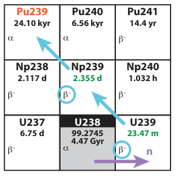

    **图 15.17:** 通向 :math:`{}^{239}\text{Pu}` 的增殖路径。

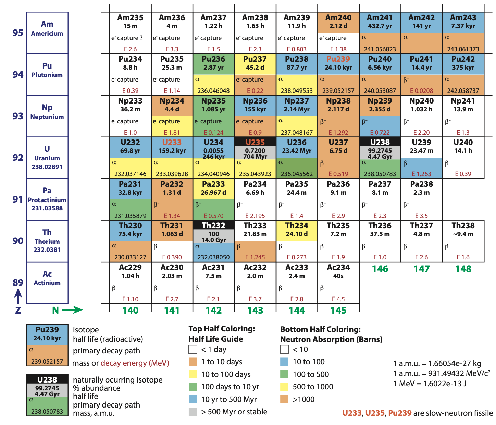

    **图 15.18:** 裂变区域的核素图。另见 :ref:`图 15.4<fig15.4>` 了解左下角。:cite:`c691`

结果是无用的 :math:`{}^{238}\text{U}` 可以被转化为可裂变的 :math:`{}^{239}\text{Pu}`，后者可以在裂变反应堆中使用。将惰性原子核转化为可裂变原子核的过程称为增殖（breeding），这也是我们获得任何钚的方式。\ [#]_ 核反应堆是将 :math:`{}^{238}\text{U}` 引入中子的绝佳场所：两者都已经存在。事实上，增殖在核反应堆中自然而然地发生：据估计，普通核反应堆中三分之一的裂变能量来自钚的增殖和随后的裂变——无需任何额外努力。特殊的反应堆设计增强了钚的生产，允许从燃料棒中"收获"钚。通常，钚用于武器，但原则上反应堆可以被设计为高效地生产和利用来自 :math:`{}^{238}\text{U}` 原料的钚。缺点将在 15.4.6 节关于武器和扩散中讨论。

.. [#] ……例如用于武器。:cite:`c692`

.. _box15.5:

.. admonition:: Box 15.5: 钍增殖

    另一种增殖形式值得一提。请注意在 :ref:`表 15.9<tab15.9>` 中钍\ [#]_ 比铀更丰富。但像 :math:`{}^{238}\text{U}` 一样，它不是可裂变的。然而，应用增殖技巧，:math:`{}^{232}\text{Th}` 吸收一个中子最终在大约一个月的时间内变成 :math:`{}^{233}\text{U}`——我们三种可裂变核素中的最后一种。由于丰度更高，这提供了比通过增殖到 :math:`{}^{239}\text{Pu}` 的 :math:`{}^{238}\text{U}` 更大的能源储存途径。与钚路线不同，钍增殖器不太容易受到武器和扩散问题的影响。\ [*]_ 话虽如此，钍反应堆比铀反应堆更复杂，因此技术障碍迄今为止阻止了该技术的任何商业规模应用，使我们不确定钍是否代表一条可行的核能道路。

.. [#] ……"钍"在希腊语中意为"神"。:cite:`c693`
.. [*] {-} ……因为作为奖品的 :math:`{}^{233}\text{U}` 与一种使钚相形见绌的极其危险的 :math:`{}^{232}\text{U}` 同位素混合在一起。:cite:`c694`

15.4.5 核废料
++++++++++++++++++++++++

正如我们在裂变过程的描述中所看到的，碎片以随机方式分布在一定质量范围内（:ref:`图 15.15<fig15.15>`）。结果通常富含中子，将在随后的秒、小时、天、月和年中通过 β⁻ 衰变迁移到稳定元素。有些会很快，有些则需要很长时间才能稳定下来，取决于半衰期。放射性废料之所以危险是因为向四面八方喷射的高能粒子（如亚原子"子弹"）可以改变 DNA，导致癌症和先天缺陷等。

两个裂变碎片中较轻的一个有 59% 的几率在大约一天内落在一个稳定原子核上。对于较重的碎片，这个几率是 45%。其余的会卡在某个较长半衰期的核素上，可能在数周或某些情况下数百万年内保持放射性。:ref:`图 15.15<fig15.15>` 中裂变概率直方图的颜色为到达稳定态的质量数提供了视觉指南：灰色表示较快到达稳定的，蓝色表示卡住较长时间的（超过 10 年）。例如，A = 90 处的直方图元素是蓝色的，因为 :math:`{}^{90}\text{Sr}`——下文讨论——阻碍了快速通向稳定态的路径。

:ref:`图 15.19<fig15.19>` 展示了裂变衰变随时间如何发展。在出堆后约一个月内，乏燃料的放射性确实非常"热"，但随着 :math:`{}^{95}\text{Zr}` 和然后 :math:`{}^{144}\text{Ce}` 在约一年后占据主导地位而迅速下降。在大约 5 年时，:math:`{}^{90}\text{Sr}` 和 :math:`{}^{137}\text{Cs}` 这一对开始在未来几百年内主导输出。一些产物可以存活数百万年，尽管放射性功率水平很低。除了子碎片外，铀在中子存在下通过中子吸收和随后的 β⁻ 衰变嬗变为镎、钚、镅和锔，在 :ref:`图 15.19<fig15.19>` 中以标记为锕系元素的虚线曲线近似集体表示。\ [#]

.. [#] 增殖反应堆可以"燃烧"锕系元素，减少一些长期废料威胁，但仍然不可避免地留下所有放射性裂变产物。:cite:`c695`

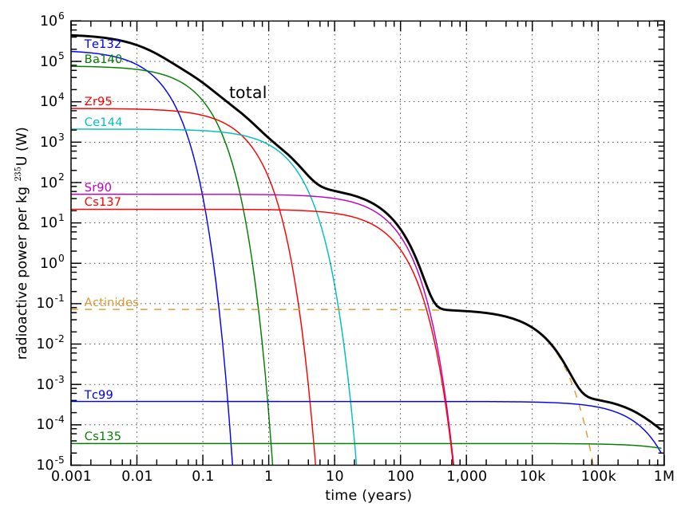

    **图 15.19:** 1 kg 裂变 :math:`{}^{235}\text{U}` 的碎片衰变活性随时间的变化，对数-对数图。纵轴是放射性发射功率，以 W 为单位，各种相关同位素——每种都有自己的特征半衰期。顶部的黑线是总活性（所有贡献的总和），一些关键的个体被分离开来。锕系元素的虚线是反应堆中铀吸收中子形成的重核所扮演角色的大致代表性指标。每个轴的次要刻度线为 2、4、6 和 8 的倍数。作为可能感兴趣的一点，每个元素在此对数-对数图上的指数衰变具有倒置绘制的指数曲线的函数形式。:cite:`c696`

底线是裂变留下了一堆放射性废料，在许多千年内保持令人困扰的水平。当初建造核反应堆时，它们配备了储存池——深水池——用于放置废料燃料，直到能够安排更永久的方案（:ref:`图 15.20<fig15.20>`）。我们仍在等待废料储存的适当永久解决方案，而"临时"储存池只是在不断积累乏燃料。运输乏燃料是危险的——部分原因是它可能落入坏人之手并被用于制造"脏弹"——也没有人愿意在自家后院建核废料设施，使这个问题在政治上棘手。在技术方面，很难找到地质上足够稳定且有少量地下水污染风险的地点。地下盐丘提供了一个有趣的可能性，但政治挑战仍然令人生畏。

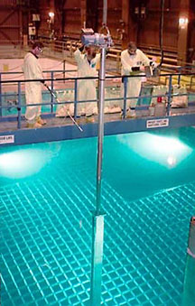

    **图 15.20:** 一根乏燃料棒正在被降入核电站水池中的储存架上。来源：美国能源部。:cite:`c697`

15.4.6 核武器与扩散
++++++++++++++++++++++++

核弹是我们所创造的最具破坏性的武器。1940 年代的第一批炸弹基于高浓缩 :math:`{}^{235}\text{U}` 或 :math:`{}^{239}\text{Pu}`。对于铀弹，其概念惊人地简单。两块分开的炸弹材料被保持分离状态，直到需要引爆时，将它们猛烈撞在一起。\ [#]_ 碰撞本身并不产生爆炸，而是一个基于高浓度可裂变材料和没有中子吸收剂来控制由此产生的链式反应的失控过程。这个概念就是临界质量。合并后的块超过了临界质量，然后爆炸。\ [*]

.. [#] 对于钚，由于 :math:`{}^{240}\text{Pu}` 的存在这一过程被破坏，迫使采用不同的方法，将一个低于临界质量的球体向内爆以产生高密度。:cite:`c698`
.. [*] {-} 永远不要将可裂变材料的块堆叠在架子上，否则可能会遇到不愉快的惊喜。:cite:`c699`

尽管核武器建造起来很简单，瓶颈在于获取可裂变材料。钚在自然界中不存在，因为其 24,100 年的半衰期意味着来自产生铀和钍的天体物理过程（:ref:`Box 15.4<box15.4>`）中已没有任何残留。我们之所以还拥有后两者，要归功于它们的长半衰期。因此可裂变材料必须从铀开始。但正如我们所见，天然铀只有 0.72% 是可裂变的（:math:`{}^{235}\text{U}`）。为了具有爆炸性，铀必须至少浓缩到 20% 的 :math:`{}^{235}\text{U}`，通常要高得多（85%）。反应堆燃料，以 3–5% 的 :math:`{}^{235}\text{U}` 在超过临界质量时会经历堆芯熔毁，但不会爆炸。浓缩在技术上很困难，获取和浓缩铀的尝试受到密切监控。我们经常听到一些国家追求铀浓缩，声称他们只对国内能源生产感兴趣——一个和平目的。核能发电的第一步确实也是浓缩。因此很难确定真实意图。一旦一个国家有能力将铀浓缩到足以满足核电站的需求，他们原则上可以让该过程运行更长时间以达到武器级 :math:`{}^{235}\text{U}`。

虽然我们担心 :math:`{}^{235}\text{U}` 落入坏人之手，但也许更令人不安的是 :math:`{}^{239}\text{Pu}`。它比 :math:`{}^{235}\text{U}` 的半衰期短得多（2.4 万年 vs. 7.04 亿年），因此处理起来更危险。\ [#]_ 但钚在其他方面容易处理，因为它不需要浓缩，可以通过化学分离来达到纯度。它是核武器的首选材料。

认真追求增殖反应堆实际上意味着制造大量钚，导致核材料的扩散：追踪和防止其落入恶意集团变得更加困难。在增殖计划下，世界变得更加危险。钍增殖（:ref:`Box 15.5<box15.5>`）在这方面风险较小，因为作为奖品的 :math:`{}^{233}\text{U}` 与一种使钚相形见绌的极其危险的 :math:`{}^{232}\text{U}` 同位素混合在一起，与之工作相当致命，这可能会阻止恶意集团追求这种材料。

一个相关的担忧涉及裂变电站大量放射性废料的扩散，这些废料可以混入常规炸药\ [*]_ 中以放射性方式污染城市或局部地区——毒害水、食物和空气。简而言之，核裂变在多个方面带来了许多危险。

.. [*] {-} ……放射性衰变率高得多。:cite:`c700`
.. [*] {-} ……称为"脏弹"。:cite:`c701`

15.4.7 核安全
++++++++++++++++++++++++

正常运行的核设施实际上排放的放射性比传统燃煤电厂还要少！就像从地下开采的许多材料一样，煤含有地球地壳中发现的一些少量放射性元素：主要是钍、铀和钾。没有任何屏蔽或保护，煤电厂的废气将这些产物散布到大气中。核电站相比之下没有废气，\ [#]_ 并仔细控制放射性暴露。

然而，事情可能出错。美国在 1979 年经历了一场恐慌，当时宾夕法尼亚州三里岛一座仅运行六个月的核电站（:ref:`图 15.21<fig15.21>`）发生了冷却剂丧失事故，导致堆芯严重损坏（熔毁）。但安全壳容器完好，没有显著的放射性释放到环境中。电厂工作人员接受的剂量相当于额外 100 天的自然\ [*]_ 辐射暴露。所以侥幸逃过一劫。

切尔诺贝利在 1986 年 4 月就没那么幸运了，当时一次构思不当的测试出了岔子，导致堆芯实际爆炸。这种情景以前被认为是不可能的，但它是一次蒸汽爆炸，不是核爆炸——所以更像是"脏弹"将放射性物质散布到该地区。31 人在事故发生后立即死亡，约 200 人患上了急性辐射病。据估计，从长期来看，将增加 25,000 到 50,000 例癌症病例，但这个数字存在争议，很难将切尔诺贝利引起的癌症/死亡与数量大得多的背景癌症病例区分开来。切尔诺贝利镇至今仍然被废弃，仅最近才开始允许极其有限的进入。

最近一次重大事故是 2011 年 3 月仙台地震后日本福岛第一核电站，导致 20 万人疏散和农业损失。地震导致三座运行中的反应堆关闭（安全地），同时柴油发电机运行以驱动维持冷却液在热燃料棒上流动的水泵。反应堆堆芯在裂变停止后仍然非常热，并随着子原子核的衰变继续产生热量，因此必须维持冷却液流动，否则堆芯会熔毁。随后的海啸\ [#]_ 破坏了保持堆芯冷却的计划，因为发电机室被淹没，导致冷却液流动失败。三座反应堆的堆芯全部熔毁，氢气爆炸造成了重大的放射性释放。也许与切尔诺贝利核电站形成对比的是，福岛由通用电气设计，由一个受过高等教育的高科技社会运营。当涉及到核反应堆时，没有人能免除风险。

.. [#] 请注意，冷却塔上方经常有水蒸气的羽流，但这是蒸发冷却的结果，而非通常意义上的废气。:cite:`c702`
.. [*] {-} 我们在日常生活中不可避免地暴露于来自空气、水、食物、地球和宇宙的辐射。:cite:`c703`
.. [#] {-} ……在地震后 10 分钟内。:cite:`c704`

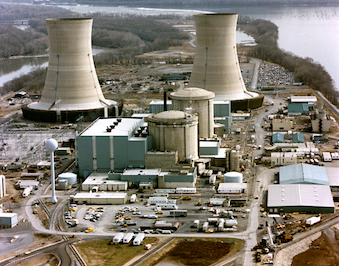

    **图 15.21:** 宾夕法尼亚州三里岛核电站。两个反应堆堆芯位于前景较大的冷却塔后面。来源：美国能源部。:cite:`c705`

15.4.8 裂变的优缺点
++++++++++++++++++++++++

汇集裂变的优缺点，我们从积极方面开始：

* 核燃料具有非凡的能量密度，约为化学能量密度的一百万倍；
* 核裂变是经过验证的技术，目前提供了相当大比例的电力；
* 核裂变的生命周期 CO\ :sub:`2` 排放仅为传统化石燃料发电的 2%；\ [#_
* 增殖反应堆可以通过铀和钍提供数千年的燃料（尚未开发）。

缺点方面：

* 放射性废料在数千年内具有危险性，尚未出现明确的处置或长期储存解决方案；
* 常规铀裂变的燃料供应有限，\ [*]_ 以几十年计；
* 增殖反应堆加剧了废料问题并促进核材料扩散；
* 核能技术的发展为制造极具破坏性的核武器铺设了便捷之路；
* 事故即使在管理最好的反应堆中也会发生，后果往往对一个地区很严重。

.. [#] (2020), Life Cycle GHG Emissions。:cite:`c706`
.. [*] {-} ……在没有增殖反应堆实施的情况下。:cite:`c707`

核裂变是一个复杂的话题，具有令人信服的优势和令人担忧的缺陷。毫不奇怪，态度高度分化。一项调查\ [#_ 表明，美国成年人以微弱的 51% 对 45% 反对建设更多核电站，而科学家总体上以 2:1 的比例支持推进核电站，物理学家调查中更是以 4:1 的比例支持。科学家比美国总人口更有可能将气候变化视为严重威胁，因此更可能被不排放 CO\ :sub:`2` 的能源所吸引。在被调查的物理学家中，假设大多数人都像本章所涵盖的那样彻底了解该话题是错误的——考虑到该领域的专业化程度。在那些彻底了解该话题的人中\ [*]_ ，几乎可以肯定你会发现一种健康的分歧：那些认为危险大于优势的人，以及那些对气候变化足够关注而接受"两害相权取其轻"的人，和/或对这项技术作为我们掌握自然隐藏秘密的辉煌典范而充满热情的人。

.. [#] Pew Research (2015), "Elaborating on the Views of AAAS Scientists, Issue by Issue"。:cite:`c708`
.. [*] {-} 我们也许还应承认，对于已掌握的复杂话题有一种内在的心理吸引力：对特权理解的一种自豪感可能会转化为对该主题的好感。:cite:`c709`

15.5 聚变
---------------------

鉴于裂变存在铀供应有限、放射性废料、扩散和武器以及安全问题，其未来是不确定的。

聚变则不受大多数这些问题困扰。它的主要问题是极其困难，70 年来一直处于研究阶段。除此之外，它有许多（虚拟的）美德。需要明确的是，世界没有、也从未有过运营中的聚变发电站。它可能属于未来，但不能保证它一定会变得实用。

首先，基础知识。我们已经提到过聚变从小的构建到大的。将四个 :math:`{}^{1}\text{H}` 原子核放在一起，每个 1.007825 a.m.u.，形成 4.0026033 a.m.u. 的 :math:`{}^{4}\text{He}`，留下 0.0287 a.m.u. 的差值——总质量的 0.7%——相当于 1.53 亿 kcal/g。\ [#__ 这几乎是裂变量（1700 万 kcal/g；:ref:`Box 15.3<box15.3>`）的十倍，使其比化学反应强大一千万倍。回想一下，聚变的更好表现可以与 :ref:`图 15.10<fig15.10>` 中每个核子结合能曲线左侧的陡峭程度相关联。

使聚变如此困难的是，让质子粘合在一起极其困难。它们的电排斥力如此之强，以至于它们需要以接近光速的相当比例（约 7%）相互接近，才能到达在大约 :math:`10^{-15}\,\text{m}` 距离内接管的强核力范围。对应的温度是十亿度。\ [*]_ 甚至太阳的中心也只有"区区"1600 万度。不过，太阳的优势在于巨大。因此即使在相对"凉爽"的 1600 万度，一些罕见的质子偶然会以额外快的速度运动并有足够的冲力克服排斥力并粘合在一起。这就像以极低概率中彩票，但太阳足够大，购买了足够的彩票，所以这个过程仍然足够频繁地发生。\ [#]_ 在地面实验室环境中我们没有这种奢侈，因此我们需要比太阳中心更高的温度！

使用 :math:`{}^{2}\text{H}` 原子核（氘核，标记为 D）代替 :math:`{}^{1}\text{H}`（质子），在所谓的 D–D 聚变反应堆中，允许在 1 亿度而不是 10 亿度下运行。将一个氘核与一个氚核\ [#]_（:math:`{}^{3}\text{H}` 原子核，标记为 T；12.3 年半衰期）碰撞，D–T 聚变反应堆只需要 4500 万度。因此，目前只追求 D–T 聚变。

对于所有三种类型，相关反应\ [#]_ 为：

.. _eq15.3:

.. math::
    \begin{aligned}
    \text{p–p}: &\quad {}^{1}\text{H} + {}^{1}\text{H} + {}^{1}\text{H} + {}^{1}\text{H} \rightarrow {}^{4}\text{He} + 26.7\,\text{MeV} \\
    \text{D–D}: &\quad {}^{2}\text{H} + {}^{2}\text{H} \rightarrow {}^{4}\text{He} + 23.8\,\text{MeV} \\
    \text{D–T}: &\quad {}^{2}\text{H} + {}^{3}\text{H} \rightarrow {}^{4}\text{He} + \text{n} + 17.6\,\text{MeV}
    \end{aligned} \tag{15.3}

.. [#] 计算过程是 0.0287 a.m.u. 对应 :math:`\Delta m = 4.8 \times 10^{-29}\,\text{kg}`，或 :math:`E = \Delta m\,c^2 = 4.2 \times 10^{-12}\,\text{J}`（26.7 MeV）。我们将焦耳转换为 kcal（除以 4,184），然后除以输入质量（以克为单位）（4.03 a.m.u. 乘以 :math:`1.6605 \times 10^{-24}\,\text{g/a.m.u.}`）得到 153 万 kcal/g。从两个氘核出发将能量产额略微减少到 137 万 kcal/g，氘-氚反应则降至 8100 万 kcal/g。:cite:`c710`
.. [*] {-} 对于如此高的温度，无论是用开尔文还是摄氏度都没关系，因为 273 度的差距与十亿度相比微不足道。因此这些标度在这里本质上相同。:cite:`c711`
.. [#] {-} 这并非偶然：如果中心太冷，太阳在缺乏辐射压力的情况下会收缩，直到中心从压缩中升温并点燃核聚变——恰好足以阻止进一步收缩。它在聚变的边缘找到了自己的平衡。就太阳而言，每 :math:`10^{26}` 次碰撞中只需一次粘合就能维持运转。:cite:`c712`
.. [#] 如果 UCSD 吉祥物是因这个氚核命名的就好了……:cite:`c713`
.. [#] {-} ……允许在过程中通过 β 衰变将质子变为中子。:cite:`c714`

但 D–T 聚变所需的 4500 万度仍然令人恐惧地难以实现。没有容器能承受超过几千度的温度。约束——或称约束——因此成为巨大的挑战。数百万度的等离子体\ [#]_ 不允许接触容器壁，尽管其组成部分以约 1,000 km/s 的速度飞驰！这一壮举可以通过磁场使高速带电粒子的路径弯曲成圆形来实现。但等离子体中的湍流困扰着在足够高温度下约束 D–T 混合物以产生聚变产出的尝试。

.. [#] 等离子体是一种热的电离气体，其中电子被从原子核上剥离。太阳有资格作为等离子体。:cite:`c715`

.. _box15.6:

.. admonition:: Box 15.6: 成功的聚变

    请注意，除了恒星作为成功聚变的例子外，我们已经在净能量正面的方式下成功创造了人工聚变，其形式是氢弹。这确实是一个聚变装置，但我们不能称之为受控聚变。在氢弹中，需要将裂变弹（钚）直接放在 D–T 混合物旁边以将 D–T 加热到足以发生聚变。它工作并被展示出来这一点很酷（也很糟糕），但它不是运行发电厂的方式。

如果 4500 万度的等离子体能够以稳定的方式被约束，反应产生的热量\ [#]_ 可以用来制造蒸汽并运行传统发电厂——用更花哨的东西替换图 6.2（第 90 页）中的火焰符号。因此，该方案首先需要将等离子体加热到令人难以置信的温度，以便等离子体通过聚变自产生足够的额外热量，从而使游戏转变为保持等离子体足够冷却以产生稳定的聚变速率而不至于自行熄灭。在这种情景中，从冷却流中提取的热量制造蒸汽。这是可能想到的最精细的烧水热源。这可能有点像努力开发一把光剑，而其唯一用途是作为拆信刀。

.. [#] {-} ……以放射性释放回到等离子体的形式。:cite:`c716`

15.5.1 燃料丰度
++++++++++++++++++++++++

氘——氢的一种同位素——在氢中的比例为 0.0115%，\ [#]_ 这意味着偶尔有 H\ :sub:`2`O 分子实际上是 HDO。\ [*]_ 因此海水中充满了氘。全球 18 TW 的需求每年需要 :math:`3 \times 10^{32}` 个氘原子用于 D–D 或每年 :math:`2 \times 10^{32}` 个氘原子和氚原子用于 D–T。使用后一个相对较容易的 D–T 反应的数字，我们每年需要处理 :math:`9 \times 10^{35}` 个水分子来找到所需的氘。这相当于 2600 万吨水，是一个约 300 米见方的立方体体积。是的，这很大，但海洋更大。此外，这相当于每年 1.6 亿桶的体积，约为我们年石油消耗量的 200 分之一。因此，所需的体积完全不具挑战性。\ [#]_ 海洋体积是我们 300 米见方立方体的 600 亿倍，意味着我们有足够的氘可用 600 亿年。太阳不会活那么久，所以让我们说地球上有充足的氘。

.. [#] 见 :ref:`图 15.4<fig15.4>` 中核素图的丰度信息。:cite:`c717`
.. [*] {-} ……一个 :math:`{}^{1}\text{H}`、一个 :math:`{}^{2}\text{H}` 和一个氧。:cite:`c718`
.. [#] {-} 毕竟，海水比地下油藏更容易获取。:cite:`c719`

然而，氚基本上无处可寻，因为其半衰期为 12.3 年。我们可以通过向锂添加中子并刺激 α 衰变来生成氚。因此问题转移到我们有多少锂。已探明储量约为 1500 万吨，目前年产量约为 30,000 吨。\ [#__ 我们需要每年 2,300 吨\ [*]_ 锂来满足我们 :math:`2 \times 10^{32}` 个氚原子目标（用于 18 TW）。在没有锂资源竞争\ [#]_ 的情况下，相关的储量/产量比时间尺度为 6,500 年。是的，这是一个相当长的时间，但不是永恒。其想法是这将为解决 D–D 挑战争取时间。

.. [#] 大多数锂用于电池；在这种情况下的储量/产量比为 500 年。:cite:`c720`
.. [*] {-} ……仅为当前年产量的 8%。:cite:`c721`
.. [#] {-} 否则，我们仍然只能看 500 年的储量/产量比。:cite:`c722`

15.5.2 聚变现实
++++++++++++++++++++++++

人们为什么对聚变感到兴奋是很清楚的。它似乎是一种取之不尽的供应，可以以今天的能源需求速率持续数千年甚至数十亿年。从另一个角度看，想想我们还知道什么能持续数十亿年。我们已经有一个巨大的聚变反应堆停泊在 1.5 亿公里之外，不需要采矿、维修或任何关注。从这个意义上说，太阳本质上与聚变承诺的一样用之不竭，但已经在运作中且免费。太阳能电池板加电池今天就有效，并且已经展示了一条通向永恒能源的可能路径。作者以与聚变企业相比微不足道的预算建造了自己的离网太阳能系统。

至于聚变企业，法国南部一个名为 ITER（:ref:`图 15.23<fig15.23>`）的国际合作项目正在建造一个等离子体约束机器，目标是到 2035 年通过偶尔的 8 分钟、0.5 GW 热功率脉冲开始实验性 D–T 聚变。这台机器是一个垫脚石，并非设计用于发电。建设成本估计在 220 亿到 650 亿美元之间。相比之下，一座核裂变电站的建造成本为 60–90 亿美元。诚然，第一个实验设施会花费更多，但很难想象聚变在经济上会成为一个真正的便宜货。即使燃料是免费的，那又怎样？太阳能也一样。

美国的一个名为国家点火装置（NIF）的项目正在追求一种不同的聚变研究方法：试图通过用 192 束汇聚的激光束轰击一个微小的 D–T 混合球体，将其向内爆至超过恒星内部的压力，导致热量的爆炸性释放。该建筑主要由巨型激光器占据，面积相当于三个足球场，到目前为止已耗资约 100 亿美元。同样，这个实验设施也没有配备以利用任何净能量增益\ [#]_ 来发电。

假设到 2050 年，我们掌握了这项技术并能以 150 亿美元建造一座 1 GW 电输出\ [*]_ 的聚变电站。那是每瓦输出功率 15 美元，我们可以与当今太阳能公用事业级安装成本每峰瓦 1 美元进行比较。\ [#]_ 应用典型的容量因子后，聚变的成本已经是太阳能当前成本的两倍。

.. [#] {-} ……其前景令人怀疑。:cite:`c723`
.. [*] {-} ……因此约 3 GW 热功率，给定的典型热机效率。:cite:`c724`
.. [#] {-} ……光伏为 10–20%，聚变也许 90%？:cite:`c725`

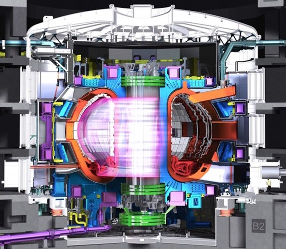

    **图 15.23:** ITER 托卡马克剖面图，等离子体将在其中产生。外部白色腔体的大小相当于一栋六层建筑。来源：ITER 组织。:cite:`c726`

聚变因此是一种复杂且不特别便宜的发电方式。与此同时，我们并不严重缺乏可再生发电方式：太阳能、风能、水电、地热、潮汐。交通运输的液体燃料代表着一个更大更紧迫的挑战，而聚变在这方面并不比其他发电方案更好地直接解决这个问题。聚变是我们有史以来尝试过的最复杂的发电方案，70 年的努力仍在进行中就是证据。需要多少物理学博士来保持一个聚变电站的运转？有时，我们会陷入追求有缺陷的未来愿景中，难以重新评估我们的选择。想象一下作为一个 1950 年代的中年物理学家或工程师。在你的有生之年，你见证了汽车、飞机、收音机、电视、核裂变的出现，以及其他大量技术进步。下一个前沿显然是聚变，那就攻克它吧！在这个时间点，70 年后，也许我们应该问：为什么？

而且让我们指出，聚变并非没有其废料挑战。它仍然是一个放射性环境，虽然不产生危险的直接产物（:math:`{}^{4}\text{He}` 是无害的！）。它确实涉及放射性燃料源（氚），并且确实将高能粒子和中子嵌入约束容器中，随着时间的推移损害容器的完整性，以至于它必须作为一块放射性金属块被丢弃。\ [#_ 相比之下，基于太阳的太阳能、风能和其他可再生源没有此类问题。所有令人不快的东西都在太阳中产生，并留在太阳中。

.. [#] 材料中原子核的嬗变将产生放射性。:cite:`c727`

15.5.3 聚变的优缺点
++++++++++++++++++++++++

汇集聚变的优缺点，我们从积极属性开始：

* 聚变将享有取之不尽的氘供应，易于获取，寿命超过太阳；
* 聚变反应堆可作为久经考验的蒸汽驱动发电技术的热源。

不太好的方面：

* 在所需温度下生成稳定等离子体极其困难；
* 70 年的努力尚未结出作为能源供应的果实；
* 氚不可用，必须从有限的锂供应中制造；
* 聚变仍然面临放射性燃料（氚）和被放射性污染的约束容器的问题。

积极要点的较少数量本身并不表明不平衡，因为第一点是巨大的。一头大象可以在操场的跷跷板上平衡几十个孩子。

15.6 总结：核能
---------------------

核裂变是真实存在的：它能够并且确实产生了世界电力的重要组成部分。在大幅扩张的道路上存在许多实质性的挑战。\ [#__ 对于迄今为止实践的常规核裂变，已探明铀储量以当前使用速度仅能持续 90 年，如果试图从裂变中获得全部 18 TW 则不到 4 年。放射性废料是一个尚未解决的问题，持续数百到数千年。增殖计划可以将资源延长大倍数（在 18 TW 核-增殖努力下进入 500 或 1,000 年的范围）。但扩散和炸弹危险变得更加突出——更不用说更紧迫的废料问题和运营反应堆数量增加带来的更高事故率。很难对核能未来感到兴奋。我们弄清楚了如何做到这一点，这很酷。但仅仅因为我们能做某事并不意味着扩大它是一个好主意。

聚变是一个更难把握的前景。目前，它不在桌面上，从未在能够生产商业规模电力的可行反应堆中得到验证。但即使我们真的成功了，考虑到其复杂性，它如何能在经济上竞争？即使燃料本身是免费的，\ [*]_ 它可能最终成为我们能拿出的最昂贵的电力形式。聚变并非没有放射性担忧，并且并列比较时，太阳能看起来好得多——间歇性是致命的缺点，需要储能。

核能选择迫使我们思考：我们是谁？我们的身份是什么？我们的目标是什么，我们想走向哪里？我们是否在规划一个《星际迷航》式的未来，在这种情况下我们似乎别无选择，只能采用最高科技的解决方案。还是我们瞄准一个更与地球上自然生态系统对齐的更朴素的未来？因此，即使我们能做某事，这意味着我们有义务去做吗？有时代价可能太高。

.. [#] 见 [105] 了解一篇总结各种挑战的短文。光伏和光热的优缺点分别在 15.4.8 节和 15.5.3 节中列出。:cite:`c728`
.. [*] {-} ……太阳能也是如此，这并不意味着太阳能便宜。:cite:`c729`

15.7 思考题
-------------------

1. 如果将一个原子放大到与一个中等校园的范围相当，原子核会有多大，什么熟悉的物体与之类似？

2. 参照示例 15.1.1，放射性同位素碳-14 的所有标记方式是什么？

3. 同位素 :math:`{}^{56}\text{Fe}` 含有多少个中子？

4. 利用 :ref:`图 15.4<fig15.4>` 中 :math:`{}^{12}\text{C}` 和 :math:`{}^{13}\text{C}` 方框中的信息，确定天然碳混合物的加权复合质量——展示计算过程——并与同一图中碳行最左侧方框中的数字进行比较。

5. 在 :ref:`图 15.4<fig15.4>` 中，哪些质量数 A 没有稳定原子核存在？

6. 在 :ref:`图 15.4<fig15.4>` 所示的核素图部分中，仅有的三个长寿命放射性同位素是什么，哪一个寿命最长（多久）？

7. 宇宙射线撞击我们的大气层，从 :math:`{}^{14}\text{N}` 原子核中产生放射性 :math:`{}^{14}\text{C}`。\ [#__ 这些 :math:`{}^{14}\text{C}` 原子很快与氧结合形成 CO\ :sub:`2`，因此从空气中吸收 CO\ :sub:`2` 的植物将约有万亿分之一的碳原子处于这种形式。食用这些植物的动物\ [*]_ 体内也将有这个比例的碳，直到它们死亡并停止将碳循环到体内。此时，体内以 :math:`{}^{14}\text{C}` 形式存在的碳原子比例以 5,715 年的半衰期下降。如果你挖出一个人类头骨，发现只有通常万亿分之一的八分之一是 :math:`{}^{14}\text{C}`，你认为这个头骨有多古老？

.. [#] 氮是地球大气层的主要成分。:cite:`c730`
.. [*] {-} ……和/或食用吃了这些植物的动物。:cite:`c731`

8. 如果一个朋友创建了一个半衰期为 4 小时的原子核并在中午交给你，到第二天中午它还没有衰变的概率是多少？

9. 类比 :math:`{}^{235}\text{U}` 和 :math:`{}^{238}\text{U}` 的半衰期，假设两种元素分别有 45 亿年和 7.5 亿年的半衰期。\ [#__ 如果我们开始时有相同数量的每种（1:1 比例），45 亿年后比例将是什么？以 x:1 表示，其中 x 是两者中较大的。

.. [#] {-} ……相差 6 倍。:cite:`c732`

10. 核反应堆中的控制棒往往含有 :math:`{}^{10}\text{B}`，它具有高中子吸收截面。\ [#__ 当它吸收一个中子时会发生什么，结果稳定吗？如果不稳定，追踪衰变链直到它落在稳定的原子核上。

.. [#] {-} 如 :ref:`图 15.4<fig15.4>` 中相应方框的橙色下半部分所示。:cite:`c733`

11. 如果有人设法创建了一个 :math:`{}^{14}\text{B}` 原子核，它的命运会是什么？在 :ref:`图 15.4<fig15.4>` 上追踪衰变链——指出每一步的衰变类型——直到它达到稳定状态，并指出每一步可能需要多长时间。

12. 一个特定核素在衰变链后被发现失去了 3 个中子和 1 个质子。α 和 β 衰变的什么组合可以解释这个结果？

13. 你如何定性描述 :ref:`图 15.8<fig15.8>` 的总体感觉，关于在核素图的什么位置\ [#__ 可能会看到 α 衰变、β⁻ 衰变、β⁺ 衰变和自发裂变？

.. [#] 区域描述可以包括对质量范围的引用（例如低质量或高质量）、稳定元素上方或下方（富质子或富中子）。:cite:`c734`

14. 一年内，一个普通美国人使用约 :math:`3 \times 10^{11}\,\text{J}` 的能量。通过 :math:`E = mc^2` 这相当于多少质量？岩石的密度约为水的 3 倍，即约每立方毫米 3 毫克。那么，如果完全转化为纯能量，一块多大的岩石材料可以提供一年的能量？更像灰尘、沙粒、石子、岩石、巨石、小山还是山？

15. 世界以 18 TW 的速率使用能量，每年接近 :math:`6 \times 10^{20}\,\text{J}`。这个年能量的质量等价物\ [#__ 是多少？你能为这个质量提供什么背景参照？

.. [#] ℹ 这就是每年必须"消失"多少质量才能满足当前人类需求。:cite:`c735`

16. 一座核电站如果以 2.5 GW（热功率）不间断运行一年，会将多少质量转化为能量？

17. 一块质量为 1,000 kg、比热容为 1,000 J/kg/°C 的大岩石从 0°C 被加热到发光的 1,800°C。假设没有添加或减去任何原子，它的质量增加了多少？

18. 参照示例 15.3.2 中 :math:`{}^{56}\text{Fe}` 的方法，复现 :ref:`表 15.5<tab15.5>` 中 :math:`{}^{4}\text{He}` 的计算。在此过程中，报告以 kg 为单位的 Δm 和以焦耳为单位的对应 ΔE，这些不在表中。

19. 为说明原理，假设我们有一个质量为 200.000 a.m.u. 的原子核，注入 1,600 MeV 的能量以将其完全拆解为组成核子。最终核子集合的质量将是多少？
    a) 完全相同：200.000 a.m.u.
    b) 小于 200.000 a.m.u.
    c) 大于 200.000 a.m.u.

20. 使用问题 19 的设定，计算注入能量拆解原子核后最终构型的质量（以 a.m.u. 为单位）。

21. 参考 :ref:`图 15.10<fig15.10>`，质量数 A = 180 的原子核的总结合能（以 MeV 为单位）是多少？

22. 详细解释如果控制棒在吸收中子方面过于有效，使得每次裂变事件产生的未吸收中子太少会发生什么。

23. 以下关于 :math:`{}^{235}\text{U}` 裂变事件碎片的哪项是正确的？
    a) 可以产生任意数量的碎片（2 到 235 个）
    b) 将出现少量碎片（2 到 5 个）
    c) 将出现两个几乎相同的碎片
    d) 将出现两个明显不同大小的碎片
    e) 裂变是 α 衰变：发射一个 A = 4 的小碎片

24. :math:`{}^{235}\text{U} + \text{n}`（总计 A = 236）的某次裂变发生了碎裂。一个碎片有 Z = 54 和 N = 86，即 :math:`{}^{140}\text{Xe}`。如果此事件中没有多余的中子产生，另一个碎片必须是什么才能使所有数字加总？参考周期表（如 图 B.1；第 375 页）以了解对应 Z 值的元素，并以 :math:`{}^{A}\text{X}` 的表示法表达结果。

25. 遵循问题 24 相同的情景，但这次有两个中子从最终碎片中留下。如果较大的碎片仍然是 :math:`{}^{140}\text{Xe}`，较小的碎片这次是什么？

26. 给出三个可能的裂变碎片大小对（质量数 A）的示例，来自 :math:`{}^{235}\text{U} + \text{n}` 的裂变，自行编造随机结果，同时尊重 :ref:`图 15.15<fig15.15>` 的分布在确定 A 值时。为简便起见，假设没有多余的中子逃逸碎片。

27. 参照示例 15.4.3 中使用 :ref:`图 15.10<fig15.10>` 的图形方法，从两个氘（:math:`{}^{2}\text{H}`）原子核到 :math:`{}^{4}\text{He}` 的聚变过程中，你预计会释放多少总能量，以 MeV 为单位？

28. 核电和燃煤电厂都是热机。比较图 6.2（第 90 页）和 :ref:`图 15.12<fig15.12>`，这两者的根本区别是什么？

29. 如果一座核电站的建造成本为 100 亿美元，运营 50 年，运营成本为每年 1 亿美元，假设电站以 1 GW 的稳定速率在整个时间内交付电力，以美元/kWh 计的发电成本是多少？

30. 由于每座核电站提供约 1 GW 的电力，以约 40% 的热力学效率，这意味着 2.5 GW 的热功率产出。我们需要多少座核电站才能供应我们当前 18 TW 的全部能源需求？由于典型寿命为 50 年然后退役，在稳态下平均每隔多少天会有新电站上线（同时旧电站退役）？

31. 将问题 16 向实际情况延伸，我们从 :ref:`表 15.7<tab15.7>` 知道质量变化（在问题 16 中接近 1 kg）仅为 :math:`{}^{235}\text{U}` 质量的 0.08%。\ [#__ 此外，一根新燃料棒只有 5% 是 :math:`{}^{235}\text{U}`——其余是 :math:`{}^{238}\text{U}`。那么如果所有 :math:`{}^{235}\text{U}` 都被用尽，每年必须向反应堆装载多少总铀？\ [*]_

.. [#] 235 a.m.u. 中的 0.185。:cite:`c736`
.. [*] {-} 将两种同位素视为质量相同：燃料棒中的铀是 :math:`{}^{235}\text{U}` 部分的 20 倍。:cite:`c737`
.. [#] {-} 实际并非如此，因此这个答案是实际必须装载量的下限。问题 16 中约 1 kg 的答案就此作罢。:cite:`c738`

32. 问题 15 表明我们需要少于 10 吨的质量等价物\ [#__ 来支持世界年度能源需求。但考虑到实际中只有 0.08% 的质量在核反应中转化为能量，天然铀中只有 0.72% 是可裂变的 :math:`{}^{235}\text{U}`，且只有一半的 :math:`{}^{235}\text{U}` 是可回收的\ [*]_ 并在反应堆中"燃烧"，假设有 5 吨质量需要通过 :math:`E = mc^2` 转化为能量，每年需要开采多少吨铀才能通过常规裂变支持 18 TW？

.. [#] 一吨是 1,000 kg。:cite:`c739`
.. [*] {-} ……考虑到浓缩效率损失。:cite:`c740`

33. 根据 :ref:`表 15.9<tab15.9>` 中 :math:`{}^{235}\text{U}` 在地壳中的丰度，每年需要开采和处理多少千克的典型地壳才能提供你的个人能源所需的约 0.005 kg :math:`{}^{235}\text{U}`（如示例 15.4.2 所示）？

34. 粗略地说，已探明铀储量可以当前使用速度再维持约 90 年。但世界只有约十分之一的电力来自核能。如果世界全部电力都来自常规（非增殖）核裂变，这对铀供应的时间尺度意味着什么？

35. 复现计算并展示推导过程：如果我们有 :math:`2 \times 10^{21}\,\text{J}` 的已探明铀储量，在常规裂变下如果使用此来源来支持全部 18 TW 全球能源需求，我们将在不到 4 年内耗尽供应。

36. 使用 :ref:`图 15.18<fig15.18>` 重构从 :math:`{}^{232}\text{Th}` 到 :math:`{}^{233}\text{U}` 的增殖路径，描述涉及的相关原子核和衰变（及半衰期）。

37. 对于数十年前的乏核燃料，根据 :ref:`图 15.19<fig15.19>`，哪些同位素导致了大部分放射性？

38. 假设乏燃料棒在出堆十年后从核设施的储存池中取出。根据废料产物的总放射性功率（:ref:`图 15.19<fig15.19>` 中的黑线），大约需要等待多长时间才能使放射性水平从取出时再降低 1,000 倍？

39. 在约 60 年的时间里，运营约 450 座核电站，总热功率水平为 1 TW，我们已经发生了两次向环境的重大放射性释放事件。如果我们完全走核能道路并以这种方式获得全部 18 TW，\ [#__ 如果事故率仅随使用水平缩放，我们预期的事故率是多少？

.. [#] {-} ……也是热功率衡量标准。:cite:`c741`

40. 综合考虑常规核裂变的好处和缺点，你在终止、继续还是扩大我们对这项技术的使用方面持什么立场？我们应该大规模追求增殖反应堆吗？请根据你认为最重要的因素来论证你的结论。

41. 太阳是一个产生 :math:`3.8 \times 10^{26}\,\text{W}` 功率的聚变发电站。它每年通过纯能量转化损失多少千克的质量？这与一颗直径 50 km、密度 2,000 kg/m³ 的球形小行星的质量相比如何？提示：球的体积是 :math:`4\pi R^3/3`。

42. 基于将四个氢原子转化为一个氦原子所关联的质量损失比例，假设太阳在其一生中将所有氢转化为氦（简化假设为起始时 100% 为氢），太阳在其一生中将损失其质量的多少比例？

43. 式 15.3 中的三种聚变形式各自有不同的能量输出。看 :ref:`图 15.10<fig15.10>`，\ [#__ 你如何定性地描述为什么三种反应在这方面有所不同？

.. [#] 氚没有标记，但在左侧略低于 3 MeV 处可见。:cite:`c742`

44. 基于提供足够氘所需的年立方体海水为 300 米见方的计算，作为地球上 80 亿人之一，你的个人份额是多少，以升为单位？你能自己举起它吗？一立方米等于 1,000 升。

45. 你对聚变有什么想法？你是兴奋、怀疑、困惑，还是以上都有？请提供你对聚变在你想象的未来中所扮演角色的深思熟虑的评估——你的最佳猜测。
